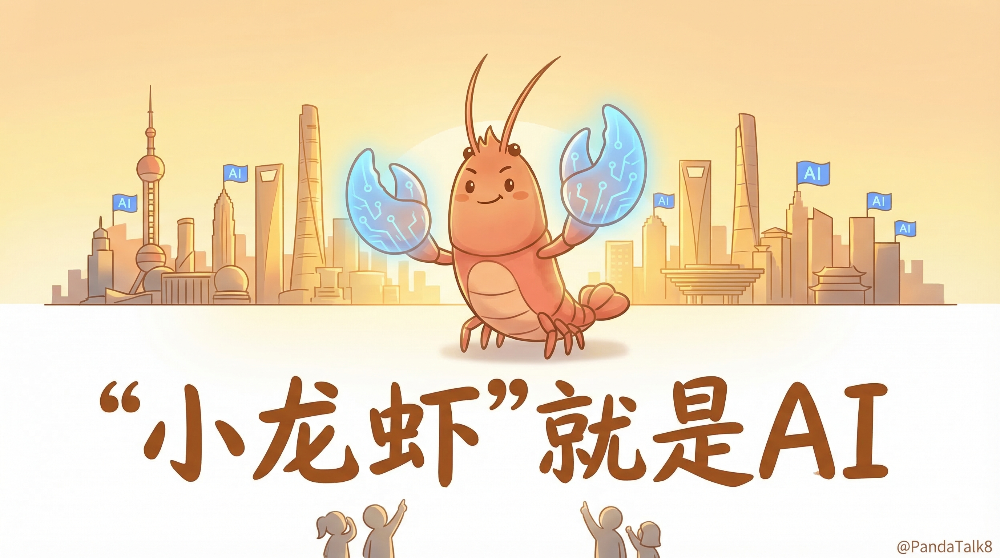
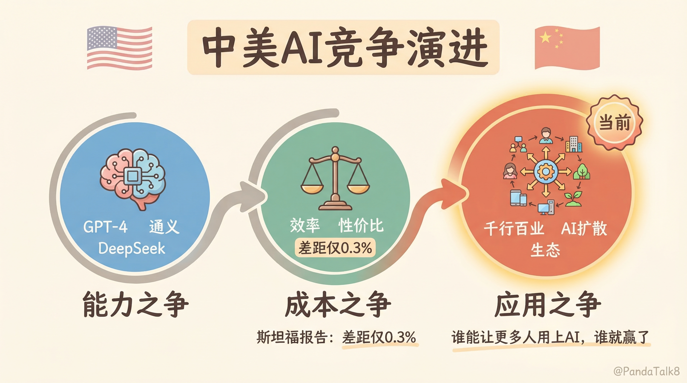
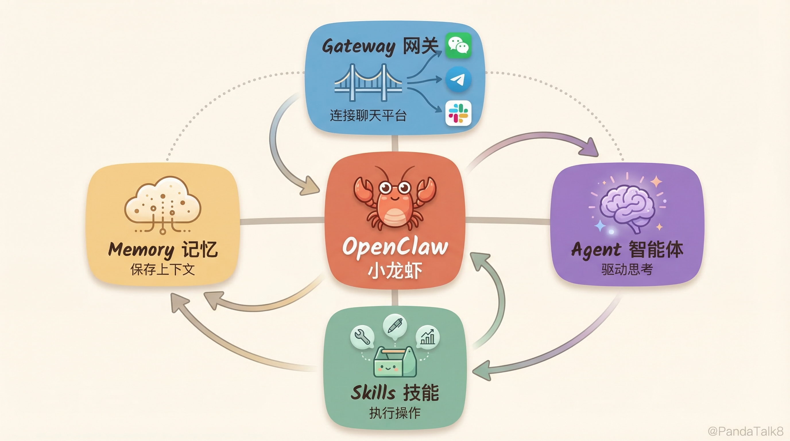
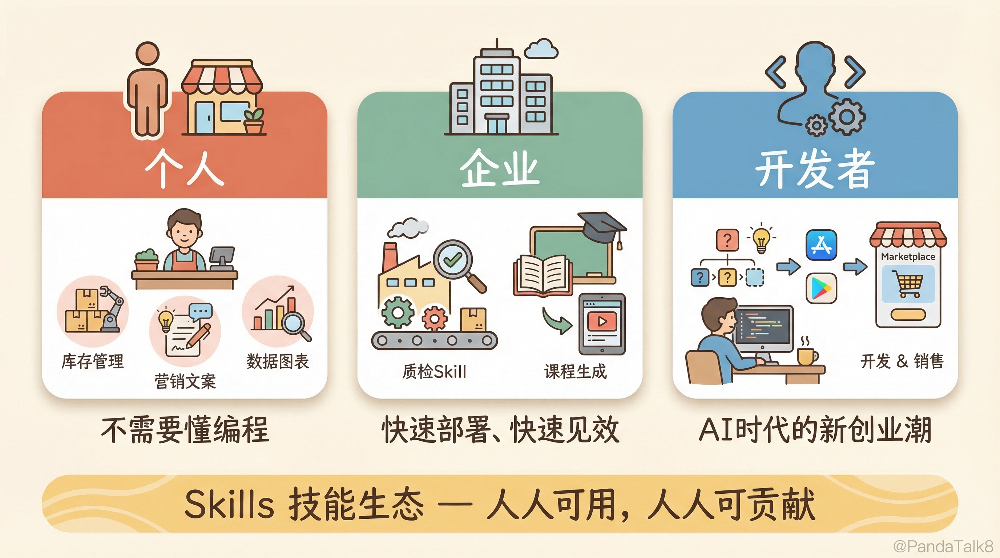
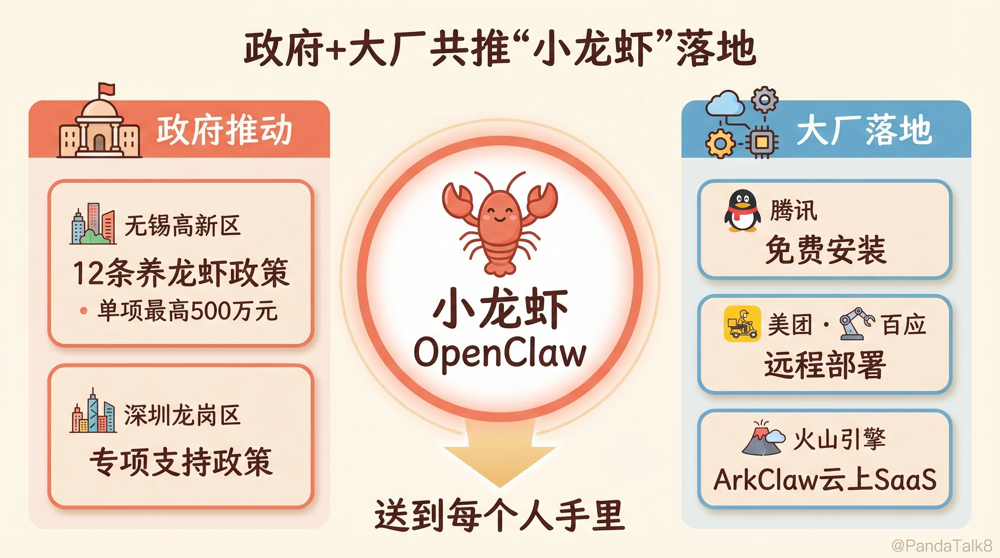
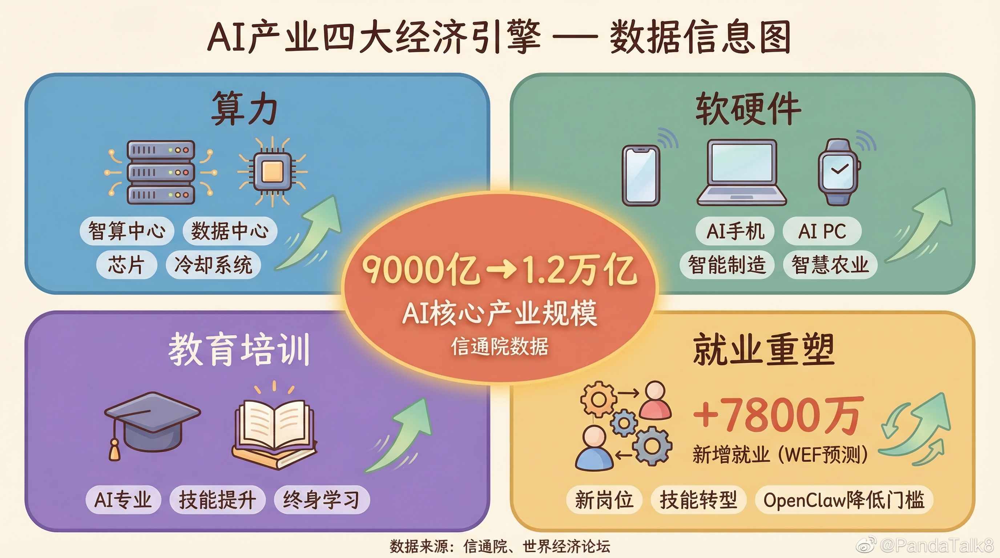

# 为什么全国都在鼓励搞"小龙虾"产业？

好多人没有缓过神来。

为什么全国各地级市都在鼓励搞"小龙虾"产业？

这里的"小龙虾"，不是夜市大排档里的麻辣小龙虾，而是圈内人对OpenClaw的昵称——一个AI智能体平台。Claw是爪子，龙虾最醒目的就是那对大钳子，所以大家亲切地叫它"小龙虾"。

为什么从一线城市到三四线城市，都在出台政策、建产业园、引AI企业、推动AI应用落地？有人觉得这是跟风，有人觉得这是泡沫。

但如果你仔细看这件事的底层逻辑，你会发现——这真就是电视剧里的那句台词：

**"上利国家，下利你们。"**

---

## 一、中美AI竞争，已进入第三阶段

很多人对中美AI竞争的理解还停留在"谁的模型更强"上。但事实是，这场竞争已经经历了三个清晰的阶段。

**第一阶段：AI能力之争。** 这个阶段的核心问题是——谁能做出更强的大模型？GPT-4横空出世时，全世界都在仰望OpenAI。中国的大模型厂商奋起直追，从百度文心、阿里通义，到DeepSeek，纷纷拿出了自己的答卷。这个阶段的竞争本质是技术能力的较量，比的是谁的参数更大、谁的benchmark跑分更高。

**第二阶段：AI成本之争。** 当大家都能做出还不错的大模型之后，竞争焦点转向了成本。谁能用更低的价格提供同样水平的AI能力，谁就能赢得更大的市场。DeepSeek的崛起就是最好的例证——它以远低于美国同行的成本，训练出了性能对标OpenAI o1的模型，推理价格更是低了一个数量级。Google DeepMind CEO Demis Hassabis在2026年初也承认，中国的AI模型只落后美国"几个月"。斯坦福《2025 AI Index》报告更是指出，中美在模型性能上的差距已缩小到仅0.3%。这个阶段的关键词是"效率"和"性价比"。

**第三阶段：AI应用之争。** 这是我们正在进入的阶段，也是最关键的阶段。模型能力和成本问题在逐步收敛，各家差距在缩小。但谁能把AI真正用起来，用到千行百业的每一个场景里，谁就能在这轮科技革命中胜出。正如多位分析师所指出的：决定这场竞赛胜负的，不是AI创新，而是AI扩散——谁能让更多人用上AI，谁就赢了。

为什么第三阶段最关键？因为历史上每一次科技革命的赢家，不是发明技术的人，而是把技术变成应用、把应用变成生态的人。互联网不是美国军方发明的吗？但真正改变世界的是Google、Amazon、Facebook这些应用层公司。智能手机的核心技术日本都有，但最终赢的是苹果和安卓生态。

**谁能在AI应用层建立起最丰富的生态，谁就能主导未来十年甚至二十年的全球经济增长。** 这就是为什么国家要在各地推动AI产业——不是为了让每个城市都去训练大模型，而是要让每个城市、每个行业都学会用AI，用AI去解决真实的问题、创造真实的价值。

---

## 二、"小龙虾"不只是一个AI智能体

说到AI应用，很多人的想象力还停留在"聊天机器人"上。问它几个问题，让它写写文案，仅此而已。

但真正的AI应用远不止于此。

OpenClaw——也就是大家口中的"小龙虾"——最初由奥地利开发者Peter Steinberger创建，是一个开源的自主AI智能体平台。它在2026年初爆火，GitHub Star数一度超越React，成为全球最受关注的开源项目之一。2月创始人加入OpenAI后，项目移交开源基金会，成为了真正属于全球社区的公共基础设施。

但OpenClaw不仅仅是一个AI智能体，它是一个平台。这个区别非常重要。

一个AI智能体，就像一个聪明的员工——你给它一个任务，它帮你完成。但一个AI平台，就像一个生态系统——它由四大核心组件构成：Gateway（网关，连接各种聊天平台）、Agent（智能体，驱动思考）、Skills（技能，执行操作）、Memory（记忆，保存上下文与偏好）。每个人都可以在上面找到自己需要的能力，每个人也都可以贡献自己的Skills。

OpenClaw真正的杀手锏，是围绕Skills（技能）生态的全新玩法。什么是Skills？简单说，就是AI能做的每一件具体的事。翻译文档是一个Skill，分析数据是一个Skill，生成海报是一个Skill，自动化报税是一个Skill。这些Skills可以被任何人创建、分享、组合、调用。

这意味着什么？

**对个人来说，** 你不需要懂编程，不需要懂AI，你只需要找到适合自己的Skills组合，就能让AI成为你的超级助手。一个小商户可以用AI Skills来管理库存、做营销文案、分析客户数据。一个自由职业者可以用AI Skills来自动化报价、管理项目、生成交付物。

**对企业来说，** 你不需要从零搭建AI团队，不需要投入巨额研发费用。你可以直接在平台上找到适合自己行业的Skills，快速部署、快速见效。一个制造企业可以用质检Skill来自动检测产品缺陷，一个教育机构可以用课程生成Skill来快速开发教学内容。

**对开发者来说，** 这是一个全新的创业机会。你可以开发专业领域的Skills，在平台上销售或提供服务。就像当年App Store催生了移动互联网的创业浪潮一样，Skills生态会催生AI时代的新一轮创业潮。

**它会重塑我们生产和生活的方方面面。** 这不是夸大其词，而是正在发生的事实。当AI能力被模块化、标准化、平台化之后，它的渗透速度会指数级加快，就像电力从发电厂走进千家万户一样。

---

## 三、提振消费，激活经济新引擎

为什么各地政府这么积极？实际行动已经说明了一切——无锡高新区率先发布12条"养龙虾"政策，单项支持最高500万元；深圳龙岗区也出台了专项支持OpenClaw发展的政策草案；腾讯宣布免费安装OpenClaw，美团联合百应推出远程部署服务，火山引擎上线ArkClaw（云上SaaS版）。从政府到大厂，都在抢着把"小龙虾"送到每个人手里。

为什么？因为AI产业带来的不仅仅是技术进步，更是实实在在的经济增长。

**首先是算力需求。** AI大模型的训练和推理需要大量的算力支撑。各地建设智算中心、数据中心，本身就是巨大的基础设施投资。服务器、芯片、网络设备、电力系统、冷却系统——每一项都是真金白银的产业链。这些投资不仅带来建设期的就业，更会形成长期的运营需求。

**其次是软件和硬件。** AI应用的爆发会带动整个软件和硬件产业的升级。新的AI手机、AI PC、AI穿戴设备会刺激消费电子市场。新的AI软件工具、SaaS服务会催生大量的软件开发需求。智能制造、智慧农业、智慧城市——每个领域都需要软硬件的全面升级。

**第三是教育培训。** AI时代需要大量懂AI、会用AI的人才。从高校的AI专业到社会上的AI培训，从企业内部的AI技能提升到个人的终身学习——教育培训市场会迎来爆发式增长。这不仅是知识的传递，更是就业能力的升级。

**第四是就业结构的重塑。** 这一点需要正视：AI确实会对现有岗位带来冲击。研究显示超过一半的岗位面临不同程度的AI替代风险，人社部也在紧急研究应对政策。但换个角度看，每一次技术革命都会淘汰旧岗位、创造新岗位。世界经济论坛预测，到2030年AI将净增约7800万个就业机会。关键在于——谁能更快地完成这个转型，谁就能在阵痛期后率先收获红利。而像OpenClaw这样降低AI使用门槛的平台，恰恰是帮助普通人跨越技能鸿沟、抓住新机会的关键工具。

把这些加在一起，你就能理解为什么各地政府都在抢抓"小龙虾"产业了——

**它能促进本地产业发展，催生新的就业形态，刺激消费需求，为地方增加财政收入。** 据信通院数据，2024年中国AI核心产业规模已突破9000亿元，2025年预计突破1.2万亿元。这不是画饼，而是看得见摸得着的经济逻辑。

---

## 结语

回到开头的问题：为什么全国各地都在鼓励搞"小龙虾"产业？

因为这一次，我们站在了一个比互联网更大的风口上。AI不是某个行业的事，它是所有行业的事。它不是某个城市的机会，它是每个城市的机会。

而OpenClaw这样的AI智能体平台，正是把AI能力送到每个城市、每个行业、每个人手里的关键基础设施。**它要帮助中国在全球AI应用竞争中占据制高点，同时让普通人的生产和生活变得更好。**

上利国家，下利你们。

这一次，"小龙虾"真的能做到。

