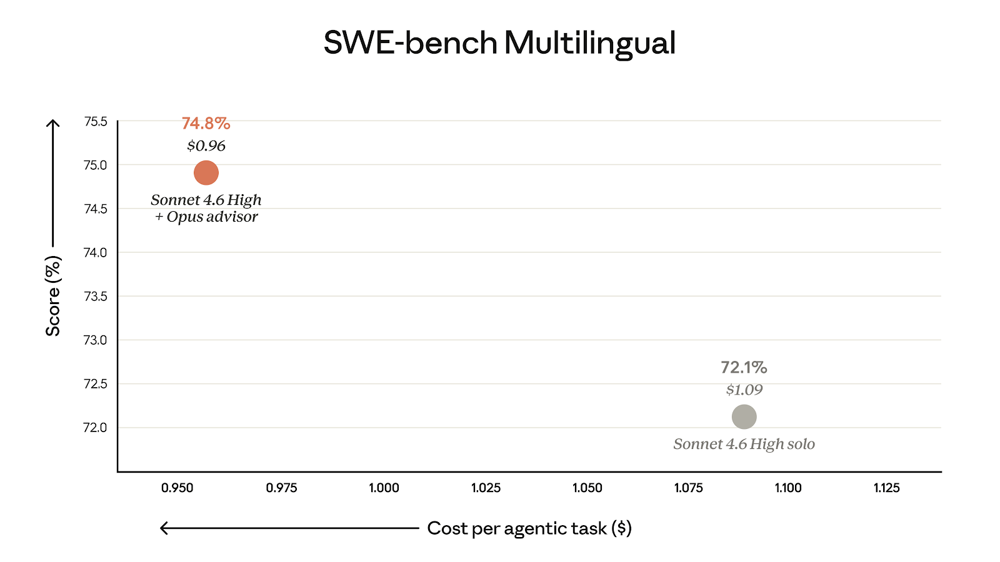
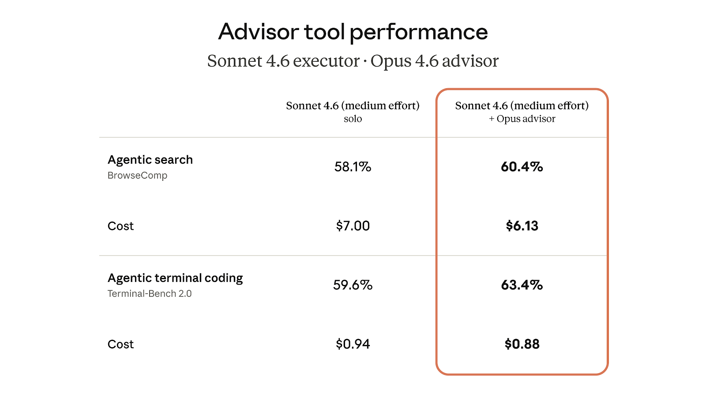

# Advisor 策略：用顾问模式提升 AI 智能体的智力水平

> 原文：[The advisor strategy: Give agents an intelligence boost](https://claude.com/blog/the-advisor-strategy)
> 发布日期：2026 年 4 月 9 日 · 阅读时间：约 5 分钟

**核心思路：将 Opus 作为顾问（Advisor），Sonnet 或 Haiku 作为执行者（Executor），以接近 Sonnet 的成本获得接近 Opus 水平的智能表现。**

---

希望在智能水平和成本之间取得更好平衡的开发者，逐渐摸索出了一种我们称之为「顾问策略」的方法：将 Opus 作为顾问，Sonnet 或 Haiku 作为执行者。这种方式能让你的智能体在保持接近 Sonnet 级别成本的同时，获得接近 Opus 级别的智能表现。

今天，我们在 Claude 平台上正式推出了 Advisor 工具（顾问工具），让你只需在 API 调用中加一行配置，就能启用顾问策略。

## 用顾问策略构建高性价比的智能体


在顾问策略中，Sonnet 或 Haiku 作为执行者全程驱动任务——调用工具、读取结果、迭代推进直到完成。当执行者遇到超出其能力范围的决策时，它会向作为顾问的 Opus 请求指导。Opus 能够访问共享上下文，并返回一个计划、一个修正指令，或者一个停止信号，然后执行者继续工作。顾问从不调用工具，也不产生面向用户的输出，它只负责为执行者提供指导。

这与常见的子智能体模式恰好相反。传统模式中，更大的编排模型负责分解任务并分配给更小的工作模型。而在顾问策略中，更小、更经济的模型负责驱动执行，在需要时主动向上请求指导——不需要任务分解，不需要工作池，也不需要编排逻辑。前沿级别的推理能力只在执行者真正需要时才介入，其余时间的运行成本都维持在执行者级别。

在我们的评估中，Sonnet 搭配 Opus 顾问在 SWE-bench Multilingual 基准上比 Sonnet 单独运行提升了 2.7 个百分点，同时每个智能体任务的成本降低了 11.9%。



## 顾问工具（Advisor Tool）

我们通过 Advisor 工具将顾问策略引入 API。这是一个服务器端工具，Sonnet 和 Haiku 知道在需要指导或帮助时调用它。

在我们的评估中，Sonnet 搭配 Opus 顾问在 BrowseComp 和 Terminal-Bench 2.0 基准测试中均提升了分数，同时每个任务的成本低于 Sonnet 单独运行。



顾问策略同样适用于以 Haiku 作为执行者的场景。在 BrowseComp 上，Haiku 搭配 Opus 顾问得分 41.2%，是其单独运行 19.7% 得分的两倍多。Haiku + Opus 顾问的得分比 Sonnet 单独运行低 29%，但每个任务的成本低了 85%。顾问的引入确实会在 Haiku 基础上增加一些成本，但组合价格仍然只是 Sonnet 的一小部分，对于需要在智能水平和成本之间取得平衡的高吞吐场景来说，这是一个很有竞争力的选择。


在 Messages API 请求中声明 `advisor_20260301`，模型之间的交接就在单个 `/v1/messages` 请求内完成——无需额外的往返请求或上下文管理。执行者模型自行决定何时调用顾问。当它调用时，我们将精选的上下文路由到顾问模型，返回指导方案，执行者继续执行——全部在同一个请求内完成。

```python
response = client.messages.create(
    model="claude-sonnet-4-6",  # 执行者
    tools=[
        {
            "type": "advisor_20260301",
            "name": "advisor",
            "model": "claude-opus-4-6",
            "max_uses": 3,
        },
        # ... 你的其他工具
    ],
    messages=[...]
)

# 顾问的 token 用量在 usage 块中单独报告
```

**计费方式。** 顾问的 token 按顾问模型的费率计费，执行者的 token 按执行者模型的费率计费。由于顾问只生成简短的指导方案（通常 400-700 个文本 token），而执行者以更低的费率处理完整输出，因此整体成本远低于全程使用顾问模型。

**内置成本控制。** 设置 `max_uses` 参数即可限制每个请求中顾问的调用次数。顾问的 token 用量在 usage 块中单独报告，便于按层级追踪支出。

**与现有工具无缝协作。** 顾问工具只是 Messages API 请求中的另一个工具条目。你的智能体可以在同一个循环中搜索网页、执行代码，并咨询 Opus。

---

> "它在复杂任务上做出了更好的架构决策，同时在简单任务上没有增加任何额外开销。规划和执行路径的质量有着天壤之别。"
>
> —— **Eric Simmons**，Bolt CEO 兼创始人
