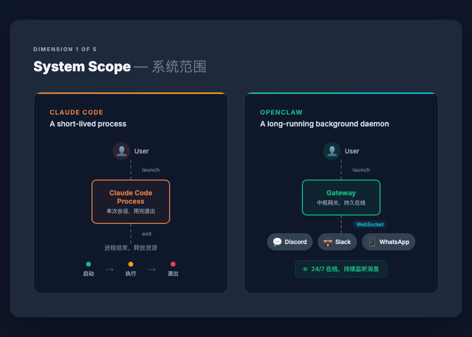
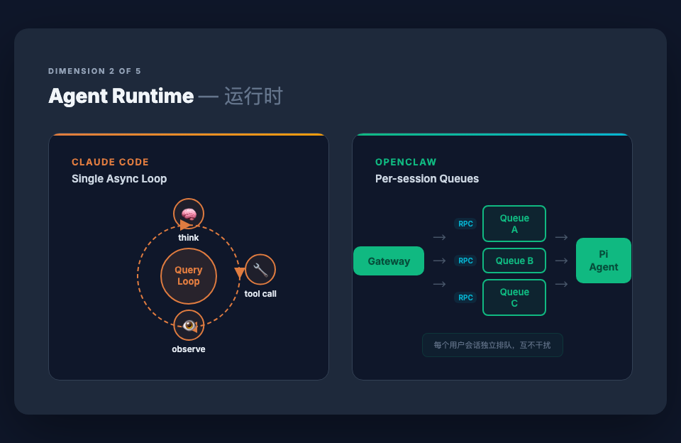
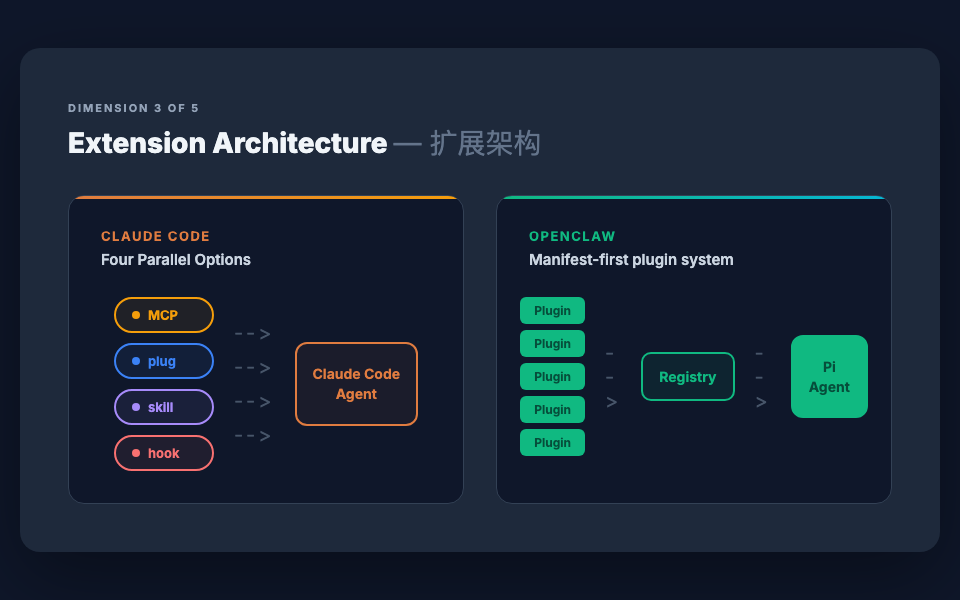
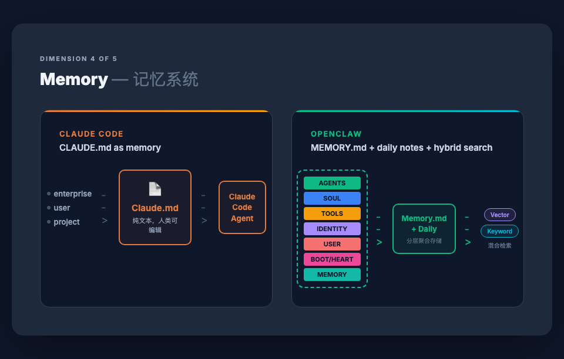
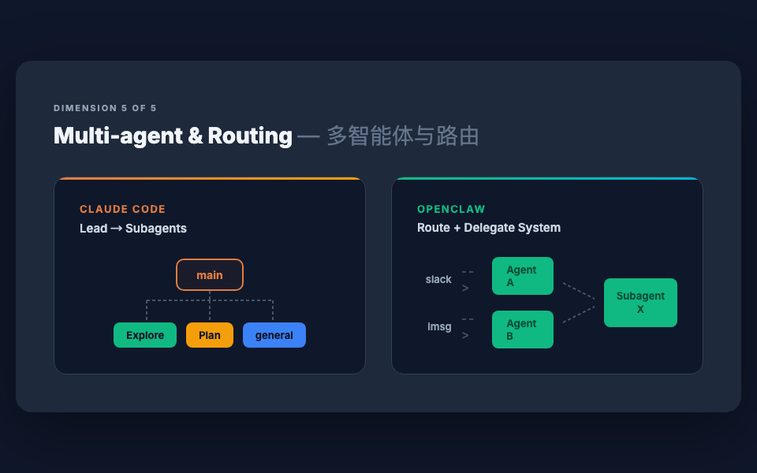

# Claude Code vs OpenClaw：五个设计维度的架构对比

> 基于 ByteByteGo 制作的架构对比图，从系统范围、运行时、扩展架构、记忆系统和多智能体路由五个维度，拆解两个项目截然不同的设计取向。

Claude Code 和 OpenClaw 是当前最具代表性的两个 AI Agent 产品，但它们的设计出发点完全不同。Claude Code 是一个开发者工具，OpenClaw 是一个生活助手。这个根本性的定位差异，决定了它们在每一个架构维度上的选择。

## 系统范围：即启即停进程 vs 常驻守护进程

Claude Code 是一个即启即停的进程（short-lived process）。用户启动它，它完成任务，然后退出。这和你使用 `git` 或 `curl` 的方式本质上没有区别——用完即走，不占用后台资源。这种设计天然适合开发者工作流：你在终端里召唤它，它帮你改代码、跑测试、提 PR，做完就结束。

OpenClaw 则是一个长期运行的后台守护进程（long-running background daemon）。用户通过消息发起请求，请求先到达 Gateway 网关，Gateway 通过 WebSocket 保持与各个应用平台（Discord、Slack、WhatsApp 等）的持久连接，持续接收和分发消息。它必须 24/7 在线，因为它的价值就在于"随时可用"——凌晨三点你在 WhatsApp 上给它发条消息，它也得能接住。

这是两种完全不同的系统哲学：一个是按需启动的工具，一个是永不下线的服务。

## 智能体运行时：单异步循环 vs 会话级队列

Claude Code 的运行时是一个单一的异步循环（Single Async Loop），也称 Query Loop。这个循环只做三件事：思考（think）→ 调用工具（tool call）→ 观察结果（observe），然后回到思考。整个过程在一个进程、一个会话里完成。简洁、可预测、容易调试。对于"一个开发者坐在终端前和 Agent 交互"这个场景，这就够了。

OpenClaw 面对的是多用户同时发消息的场景，不可能用单循环处理。它采用了会话级队列（Per-session Queues）架构：每个用户会话对应一个独立的消息队列（Queue A、Queue B、Queue C……），Gateway 通过 RPC 将消息分发到对应队列，再由 Pi Agent 统一消费处理。这种设计保证了不同用户的会话互不干扰，同时支持并发。

## 扩展架构：四轨并行 vs 清单驱动的插件系统

Claude Code 提供了四种并行的扩展机制：MCP（Model Context Protocol，标准化的外部工具协议）、Plug（插件）、Skill（技能，可复用的提示词模板）和 Hook（钩子，在特定事件触发时执行的 Shell 命令）。四种机制各司其职、互不依赖，开发者可以根据需求选择组合。这种"工具箱"式的扩展策略给了开发者最大的灵活性，但也意味着你需要理解每种机制的适用场景。

OpenClaw 采用的是清单驱动的插件系统（Manifest-first plugin system）。所有扩展都以 Plugin 的统一形态存在，通过一个中央 Registry（注册表）管理。Agent 启动时从 Registry 加载可用插件列表，按需调用。这种设计降低了扩展机制的认知成本——所有东西都是 Plugin，注册一次，全局可用。代价是灵活性不如四轨并行模型，所有扩展都必须遵循同一套 Plugin 规范。

## 记忆系统：CLAUDE.md 单文件 vs 分层记忆 + 混合检索

Claude Code 的记忆系统围绕一个核心文件构建：`CLAUDE.md`。这个 Markdown 文件分为三个层级——enterprise（企业级）、user（用户级）和 project（项目级），层层叠加后注入 Agent 的上下文。设计极度简洁：一个文件，纯文本，人类可读可编辑，版本控制友好。你打开 CLAUDE.md 就能看到 Agent 知道什么、不知道什么。

OpenClaw 的记忆系统要复杂得多。它维护了多种类型的配置文件（AGENTS、SOUL、TOOLS、IDENTITY、USER、BOOT/HEART、MEMORY），分别定义 Agent 的身份、能力、行为边界和长期记忆。这些内容汇聚到 `Memory.md` 和每日笔记（Daily notes）中，再通过向量检索和关键词检索的混合搜索机制进行调取。这套系统让 OpenClaw 能够积累更丰富的长期记忆，并在恰当的时候精准召回，但系统复杂度也显著提高。

两种设计的取舍很清晰：Claude Code 用简洁换取透明和可控，OpenClaw 用复杂换取记忆的深度和智能程度。

## 多智能体与路由：主从派发 vs 路由委托

Claude Code 采用主从模式（Lead → Subagents）。主 Agent（main）负责理解用户意图和任务分解，然后将子任务派发给专用的子 Agent——Explore（代码搜索）、Plan（方案设计）、general（通用执行）。每个子 Agent 有独立的工具集和上下文窗口，完成后将结果返回主 Agent。这是一个树状的、自顶向下的协作结构。

OpenClaw 采用路由委托模式（Route + Delegate System）。消息从不同渠道（Slack、iMessage 等）进入后，先被路由到对应的专职 Agent（Agent A、Agent B），这些 Agent 再按需将任务委托给 Subagent X 执行。这是一个更偏网状的结构——多个入口、多个 Agent、按需组合。它更适合 OpenClaw 的多平台、多用户场景：不同渠道可能需要不同的 Agent 来处理，而底层的能力可以通过 Subagent 共享。

---

五个维度，五组不同的选择，但没有绝对的优劣。Claude Code 的每一个设计决策都指向同一个目标：让一个开发者在终端里高效地完成编码任务。OpenClaw 的每一个设计决策也都指向它的目标：让任何人在任何聊天平台上随时使用一个智能助手。架构服务于场景，场景决定了取舍。
