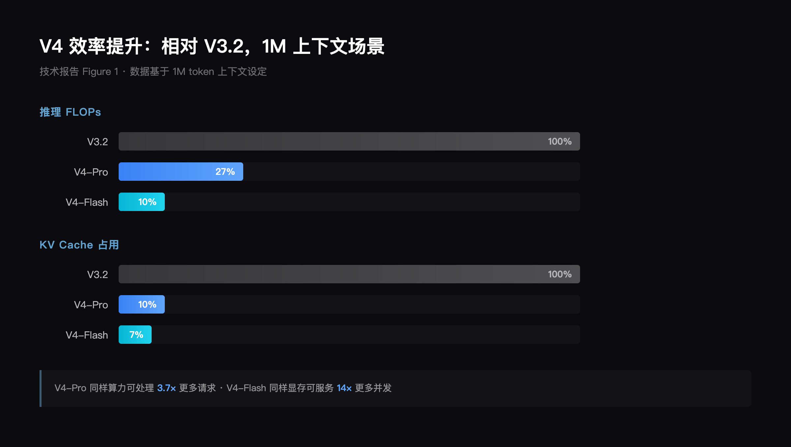
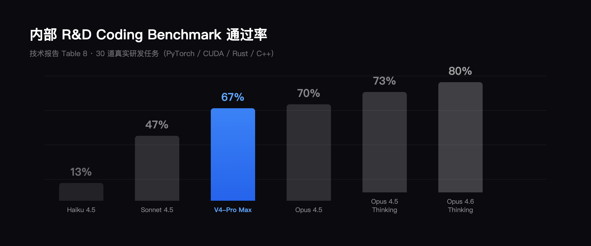
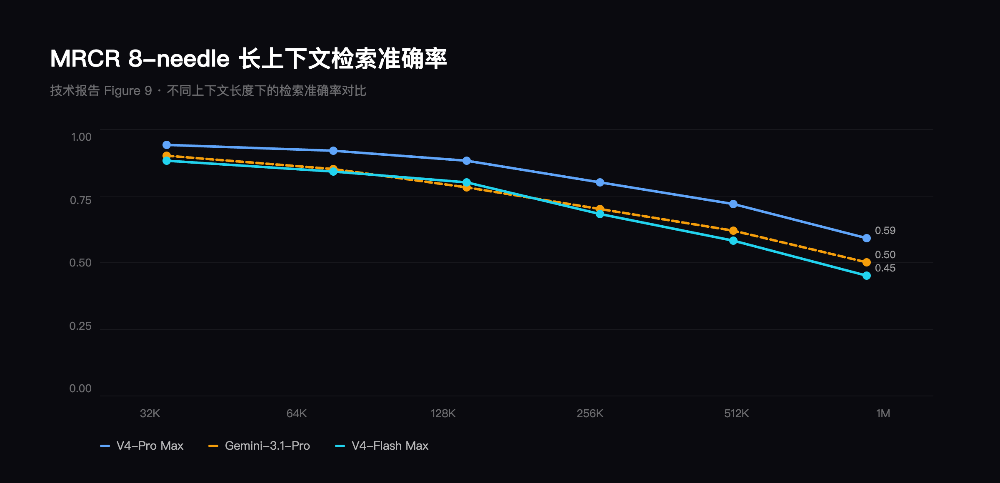
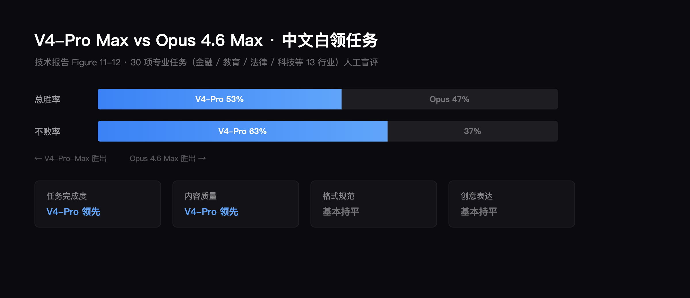

# DeepSeek-V4 正式发布：1.6 万亿参数、百万上下文，开源再次比肩顶级闭源模型

**TL;DR**：DeepSeek-V4 发布两款开源 MoE 模型（Pro 1.6T/49B 激活，Flash 284B/13B 激活），原生支持 1M 上下文。通过 CSA+HCA 混合注意力架构，推理 FLOPs 降至 V3.2 的 27%，KV Cache 降至 10%。竞赛编程（LiveCodeBench、Codeforces）超越所有闭源模型，Agent 编码逼近 Claude Opus 4.5，知识推理落后 Gemini-3.1-Pro 约 3-6 个月。API 已上线，权重已开源。

---

2026 年 4 月 24 日，DeepSeek 正式发布 DeepSeek-V4 Preview 版本，同步开源模型权重。技术报告标题为 *"DeepSeek-V4: Towards Highly Efficient Million-Token Context Intelligence"*，明确将"百万 token 上下文的高效处理"作为这一代模型的核心命题。

本文基于 DeepSeek 官方发布线程（1/n - 7/n）和完整技术报告，梳理 V4 的架构变化、性能数据和工程细节。

## V4 做到了什么，差距在哪里

先用最直白的语言说清楚三件事：V4 的亮点、与顶级闭源模型的差距、以及创新点。

**亮点：编程登顶，效率飞跃**

V4 最耀眼的成绩在编程。在两个最权威的编程竞赛评测上——LiveCodeBench 和 Codeforces——V4-Pro 的得分超过了 GPT-5.4、Gemini-3.1-Pro、Claude Opus 4.6 等所有顶级闭源模型。这是开源模型第一次在编程领域全面反超闭源。在更贴近日常开发的 Agent 编码评测中，V4-Pro 的通过率达到 67%，接近 Claude Opus 4.5 的 70%。

另一个重大突破是百万级上下文。V4 把默认上下文长度从 V3 的 12.8 万 token 直接拉到 100 万 token，扩展了 8 倍。通俗地说：以前一次只能读一本书，现在一次能读一整个书架。而且这不是靠堆硬件暴力实现的——V4 通过新的注意力架构，把处理同样长度文本所需的计算量压缩到上一代的 27%，显存占用压缩到 10%。同样的硬件，能处理更长的文本、跑更多的任务。

**差距：知识储备和通用推理仍有距离**

V4 并不是在所有方面都追平了闭源模型。在知识类测试（比如回答事实性问题）上，V4-Pro 得分 57.9，而 Google 的 Gemini-3.1-Pro 得分 75.6——差距接近 18 分。在数学推理上，V4-Pro 得分 89.8，而 GPT-5.4 得分 91.4——差距不大但确实存在。在最难的科学推理测试 Apex 上，V4 得分 38.3，而 Gemini-3.1-Pro 得分 60.9——差距显著。

DeepSeek 团队在技术报告中的自我评估很坦诚："发展轨迹大约落后前沿闭源模型 3-6 个月。"换句话说，V4 今天的水平大致相当于 GPT 和 Gemini 半年前的水平。考虑到 DeepSeek 是一家创业公司，资源远不及 Google 和 OpenAI，这个差距本身就是一种实力的证明。

**创新点：用更少的资源做更多的事**

V4 的核心创新可以用一句话概括：让模型在处理超长文本时，不再需要"记住每一个字"，而是学会"先压缩、再挑重点看"。

具体来说，V4 设计了两种新的注意力机制交替配合：一种先把文本压缩、再挑最相关的部分精读（CSA），另一种把文本大幅压缩后全部浏览（HCA）。这相当于阅读一本长书时，有的章节精读关键段落，有的章节快速通览全篇——两种策略交替使用，既不遗漏重要信息，又不浪费算力。

训练方面，V4 也做了一件聪明的事：不是训练一个什么都会的模型，而是先分别训练十多个"专科专家"（数学专家、编程专家、写作专家等），然后用一种叫"在线策略蒸馏"的方法把所有专家的能力合并到一个模型里。就像先培养各科状元，再把他们的知识融合成一个全科选手。

## 两个模型，两种定位

V4 系列包含两款 MoE（混合专家）模型，以下为官方公布的模型规格：

| 模型 | 总参数 | 激活参数 | 上下文长度 | 精度 |
|------|--------|----------|------------|------|
| DeepSeek-V4-Pro | 1.6T | 49B | 1M | FP4 + FP8 混合 |
| DeepSeek-V4-Flash | 284B | 13B | 1M | FP4 + FP8 混合 |

V4-Pro 有 61 层 Transformer，隐藏维度 7168，每个 MoE 层包含 1 个共享专家和 384 个路由专家（每个 token 激活 6 个），在 33T token 上完成预训练。V4-Flash 有 43 层 Transformer，隐藏维度 4096，每个 MoE 层包含 1 个共享专家和 256 个路由专家，在 32T token 上完成预训练。

两款模型均支持三种推理模式，出自技术报告 Table 2：

| 推理模式 | 特征 | 适用场景 |
|---------|------|---------|
| Non-think | 快速直觉式响应 | 日常对话、低风险决策 |
| Think High | 有意识的逻辑分析，较慢但更准确 | 复杂问题求解、中等风险决策 |
| Think Max | 将推理推到极限，最慢但最强 | 探索模型推理能力边界 |

Think Max 模式下，系统提示词会注入一条专门指令："Reasoning Effort: Absolute maximum with no shortcuts permitted."，引导模型进行最彻底的推理过程。

## 架构创新：让百万上下文成为标配

V4 保留了 DeepSeek-V3 的 Transformer 主干和 Multi-Token Prediction（MTP）策略，在此基础上引入三项关键升级。技术报告 Figure 2 展示了完整架构——注意力层采用 CSA/HCA 混合机制，前馈层继续使用 DeepSeekMoE，残差连接升级为 mHC：

```
DeepSeek-V4 整体架构（技术报告 Figure 2）

┌─────────────────────────────────────────────────────┐
│                  DeepSeek-V4-Pro                     │
│                  61 层 Transformer                   │
├─────────────────────────────────────────────────────┤
│                                                     │
│  Layer 1-2:  滑动窗口注意力（纯局部）                │
│                                                     │
│  Layer 3+:   CSA 层 ──→ HCA 层 ──→ CSA 层 ──→ ...  │
│              (交替排列)                              │
│                                                     │
│  ┌─────────────┐    ┌──────────────┐                │
│  │  CSA 注意力  │    │  HCA 注意力   │                │
│  │ 压缩率 m=4  │    │ 压缩率 m'=128 │                │
│  │ 稀疏 top-k  │    │  密集全注意力  │                │
│  │  =1024      │    │              │                │
│  └──────┬──────┘    └──────┬───────┘                │
│         └──────────┬───────┘                        │
│                    ▼                                │
│           ┌────────────────┐                        │
│           │  DeepSeekMoE   │                        │
│           │ 1 共享 + 384   │                        │
│           │ 路由专家(激活6) │                        │
│           └────────┬───────┘                        │
│                    ▼                                │
│           ┌────────────────┐                        │
│           │  mHC 残差连接   │                        │
│           │ (流形约束)      │                        │
│           └────────────────┘                        │
│                                                     │
│  预训练: 33T tokens  │  精度: FP4 + FP8 混合        │
└─────────────────────────────────────────────────────┘
```

**（1）混合注意力机制：CSA + HCA**

这是 V4 最核心的架构创新。传统 Transformer 的全注意力机制在处理超长上下文时，计算量和显存消耗呈平方级增长。V4 设计了两种高效注意力架构的交替混合：

- **Compressed Sparse Attention（CSA）**：先将每 *m* 个 token 的 KV Cache 压缩为一个条目，再通过 Lightning Indexer 学习选择 top-k 个最相关的压缩条目进行稀疏注意力计算。同时保留一个小的滑动窗口分支，确保局部细粒度依赖不丢失。

```
CSA: Compressed Sparse Attention（技术报告 Figure 3）

输入 tokens: [t1, t2, t3, t4, t5, t6, t7, t8, ...]
                    │
                    ▼
         ┌─────────────────────┐
         │  KV 压缩 (每 m=4 个  │
         │  token 合并为 1 条目) │
         └──────────┬──────────┘
                    ▼
压缩后 KV: [C1,    C2,    C3,    ...]
                    │
          ┌─────────┴─────────┐
          ▼                   ▼
  ┌───────────────┐   ┌──────────────┐
  │ Lightning     │   │  滑动窗口     │
  │ Indexer       │   │  (局部注意力)  │
  │ → top-k=1024  │   │  保留细粒度   │
  │   最相关条目   │   │  局部依赖     │
  └───────┬───────┘   └──────┬───────┘
          │                  │
          └────────┬─────────┘
                   ▼
          稀疏注意力输出
```

- **Heavily Compressed Attention（HCA）**：采用更激进的压缩率（m' ≫ m），将更多 token 合并为一个条目，但保留密集注意力计算。HCA 不做稀疏选择，而是对所有压缩后的条目做完整注意力。

```
HCA: Heavily Compressed Attention（技术报告 Figure 4）

输入 tokens: [t1, t2, ... t128, t129, ... t256, ...]
                       │
                       ▼
            ┌─────────────────────┐
            │  重度压缩 (每 m'=128 │
            │  个 token 合并为 1)  │
            └──────────┬──────────┘
                       ▼
压缩后 KV:  [C1,              C2,              ...]
            (128 tokens→1)   (128 tokens→1)
                       │
                       ▼
            ┌─────────────────────┐
            │   密集全注意力        │
            │   (对所有压缩条目     │
            │    做完整注意力计算)   │
            └─────────────────────┘

对比 CSA vs HCA:
  CSA:  轻度压缩(4:1) + 稀疏选择(top-k) → 精读关键段落
  HCA:  重度压缩(128:1) + 密集全注意力   → 快速通览全篇
```

V4-Pro 的前两层使用纯滑动窗口注意力，后续层 CSA 和 HCA 交替排列。CSA 的压缩率 m=4，稀疏 top-k=1024；HCA 的压缩率 m'=128。

**（2）Manifold-Constrained Hyper-Connections（mHC）**

mHC 将残差映射矩阵约束在双随机矩阵的流形（Birkhoff 多面体）上，确保谱范数不超过 1，从而在深层堆叠时保持信号传播的数值稳定性。相比原始 Hyper-Connections（HC），mHC 解决了训练深层网络时频繁出现的数值不稳定问题。

**（3）Muon 优化器**

V4 对大部分参数采用 Muon 优化器替代 AdamW，通过混合 Newton-Schulz 迭代实现近似正交化，带来更快的收敛速度和更好的训练稳定性。仅对 embedding、prediction head、mHC 的静态参数和 RMSNorm 权重保留 AdamW。

**效率提升有多大？**

以下数据来自技术报告 Figure 1 右侧的效率对比图：

在 1M token 上下文设定下，V4-Pro 单 token 推理的 FLOPs 仅为 V3.2 的 27%，KV Cache 仅为 V3.2 的 10%。V4-Flash 更极端，分别压缩到 10% 和 7%。

技术报告进一步指出：以 BF16 GQA8（head dimension=128）这一常见 LLM 注意力配置为基线，V4 系列在 1M 上下文场景下的 KV Cache 大小仅为该基线的约 2%。

这些效率提升的直接结果是：1M 上下文成为 DeepSeek 所有官方服务的默认配置，从 V3 的 128K 一步跨越到 1M，扩展了 8 倍。

## 性能评测：官方数据全览

技术报告 Figure 1 是最核心的一张图——左侧展示了 V4-Pro-Max 与顶级闭源模型在知识推理和 Agent 两大维度上的对比，右侧展示了推理 FLOPs 和 KV Cache 的效率对比：



**基座模型评测**

技术报告 Table 1 给出了三代基座模型的完整对比（所有模型在统一内部框架下评测）：

| 基准测试 | DeepSeek-V3.2-Base | V4-Flash-Base | V4-Pro-Base |
|----------|---------------------|---------------|-------------|
| MMLU（5-shot） | 87.8 | 88.7 | **90.1** |
| MMLU-Pro（5-shot） | 65.5 | 68.3 | **73.5** |
| MMLU-Redux（5-shot） | 87.5 | 89.4 | **90.8** |
| C-Eval（5-shot） | 90.4 | 92.1 | **93.1** |
| Simple-QA verified（25-shot） | 28.3 | 30.1 | **55.2** |
| SuperGPQA（5-shot） | 45.0 | 46.5 | **53.9** |
| FACTS Parametric（25-shot） | 27.1 | 33.9 | **62.6** |
| HumanEval（Pass@1） | 62.8 | 69.5 | **76.8** |
| MATH（4-shot） | 60.5 | 57.4 | **64.5** |
| CMath（3-shot） | 92.6 | 93.6 | **90.9** |
| LongBench-V2（1-shot） | 40.2 | 44.7 | **51.5** |

V4-Flash-Base 尽管激活参数仅为 V3.2-Base 的三分之一（13B vs 37B），在多数测试项上却反超 V3.2-Base，体现了架构优化带来的参数效率提升。V4-Pro-Base 则在几乎所有基准测试上大幅领先，其中 Simple-QA verified 从 28.3 跃升至 55.2（+26.9），FACTS Parametric 从 27.1 跃升至 62.6（+35.5），知识类指标提升尤为显著。

**对标顶级闭源模型**

技术报告 Table 6 给出了 V4-Pro-Max 与顶级闭源/开源模型的正面对比（完整截图见下方，粗体为最高分，下划线为次高分）：

| 基准测试 | Opus 4.6 Max | GPT-5.4 xHigh | Gemini-3.1 High | K2.6 Thinking | GLM-5.1 Thinking | **V4-Pro Max** |
|----------|-------------|---------------|-----------------|---------------|------------------|--------------|
| MMLU-Pro | **89.1** | 87.5 | 91.0 | 87.1 | 86.0 | 87.5 |
| SimpleQA-Verified | 46.2 | 45.3 | **75.6** | 36.9 | 38.1 | 57.9 |
| Chinese-SimpleQA | 76.4 | 76.8 | **85.9** | 75.9 | 75.0 | 84.4 |
| GPQA Diamond | 91.3 | **93.0** | **94.3** | 90.5 | 86.2 | 90.1 |
| HLE | 40.0 | 39.8 | **44.4** | 36.4 | 34.7 | 37.7 |
| LiveCodeBench | 88.8 | — | 91.7 | 89.6 | — | **93.5** |
| Codeforces | — | 3168 | 3052 | — | — | **3206** |
| HMMT 2026 Feb | 96.2 | **97.7** | 94.7 | 92.7 | 89.4 | 95.2 |
| IMOAnswerBench | 75.3 | **91.4** | 81.0 | 86.0 | 83.8 | 89.8 |
| Apex | 34.5 | **54.1** | **60.9** | 24.0 | 11.5 | 38.3 |
| Apex Shortlist | 85.9 | 78.1 | **89.1** | 75.5 | 72.4 | **90.2** |

几个关键结论：

- **编程竞赛**：V4-Pro-Max 在 LiveCodeBench（93.5）和 Codeforces Rating（3206）上排名第一，超越所有闭源模型。技术报告指出，在 Codeforces 排行榜上 V4-Pro-Max 排名第 23 位，首次有开源模型在竞赛编程上追平闭源模型。
- **数学推理**：IMOAnswerBench 达到 89.8，仅次于 GPT-5.4（91.4）。HMMT 2026 Feb 得分 95.2，接近 GPT-5.4 的 97.7。
- **知识基准**：SimpleQA-Verified（57.9）大幅领先其他开源模型（K2.6 仅 36.9），但仍落后于 Gemini-3.1-Pro（75.6）。

技术报告对此做了坦诚评估："其性能略低于 GPT-5.4 和 Gemini-3.1-Pro，发展轨迹大约落后前沿闭源模型 3-6 个月。"

**V4 系列不同模式的完整对比**

技术报告 Table 7 给出了 V4-Flash 和 V4-Pro 在三种推理模式下的全面对比（完整截图如下）：

| 基准测试 | V4-Flash Non-Think | V4-Flash High | V4-Flash Max | V4-Pro Non-Think | V4-Pro High | V4-Pro Max |
|----------|-------------------|---------------|-------------|-----------------|-------------|-----------|
| MMLU-Pro | 83.0 | 86.4 | 86.2 | 82.9 | 87.1 | **87.5** |
| SimpleQA-Verified | 23.1 | 28.9 | 34.1 | **45.0** | 46.2 | 57.9 |
| GPQA Diamond | 71.2 | 87.4 | 88.1 | 72.9 | 89.1 | **90.1** |
| LiveCodeBench | 55.2 | 88.4 | 91.6 | 56.8 | 89.8 | **93.5** |
| Codeforces | — | 2816 | 3052 | — | 2919 | **3206** |
| HMMT 2026 Feb | 40.8 | 91.9 | 94.8 | 31.7 | 94.0 | **95.2** |
| IMOAnswerBench | 41.9 | 85.1 | 88.4 | 35.3 | 88.0 | **89.8** |
| MRCR 1M | 37.5 | 76.9 | 78.8 | 44.7 | **83.3** | 83.5 |
| CorpusQA 1M | 15.5 | 59.3 | 60.5 | 35.6 | 56.5 | **62.0** |
| SWE Verified | 73.7 | 78.6 | 79.0 | 73.6 | 79.4 | **80.6** |
| Terminal Bench 2.0 | 49.1 | 56.6 | 56.9 | 59.1 | 63.3 | **67.9** |
| GDPval-AA | — | — | 1395 | — | — | **1554** |

V4-Flash-Max 的 LiveCodeBench（91.6）和 Codeforces（3052）已经达到 Gemini-3.1-Pro 的同等水平，而激活参数仅 13B。V4-Flash-Max 在 GDPval-AA 上取得 1395 的 Elo 分，V4-Pro-Max 取得 1554。

技术报告 Figure 10 进一步展示了推理预算（Total Tokens）与任务表现之间的关系——随着推理模式从 Non-Think 提升到 High 再到 Max，V4 系列在 HLE 和 Terminal Bench 2.0 上的表现持续攀升，且 V4-Pro 相比 V3.2 在同等 token 预算下效率更高：



**长上下文能力**

技术报告 Figure 9 展示了 V4 系列在 MRCR 8-needle 任务上的长上下文检索能力：



V4-Pro-Max 在 128K 以内的检索准确率保持在 0.85-0.94 的高位；超过 128K 后性能开始下降，但在 1M 时仍保持 0.59 的得分。技术报告评价称"V4-Pro 超过 Gemini-3.1-Pro，但仍落后于 Claude Opus 4.6"。在更接近真实场景的 CorpusQA 评测中，V4-Pro 优于 Gemini-3.1-Pro。

同一页的 Figure 8 还展示了 Putnam 数学竞赛的形式推理对比：在 Practical Regime（Putnam-200 Pass@8）下，V4-Flash-Max 得分 81.00，大幅超过 Seed-2.0-Pro（35.50）和 Gemini-3-Pro（26.50）；在 Frontier Regime（Putnam-2025 混合形式化推理）下，V4 达到 120/120 的满分，追平 Axiom。

**Agent 编码能力**

V4 官方发布线程（5/n）指出，V4 已与 Claude Code、OpenClaw、OpenCode 等主流 AI Agent 工具完成集成，并在 DeepSeek 内部驱动日常的 Agent 编码工作。

技术报告中，DeepSeek 专门构建了一个内部 R&D Coding Benchmark，从 50 多位内部工程师的真实研发任务中筛选出约 200 道题目（涵盖 PyTorch、CUDA、Rust、C++ 等技术栈），经严格质量过滤后保留 30 道作为评测集（Table 8）：

| 模型 | Haiku 4.5 | Sonnet 4.5 | V4-Pro-Max | Opus 4.5 | Opus 4.5 Thinking | Opus 4.6 Thinking |
|------|-----------|-----------|-----------|---------|------------------|------------------|
| Pass Rate (%) | 13 | 47 | **67** | 70 | 73 | **80** |

V4-Pro-Max（67%）大幅超过 Sonnet 4.5（47%），接近 Opus 4.5（70%）的水平。

**中文写作与白领任务**

技术报告 5.4 节专门评测了中文场景下的表现。在功能性写作任务中，V4-Pro 以 62.7% 的总胜率优于 Gemini-3.1-Pro（34.1%）。在创意写作任务中，V4-Pro 在写作质量维度达到 77.5% 的胜率。

在 30 项高级中文专业任务（覆盖金融、教育、法律、科技等 13 个行业）的人工盲评中，V4-Pro-Max 与 Opus 4.6 Max 对比：总胜率 53.0%，不败率 63.0%，在任务完成度和内容质量上优势显著：



## 训练工程：稳定性与效率

技术报告用了大量篇幅讲述训练过程中遇到的工程挑战和解决方案，以下几点值得关注：

**训练不稳定性的解决**：万亿参数的 MoE 模型训练频繁出现 loss spike。DeepSeek 发现问题根源在于 MoE 层的异常值（outlier）会被路由机制放大。他们找到了两个实用技巧——Anticipatory Routing（将路由网络的更新与主干网络解耦，使用历史参数计算路由索引）和 SwiGLU Clamping（将 SwiGLU 的线性分量限制在 [-10, 10]，门控分量上限为 10）。

**FP4 量化感知训练**：V4 的路由专家权重使用 FP4 精度，Lightning Indexer 的 QK 路径也采用 FP4 计算。虽然当前硬件上 FP4×FP8 的峰值 FLOPs 与 FP8×FP8 相同，但技术报告指出"理论上在未来硬件上可以再提升 1/3 的效率"。

**后训练流水线的革新**：V4 的后训练流水线采用"专家领域专精 + 在线策略蒸馏（OPD）"的两阶段范式。先为数学、编程、Agent、指令遵循等每个领域独立训练专家模型（SFT + GRPO 强化学习），再通过多教师 OPD 将超过 10 个专家模型的能力蒸馏合并到一个统一模型中。这替代了 V3.2 中的混合 RL 阶段。

**Agent 基础设施 DSec**：为支撑 Agent 训练和评测，DeepSeek 构建了名为 DSec（DeepSeek Elastic Compute）的生产级沙箱平台，用 Rust 编写，支持 Function Call、Container、microVM、fullVM 四种执行基底，单集群管理数十万并发沙箱实例。

## API 与定价

V4 的 API 已于发布当天上线。官方发布线程（6/n）给出的要点：

- 只需将 model 参数更新为 `deepseek-v4-pro` 或 `deepseek-v4-flash`，base_url 保持不变
- 同时支持 OpenAI ChatCompletions 和 Anthropic 两套 API 接口
- 两款模型均支持 1M 上下文和双模式（Thinking / Non-Thinking）
- 旧模型 `deepseek-chat` 和 `deepseek-reasoner` 将在 2026 年 7 月 24 日 15:59（UTC）后完全停用，目前已自动路由到 V4-Flash

## 开源与获取方式

- 在线体验：chat.deepseek.com，通过 Expert Mode / Instant Mode 使用
- 开源权重：[Hugging Face](https://huggingface.co/collections/deepseek-ai/deepseek-v4) 和魔搭社区同步发布
- 技术报告：[DeepSeek_V4.pdf](https://huggingface.co/deepseek-ai/DeepSeek-V4-Pro/blob/main/DeepSeek_V4.pdf)
- 推理代码：[inference 目录](https://huggingface.co/deepseek-ai/DeepSeek-V4-Pro/tree/main/inference)

官方发布线程（7/n）特别提醒："请仅通过我们的官方账号获取 DeepSeek 新闻，其他渠道的声明不代表我们的观点。"

## 怎么看这次发布

V4 技术报告长达 55 页，信息密度极高，几个关键判断：

第一，编程竞赛和 Agent 编码是 V4 最强的突破方向。LiveCodeBench 和 Codeforces 上超越所有闭源模型，内部 R&D Coding Benchmark 逼近 Opus 4.5，SWE-Verified 达到 80.6%——这些是开源模型第一次在编程领域全面追平甚至反超闭源。

第二，百万级上下文的普惠化真正实现了。通过 CSA+HCA 混合注意力架构，V4 将 KV Cache 压缩到常规 BF16 GQA8 注意力的约 2%，使得 1M 上下文从实验室特性变成了生产环境的默认配置。

第三，DeepSeek 的技术透明度在行业中仍然突出。技术报告完整披露了训练不稳定的原因和对策（Anticipatory Routing、SwiGLU Clamping），坦承"理论理解仍然不充分，开放给社区进一步探索"。同时主动标注与 GPT-5.4 和 Gemini-3.1-Pro 的差距——这种"我知道我在哪，也知道我要去哪"的定位，本身就是竞争力的体现。

---

Sources:
- [DeepSeek-V4 技术报告（PDF）](https://huggingface.co/deepseek-ai/DeepSeek-V4-Pro/blob/main/DeepSeek_V4.pdf)
- [DeepSeek 官方发布线程（X/Twitter）](https://x.com/deepseek_ai)
- [Hugging Face: DeepSeek-V4 模型集合](https://huggingface.co/collections/deepseek-ai/deepseek-v4)
- [DeepSeek API 文档](https://api-docs.deepseek.com/guides/thinking_mode)
