# HuggingFace 入门指南：AI 世界的 GitHub

如果你关注 AI 领域，一定会反复看到一个名字——HuggingFace。每次有新模型发布，论文作者会说"模型已开源在 HuggingFace 上"；每次有人分享 AI 工具，链接往往指向 huggingface.co。

这个网站到底是什么？为什么 AI 从业者离不开它？

一句话概括：**HuggingFace 之于 AI，就像 GitHub 之于软件开发。** GitHub 是全球最大的代码托管平台，而 HuggingFace 是全球最大的 AI 模型托管平台。开发者在 GitHub 上分享代码，AI 研究者在 HuggingFace 上分享模型、数据集和可运行的 Demo。

这篇文章面向完全没有接触过 HuggingFace 的读者，从注册账号开始，逐步介绍它的核心功能，帮你把这座"AI 大宝库"真正用起来。

## HuggingFace 的三大核心板块

打开 huggingface.co，你会发现网站主要围绕三样东西运转：**Models（模型）、Datasets（数据集）、Spaces（应用空间）**。

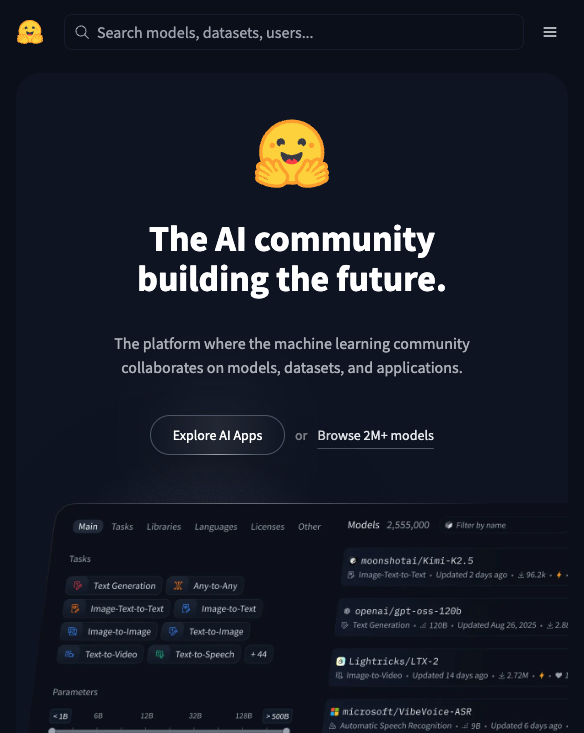

理解这三个板块，就理解了 HuggingFace 的全部。

**Models** 是 HuggingFace 的核心资产。截至 2025 年，平台上已托管超过 100 万个模型，覆盖文本生成、图像识别、语音合成、翻译、代码补全等几乎所有 AI 任务类型。Meta 的 Llama、Mistral、Stable Diffusion、Whisper……这些知名模型都在这里。每个模型页面包含模型介绍、使用方法、性能指标和下载入口，就像 GitHub 上的代码仓库页面一样完整。

**Datasets** 是训练模型的原材料。HuggingFace 上托管了超过 25 万个公开数据集，涵盖各种语言和任务。无论你想训练一个中文情感分析模型，还是想做一个医学影像分类器，大概率能在这里找到可用的数据。

**Spaces** 是最直观的部分——它让你无需写任何代码，就能在浏览器里直接体验各种 AI 模型。图像生成、语音克隆、文档问答、实时翻译，点开就能用。对于零基础用户来说，Spaces 是最好的起点。

## 注册与基本设置

访问 huggingface.co，点击右上角 Sign Up，用邮箱注册即可。也支持 GitHub 账号直接登录。

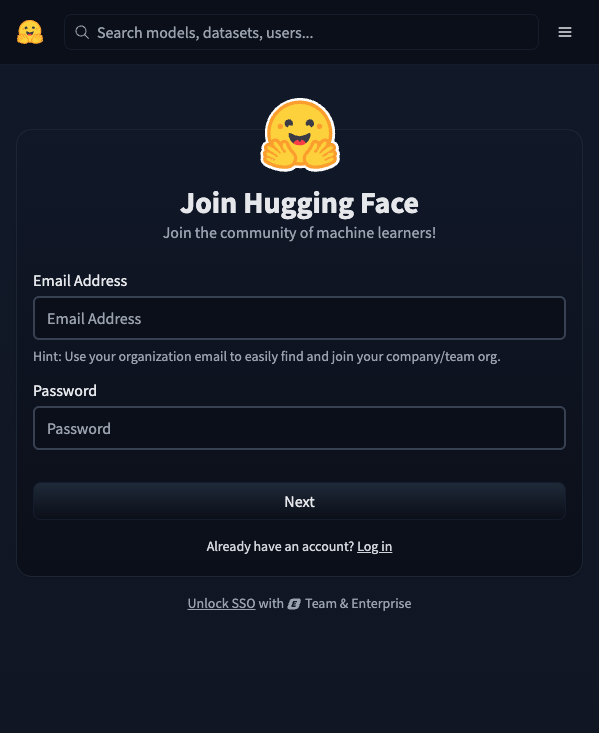

注册完成后，建议做两件事：

第一，完善个人资料。点击头像进入 Settings，填写用户名和简介。如果你将来想发布自己的模型或数据集，一个清晰的个人页面会帮你获得更多关注。

第二，获取 Access Token。进入 Settings → Access Tokens，点击 New token 创建一个。这个 Token 是你通过代码调用 HuggingFace 资源的"钥匙"。即使你现在不写代码，也建议提前创建好。Token 分为两种权限：Read（只读，用于下载模型）和 Write（读写，用于上传内容）。日常使用选 Read 就够了。

## 如何搜索和发现模型

HuggingFace 上模型数量庞大，学会高效搜索是第一项实用技能。

点击顶部导航栏的 Models，进入模型搜索页面。左侧有一系列筛选条件，这些筛选器是快速定位目标模型的关键。

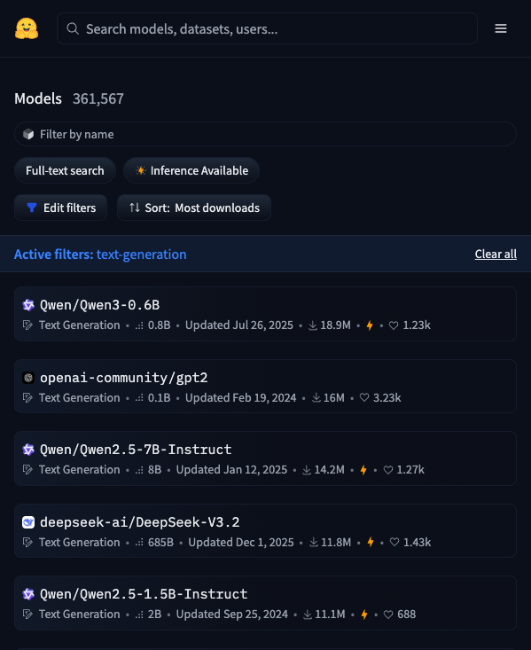

**按任务筛选（Tasks）。** 这是最常用的筛选方式。HuggingFace 把 AI 能做的事情分成了几十种任务类型，主要包括：

- Text Generation（文本生成）：ChatGPT 类对话模型
- Text-to-Image（文字生成图片）：Stable Diffusion 类模型
- Automatic Speech Recognition（语音识别）：Whisper 类模型
- Translation（翻译）
- Summarization（摘要）
- Question Answering（问答）
- Image Classification（图像分类）
- Object Detection（目标检测）

如果你不确定自己的需求属于哪种任务，直接在搜索框输入关键词也可以。比如搜索"chinese sentiment"就能找到中文情感分析相关的模型。

**按热度排序。** 默认按 Trending 排序，展示近期最热门的模型。也可以切换到 Most downloads（下载量最高）或 Most likes（点赞最多）。一个经验法则：下载量高的模型通常意味着社区验证过、文档完善、使用门槛低。

**按模型库筛选（Libraries）。** 如果你使用 PyTorch、TensorFlow 或特定框架（如 GGUF 格式的量化模型），可以通过这个筛选器快速缩小范围。对于想在本地运行大语言模型的用户，筛选 GGUF 格式特别实用——这种格式专门为消费级硬件优化过。

**按语言筛选。** 如果你需要处理中文任务，在 Languages 筛选器中选择 Chinese，可以过滤出支持中文的模型。

## 读懂一个模型页面

找到感兴趣的模型后，点击进入模型页面。一个典型的模型页面包含以下信息：

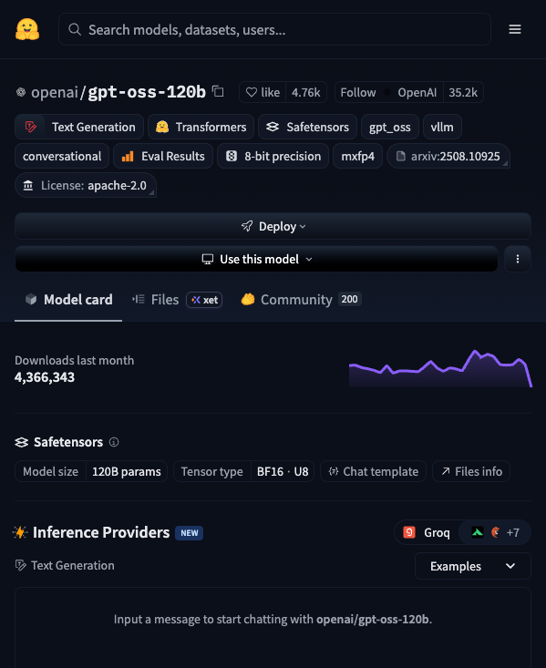

**Model Card（模型卡片）。** 这是模型的"说明书"，通常包括模型简介、适用场景、使用示例、性能评估和已知限制。质量好的 Model Card 会写得非常详细，差的可能只有寥寥几行。Model Card 的完善程度本身就是衡量模型质量的一个信号。

**Files and versions（文件与版本）。** 点击这个 Tab，可以看到模型的所有文件。对于大语言模型，你通常会看到不同大小的版本（比如 7B、13B、70B，数字代表参数量，越大越强但也越吃硬件）。很多模型还提供量化版本（文件名中带有 Q4、Q5、Q8 等标识），这些版本牺牲了一点精度但大幅降低了硬件要求。

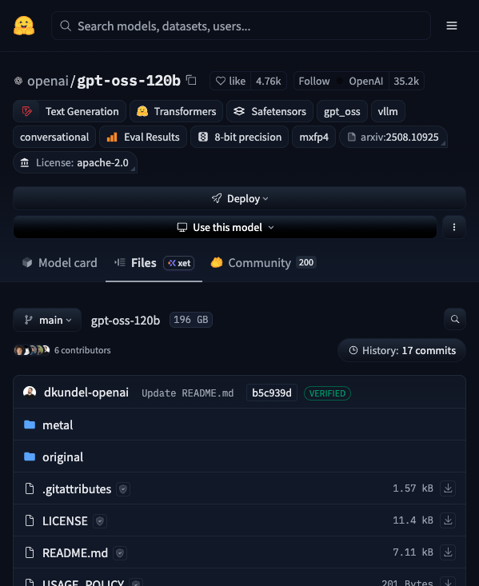

**右侧信息栏。** 这里显示模型的下载量、点赞数、最近更新时间、许可证类型等元信息。注意看许可证——有些模型虽然可以免费下载，但商用有限制（比如 Llama 系列的社区许可证）。

**Use this model（使用此模型）。** 页面上通常有一个按钮或代码片段，告诉你如何在代码中调用这个模型。如果你是开发者，这部分最实用。

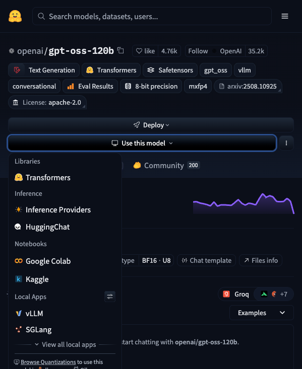

## Spaces：零代码体验 AI 的最佳入口

对于非技术用户，Spaces 是 HuggingFace 最有价值的功能。

点击顶部导航栏的 Spaces，你会看到一个应用市场般的页面。每个 Space 都是一个可以直接在浏览器中运行的 AI 应用。这些应用由社区成员搭建，覆盖的场景非常广泛。

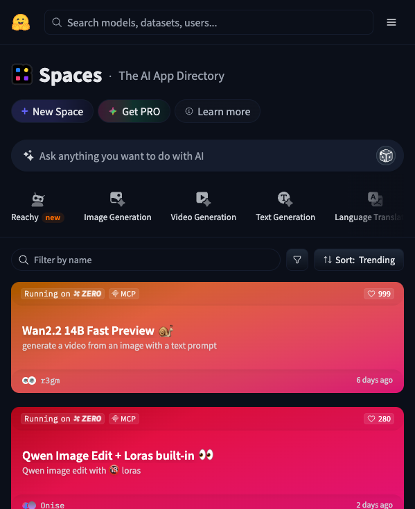

几个值得立刻体验的 Spaces：

**图像生成类。** 搜索"Stable Diffusion"或"FLUX"，可以找到多个文字生成图片的 Space。输入一段英文描述，等待几秒到几十秒，就能得到 AI 生成的图片。这是目前最直观的 AI 体验之一。

**语音识别类。** 搜索"Whisper"，可以找到 OpenAI 开源的语音识别模型。上传一段音频文件，它能自动转录成文字，支持中文和几十种其他语言。

**对话类。** 很多开源大语言模型都有对应的 Space。你可以在这里免费体验各种模型的对话能力，比较它们在中文理解、代码生成、逻辑推理等方面的差异。

**实用工具类。** 比如背景移除（搜索"remove background"）、图片放大（搜索"upscale"）、OCR 文字识别等。这些工具直接解决具体问题，不需要任何 AI 知识。

使用 Spaces 的一个注意事项：免费 Space 使用的是共享计算资源，高峰期可能需要排队，生成速度也会变慢。如果你发现某个 Space 加载很久，换个时间再试即可。

## Datasets：数据集的宝库

如果你正在学习机器学习，或者准备训练自己的模型，Datasets 板块将是你的重要资源。

点击顶部导航栏的 Datasets 进入数据集搜索页面。和 Models 类似，左侧有按任务类型、语言、大小等维度的筛选器。

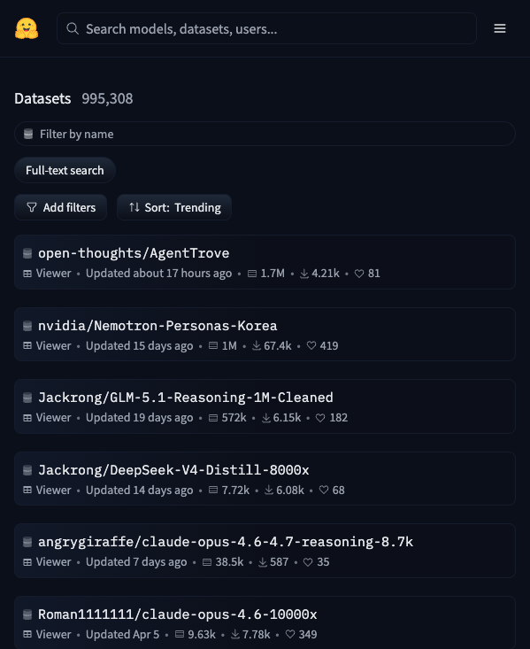

几类常用数据集：

**基准测试数据集。** 这类数据集用来评估模型表现。比如 MMLU（衡量语言模型的知识广度）、GSM8K（衡量数学推理能力）、HumanEval（衡量代码生成能力）。了解这些数据集的名字，可以帮你看懂各种模型的评测报告。

**训练数据集。** 如果你想微调一个模型来完成特定任务（比如客服对话、法律文书分析），可以在这里找到领域数据集作为起点。

**研究数据集。** 学术论文中使用的数据集大多托管在这里。如果你在复现一篇论文，直接搜索论文名或数据集名即可。

每个数据集页面都有一个 Dataset Viewer（数据预览器），可以直接在浏览器中查看数据的前几行，不需要下载整个数据集就能判断它是否符合你的需求。这个功能非常实用——很多数据集动辄几十 GB，先预览再决定是否下载，能省下不少时间和带宽。

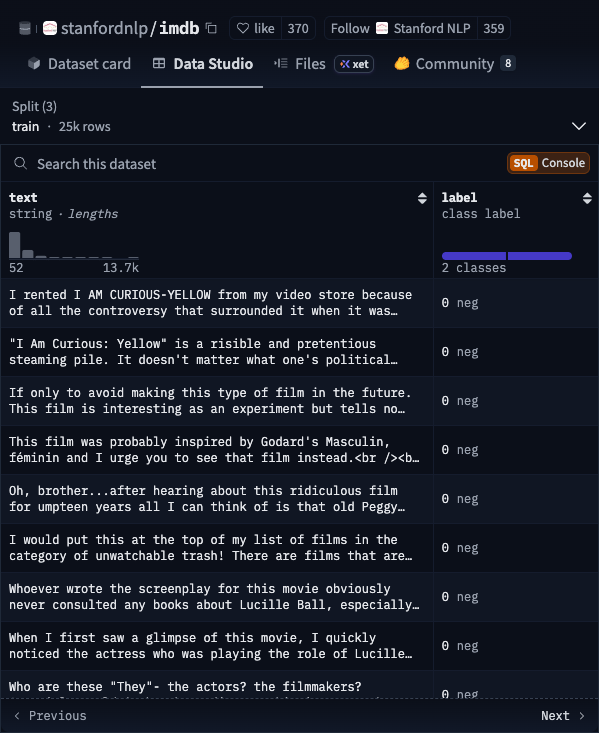

## 五个实用技巧

掌握了基本功能后，以下技巧可以帮你更高效地使用 HuggingFace。

**技巧一：善用 Collections（合集）。** 很多用户和组织会把相关的模型、数据集和 Spaces 整理成合集。比如 Meta 会把 Llama 系列的所有版本放在一个 Collection 里。关注你感兴趣的领域的 Collections，可以快速获取体系化的资源。

**技巧二：关注 Organizations（组织）。** HuggingFace 上有很多重量级组织，比如 Meta（Llama 系列）、Google（Gemma 系列）、Mistral AI、Microsoft、Stability AI 等。关注这些组织的主页，相当于订阅了它们的最新开源动态。

**技巧三：用 Daily Papers 追踪前沿。** HuggingFace 有一个 Daily Papers 板块（huggingface.co/papers），每天精选 arXiv 上的最新 AI 论文，并且直接关联论文对应的模型和数据集。这是了解 AI 研究前沿的高效渠道，比自己刷 arXiv 效率高很多。

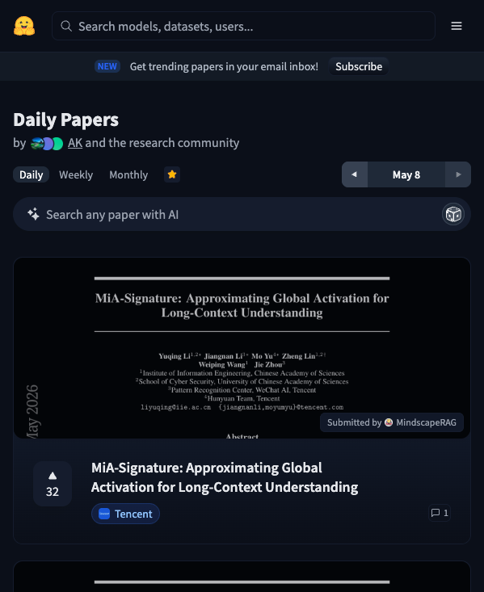

**技巧四：查看 Open LLM Leaderboard。** 如果你想知道目前哪个开源大语言模型最强，HuggingFace 维护了一个公开的排行榜（搜索"Open LLM Leaderboard"即可找到对应的 Space）。排行榜按多个维度评分，帮你在选择模型时有据可依。

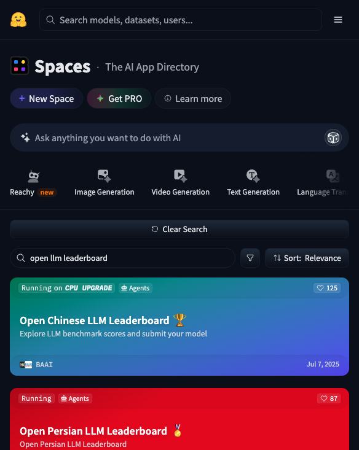

**技巧五：利用 Inference API 快速测试。** 很多模型页面右侧有一个 Inference API 小组件，可以直接输入内容测试模型效果，无需下载或部署。这是最快的模型试用方式——在你决定花时间部署之前，先用这个功能验证模型是否满足需求。

## 使用 HuggingFace 的常见场景

把上面的功能串起来，看看不同角色的人会怎么用 HuggingFace。

**如果你是 AI 爱好者，想体验最新技术。** 直接去 Spaces 板块，按 Trending 排序，找到感兴趣的应用点击体验。关注 Daily Papers 了解行业动态。这两个入口完全不需要任何技术背景。

**如果你是开发者，想在项目中使用 AI 模型。** 在 Models 中按任务类型筛选，找到合适的模型，参考模型页面的代码示例集成到你的项目中。HuggingFace 提供了 transformers 和 hub 两个 Python 库，几行代码就能加载和运行模型。

**如果你是学生或研究者，想复现论文或开展研究。** 在 Models 和 Datasets 中搜索论文名称，通常能找到作者上传的官方模型权重和训练数据。如果论文引用了特定的基准测试，在 Datasets 中也能找到对应的评测数据集。

**如果你是内容创作者，想用 AI 提升效率。** Spaces 中有大量实用工具：图片生成、背景移除、语音转文字、视频字幕生成、文案改写。这些工具免费且无需注册就能使用，可以作为你工作流中的辅助环节。

## 与 GitHub 的类比：帮你建立直觉

如果你熟悉 GitHub，以下类比可以帮你快速建立对 HuggingFace 的直觉：

| GitHub | HuggingFace | 说明 |
|--------|-------------|------|
| Repository（仓库） | Model / Dataset | 内容的基本单位 |
| README.md | Model Card | 项目说明文档 |
| Stars（星标） | Likes（点赞） | 社区认可度指标 |
| Releases（发布） | Model versions | 版本管理 |
| GitHub Pages | Spaces | 在线展示/运行 |
| Organizations | Organizations | 团队和公司主页 |
| Topics / Tags | Tasks / Tags | 分类标签 |
| GitHub Actions | Webhooks / CI | 自动化流程 |

两者的核心理念一致：让全球开发者和研究者能够方便地分享、发现和复用彼此的工作成果。GitHub 降低了代码共享的门槛，HuggingFace 降低了 AI 模型共享的门槛。

## 一些注意事项

**关于模型许可证。** 并非所有模型都可以随意使用。下载前务必检查许可证类型。常见的许可证包括：Apache 2.0（商用友好）、MIT（商用友好）、Llama Community License（有用户数限制）、CC-BY-NC（仅限非商业用途）。用于个人学习和研究通常没有问题，商业项目需要仔细确认。

**关于模型安全。** 和从 GitHub 下载代码一样，从 HuggingFace 下载模型也需要基本的安全意识。优先选择知名组织发布的模型，查看社区评论和讨论，避免运行来源不明的模型文件。HuggingFace 已经在推进模型安全扫描机制，但用户自身的判断仍然是最重要的防线。

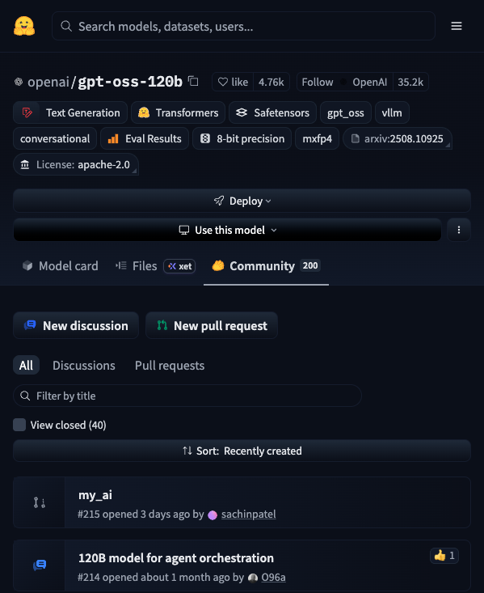

**关于网络访问。** 由于 HuggingFace 的服务器在海外，部分地区访问速度可能较慢。HuggingFace 提供了镜像站点（hf-mirror.com），可以加速模型和数据集的下载。使用时只需要将下载链接中的 huggingface.co 替换为 hf-mirror.com 即可。

---

HuggingFace 正在成为 AI 领域的基础设施，就像 GitHub 之于现代软件开发一样不可或缺。无论你是想体验最新的 AI 应用，还是想深入学习和开发，它都是一个值得花时间熟悉的平台。从打开 Spaces 体验第一个 AI 应用开始，慢慢探索这座宝库的更多角落。
