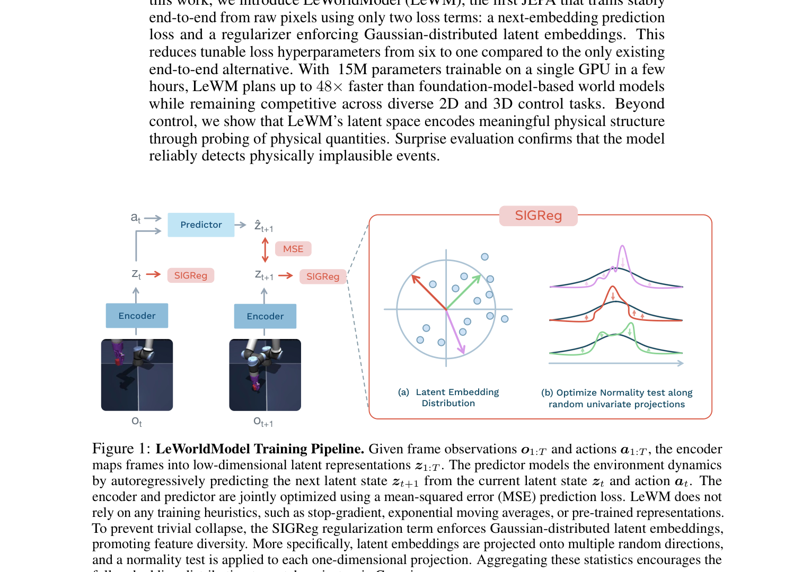
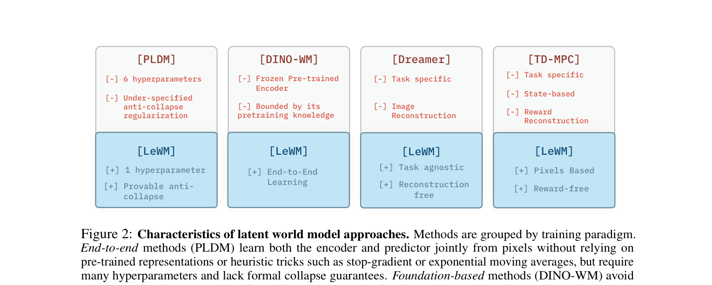
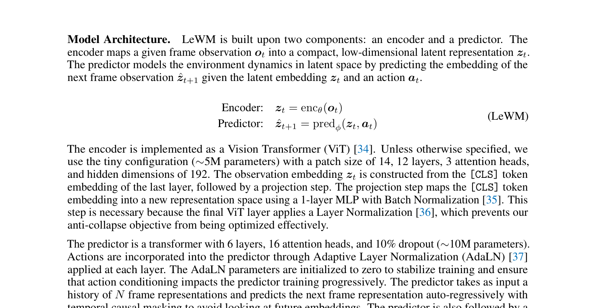
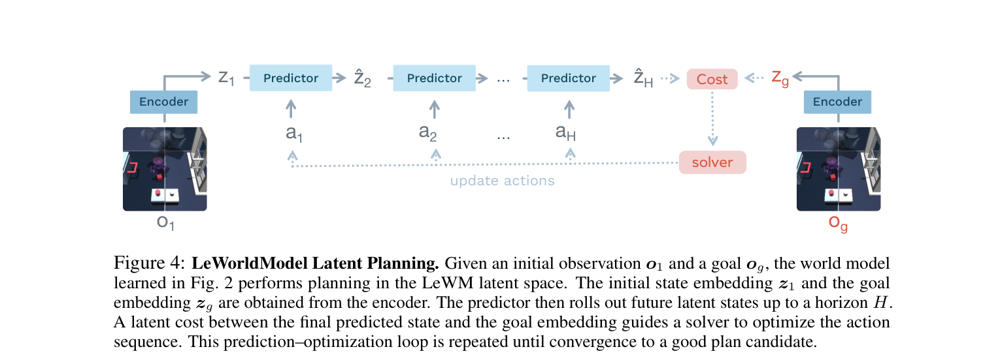
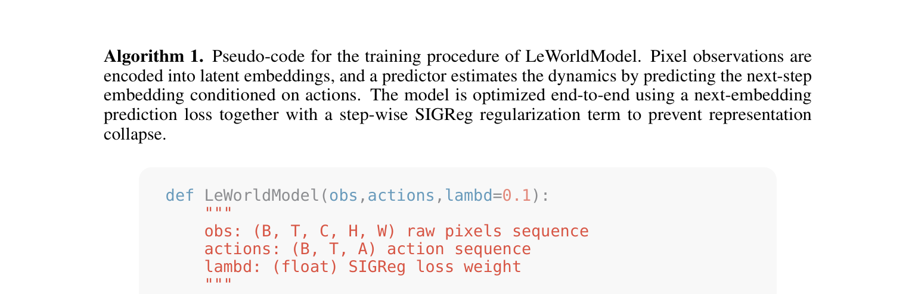
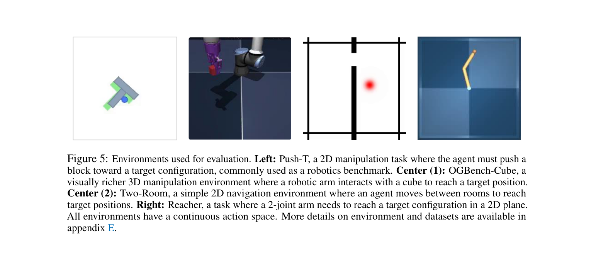
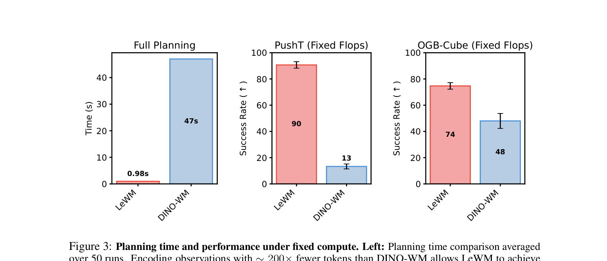
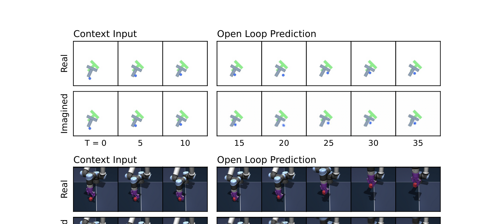
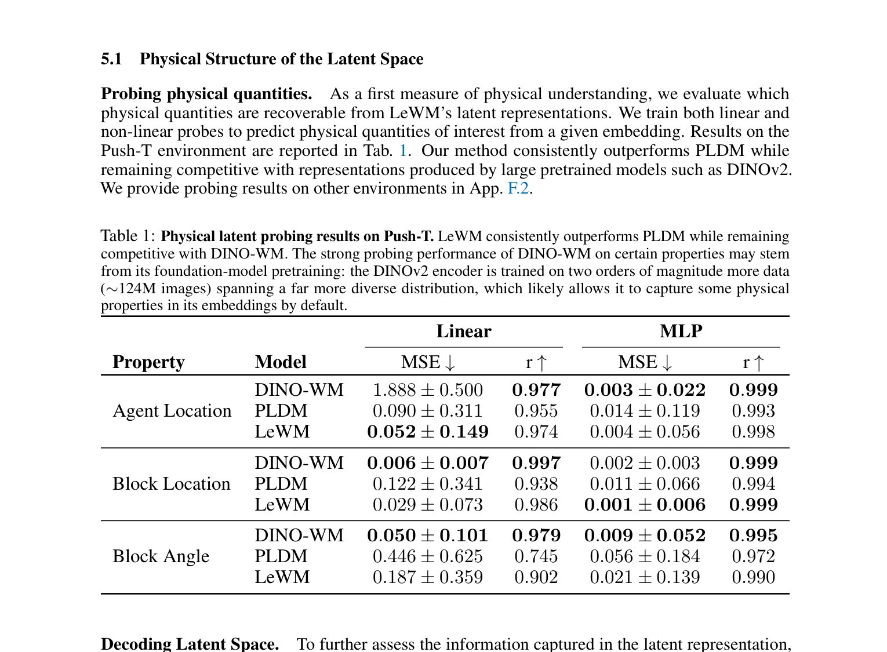
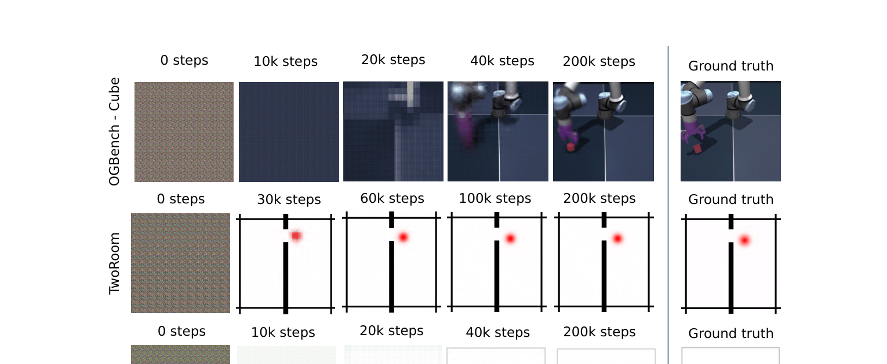

# AI 如何像人一样在脑中"想象"世界：LeWorldModel 科普解读

你在厨房里端着一杯水走向餐桌。你没有把水泼出来，也没有撞到椅子。你是怎么做到的？

答案是：你在脑子里模拟了一遍。你在迈步之前，已经"想象"了接下来几步会发生什么——水会怎么晃、椅子在哪里、手应该怎么端。这个过程快到你完全意识不到它的存在，但它确实在发生。

如果 AI 也能拥有这种能力呢？

这正是一篇来自 Yann LeCun 团队的最新论文想要解决的问题。这篇论文叫 LeWorldModel，它让一个 AI 仅通过"看"——没有人告诉它物理规律，没有预先编写的规则——就学会了在脑中建立一个关于环境的内部模型，然后用这个模型来"想象"和规划。

## 为什么 AI 需要"想象力"

今天最热门的 AI 是 ChatGPT 这样的大语言模型。它们通过阅读海量文字学会了回答问题、写文章、编程序。但请注意一个关键的缺失：它们从未"看"过这个世界，也从未在物理环境中"行动"过。

这带来一个根本性的局限。你可以问 ChatGPT"如果我把杯子推到桌子边缘会怎样"，它会回答"杯子会掉下去"。但它给出这个答案，是因为它读过无数描述这个场景的文字，而非因为它真正"理解"了重力。

换一种方式想：一个从未见过水的人，仅通过阅读关于水的文字描述，能学会游泳吗？

世界模型走的是另一条路。它让 AI 直接从视觉画面中学习——看大量的视频或图像序列，从中自己摸索出"这个世界是怎么运转的"。学成之后，AI 就拥有了一个内部的"想象空间"，可以在脑中模拟"如果我做这个动作，接下来会发生什么"，然后选择最好的方案去执行。

就像你端水过厨房一样。

## 两种"想象"的方式

AI 构建"想象力"有两种主要方式，区别在于它在脑中"想象"的内容有多详细。

**第一种：像放电影一样想象每一帧画面。** 这叫生成式世界模型。AI 会在脑中"生成"未来的完整图像——每个像素、每种颜色、每处阴影都要预测出来。优点是信息完整，缺点是计算量极大。想象一下，你只是想决定往左走还是往右走，却要先在脑中完整地渲染出两条路径上的每一帧超高清画面——这显然太浪费了。

**第二种：只想象"要点"。** 这叫潜在世界模型，也是 LeWorldModel 所属的类别。AI 不去想象完整的画面，而是把每一帧画面"压缩"成一个精简的"要点"表述（技术上叫做"潜在表征"），然后在这个压缩后的空间里做预测。

打个比方：你在脑中想象端水走过厨房时，你并没有在脑中渲染厨房地砖的每一个花纹。你只是记住了几个关键信息——水杯在手里、椅子在右前方大概两步远、餐桌在正前方。这些"要点"就够你做出正确决策了。

LeWorldModel 做的就是这件事：从画面中提取要点，在要点空间里预测未来。

上图是 LeWorldModel 的工作原理。左边两个"Encoder"（编码器）负责把原始画面压缩成要点。中间的"Predictor"（预测器）根据当前的要点和执行的动作，预测下一时刻的要点。右边的"SIGReg"是防止系统偷懒的机制（后面会解释）。

## 一个听起来很蠢但很致命的问题

这套"提取要点，然后预测"的框架听起来很优雅，但它有一个致命的bug——AI 会"偷懒"。

想象你在教一个学生做数学题。你告诉他"我会检查你的答案是否正确"。这个学生发现了一个"完美"的策略：不管题目是什么，他都回答"0"。如果批改老师也学会了同样的策略——不管输入什么，都把"正确答案"设为"0"——那这个学生永远都能得满分。

这在 AI 领域叫"表征坍缩"。编码器把所有不同的画面都压缩成同一个"要点"（比如全是零向量），然后预测器永远输出这个固定值，预测误差为零。技术上看，损失函数达到了最小值，系统"完美"地完成了训练目标。但实际上，它什么都没学到。

这不是一个假设性的风险——在 LeWorldModel 之前，几乎所有尝试这种架构的研究都被这个问题折磨过。

## 现有方案：各种"反偷懒"策略

研究者们发明了各种方法来阻止 AI 偷懒，但每种方法都有明显的代价：

**策略一：请一个外部监督员。** 有一种方法叫 DINO-WM，它用一个已经在海量图片上训练好的视觉模型（DINOv2，在 1.24 亿张图片上训练过）来充当编码器，而且冻结这个编码器不让它更新。这就好比请了一个经验丰富的外部顾问来做"压缩要点"的工作，自己只训练"预测"那一部分。问题是：这个外部顾问是通用的，它从互联网图片中学来的经验不一定适合你要解决的具体任务。

**策略二：加大量防偷懒规则。** 另一种方法叫 PLDM，它在训练目标里塞进了七个不同的损失项，用复杂的规则来防止坍缩。这就好比一个公司为了防止员工摸鱼，搞了七套考核制度。结果是：六个超参数需要手动调整，不同的规则之间可能互相冲突，系统变得极其难以稳定。

**策略三：各种工程技巧。** 还有的方法用 stop-gradient（切断梯度）、指数移动平均（EMA）等技巧来间接地防止坍缩。这些技巧在实践中有效，但研究者并不完全理解"为什么有效"——它们更像是经验配方而非有根据的解决方案。

下图对比了这些方法的特点。每个方框上方的 [-] 表示局限，下方的 [+] 表示 LeWM 如何克服了该局限：

## LeWorldModel 的做法：一条极简规则

LeWorldModel 的核心贡献是找到了一个极其简洁的"反偷懒"方案。

它的训练目标只有两项：

**第一项：预测要准。** 给定当前画面的"要点"和执行的动作，预测下一时刻的"要点"，预测误差越小越好。这是世界模型的核心功能。

**第二项：要点不能都一样。** 这就是 SIGReg 正则化。它的要求用大白话说就是：编码器压缩出来的"要点"必须呈现多样性，不同的画面必须对应不同的要点，而且这些要点的整体分布必须"散开"，像一团均匀扩散的烟雾一样。

如果 AI 想偷懒把所有画面都映射到同一个点，第二项规则就会重重地惩罚它——因为一个点不是"均匀散开的烟雾"。

就这两条规则，没有了。没有七项损失函数，没有冻结外部模型，没有无法解释的工程技巧。论文作者还证明了，这个方法在数学上有严格的防坍缩保证——不是"经验上有效"，而是"可以证明有效"。

整个训练过程的代码短到可以放在半页纸上：

唯一需要手动调整的参数只有一个：两条规则之间的权重比（λ）。默认值 0.1 在大多数情况下就能用。

## 用"想象力"做规划

训练完成后，LeWorldModel 就拥有了一个环境的内部模型。接下来它要用这个模型来规划行动。

规划过程可以用一个日常比喻来理解。假设你在一个陌生的房间里，要把一个方块推到指定位置：

1. **观察现状：** 你看到方块在哪里（当前画面），也知道目标状态是什么样（目标画面）。编码器把这两个画面分别压缩成"当前要点"和"目标要点"。

2. **脑中推演：** 你在脑中尝试不同的动作序列——"先向右推三步，再向前推两步"。预测器根据你假想的每个动作，在要点空间里依次推算每一步的结果。

3. **评估方案：** 推演结束后，看看终点的"要点"离"目标要点"有多远。如果很远，说明这个方案不好。

4. **优化选择：** 同时试上百个随机方案，选最好的那些，在它们附近继续搜索更好的方案。反复迭代几轮，找到一个足够好的动作序列。

5. **只走第一步：** 执行方案的前几步动作，然后重新观察现状，重新规划。这避免了一次性规划太远而累积误差。

这一切都发生在"要点空间"里——一个只有 192 个数字的压缩空间。相比之下，一帧 84×84 的彩色画面有超过 2 万个数字。在压缩空间里做规划，计算量小了几个数量级。

## 实际效果：快了 48 倍

论文在四个不同的测试环境中验证了 LeWorldModel：

从左到右分别是：推 T 形方块的二维任务、三维机械臂抓方块、二维房间导航、以及二关节机械臂。

**核心结果一：规划效果有竞争力。**

在 Push-T（推方块）和 Reacher（机械臂够目标）任务上，LeWorldModel 的表现优于那个使用七项损失函数的复杂方法（PLDM），也优于那个使用 1.24 亿张图片预训练编码器的方法（DINO-WM）。

一个只有 1500 万参数、从零开始训练的小模型，打败了依赖海量预训练的大模型——这本身就说明了"在正确的框架下学习"比"堆参数和数据"更重要。

**核心结果二：规划速度快了 48 倍。**

由于 LeWorldModel 的"要点"表述极其紧凑（192 个数字），它做一次完整的规划只需不到 1 秒。而使用预训练大编码器的 DINO-WM 需要 47 秒——因为它的"要点"表述太大了（token 数量多出约 200 倍）。

在相同的计算预算下比较（右边两张图），LeWorldModel 在 Push-T 上的成功率是 90%，DINO-WM 只有 13%。

**核心结果三：单块 GPU，几小时搞定。** LeWorldModel 的模型只有 1500 万参数（作为对比，ChatGPT 背后的 GPT-4 有超过万亿参数），在普通的单块 GPU 上几个小时就能训练完成。

## 它真的"理解"物理吗

一个核心问题是：LeWorldModel 在压缩画面时，是否真的抓住了物理世界的关键信息，还是只是在做某种统计上的模式匹配？

论文通过几个漂亮的实验回答了这个问题。

**实验一：从要点恢复画面。** 作者训练了一个"解压器"，把 192 个数字还原成画面。注意，LeWorldModel 训练时从来不需要恢复画面——这个解压器是事后加上去的，纯粹用来检验那 192 个数字里到底保存了多少信息。

结果令人惊讶：随着训练进行，从 192 个数字恢复出的画面越来越清晰，最终几乎和真实画面一模一样。这说明那 192 个数字虽然压缩了 99% 以上的数据量，但几乎没有丢失关键信息。

**实验二：预测器的"想象"有多准。** 给模型三帧画面作为上下文，再给一串动作，让预测器在要点空间里"想象"接下来会发生什么，然后用解压器把"想象"还原成画面：

上面一行是真实发生的画面，下面一行是 AI"想象"出来的画面。几乎完全吻合。这个 AI 真的在脑中"播放"了一部和现实高度一致的"电影"。

**实验三：违反预期测试。** 这是最有趣的一个实验，灵感来自发展心理学中测试婴儿认知能力的经典方法。

心理学家发现，即使是几个月大的婴儿，当看到"不可能"的事件时（比如一个球穿过了一堵墙），也会表现出"惊讶"——注视时间变长。这说明婴儿已经对物理世界有了基本的"预期"。

论文对 LeWorldModel 做了类似的测试：让它观察正常的画面序列，然后突然做两种"扰动"——一是让物体的颜色突然变了，二是让物体突然"传送"到了另一个位置。然后测量模型的预测误差（类比于"惊讶程度"）。

结果清楚地显示：当物体突然传送时（蓝色线），模型的"惊讶度"急剧飙升。但当物体只是换了颜色时（绿色线），模型的反应相对平静。

这意味着什么？LeWorldModel 学会了区分"物理性变化"和"外观性变化"。它"知道"物体不应该凭空消失又出现在别处，但颜色变一变倒不是什么大事。

没有人教它牛顿定律，没有人给它编写物理引擎，它只是看了大量的画面序列，就自己发展出了这种朴素的"物理直觉"。

## 它的局限性

LeWorldModel 当然远非完美，论文也坦诚地讨论了几个主要局限：

**只能做短视规划。** 就像你在脑中推演走路不会一次性想十分钟后的情况一样，LeWorldModel 的"想象"也只能推演有限的未来。每一步预测都有微小的误差，步数越多误差越大。目前它只适合几十步以内的短期规划。

**测试环境还比较简单。** 推方块、够目标这些任务虽然对 AI 来说已经不容易，但和真实世界的复杂度（比如在一个杂乱的厨房里做饭）相比差距还很大。

**需要"动作标签"。** 训练数据不仅需要画面，还需要知道每一帧对应执行了什么动作。在机器人场景中这很容易获取，但在自然视频中就难了。

**简单环境反而表现差。** 在最简单的二维导航任务中，LeWorldModel 的表现反而不如其他方法。这是因为它的防偷懒机制（SIGReg）要求"要点"的分布像均匀的烟雾一样散开，但当环境本身信息量很少时，强制"散开"反而引入了无意义的噪声。

## 为什么这篇论文值得关注

站远一步看，LeWorldModel 的意义超越了技术细节本身。

**它证明了"简洁"的力量。** 在 AI 研究中有一种越来越明显的趋势：通过不断堆叠技巧来提升性能——更多的损失函数、更多的超参数、更复杂的训练流程。LeWorldModel 反其道而行之，只用了两条规则就解决了别人用七条规则都解决不好的问题。这提醒我们，当一个方案需要大量补丁才能工作时，也许问题出在方案本身，而非补丁还不够多。

**它降低了研究门槛。** 单块 GPU、几小时训练、1500 万参数——这意味着大学实验室甚至个人研究者也能复现和改进这项工作。在 AI 研究越来越被大公司和大算力垄断的今天，这种"平民化"尤为可贵。

**它关乎 AI 发展方向之争。** 当前 AI 的主流路线是大语言模型——通过阅读文字来"理解"世界。而 LeWorldModel 代表的是另一条路线——通过"看"和"做"来理解世界。这篇论文用实验证明了，一个仅从画面中学习的小模型，可以自发地发展出物理直觉——不需要语言作为中介。

两条路线未必互相排斥。未来更强大的 AI 可能同时拥有"阅读理解"（大语言模型）和"物理想象"（世界模型）两种能力。但至少 LeWorldModel 证明了：通往物理理解的这条路是走得通的，而且比我们以为的要简单得多。

## 一句话总结

LeWorldModel 让 AI 仅通过"看"就学会了在脑中"想象"世界的运作方式——只用了两条训练规则、1500 万参数、一块 GPU——并且这个 AI 还自发地发展出了区分"物理违规"和"外观变化"的能力。它不是通用人工智能的答案，但它可能是通往答案的路上一块重要的铺路石。
