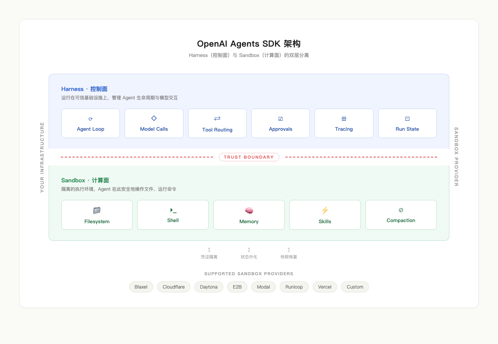
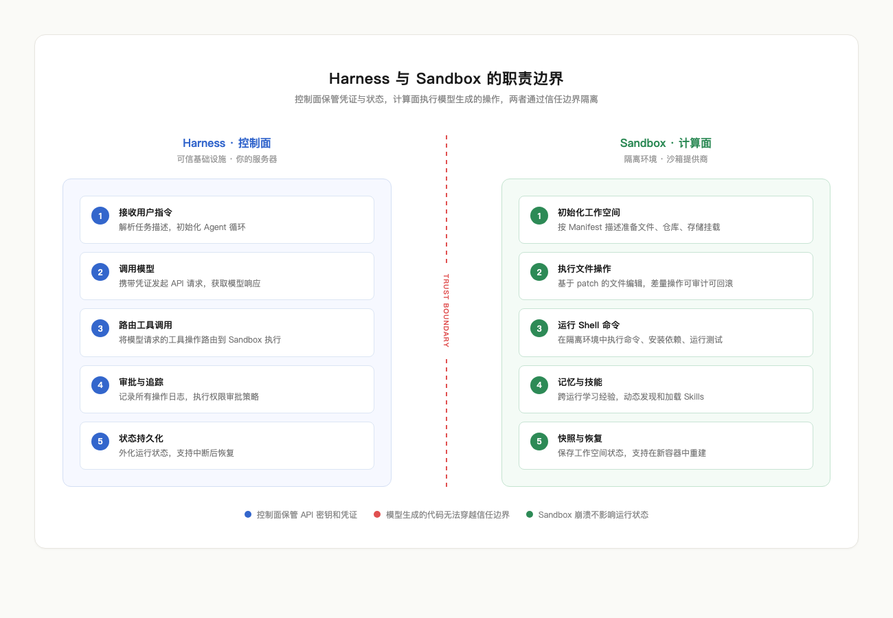

# OpenAI Agents SDK 的下一步演进：当 Agent 拥有了自己的操作系统

2026 年 4 月 15 日，OpenAI 发布了 Agents SDK 的一次重大更新。这次更新的核心，是给 Agent 配备了两样东西：一个控制面（Harness），一个计算面（Sandbox）。前者决定模型如何感知工具、文件和状态，后者提供一个隔离的执行环境，让 Agent 可以安全地读写文件、运行命令、安装依赖。

这件事的意义，远不止"多了几个 API"。它标志着行业对 Agent 基础设施的认知正在发生根本性的转变——Agent 的能力瓶颈，从来都不在模型本身，而在模型运行的那套基础设施上。



## 问题的本质：Agent 缺的是一个运行时

过去一年，几乎所有做 Agent 的团队都撞上了同一堵墙：模型能力在快速提升，但 Agent 在生产环境中的表现却跟不上。原因并不难理解——一个 Agent 要完成真实的工作任务，需要的远不止"生成一段文本"。它需要浏览目录结构、读写文件、执行 shell 命令、安装依赖包、处理多步工作流中的中间状态、在任务中断后恢复执行。

这些能力，模型本身不提供。它们属于基础设施层。

在这次更新之前，开发者要让 Agent 具备这些能力，只能自己搭建：自己写沙箱隔离逻辑，自己管理文件系统状态，自己处理任务中断和恢复，自己做安全隔离防止 Agent 的操作泄漏到宿主机。这些基础设施的工程量巨大，且每个团队都在重复造轮子。

OpenAI 这次更新的思路很直接：把这些基础设施标准化，内置到 SDK 里。开发者只需一行 `pip install openai-agents`，就能获得完整的 Agent 运行时。

## Harness 与 Sandbox：控制面与计算面的分离

这次更新的架构设计围绕一个核心拆分展开：**Harness（控制面）和 Sandbox（计算面）的分离**。

**Harness** 是 Agent 的控制中枢，运行在可信的基础设施上，负责：

- Agent 循环（agent loop）的调度
- 模型调用的发起和响应处理
- 工具路由、审批、handoff
- 追踪（tracing）和可观测性
- 运行状态（run state）的管理和恢复

**Sandbox** 是 Agent 的执行环境，提供一个隔离的类 Unix 工作空间：

- 文件系统的读写操作
- Shell 命令的执行
- 依赖包的安装
- 云存储的挂载（S3、GCS、Azure Blob、Cloudflare R2）
- 端口暴露和服务预览
- 工作空间快照和恢复



这两层可以运行在同一台机器上，也可以分开部署。分离带来了两个关键好处。

第一，**安全性**。凭证和密钥保存在 Harness 侧，Agent 生成的代码在 Sandbox 中执行，两者之间有明确的信任边界。即使 Agent 被 prompt injection 攻击或生成了恶意代码，也无法触及 Harness 中的敏感信息。

第二，**持久性**。当 Agent 的状态被外化到 Harness 侧，Sandbox 容器的丢失就不再意味着任务的丢失。SDK 内置了快照（snapshot）和重建（rehydration）机制——如果原始 Sandbox 环境崩溃或过期，系统可以在一个全新的容器中恢复 Agent 的状态，从上一个检查点继续执行。

OpenAI 产品团队的 Karan Sharma 在发布时说："这次发布的核心，是让现有的 Agents SDK 能够兼容所有这些沙箱提供商。"目前支持的沙箱提供商包括 Blaxel、Cloudflare、Daytona、E2B、Modal、Runloop 和 Vercel，开发者也可以接入自定义的沙箱实现。

## Manifest：声明式的工作空间描述

Manifest 是这次更新中一个值得仔细看的抽象。它用声明式的方式描述 Agent 的工作空间应该长什么样——有哪些文件、挂载哪些存储、克隆哪些仓库、设置哪些权限。

```python
from agents.sandbox import Manifest, SandboxAgent
from agents.sandbox.entries import GitRepo, LocalDir

agent = SandboxAgent(
    name="代码审查工程师",
    instructions="阅读 repo/task.md，修复问题，运行测试，总结变更。",
    default_manifest=Manifest(
        entries={
            "repo": GitRepo(repo="openai/openai-agents-python", ref="main"),
            "docs": LocalDir(src="/path/to/local/docs"),
        }
    ),
)
```

这段代码做了一件事：定义一个 Agent 的工作空间，其中包含一个从 GitHub 克隆的仓库和一个从本地挂载的文档目录。Agent 启动时，SDK 会自动把这些内容准备好，Agent 在沙箱中就像在一个标准的 Unix 环境里工作。

Manifest 支持的条目类型包括：

| 条目类型 | 用途 |
|---------|------|
| File / Dir | 合成的输入文件或输出目录 |
| LocalFile / LocalDir | 从宿主机挂载的本地文件 |
| GitRepo | 从远程仓库克隆 |
| Mount | 云存储挂载（S3、GCS、R2、Azure Blob） |

路径一律使用工作空间相对路径，防止目录穿越攻击。每个条目还可以附加文件级别的权限控制，映射到标准的 Unix 文件系统语义（owner / group / other）。

这个设计的价值在于**可移植性**。同一份 Manifest 可以在本地开发环境（UnixLocalSandboxClient）、Docker 容器（DockerSandboxClient）和云端托管服务之间无缝切换，Agent 的定义本身不需要做任何修改。

## 五项内置能力

SDK 为 Sandbox Agent 内置了五项核心能力（Capabilities），每一项都是经过大量实践沉淀下来的标准化工具集：

| 能力 | 功能 |
|-----|------|
| **Shell** | 命令执行和交互式终端（PTY） |
| **Filesystem** | 基于 patch 的文件编辑和图片检查 |
| **Skills** | 技能发现和动态加载 |
| **Memory** | 跨运行的经验学习和知识沉淀 |
| **Compaction** | 长任务中的上下文压缩管理 |

其中，**Filesystem** 的实现方式值得关注。它使用基于 patch 的文件编辑，而不是整文件覆写。这意味着每次编辑都是差量（diff）操作，好处有三个：可审计（能看到具体改了什么）、减少格式漂移、支持安全回滚。这和 Codex 的 `apply_patch` 工具是同一套思路。

**Memory** 能力则解决了 Agent 跨会话学习的问题。它会把每次运行中的经验提炼成可读的文件，存储在工作空间中，后续运行可以读取和构建新知识。这套记忆机制和对话式记忆（Session Memory）是分开的——它更像是一份持续积累的工作笔记，而非聊天记录。

## 一个完整的代码示例

下面是官方文档中的一个完整示例，展示如何构建一个具备完整能力的 Sandbox Agent：

```python
import asyncio
from pathlib import Path
from agents import Runner
from agents.run import RunConfig
from agents.sandbox import Manifest, SandboxAgent, SandboxRunConfig
from agents.sandbox.capabilities import Capabilities, LocalDirLazySkillSource, Skills
from agents.sandbox.entries import LocalDir
from agents.sandbox.sandboxes.unix_local import UnixLocalSandboxClient

HOST_REPO_DIR = Path("./my-project")
HOST_SKILLS_DIR = Path("./skills")

agent = SandboxAgent(
    name="Sandbox engineer",
    model="gpt-5.5",
    instructions=(
        "Read `repo/task.md` before editing files. Stay grounded in the repository, "
        "preserve existing behavior, and mention the exact verification command you ran. "
        "If you edit files with apply_patch, paths are relative to the sandbox workspace root."
    ),
    default_manifest=Manifest(
        entries={
            "repo": LocalDir(src=HOST_REPO_DIR),
        }
    ),
    capabilities=Capabilities.default() + [
        Skills(
            lazy_from=LocalDirLazySkillSource(
                source=LocalDir(src=HOST_SKILLS_DIR),
            )
        ),
    ],
)

async def main():
    result = await Runner.run(
        agent,
        "Open `repo/task.md`, fix the issue, run the targeted test, and summarize the change.",
        run_config=RunConfig(
            sandbox=SandboxRunConfig(client=UnixLocalSandboxClient()),
            workflow_name="Sandbox coding example",
        ),
    )
    print(result.final_output)

asyncio.run(main())
```

几个关键点：

1. Agent 的定义（`SandboxAgent`）和运行环境（`SandboxRunConfig`）是分开的。同一个 Agent 定义可以在本地、Docker、或云端运行，只需要换一个 `client`。

2. `Capabilities.default()` 包含了 Shell、Filesystem、Memory、Compaction 等基础能力，`Skills` 可以额外叠加，从本地目录懒加载。

3. `instructions` 中明确了 Agent 的工作协议——先读任务文件、保持对仓库的忠实、使用相对路径编辑文件。这些约束决定了 Agent 在沙箱中的行为边界。

## 状态管理：三层持久化

Agents SDK 的状态管理设计了三层持久化机制，每一层解决不同的问题：

**RunState**：Harness 侧的运行状态，包括模型交互历史、工具调用状态、审批记录。这是最细粒度的状态，用于在单次运行中断后恢复。

**Session State**：序列化的沙箱连接状态，用于重新连接到特定的沙箱后端。需要配合 `client` 参数使用——你不能用一个 Docker session state 去恢复一个 E2B 沙箱。

**Snapshot**：工作空间内容的完整快照，可以在全新的沙箱中重建整个工作环境。这是最重量级的持久化方式，适用于跨 session 的长周期任务。

SDK 在恢复时按优先级依次尝试：注入的活跃 session → 存储的 session state → 显式的 session state 参数 → 全新创建（使用 Manifest 或 Snapshot）。

## 对开发者意味着什么

这次更新把一件原本需要数周工程量的事情变成了一行 `pip install`。但更深层的变化在于，它正在定义 Agent 基础设施的行业标准。

过去，每个做 Agent 的团队都在独立解决同一组问题：沙箱隔离、文件管理、状态持久化、安全边界、多步任务恢复。这些问题的解法大同小异，但每个团队都在从头做起。OpenAI 把这一层标准化之后，竞争的焦点将从"谁能搭出一套可用的 Agent 基础设施"转移到"谁能在这套基础设施上构建出真正有价值的 Agent 应用"。

目前这套能力只在 Python SDK 中可用，TypeScript 版本将在后续发布。所有新的 Agents SDK 功能对所有 API 用户开放，按标准 API 定价计费，不需要额外的套餐或等级。

后续还会推出 code mode 和 sub-agents 功能。沙箱提供商的生态也在扩展中——从目前支持的七家，到未来更多的集成选项，开发者将有更多选择来匹配自己的部署场景和安全要求。

对于正在构建 Agent 应用的团队来说，这次更新值得认真评估。它在工程投入和安全保障之间找到了一个务实的平衡点，而这个平衡点，在三个月前还需要自己去摸索。
