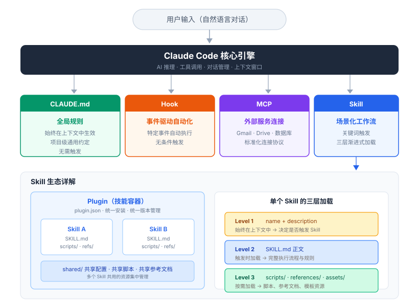

# 第一章：理解 Skill——它到底是什么

在动手安装或开发任何 Skill 之前，有几个基础概念必须搞清楚。这一章解决最根本的问题：Skill 到底是什么东西，它怎么工作，它在 Claude Code 的工具体系里处于什么位置。

**本章目录**

- [一句话定义](#一句话定义)
- [Skill 与 Prompt 的本质区别](#skill-与-prompt-的本质区别)
- [怎么触发一个 Skill](#怎么触发一个-skill)
- [三层加载机制](#三层加载机制)
- [Skill 的文件结构](#skill-的文件结构)
- [Skill 与 MCP、Hook、CLAUDE.md 的关系](#skill-与-mcphookclaude.md-的关系)
- [本章小结](#本章小结)

> **Claude Code 是什么？** Anthropic 公司推出的 AI 编程助手，你可以在终端（命令行界面）、桌面应用或网页中通过自然语言和它对话，让它帮你写代码、处理文件、分析数据。Skill 就是给这个助手"加技能"的扩展机制。

---

## 一句话定义

Skill 是一份结构化的 Markdown 文件（Markdown 是一种用简单符号标记格式的纯文本写法，文件后缀是 `.md`，你现在读的这篇文章就是用 Markdown 写的），它告诉 Claude Code 在特定场景下应该怎么做。

你可以把它想象成给一个能力极强但缺乏行业经验的新员工写的操作手册。Claude Code 本身什么都能做——写代码、处理文件、调用 API、分析数据。但它不知道你的领域里有哪些特定的做法、限制和偏好。Skill 填补的就是这个空白。

举个例子。假设你是一名会计，每个月都要做一份财务月报：从 Excel 里提取关键数据 → 按公司模板生成报告 → 插入图表 → 导出为 PDF → 发邮件给老板。Claude Code 每一步都做得来，但它不知道你们公司的模板长什么样、哪些数据必须出现在摘要里、PDF 的页眉页脚格式是什么、老板的邮箱地址是哪个。Skill 把这些信息打包在一起，让你说一句”帮我做这个月的月报”，整条流程就自动跑起来了。

再比如这份教程本身——作者的公众号排版工作就是用一系列 Skill 完成的：一句”发公众号”，Claude Code 自动上传图片、替换链接、排版生成适合公众号的格式、生成封面图、推送到草稿箱。整条流水线不需要手动介入，背后就是多个 Skill 在协作。

---

## Skill 与 Prompt 的本质区别

很多人第一反应是：“这跟写个长 Prompt 有什么区别？”

区别非常大。

Prompt 是一次性的。你在对话框里输入一段指令，Claude 按它执行，对话结束就没了。下次再做同样的事，你得重新写一遍。而 Skill 是持久存在的——写一次，保存在本地文件系统里，以后每次触发都按同一套标准执行。

Prompt 是扁平的。一段文字，从头到尾就是指令。Skill 是结构化的——它有元数据（名称、描述、版本号）、有执行流程（分阶段的步骤）、有辅助资源（脚本、参考文档、模板），每一层各司其职。

Prompt 是被动的。你必须手动输入才会触发。Skill 是半自动的——当你在对话中说出特定的关键词，Claude 会自动“想起”对应的 Skill 并加载执行。你说“发公众号”，它就知道该调用 wechat-article 这个 Skill，不需要你再解释任何流程。

用一个类比来说：Prompt 像是你每次口头吩咐员工做一件事，每次都要从头解释。Skill 像是你给员工写了一本操作手册，以后他看到特定任务就自己翻手册执行。

---

## 怎么触发一个 Skill

Skill 安装好之后，有两种截然不同的触发方式：你主动调用，或者 Claude 自动选择。

**主动触发：用户显式调用**

在 Claude Code 的对话框里输入 `/` 加上 Skill 的名称，就能直接触发对应的 Skill。这是最明确、最可控的方式——你指定用哪个，Claude 就用哪个，没有任何歧义。

```
你输入：  /weekly-report
Claude：  [加载 weekly-report Skill]
          请告诉我你本周完成了哪些工作，我来帮你生成周报。
```

输入 `/` 后，Claude Code 会弹出已安装的 Skill 列表供你选择，不需要记住每个 Skill 的全名。就像打开手机里的 App——你知道它在那里，直接点开就行。

**被动触发：模型自动选择**

你不需要显式调用任何 Skill，只要正常和 Claude 对话。Claude 会根据当前任务的需要，自主判断是否应该调用某个 Skill，如果匹配就自动加载执行。

```
你输入：  帮我把这周做的事情整理一下，生成一份周报
Claude：  [自动判断需要 weekly-report Skill，加载执行]
          好的，我来帮你生成周报。请告诉我你本周的主要工作内容。
```

Claude 怎么做到的？它会持续读取所有已安装 Skill 的功能描述（description），根据对话的语义和任务上下文来判断"现在需要哪个 Skill 的能力"。前面周报 Skill 的 description 里写了"当用户提到'写周报''生成周报''本周总结'时触发"，所以你表达了类似意图时，Claude 就能自动对号入座。

被动触发还有另一种重要场景：**Skill 之间的互相调用**。一个 Skill 在执行过程中，可以调用另一个 Skill 来完成子任务。比如你触发了"发布公众号文章"这个 Skill，它在执行过程中发现文章里有本地图片，就会自动调用"图片上传"Skill 把图片传到云端，然后再继续后续的排版和推送流程。整个过程中你只说了一句话，但背后可能有两三个 Skill 在接力工作。

```
你输入：  /wechat-article
Claude：  [加载 wechat-article Skill]
          检测到文章中有 3 张本地图片，正在上传...
          [自动调用 r2-image-upload Skill]
          图片上传完成，开始排版...
          [自动调用 cover-generator Skill]
          封面图已生成，正在推送到草稿箱...
          全部完成！
```

这个例子里，用户只主动触发了一个 Skill，但它在执行过程中又被动触发了两个 Skill。这种链式协作是 Skill 体系真正强大的地方。

**两种方式对比**

| 维度 | 主动触发 | 被动触发 |
|------|----------|----------|
| 触发方式 | 用户输入 `/skill-name` | 模型自动判断，或被其他 Skill 调用 |
| 控制权 | 在用户手里，指定用哪个 | 在模型手里，由 AI 决策 |
| 精确度 | 百分之百精确 | 依赖 description 的质量 |
| 适用场景 | 明确知道要用哪个 Skill | 自然对话、复杂流水线 |
| 类比 | 你打开手机上的某个 App | 手机根据你的需求自动弹出合适的 App |

实际使用中，两种方式经常混合出现：你主动触发一个入口 Skill，它在执行过程中再被动触发其他 Skill，最终完成一个多步骤的复杂任务。

---

## 三层加载机制

理解 Skill 怎么工作，关键在于理解它的三层加载机制。Claude Code 不会一次性把所有 Skill 的全部内容加载进来——那样会浪费大量 Token（Token 是 AI 处理文本的计量单位，粗略理解为"字数"），严重挤占上下文窗口的空间（上下文窗口是 AI 在一次对话中能"记住"的全部内容，容量有限——就像一张书桌，摊开的资料越多，留给实际工作的空间就越小），导致响应质量下降。所以它采用的是渐进式加载：

**Level 1：名称 + description（始终在上下文中）**

每个 Skill 都有一个 description 字段，大约 100 词左右。这段描述会始终存在于 Claude 的上下文窗口中。Claude 通过读这些描述来判断“当前对话是否需要某个 Skill”。

这意味着 description 是整个 Skill 的灵魂。写得好，Claude 该触发的时候精准触发；写得差，要么从不触发（等于白写），要么乱触发（比不触发更糟）。

**Level 2：SKILL.md 正文（技能被触发时加载）**

当 Claude 判断某个 Skill 与当前对话相关时，它会加载 SKILL.md 的完整正文。正文包含详细的执行流程、规则、注意事项。建议控制在 5000 词以内，确保不会占用过多上下文空间。

**Level 3：scripts / references / assets（按需加载）**

Skill 目录下可以包含脚本文件、参考文档和资源模板。这些文件不会自动加载，只在 SKILL.md 的步骤中明确引用时才会被读取。这是最节省 Token 的一层，大量的领域知识和工具代码可以放在这里。

这个三层设计的核心思想是：**用最小的常驻成本（Level 1）实现精准触发，用按需加载（Level 2 和 Level 3）提供丰富的执行上下文**。

---

## Skill 的文件结构

一个完整的 Skill 由一个目录组成，结构如下：

```
my-skill/
├── SKILL.md              # 必需：技能定义文件
├── scripts/              # 可选：可执行脚本
│   └── process.py
├── references/           # 可选：参考文档
│   └── api-docs.md
├── assets/               # 可选：模板和资源
│   └── template.html
└── LICENSE.txt           # 可选：许可证
```

四类文件各有分工：

**SKILL.md** 是整个 Skill 的大脑。它分为两部分：文件开头的 YAML 区块（YAML 是一种简洁的配置格式，用来填写 Skill 的名称、功能描述、版本号等基本信息），以及下方的 Markdown 正文（用来写具体的执行步骤和规则）。这是唯一必需的文件。

SKILL.md 的整体结构长这样：

```
┌─────────────────────────────────────────┐
│  ---                                    │
│  name: my-skill                         │  ← YAML 区块
│  description: 功能描述和触发词...         │    （基本信息）
│  version: 1.0.0                         │
│  allowed-tools: [Bash, Read, Write]     │
│  ---                                    │
├─────────────────────────────────────────┤
│                                         │
│  ## 概述                                │
│  这个 Skill 做什么、解决什么问题          │  ← Markdown 正文
│                                         │    （执行流程）
│  ## 工作流程                             │
│  1. 第一步做什么                          │
│  2. 第二步做什么                          │
│  3. 第三步做什么                          │
│                                         │
│  ## 关键规则                             │
│  - 必须遵守的约束条件                     │
│                                         │
│  ## 参考资源                             │
│  - references/xxx.md                    │
│                                         │
└─────────────────────────────────────────┘
```

下面是一个完整的 SKILL.md 示例——一个帮你自动生成周报的 Skill。即使你从未写过代码，对照注释也能看懂每一行的作用：

```yaml
---
name: weekly-report
description: >
  生成结构化的工作周报。
  当用户提到"写周报""生成周报""weekly report""本周总结"时触发。
  不要在用户只是讨论工作内容但没有要求生成周报时触发。
version: 1.0.0
allowed-tools: [Read, Write]
---
```

```markdown
## 概述

根据用户提供的本周工作内容，生成一份结构化的工作周报，
包含工作摘要、完成事项、进行中事项和下周计划四个板块。

## 工作流程

1. 询问用户本周做了哪些工作（如果用户没有主动提供）
2. 将工作内容分类整理为四个板块：
   - 本周摘要（3 句话概括）
   - 已完成事项（列表形式）
   - 进行中事项（标注进度百分比）
   - 下周计划（列表形式）
3. 读取 references/report-template.md 获取公司周报模板格式
4. 按模板格式生成 Markdown 周报
5. 保存到用户指定路径，默认保存为 weekly-report-{日期}.md

## 关键规则

- 每个板块都必须有内容，如果用户没提供下周计划，主动询问
- 已完成事项按重要程度排序，最重要的放在最前面
- 摘要部分不超过 3 句话，突出本周最大的成果
- 如果用户提供的信息太简略，追问细节而非自行编造

## 参考资源

- references/report-template.md — 公司周报的标准格式模板
```

上面这两段合在一起就是一个完整的 SKILL.md 文件（YAML 区块和 Markdown 正文写在同一个文件里，中间用 `---` 分隔）。其中 YAML 区块里的各字段含义如下：

| 字段 | 是否必填 | 作用 |
|------|----------|------|
| `name` | 是 | Skill 的唯一标识，只能用小写字母和连字符，如 `weekly-report` |
| `description` | 是 | 告诉 Claude 这个 Skill 做什么、什么时候触发、什么时候不触发 |
| `version` | 否 | 版本号，方便追踪迭代 |
| `allowed-tools` | 否 | 声明这个 Skill 需要使用哪些工具（如读写文件、执行命令等） |

**scripts/** 存放确定性操作的脚本（脚本是预先写好的小程序，可以自动完成特定操作）。比如 PDF 旋转、图片压缩、文件格式转换——这类不需要 AI 判断、每次执行方式完全相同的任务。把它们写成 Python 或 Bash 脚本，比让 Claude 每次重新生成代码更稳定、更快。

**references/** 存放领域知识文档。API 文档（API 是不同软件之间互相调用的接口，很多在线服务通过 API 提供功能）、行业规范、数据库结构定义、公司内部规则——这些信息量大但不需要每次都加载。只在 SKILL.md 的步骤中引用时才会被 Claude 读取，节省 Token。

**assets/** 存放输出用的模板和素材。HTML 骨架、PPT 模板、字体文件、样式表。这些文件不会被加载到上下文中，只会被复制或使用。

一个设计原则：**把频繁变化的配置和固定不变的代码分开**。API key（访问在线服务所需的密钥）、用户 ID、文件路径这些因人而异的配置放在环境变量（操作系统层面的配置项，不同机器可以各自设置不同的值）或独立配置文件中，Skill 内部只保留读取逻辑。这样换一台机器、换一个用户，Skill 本身不用改动。

---

## Skill 与 MCP、Hook、CLAUDE.md 的关系

Claude Code 的工具体系里有四个容易混淆的概念：CLAUDE.md、Hook、MCP 和 Skill。它们各自解决不同层面的问题，经常需要配合使用。

**CLAUDE.md：全局规则，始终生效**

CLAUDE.md 是项目级别的配置文件，里面写的规则对所有对话始终生效。适合放“写代码时用 TypeScript”“提交信息用中文”“图片资源放在 assets/ 目录”这类全局约定。它的内容始终在上下文中，不需要触发。

**Hook：事件驱动的自动化**

Hook 是在特定事件（比如文件保存、工具调用、对话开始）发生时自动执行的命令。它解决的是”在 X 发生时自动做 Y”的场景，比如每次 Claude 生成代码后自动运行代码格式化工具。Hook 的执行是无条件的、自动的。

**MCP（Model Context Protocol）：连接外部服务**

MCP 是一套标准化的连接协议，用来把外部服务（Gmail、Google Drive、数据库等）接入 Claude Code。MCP 提供的是”连接能力”——让 Claude 能使用它本来用不了的外部服务。

**Skill：场景化的工作流**

Skill 解决的是“在特定场景下，按特定流程执行特定任务”。它把流程知识、领域知识和执行步骤打包在一起。

四者的关系可以这样理解：

- CLAUDE.md 定义“项目里有哪些通用规则”
- Hook 定义“什么事件发生时自动执行什么”
- MCP 定义“Claude 能连接哪些外部服务”
- Skill 定义“遇到某类任务时应该怎么做”

它们经常配合使用。比如一个公众号发布的 Skill，可能会调用 MCP 连接微信 API，在 SKILL.md 中引用 CLAUDE.md 里定义的排版规范，并通过 Hook 在发布完成后自动通知你。

判断一个需求应该用哪个工具，看它的核心诉求：

| 核心诉求 | 用什么 |
|----------|--------|
| 所有对话都要遵守的规则 | CLAUDE.md |
| 某个事件发生时自动执行 | Hook |
| 让 Claude 调用外部 API | MCP |
| 特定任务按特定流程执行 | Skill |

搞清楚这四者的边界，你才能在正确的地方用正确的工具，避免把所有东西都塞进 Skill 或者全写在 CLAUDE.md 里。

下面这张架构图把本章讲到的所有概念放在一起，帮你建立整体画面：



---

## 本章小结

Skill 的本质是一份给 Claude Code 看的操作手册，通过三层渐进加载机制实现低成本触发和丰富的执行上下文。它由 SKILL.md、scripts、references 和 assets 四部分组成，分别承担流程定义、确定性操作、领域知识和输出模板的职责。

在 Claude Code 的工具体系中，Skill 与 CLAUDE.md、Hook、MCP 各有分工，Skill 专注于解决“场景化的工作流”问题。

理解了这些基础概念，下一章我们来看怎么安装和使用现有的 Skill。
