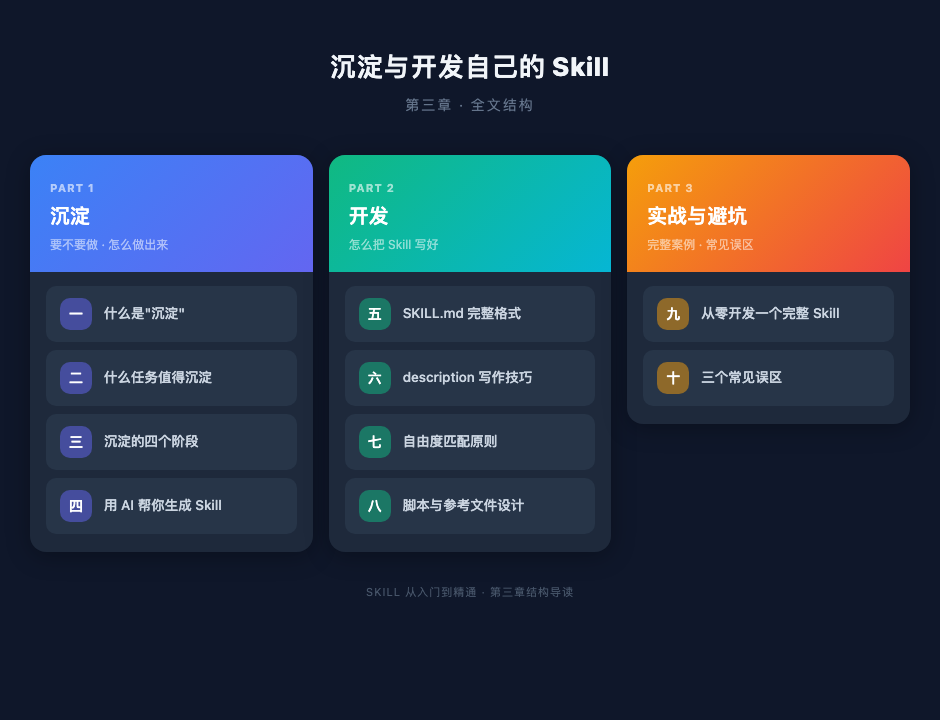
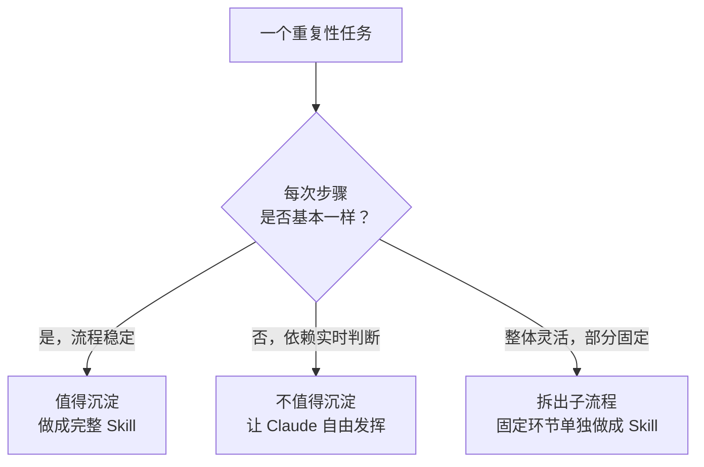
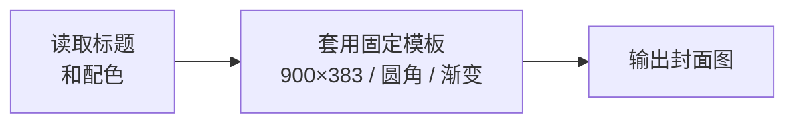
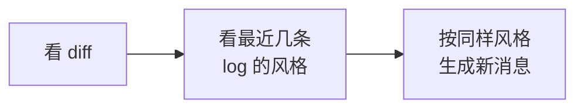
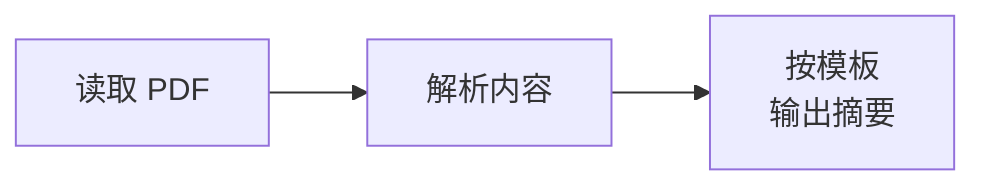
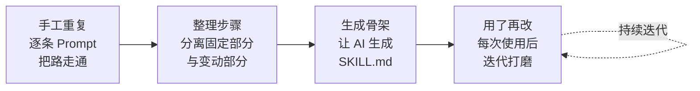
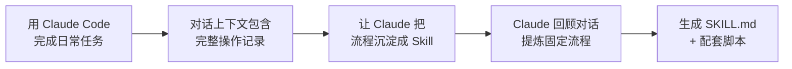

# 第三章：沉淀与开发自己的 Skill

装别人的 Skill 是买工具，沉淀自己的 Skill 才是练手艺。

前两章讲了 Skill 的机制和挑选标准。但真正让 Claude Code 变成你个人专属工具的，只有你自己沉淀出来的 Skill——它匹配你的流程，适配你的习惯，解决你的问题。这一章是整个系列的核心，从"为什么要沉淀"一路讲到"怎么把 Skill 写好"。全文分为三个部分，结构如下：



**第一部分：沉淀（一 ~ 四节）**——解决"要不要做"和"怎么做出来"的问题。先讲什么是沉淀、哪些任务值得沉淀、沉淀经历哪四个阶段，然后重点介绍如何用 AI 帮你生成 Skill，包括主动描述流程、做完任务后当场沉淀、以及使用 `skill-creator` 元技能三种方式。

**第二部分：开发（五 ~ 八节）**——解决"怎么写好"的问题。讲 SKILL.md 的完整格式、description 的写作技巧、不同任务该给 Claude 多大自由度、以及脚本和参考文件的目录设计。这部分是 Skill 质量的关键——即便你让 AI 生成，也需要知道这些规范才能判断生成结果的好坏。

**第三部分：实战与避坑（九 ~ 十节）**——从零走一遍完整的开发流程，最后总结三个最常见的误区。

---

## 第一部分：沉淀

### 一、什么是"沉淀"

很多人把 Skill 理解成"再写一个 Prompt"，这是最常见的误区。

Prompt 是一次性指令，每次对话都要重新写一遍。Skill 是把你反复使用的指令、参考资料、脚本、判断逻辑整体打包，让 Claude 在合适的时候自动触发，按你规定的流程执行。

Prompt 是消耗，每次从零开始。Skill 是积累，越用越顺。

判断一件事值不值得沉淀成 Skill，只需要问一个问题：

> **你是否已经做过这件事三次以上，而且每次的做法大同小异？**

三次是一个好门槛。做过一次，可能只是偶发需求；做过两次，还在摸索做法；到了第三次，重复的部分开始暴露出来——这些重复的部分，就是可以沉淀的骨架。

不到三次就急着写 Skill，你还不知道哪些步骤是真正固定的，写出来的流程多半要推翻重来。做过三次再动手，固定部分和变动部分自然就分清了。

### 二、什么任务值得沉淀成 Skill

搞清楚了什么是沉淀，接下来的问题是：到底哪些任务适合沉淀成 Skill？



**值得沉淀的：流程稳定的任务**

这类任务有一个共同特点——骨架固定，只有填入的内容在变化。

**发布公众号文章**——流程每次一样，变的只是文章内容：


**生成视频封面**——尺寸、圆角、渐变背景都固定，变的只是标题和配色：



**写 commit message**——固定管线，变量只是代码改动本身：



**从 PDF 提取内容并总结**——换一份 PDF，流程不变：



这些任务的共同特征是：**你能用编号步骤写出完整流程，而且每次做的步骤几乎一模一样**。

**不值得沉淀的：依赖实时判断的任务**

- 给一段代码做 Code Review——每段代码的问题不同，审查策略也不同
- 调试一个诡异的 Bug——需要根据现场堆栈、日志、环境逐步排查
- 回答一个具体的技术问题——每次问的都不一样

这类任务的核心能力是"判断"，而判断依赖上下文。硬把它们塞进 Skill 的固定流程里，只会让 Claude 变得僵硬，丢掉它本来就很强的临场推理能力。

**介于两者之间的：拆出子流程做成 Skill**

很多任务整体是灵活的，但其中某个环节是固定的。这时候不要做一个大 Skill，而是把那个固定环节单独提出来。

比如 Code Review 整体没法固化，但"跑一遍测试，把所有失败用例整理成一份结构化报告"这一步是完全确定的——输入、输出、格式都可以预设。把它做成一个独立 Skill，Code Review 流程里需要时调用一下就行。

**经验法则：细粒度的 Skill 往往比大而全的 Skill 更好用。** 三个各做一件事的小 Skill，远胜于一个试图覆盖所有场景的大 Skill。

### 三、沉淀的四个阶段

从"每次手写 Prompt"到"一句话触发整个流水线"，中间有四个自然阶段。试图跳过中间步骤直接写出完美 Skill，几乎不可能——你还不知道哪里会踩坑。



**阶段一：手工重复**

第一次做某件事，所有步骤都靠一条条 Prompt 推进。比如第一次发公众号，你可能逐步指挥 Claude：

```
"把这些图片上传到 R2"
"把 Markdown 里的本地路径替换成 CDN 链接"
"用 doocs-md 渲染成公众号格式"
"帮我生成一张 900×383 的封面图"
"推送到公众号草稿箱"
```

五条 Prompt，手工驱动。这个阶段不要写 Skill，目的是**把路先走通**，知道每一步长什么样、哪里容易出错。

**阶段二：整理步骤清单**

做到第二、第三次，你开始意识到有些步骤每次完全一样，有些每次都不同。把它们分开记下来：

| 类型 | 具体内容 | 例子 |
|------|----------|------|
| 固定部分 | 不随任务变化的配置和逻辑 | CDN 上传的 API key、排版工具的调用方式、封面尺寸 900×383 |
| 变动部分 | 每次任务的具体输入 | 文章内容、图片数量、主题配色 |

这一步的核心价值是**分离"流程"和"参数"**。Skill 沉淀的是流程，参数留给调用时由用户提供。如果你分不清哪些该固化、哪些该留活，你的 Skill 要么太死（改个颜色都要改 Skill 源码），要么太活（和直接写 Prompt 没区别）。

**阶段三：生成 Skill 骨架**

分清固定和变动之后，才到了生成 Skill 的时候。注意是"生成"——下一节会详细讲为什么你应该让 AI 来做这件事。这一步有四个要素必须想清楚：

**触发词** —— Skill 靠 description 里的关键词自动激活。触发词的写法是**穷举用户可能的表达**，包括中英文、正式说法和口语说法。比如：

```
触发词：「发公众号」「发布到微信」「推公众号」「一键发布」
「publish to wechat」「推送文章」「发微信文章」
```

只写"发布文章"是不够的——这个描述太泛，什么场景都可能匹配。

**边界** —— 明确说清 Skill 不做什么。边界定义比功能定义更重要，因为 Claude 的默认行为是"尽量满足用户请求"，如果你不画线，它会在不合适的场景硬套你的 Skill。

**步骤** —— 每一步说清输入、输出、用哪个工具。步骤之间的依赖要写明，不要让 Claude 去猜顺序。

**参考文件** —— 脚本、模板、示例文件放在 Skill 目录里，Claude 执行时会读取。把经常变化的配置和不变的代码逻辑分开存放。

**阶段四：用了再改**

第一版 Skill 几乎一定有问题。每次使用后做一次快速复盘：

- 触发对了吗？有没有该触发没触发的情况（漏触发）？有没有不该触发却触发了（误触发）？
- 哪一步 Claude 没按预期执行？是 SKILL.md 里的指令不够清楚，还是参考文件不够完整？
- 使用过程中有没有手动补了一段 Prompt？如果有，说明那段逻辑还缺失，应该写进 Skill。

**Skill 是养出来的，不是写出来的。** 指望一次写完就完美是不现实的。持续迭代才是 Skill 变好用的唯一路径。

### 四、用 AI 帮你生成 Skill

到了该动手的阶段，很多人会犯一个直觉性的错误：打开编辑器，从第一行 YAML 开始一个字一个字地写 SKILL.md，遇到需要脚本的地方就自己写 Python。

这完全搞反了。

你手里有 Claude，为什么要自己写？Skill 开发本身就应该是一次 AI 协作——你提供经验和判断，AI 负责把它转化成规范的 SKILL.md 和配套脚本。

具体做法很简单。当你经历了前面的手工重复和步骤整理，积累了足够的经验——知道了哪些步骤是固定的、哪些参数会变、哪些地方容易踩坑——直接把这些告诉 Claude：

```
我发公众号文章的流程是这样的：
1. 先把文章里的本地图片上传到 R2
2. 替换 Markdown 里的图片路径为 CDN 链接
3. 用 doocs-md 渲染成公众号格式的 HTML
4. 生成一张 900×383 的封面图
5. 通过公众号 API 推送到草稿箱

其中图片上传的 bucket 是 xxx，CDN 域名是 xxx。
封面图的圆角是 12px，默认背景色 #1a1a2e。
每次变化的只有文章内容和封面配色。

帮我把这个流程写成一个 Skill。
```

Claude 会生成完整的 SKILL.md——包括 YAML frontmatter、触发词、步骤描述、Key Rules——以及所需的辅助脚本。你要做的只是检查生成的内容是否准确，然后跑一遍测试。

**更自然的方式：做完就沉淀**

上面的做法是你主动描述流程。但还有一种更自然的方式：**在日常使用 Claude Code 完成任务之后，直接让它把刚才的过程沉淀成 Skill。**



这时候你不需要从头描述流程——整个对话上下文里已经包含了完整的操作记录：用了哪些工具、执行了哪些步骤、遇到了什么问题、怎么解决的。Claude 可以从这些真实的操作记录中提炼出 Skill，比你事后凭记忆描述要准确得多。

举个例子。你第一次用 Claude Code 帮你做周报数据分析：你给了它一份从广告后台导出的 CSV，它帮你清洗了异常数据、按渠道汇总了核心指标、生成了趋势图、最后输出了一份 Markdown 格式的周报。整个过程花了十几分钟，中间你还纠正了它两次——一次是让它排除测试账号的数据，一次是让它把 CPA 的计算口径从"总花费÷总转化"改成"去除自然量后的付费 CPA"。

任务完成后，你只需要加一句：

```
这个周报分析流程以后每周都要做。
把刚才的完整过程沉淀成一个 Skill，
包括数据清洗规则、指标计算口径、输出格式。
```

Claude 会回顾整个对话，把固定的部分提炼出来——清洗规则（排除测试账号、剔除异常值）、指标定义（付费 CPA 的计算方式）、输出模板（周报的章节结构和图表样式）——写成 SKILL.md。那些你在对话里纠正过的细节尤其有价值：它们是踩坑后的修正，如果靠你事后回忆来描述，大概率会遗漏。

下周再做周报时，你只需要说"做本周的广告数据周报"，给一份新的 CSV，Skill 会按上周打磨好的流程自动执行——测试账号已排除、CPA 口径已修正、输出格式已固定。

**养成一个习惯：每次用 Claude Code 完成一项重复性任务后，问自己这个流程以后还会再做吗？** 如果答案是"会"，当场让它生成 Skill。趁对话上下文还在，沉淀的质量最高。等过两天再回忆，很多关键细节就丢了。

以上两种方式——主动描述流程、做完任务后沉淀——都是让 AI 帮你生成 Skill。它们有三个共同的好处：

**格式零成本。** YAML frontmatter 的写法、description 的结构、Workflow 的组织方式，这些规范你不需要记。Claude 天然知道 Skill 的标准格式，生成出来就是对的。

**脚本不用手写。** 图片压缩、格式转换、API 调用这些确定性操作，描述清楚输入输出就行，Claude 生成的代码质量通常够用。不够好就让它改，比自己从头写快得多。

**迭代成本低。** 测试发现问题后，直接告诉 Claude"触发词里加上'发微信文章'""第三步改成先检查图片尺寸再上传"，它会帮你修改。每一轮迭代都是对话级别的操作，不需要翻文件手动改。

**用 skill-creator 让流程更规范**

前面讲的是直接用自然语言让 Claude 生成 Skill，灵活但缺乏结构。如果你打算持续开发多个 Skill，推荐安装一个专门为此设计的元技能：`skill-creator`——用来创建其他技能的技能。

安装后，在对话中输入 `/skill-creator` 或者说"帮我创建一个新 Skill"，Claude 会按照标准化的六步流程引导你完成整个开发过程：

1. **理解需求**：让你描述具体的使用场景，用实际例子验证理解是否准确
2. **规划资源**：分析哪些内容该做成脚本、哪些该做成参考文档、哪些该做成模板
3. **初始化目录**：运行内置的 `init_skill.py` 脚本，自动生成标准的目录结构和 SKILL.md 模板
4. **编写内容**：生成 SKILL.md 正文、辅助脚本和参考文档，并逐一测试脚本能否正常运行
5. **打包验证**：运行 `package_skill.py` 进行格式校验——检查 YAML 是否合规、name 是否符合命名规范、description 是否超长、目录结构是否完整
6. **迭代优化**：在真实任务中使用，根据实际效果调整

和直接描述需求相比，skill-creator 的优势在于**不会遗漏关键环节**。它内置了 Skill 的最佳实践——description 该怎么写触发词和排除条件、SKILL.md 正文该控制在什么长度、哪些内容该放 references/ 而不是写在正文里、脚本该如何组织——这些你在后面几节会看到的设计原则，skill-creator 在生成过程中会自动遵守。

它还附带了两份参考文档：`output-patterns.md` 讲输出格式的模板设计，`workflows.md` 讲顺序流程和条件分支的编排方式。这两份文档本身就是很好的 Skill 设计教材。

什么时候用哪种方式？简单判断：如果你只是偶尔创建一个 Skill，直接在对话里描述需求就够了。如果你计划系统性地开发一组 Skill，skill-creator 能帮你建立一致的质量标准，避免每次都重新摸索最佳实践。

**一个真实的沉淀过程**

我自己的 `wechat-article` Skill 就是这样沉淀出来的。

**第一次**：手工操作，花了 40 分钟，磕磕绊绊。踩了不少坑——图片要先传 R2 才能在公众号里显示、公众号 API 需要特定的 HTML 格式、封面图尺寸必须是 900×383。这些全是做了才知道的。

**第二次**：把第一次的踩坑点记下来，流程顺了一些，花了 25 分钟。开始意识到"图片上传 → Markdown 路径替换"这两步每次完全一样，可以固化。

**第三次**：把前两次积累的经验告诉 Claude——步骤顺序、固定参数、容易踩的坑——让它帮我生成了第一版 Skill。虽然只有流程说明、没有脚本，但已经够用了。跑下来花了 15 分钟。发现排版那一步每次参数都要手动输入，让 Claude 把排版默认参数补进了 Skill。

**第四次**：让 Claude 给 Skill 加上了默认主题、默认封面尺寸、自动调用 `r2-image-upload` 子 Skill 处理图片上传。触发一次，5 分钟完成。

**第十次以后**：Skill 已经稳定，几乎不用操心任何步骤。只需要说"发公众号"，剩下的全自动。

从 40 分钟到 5 分钟，省下的时间不是因为 Claude 变聪明了，而是因为我的流程经验被逐步固化进了 Skill。每一次使用都在打磨它，每一次打磨都让下一次更快。

归根结底，Skill 沉淀的核心价值是你的流程经验和领域知识——哪些步骤不能少、哪些参数不能错、哪些坑必须绕开。至于把这些经验转化成 SKILL.md 的格式工作，交给 AI 就好。你的角色是产品经理，不是写手。

---

## 第二部分：开发

### 五、SKILL.md 的完整格式

理解了沉淀过程之后，来看具体的文件格式。即便你让 AI 生成 Skill，也需要知道格式规范——这样你才能检查生成结果、判断质量、做针对性修改。一个完整的 Skill 由 **YAML frontmatter + Markdown body** 两部分组成。

**YAML Frontmatter**

```yaml
---
name: competitor-analysis        # 必填：小写加连字符，最长 64 字符
description: >                   # 必填：最长 1024 字符，这是 Skill 的灵魂
  生成结构化的竞品分析报告。
  当用户提到「分析竞品」「competitor analysis」「竞品调研」
  「竞品对比」「帮我看看竞争对手」时触发。
  不要在用户只是随口提到某个产品名字时触发，
  也不要在用户要求做市场规模估算时触发。
license: MIT                     # 可选
version: 1.0.0                   # 可选
allowed-tools:                   # 可选：声明需要的工具权限
  - Bash
  - Read
  - Write
  - Edit
  - WebFetch
---
```

每个字段的作用：

| 字段 | 是否必填 | 说明 |
|------|----------|------|
| `name` | 是 | Skill 的唯一标识符，只能用小写字母和连字符 |
| `description` | 是 | 决定何时触发、做什么、不做什么。下一节详细展开 |
| `license` | 否 | 开源协议，公开分享时建议填写 |
| `version` | 否 | 版本号，方便自己追踪迭代 |
| `allowed-tools` | 否 | 声明这个 Skill 需要哪些工具。不声明则使用默认工具集 |

**Markdown Body**

Frontmatter 下面就是正文，用普通 Markdown 写。建议分成四个区块：

```markdown
## Overview
竞品分析报告生成器。输入一个产品名称，输出一份包含市场定位、
核心功能对比、定价策略、用户评价的结构化报告。

## Workflow
1. 接收用户输入的产品名称
2. 使用 WebFetch 搜索该产品的官网、定价页面、用户评价
3. 读取 references/report-template.md 作为报告模板
4. 按模板结构填充搜集到的信息
5. 生成 Markdown 报告，保存到用户指定路径

## Key Rules
- 报告必须包含至少 3 个直接竞品
- 每个竞品的信息必须来自可验证的来源
- 定价数据标注获取日期，因为价格会变动
- 如果搜索不到可靠信息，明确标注"未找到"而非编造

## References
- references/report-template.md — 报告模板
- references/industry-categories.md — 行业分类标准
- scripts/fetch_pricing.py — 定价页面抓取脚本
```

四个区块各有分工：**Overview** 说清是什么、为什么存在；**Workflow** 用编号列出完整步骤；**Key Rules** 写领域特有的约束条件；**References** 指向目录中的具体文件。

### 六、description 的写作技巧

description 是整个 Skill 中最重要的字段——没有之一。Claude 决定是否触发一个 Skill，完全靠匹配 description 里的关键词和语义。description 写得差，你的 Skill 永远不会被调用；写得太泛，又会在不该出现的时候冒出来。

一个好的 description 包含三个层次：

**功能描述（What）**

用一句话说清这个 Skill 做什么。简洁、具体、无歧义。

```
✗ "A skill that helps with stuff."
  → Claude 永远不会匹配到这个 Skill

✗ "处理数据的工具"
  → 太宽泛，什么场景都可能匹配

✓ "生成结构化的竞品分析报告，包含市场定位、功能对比、定价策略和用户评价。"
  → 清楚、具体、有边界
```

**触发短语（When）**

穷举用户可能的表达方式。这一步很多人偷懒只写一两个词，结果 Skill 的召回率极低。好的做法是把你能想到的所有说法都列出来：

```
触发场景：
- 中文正式：「竞品分析」「竞争对手分析」「竞品调研报告」
- 中文口语：「帮我看看竞品」「分析一下竞争对手」「查查同类产品」
- 英文：「competitor analysis」「competitive research」「market comparison」
- 缩写和变体：「竞调」「comp analysis」
```

为什么要这么穷举？因为 Claude 的匹配是语义级别的，但语义匹配也有盲区。"竞品分析"和"competitor analysis"对 Claude 来说语义接近，但"帮我看看同行都在干嘛"和"竞品分析"之间就有一段距离。把中间态的表达写进去，能显著提高触发的准确率。

**排除条件（When Not）**

这是很多人完全忽略的部分，但它的重要性不亚于触发短语。排除条件告诉 Claude 在什么情况下**不要**触发这个 Skill，即使用户的话里包含了相关关键词。

```
不要触发的场景：
- 用户只是随口提到某个产品名字，并不是在要求做竞品分析
- 用户要求做市场规模估算（那是 market-sizing Skill 的职责）
- 用户要求做用户画像分析（那是 user-persona Skill 的职责）
- 用户在做技术选型比较，而非商业层面的竞品分析
```

一个真实的好例子来自 `xlsx` 这个 Skill 的 description：

> 不要在最终输出是 Word 文档、HTML 报告、独立 Python 脚本、数据库流水线时触发，即便涉及表格数据。

这句话精准地画了一条线：涉及表格数据不等于应该用 xlsx Skill。这就是好的排除条件——它考虑到了容易混淆的边界场景。

**一个完整的 description 示例**

```yaml
description: >
  生成结构化的竞品分析报告，包含市场定位、功能对比、
  定价策略和用户评价四大板块。
  当用户提到「竞品分析」「competitor analysis」「竞品调研」
  「竞品对比」「帮我看看竞争对手」「查查同类产品」「竞调」
  「comp analysis」「competitive research」时触发。
  不要在用户只是提到某个产品名时触发。
  不要在用户要求做市场规模估算或用户画像分析时触发。
  不要在用户做技术选型比较时触发。
```

写 description 的本质是在和 Claude 的触发机制做一次精确的约定：**什么时候来，什么时候别来。**

### 七、自由度匹配原则

这是 Skill 设计的核心原则，也是很多人写 Skill 时最容易犯错的地方。

不同任务对 Claude 的"指挥粒度"应该完全不同。有的任务只需要给 Claude 一个方向，让它自由发挥；有的任务必须把每一步都钉死，一个参数都不能让它自己决定。在 Skill 里把粒度搞反了，轻则效果打折，重则输出全废。

| 自由度 | 实现方式 | 适用场景 | 示例 |
|--------|----------|----------|------|
| 高 | 纯文本指令，给方向不给步骤 | 有多种合理做法，取决于具体上下文 | 写文章、做设计决策、头脑风暴 |
| 中 | 伪代码 + 参数化模板 | 存在最佳实践但允许灵活调整 | API 集成、数据处理、报告生成 |
| 低 | 具体脚本、最小化参数 | 操作脆弱，必须严格一致 | PDF 表单填写、图片格式转换、文件命名规范 |

**高自由度：给方向，不给步骤**

```markdown
## 写作指导
根据用户提供的主题，撰写一篇深度技术文章。
文章应具备清晰的逻辑主线，有自己的观点和判断。
避免罗列式写作，每个论点需要有论据支撑。
```

这种写法把决策权交给 Claude。它本身就擅长写作推理，你给方向就够了，不需要规定"第一段写什么、第二段写什么"。过度控制反而限制了它的发挥。

**中自由度：给框架，留空间**

```markdown
## 数据处理流程
1. 读取用户指定的 CSV 文件
2. 检查数据完整性（缺失值比例、异常值检测）
3. 根据数据特征选择合适的清洗策略
4. 输出清洗后的数据和清洗报告
   - 报告包含：原始行数、清洗后行数、处理了哪些问题
```

框架是固定的（四步流程），但具体怎么检测异常值、选什么清洗策略，留给 Claude 根据实际数据判断。

**低自由度：写死脚本，锁定参数**

```markdown
## 封面图生成
1. 运行 scripts/generate_cover.py
2. 参数：
   - 宽度：900px（固定）
   - 高度：383px（固定）
   - 圆角：12px（固定）
   - 标题：从用户输入获取
   - 背景色：从用户输入获取，默认 #1a1a2e
3. 输出路径：与源文件同目录，文件名加 -cover 后缀
```

生成封面图这种任务，尺寸差一个像素可能就不符合平台要求。必须把能写死的全部写死，只留真正需要用户输入的参数。

**核心洞察：Claude 本身已经很聪明了。** 你要做的不是教它怎么思考，而是补充它不知道的——你的领域知识、你的流程规范、你的平台要求。不要在 Skill 里写"请仔细检查是否有错误"这种指令，它本来就会这么做。你该写的是"封面图宽度必须是 900px 因为公众号要求这个尺寸"——这种信息它没有，你给了才有。

### 八、脚本、参考文件和资源的设计

一个 Skill 不只是一份 SKILL.md，它通常还附带脚本、参考文件和模板资源。这三类文件的职责完全不同，混在一起会造成混乱。

**scripts/ 目录：确定性操作**

放在这里的是不需要 AI 判断、每次执行结果都应该完全一致的脚本。

```
scripts/
├── generate_cover.py      # 生成封面图
├── compress_images.sh     # 批量压缩图片
├── convert_format.py      # 数据格式转换
└── validate_output.py     # 校验输出格式
```

为什么不让 Claude 每次现写这些代码？两个原因：

1. **一致性**。Claude 每次生成的代码可能略有不同——参数顺序、变量命名、边界处理都可能变。固化成脚本后，行为完全可预测。
2. **效率**。避免 Claude 每次花 tokens 重新生成相同的代码。直接调用现成脚本，快且省。

同样，这些脚本也应该让 Claude 帮你生成。描述清楚输入、输出和约束条件，让它写代码，你负责测试和验收。脚本要确保可执行权限（`chmod +x`），并且在头部写清依赖说明。

**references/ 目录：按需加载的领域知识**

这里放的是 Claude 在执行 Skill 时可能需要参考的文档——API 文档、行业标准、数据定义、公司风格规范等。

```
references/
├── report-template.md       # 报告模板
├── industry-categories.md   # 行业分类标准
├── api-docs.md              # 相关 API 文档
└── style-guide.md           # 写作风格规范
```

关键设计原则：references/ 里的文件**只在需要时才被 Claude 读取**，不会每次触发 Skill 都全量加载。这节省了大量 tokens。

如果某份参考文档超过 10000 字，不要指望 Claude 每次都从头读完。在 SKILL.md 里提供搜索提示——告诉 Claude 去哪里找关键信息：

```markdown
## 参考文件使用指南
- industry-categories.md 很长，按行业名称 grep 查找即可
- api-docs.md 按接口名称搜索，不需要通读
```

**assets/ 目录：模板和资源文件**

HTML 模板、CSS 样式表、字体文件、报告骨架等。这些文件不会进入 Claude 的上下文窗口，而是在需要时被 Claude 读取、复制或修改后输出。

```
assets/
├── report-style.html        # HTML 报告模板
├── email-template.html      # 邮件模板
└── default-theme.css        # 默认主题样式
```

**Token 预算控制**

SKILL.md 的正文部分建议控制在 **500 行以内**。超过这个长度，说明你把太多内容塞进了 SKILL.md 本身。应该拆分：流程说明留在 SKILL.md，详细参考放进 references/，确定性逻辑放进 scripts/。

一个简单的判断标准：如果你删掉 SKILL.md 里的某段内容，把它放到 references/ 里并加一行"详见 references/xxx.md"，Skill 的执行效果不受影响——那这段内容就应该放在 references/ 里。

---

## 第三部分：实战与避坑

### 九、实战案例：从零开发一个完整 Skill

理论讲完，走一遍完整的实战流程。我们以"竞品分析报告生成器"为例，从用户场景到最终交付，展示每一步的具体产出。

**Step 1：明确用户场景**

先回答三个基本问题：

- 目标用户是谁？——产品经理、创业者、投资分析师
- 核心需求是什么？——输入一个产品名称，输出一份结构化的竞品分析报告
- 典型触发方式？——"帮我分析一下 Notion 的竞品""做个竞品调研""competitor analysis for Figma"

**Step 2：规划文件结构**

```
competitor-analysis/
├── SKILL.md                       # 核心：触发规则 + 执行流程
├── references/
│   ├── report-template.md         # 报告模板骨架
│   └── industry-categories.md     # 行业分类参考
├── scripts/
│   └── fetch_pricing.py           # 定价页面抓取脚本
└── assets/
    └── report-style.html          # HTML 版报告样式
```

**Step 3：让 Claude 生成 SKILL.md**

把前面规划好的场景、文件结构和详细需求告诉 Claude，让它生成 SKILL.md。以下是生成并经过检查微调后的结果：

```yaml
---
name: competitor-analysis
description: >
  生成结构化的竞品分析报告，包含市场定位、功能对比、
  定价策略和用户评价四大板块。
  当用户提到「竞品分析」「competitor analysis」「竞品调研」
  「竞品对比」「帮我看看竞争对手」「查查同类产品」时触发。
  不要在用户只是随口提到某个产品名时触发。
  不要在用户要求做市场规模估算或用户画像时触发。
version: 1.0.0
allowed-tools: [Bash, Read, Write, WebFetch]
---

## Overview

竞品分析报告生成器。输入一个产品名称，自动搜集竞品信息，
按照标准模板生成一份包含四大板块的分析报告。

## Workflow

**Phase 1：信息搜集**

1. 确认用户输入的目标产品名称
2. 使用 WebFetch 搜索以下信息：
   - 目标产品官网及核心功能列表
   - 至少 3 个直接竞品的官网和功能页面
   - 各产品的定价页面
   - 用户评价（G2、Capterra、ProductHunt 等平台）

**Phase 2：数据整理**

3. 读取 references/report-template.md 作为报告骨架
4. 将搜集到的信息分类填入四大板块：
   - 市场定位：各产品的目标用户和核心价值主张
   - 功能对比：用表格形式对比核心功能差异
   - 定价策略：各产品的定价层级和关键价格点
   - 用户评价：主流评价平台的评分和典型反馈

**Phase 3：报告生成**

5. 按 references/report-template.md 的格式生成 Markdown 报告
6. 在报告开头生成一段 Executive Summary（3-5 句话概括核心发现）
7. 保存到用户指定路径，默认保存到当前目录

## Key Rules

- 竞品数量不少于 3 个，不超过 8 个
- 功能对比必须用表格，不要用散文
- 定价数据必须标注获取日期，因为价格经常变动
- 如果某项信息搜索不到，明确标注「未找到公开数据」
- Executive Summary 放在报告最前面，不超过 5 句话

## References

- references/report-template.md — 报告的四大板块模板
- references/industry-categories.md — 行业分类标准，
  用于判断竞品所属赛道。文件较长，按行业名称搜索即可。
```

**Step 4：测试**

安装 Skill 后，直接说"帮我分析一下 Notion 的竞品"。然后对照检查：

| 检查项 | 预期 | 实际情况 |
|--------|------|----------|
| 是否正确触发 | 说"竞品分析"时触发 | ✓ / ✗ |
| 是否按 Phase 顺序执行 | 先搜集 → 再整理 → 再生成 | ✓ / ✗ |
| 竞品数量是否达标 | ≥3 个 | ✓ / ✗ |
| 功能对比是否用了表格 | 表格格式 | ✓ / ✗ |
| 定价是否标注了日期 | 日期明确 | ✓ / ✗ |
| 输出格式是否符合模板 | 四大板块齐全 | ✓ / ✗ |

**Step 5：迭代**

第一次测试后，你可能会发现：

- 触发词里没有"对标分析"这个说法，而你实际经常这么说——让 Claude 加上
- Claude 搜集信息时有时会遗漏定价页面——让 Claude 在 Workflow 的第 2 步里把"定价页面"从列表项提升为独立步骤，加粗强调
- 报告里的功能对比表格列太多，手机上看不清——让 Claude 在 Key Rules 里加一条"功能对比表格列数不超过 6 列"
- 整个流程跑下来花了三分钟，其中一半时间在搜索——考虑预置一些常用行业的竞品名单在 references/ 里

每一轮迭代都让 Skill 更贴合你的真实需求。三五次之后，它就会变得非常顺手。

### 十、三个常见误区

写 Skill 的过程中，有三个坑我见过很多人反复踩。

**误区一：追求大而全**

一个 Skill 试图处理竞品分析、市场规模估算、用户画像、SWOT 分析……结果每个功能都浅尝辄止，没有一个真正好用。

正确做法是把它们拆成独立的 Skill——competitor-analysis、market-sizing、user-persona 各司其职。每个 Skill 只解决一个问题，但把那个问题解决得很深。

如果这些 Skill 之间需要协作，后面第四章会讲怎么用 Plugin 把它们打包在一起。

**误区二：把配置写死在 Skill 里**

在 SKILL.md 或脚本里直接硬编码 API key、用户 ID、文件路径：

```python
# 反面示例
API_KEY = "sk-xxxx1234abcd"
OUTPUT_DIR = "/Users/zhangsan/Desktop/reports"
```

换一台电脑，Skill 直接废了。正确做法：

```python
# 正面示例
API_KEY = os.environ.get("COMPETITOR_API_KEY")
OUTPUT_DIR = os.environ.get("REPORT_OUTPUT_DIR", "./reports")
```

配置放环境变量或独立配置文件，Skill 里只放读取逻辑。这样迁移机器、分享给同事都不用改 Skill 本身。

**误区三：写完就不管了**

写完一个 Skill，用了一次觉得"还行"，然后就搁在那里再也不碰。半年后再用，发现触发词和自己的用语习惯对不上了，步骤和当前工作流也有差异，又回到了手写 Prompt 的状态。

Skill 的价值来自**持续迭代**。每次使用后花 30 秒问自己"哪里能改"，一个月之后它的流畅度会和第一天完全不同。把 Skill 当成一个活的工具，而不是一个写完就归档的文档。

---

## 结语

沉淀与开发 Skill 的本质，是把你在和 AI 协作中积累的流程经验变成可复用的数字资产。

写 Prompt 是消耗，每次从零开始。写 Skill 是积累，越用越顺。当你的 Skill 库里有了 20 个、50 个稳定的 Skill，和 Claude 的协作效率会进入完全不同的档位——大部分日常任务，一句话就能启动整个流水线。

不需要一步到位。先把流程手工走通，再分离固定和变动，然后让 AI 帮你生成骨架，最后持续打磨。四个阶段走下来，你会拥有一套别人复刻不出来的专属工具集。从今天开始，挑一件你已经做过三次以上的事，把它沉淀成第一个 Skill。

下一章我们讲当你积累了多个相关 Skill 之后，如何用 Plugin 机制把它们组织成一个协作的整体。
