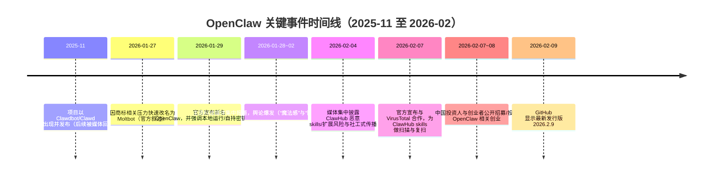

# OpenClaw 调研报告：技术能力、市场舆论、竞品与可行创业机会

## 执行摘要

OpenClaw 是一个“本地优先（local-first）”的开源个人 AI 代理平台：你把它运行在自己的设备或自管服务器上，通过 WhatsApp、Telegram、Slack、Discord、iMessage 等你日常使用的聊天渠道与它交互；它不仅能回答问题，还能执行动作（读写文件、运行命令、浏览器自动化、定时任务、调用外部服务 API 等）。其核心设计是一个常驻的 Gateway（控制平面）与一套会话/记忆/工具系统，旨在把“对话式 AI”推进到“可持续运转的数字员工/数字管家”。citeturn18view5turn15view0turn23view0turn14view0

从技术成熟度看，OpenClaw 已经把多项“难但关键的工程拼图”整合到一个可用的整体（多渠道收件箱、持久记忆与会话模型、技能/插件扩展、定时/心跳、设备节点与可视化 Canvas 等），并以极快速度迭代（GitHub 上 star、fork、issue、PR 数量均体现出超高热度）。截至本报告撰写时（2026-02-11），其主仓库显示约 183k stars、30.7k forks，并有最新发行版标记为 2026-02-09。citeturn16view0turn16view1

市场与舆论呈现“强烈两极分化”：一方面，主流科技媒体与大量开发者将其形容为“第一次真正像在使用未来的个人助理”，并认为它让自动化能力“从实验室走向民间”；另一方面，安全研究者、社区讨论与媒体集中指出它具备“高权限 + 可被操纵的语言输入 + 插件/技能供应链”的典型高风险组合，且围绕技能市场 ClawHub 的恶意扩展与社工传播已快速出现。citeturn26view0turn25news21turn25news29turn20view0turn14view0

投资界与创业圈对 OpenClaw 的态度更接近“基础设施级机会”：中国投资人与创业者公开“招募/投资 OpenClaw 相关创业”，并将其视为“AI 从聊天到做事”“插件化能力生态”“持续在线记忆与状态”的阶段性验证；海外则出现知名天使投资人/创业者公开建议其创始人直接进行大额融资与公司化运作，同时 GitHub Sponsors 页面与相关报道也显示一批创业者/投资人对其进行赞助支持。citeturn24view0turn18view0turn18view4turn18view1

本报告对“基于 OpenClaw 的创业机会”给出明确结论：短期内最可行、风险收益比更优的方向集中在“安全、治理、观测与可控执行”这类“卖铲子”赛道（企业/团队级策略控制、执行审批与审计、技能供应链安全、托管/代运维与合规包），而不是直接做一个“更通用、更大胆的全能代理”。原因在于：OpenClaw 自身的执行面过大且生态极易被攻击，用户对安全/合规的焦虑已被媒体和社区广泛放大，反而形成付费意愿与 B2B 采购理由。citeturn25news21turn18view4turn14view0turn20view0turn13view0

## OpenClaw 技术概述

OpenClaw 的官方定位是“运行在你选择的基础设施上（笔记本、家庭服务器、VPS），使用你自己的 key/数据”的开放代理平台；其创始人entity["people","彼得·斯坦伯格","openclaw creator"]在项目公告中强调：与 SaaS 助理相比，它把控制权、数据与密钥留在用户侧。citeturn18view5

在系统结构上，OpenClaw 的关键组件可以概括为：常驻 Gateway（控制平面）+ 多渠道连接器（把聊天平台消息转为统一事件）+ 代理运行时（Pi 路径）+ 工具系统（执行/浏览器/节点/定时/会话工具等）+ 记忆与工作区文件系统 + 技能/插件扩展与技能注册中心 ClawHub。其 GitHub README 直接把 Gateway 描述为“控制平面”，并列举了 WebChat、macOS App、iOS/Android 节点等多类客户端/节点与其连接。citeturn15view0turn23view0

OpenClaw 的“编码/执行”代理路径目前被明确收敛：官方特性页写明传统的 Claude、Codex 等旧路径已移除，Pi 是唯一的 coding agent path；同时强调其具备多代理路由、媒体处理、Web 控制 UI 等能力。citeturn23view0

在 API/SDK 与可扩展性方面，OpenClaw 同时提供：  
一是 Gateway 作为统一的 WebSocket 控制平面与若干协议/运行手册（便于第三方客户端/节点/工具接入、会话与事件处理）。citeturn3view0turn3view1  
二是“技能（skills）”与“插件/扩展（plugins/extensions）”两条扩展路线：技能更像“带版本的任务包/工作流 + 相关脚本与文件”，通过 `SKILL.md` 等文件向代理传授操作方法；插件则是 Gateway 进程内加载的代码扩展，安全模型上被要求视为“可信代码”。citeturn20view5turn20view0

部署模式上，OpenClaw 支持本机长期运行（daemon/service）与远程 Gateway（例如在小型 Linux 实例上运行），并提供远程访问方案（例如通过entity["company","Tailscale","vpn mesh networking"]相关机制或隧道方式暴露仪表盘/控制面，但强调需配合认证与安全配置）。citeturn15view0

性能与限制方面，OpenClaw 的官方文档对“本地大模型”给出相当直白的约束：OpenClaw 期望“大上下文 + 更强的 prompt injection 防御能力”，并警告小模型/重度量化会提高安全风险；文档甚至给出较高硬件门槛的建议，并指出本地模型缺少提供商侧过滤时，需要额外注意安全与爆炸半径控制。citeturn20view4turn20view0

下图用一个“控制面—执行面—扩展生态”的角度，概括 OpenClaw 的关键数据流与信任边界（示意图，用于理解而非实现细节）：

```mermaid
flowchart LR
  user[User] --> chatapps[Chat Apps: WhatsApp/Telegram/Slack/...]
  chatapps --> ingress[Channel Connectors]
  ingress --> gw[Gateway (control plane)]
  gw --> sessions[Sessions & Routing]
  sessions --> agent[Pi Agent Runtime]
  agent --> tools[Tools: exec/browser/cron/nodes/canvas/...]
  tools --> host[Host OS / Files / Network]
  gw --> ui[WebChat/Control UI/macOS App]
  gw --> nodes[iOS/Android/macOS Nodes]
  agent --> skills[Skills in Workspace]
  skills <--> hub[ClawHub Skill Registry]
  hub --> scan[VirusTotal scanning & moderation]
```

图中“技能注册中心—下载—执行”是当前争议的核心风险面之一：技能本质上可能携带脚本与指令，运行在代理上下文并继承其权限；官方也在安全计划中将其列为供应链风险重点。citeturn13view0turn14view0turn20view5

## 市场与舆论

OpenClaw 在 2026 年初迅速破圈，形成“技术尝鲜—媒体报道—安全争议—安全加固—资本与创业跟进”的连锁反应。下图给出关键时间线（以公开报道/公告为准）：



时间线中的“资本与创业跟进”在中文世界尤其明确：entity["people","王慧文","meituan cofounder"]公开表示欢迎 OpenClaw 相关创业团队联系融资；报道同时引用entity["organization","真格基金","venture capital firm china"]投资合伙人entity["people","杨远骋","zhenfund partner"]的判断：类似热度意味着某个创业方向被打开，开源先验证“可行性”，后续创业者做产品化与规模化机会。citeturn24view0

海外投资/创业圈也给出“公司化想象空间”：entity["known_celebrity","Jason Calacanis","angel investor"]在 LinkedIn 的公开视频文本中，建议其创始人选择“契合的 VC 合作伙伴”并以较大规模的融资（例如他提到的“$20M for 10%”式条款作为示例）来推进公司化与治理能力建设；该内容反映的不是事实融资，而是“市场对其可融资性与估值竞价的预期”。citeturn18view0

从“科技媒体叙事”看，OpenClaw 同时被塑造成“未来的个人助理雏形”和“隐私/安全噩梦的预告”。entity["organization","WIRED","magazine"]在 2026-01-28 的报道中，以真实用户案例描述其如何被连接到多类账户并承担日常管理任务，同时明确指出“即使有隐私担忧，人们仍在让它运行生活”；报道也将其与 Siri、Alexa 等传统助手对比，强调其持续运行与跨应用执行能力，并提及 prompt injection 等风险。citeturn26view0

反向叙事则集中在安全与技能供应链：entity["organization","The Verge","tech media"]在 2026-02-04 的报道中，引用安全研究者的发现，称 ClawHub 上出现大量恶意 skills，并解释其通过诱导用户执行命令下载信息窃取类恶意软件；该报道也指出 OpenClaw 具备读写文件、运行脚本等高权限能力，使得恶意 skill 的危害更大。citeturn25news21 另一家媒体也以类似口径警告恶意 skills 与“快速改名带来的混淆”提高了攻击者社工效率。citeturn25news29

在“更偏一线从业者视角”的entity["organization","Platformer","casey newton newsletter"]中，作者直言自己曾“短暂爱上又迅速失望”，并强调：软件本身离一般用户安全使用仍有距离；同时围绕 Moltbook（AI agent 社交网络）引发的“真假内容、难以验证与更强的操纵风险”展开讨论。citeturn26view3

社交媒体与开发者社区的反馈可以用几个“代表性摘录”展示（为便于核对，本报告尽量优先选取可公开访问且带明确日期/相对时间的来源；X 部分由于页面抓取限制，采用“官方汇编摘录 + Snowflake ID 推算日期”的方式，并在表内说明推算方法来源）：

| 渠道 | 账号/作者 | 摘录（节选） | 日期（来源页/推算） | 代表性含义 |
|---|---|---|---|---|
| 文章（媒体） | WIRED 采访用户 | 用户称“几乎可以自动化任何事情，像魔法一样”，并把其用于日程、发票、孩子作业提醒等生活管理。citeturn26view0 | 2026-01-28（文章时间）citeturn26view0 | 强“魔法感”与真实用例驱动的扩散 |
| 文章（媒体） | TechCrunch 引用维护者 | 维护者在 Discord 提醒：如果连命令行都无法理解，这个项目对普通人“过于危险”，不适合大众使用。citeturn18view4 | 2026-01-30（文章时间）citeturn18view4 | 社区内部的“安全门槛”共识 |
| 社区（HN） | Hacker News 讨论 | 讨论集中在“如何防 prompt injection”“是否应隔离 Gmail/日历权限”“需要安全技巧站点”等，并出现对供应链与快速迭代质量的担忧。citeturn26view4 | HN 显示“12 days ago”（按报告日期推算约 2026-01-30 前后）citeturn26view4 | 安全焦虑转化为“工具/服务缺口”需求 |
| 社区（Reddit） | r/selfhosted | 评论将其形容为“安装了一堆漏洞”，认为应假设放到公网就等于把权限暴露给所有人。citeturn26view5 | 抓取时显示“36m ago”（本报告日期 2026-02-11）citeturn26view5 | 自托管圈对风险的直觉性反弹 |
| X（官方汇编） | openclaw.ai Shoutouts | “安装后很震撼…它能在 Discord 里不断自我构建”“持久记忆/多渠道/心跳等很多难点做对了”等。citeturn12view0 | 由推文 ID（Snowflake）推算：例如 2010605…≈2026-01-11（PT）citeturn12view0turn27search0turn27search3 | 强正反馈来自“可自我增强的自动化体验” |
| 视频（YouTube） | corbin 频道 | 频道页显示 “OpenClaw Explained in 12 Minutes (for beginners)” 等内容，且显示“13 hours ago”等相对时间。citeturn31search4 | 相对时间（抓取时约 2026-02-10~11）citeturn31search4 | 大众化“入门教程”开始形成，说明扩散外溢 |

关于“用 Snowflake 推算 X 推文日期”的方法：Snowflake ID 的高位包含毫秒级时间戳，可由 ID 逆推出发布时间；这一点在 Snowflake ID 的格式说明中被明确（41 位时间戳 + 机器/序列位），同时 X 开发者社区也给出常见的右移与 epoch 计算公式。citeturn27search0turn27search3

## 竞品分析表格

OpenClaw 的“竞品/替代方案”要分两类理解：  
第一类是“个人代理平台/电脑控制类工具”（强调能在真实系统里执行动作）；第二类是“构建多 Agent 应用的开发框架”（强调编排、状态与可观测性，但通常不提供开箱即用的多聊天渠道与个人助理体验）。OpenClaw 更接近第一类，同时又包含部分第二类特征（多会话路由、技能生态、定时与事件）。citeturn15view0turn14view0

下表选取至少 5 个替代方案，并按“功能、易用性、成本、生态、开源性、适用场景”对比（成本以“软件许可”视角为主，实际模型/运行成本需另计）：

| 方案 | 功能侧重点 | 易用性 | 成本 | 生态与扩展 | 开源性 | 更适配场景 | 与 OpenClaw 的关键差异 |
|---|---|---|---|---|---|---|---|
| entity["company","Microsoft","software company"] Agent Framework | 企业级 agent/多 agent 工作流 SDK（.NET/Python），强调编排、部署与工程化基础能力。citeturn28search8turn28search29 | 面向开发者；需要工程集成 | MIT 许可，自建为主；配套云/工具链成本另计citeturn28search8 | 微软体系与文档/示例完善citeturn28search29 | MITciteturn28search8 | 企业 agent 应用、受控工作流、多语言团队 | 更像“开发平台”，不提供 OpenClaw 的“多聊天渠道即前端 + 本地助理体验”开箱即用组合citeturn15view0 |
| AutoGen（Microsoft） | 多 agent 对话式框架；官方提示新用户优先看 Agent Framework，AutoGen 进入维护模式（bug/security patch）。citeturn28search0turn28search17 | 面向开发者；需要自己搭前端/工具 | 开源自建 | 社区与研究资源丰富citeturn28search21 |（仓库层面为开源；具体许可以仓库为准）citeturn28search0 | 研究/原型、多 agent 对话协作 | 更偏“研究与开发框架”；OpenClaw 靠“个人助理产品化”出圈citeturn26view0turn23view0 |
| entity["company","LangChain","agent framework company"] LangGraph | 低层编排框架：构建长期运行、可持久化的有状态 agent/workflow，强调图结构与控制力。citeturn28search1turn28search5 | 开发者友好；概念门槛中等 | MIT 许可，自建为主citeturn28search1 | 与 LangChain 生态相连（工具/集成/观测产品等）citeturn28search15 | MITciteturn28search1 | 需要严格控制与状态管理的生产级 agent 工作流 | OpenClaw 提供“多聊天渠道 + 个人设备执行 + 技能市场”；LangGraph 更像可控编排底座citeturn15view0turn28search5 |
| entity["company","CrewAI","multi-agent platform"] | Python 多 agent 框架，强调“轻量、快速、多 agent 自动化”，并在产品侧强调记忆、工具与可观测性等。citeturn28search2turn28search16 | 面向开发者与团队；需集成部署 | 代码开源自建；商业化产品/服务另计citeturn28search10 | 官方文档、示例与“开源工具”叙事强citeturn28search16turn28search13 | MIT（示例仓库明确）citeturn28search31 | 团队/企业多 agent 任务编排、可控自动化 | 更像“应用开发框架”，而不是“你的聊天软件里的个人助理产品”citeturn23view0 |
| entity["organization","Open Interpreter","open source project"] | 让 LLM 在本地运行代码（Python/JS/Shell 等），提供“和电脑用自然语言交互”的终端体验。citeturn28search3turn28search24 | 上手相对直接（CLI）；但安全/权限仍需自控 | 开源自建；AGPL-3.0 约束更强citeturn28search7 | 生态围绕“本地工具执行/电脑控制”citeturn28search3 | AGPL-3.0citeturn28search7 | 本地数据处理、脚本自动化、开发者个人工具 | OpenClaw 更强调“多聊天渠道入口 + 常驻 + 会话/记忆/技能系统”；Open Interpreter 更偏“本地代码解释器式电脑控制”citeturn15view0turn28search3 |

对比结论：若你要“做 OpenClaw 的替代品”，需同时解决“入口（多聊天渠道/移动端）+ 常驻状态 + 执行工具 + 扩展生态 + 安全治理”五件事；而多数竞品只覆盖其中一部分（例如只做编排、只做本地执行、只做企业 SDK）。这也是 OpenClaw 在短期内形成“整合式体验壁垒”的原因之一。citeturn23view0turn15view0turn26view0

## 创业机会清单

本节给出 10 个以上“基于 OpenClaw 的具体可行创业点子”。这些机会的共同前提是：OpenClaw 赋予代理真实执行能力，同时也暴露出“安全、可控性、合规、运维复杂度、技能供应链风险”等缺口；缺口越被媒体/社区放大，越可能形成付费市场。citeturn25news21turn18view4turn26view4turn14view0turn24view0

表格中的“市场规模/收入路径”采用可操作的“初步商业路径”表达（以单价、转化与客单假设为主），并引用已知的早期用户基数信号（GitHub stars、Sponsors 等）作为“可触达人群的上界 proxy”，不将其当作真实付费用户数。citeturn16view0turn18view1

| 创业点子 | 目标客户 | 价值主张 | 商业模式 | 技术实现要点（基于 OpenClaw） | 主要风险 | 初步收入路径/规模假设 |
|---|---|---|---|---|---|---|
| OpenClaw 企业安全治理与策略控制台 | 有“影子 AI/影子自动化”风险的企业 IT、安全团队 | 把 OpenClaw 当作“特权基础设施”纳管：最小权限、审批、审计、隔离、多租户策略 | B2B 订阅（按节点/会话/Seat）；安全评估与部署服务费 | 利用 OpenClaw 的 DM pairing、会话隔离、tool policy、sandbox、exec approvals 等作为底层控制点；统一策略下发与审计汇总citeturn14view0turn20view0turn20view3turn15view0 | 深度绑定快速迭代的开源项目；企业合规要求高 | 先从“安全扫描+基线加固”轻量产品切入（每节点/月），再扩展到策略控制台；企业对安全工具付费意愿通常高于普通用户（以采购理由为驱动）citeturn25news21turn14view0 |
| AgentOps：执行审计、可观测性与成本控制 | 高强度使用 OpenClaw 的个人/小团队/创业公司 | 解决“它到底做了什么、花了多少钱、风险在哪里”的可解释性与追责 | Freemium + Pro（订阅）；团队版按席计费 | 收集 Gateway 事件、exec/浏览器/网络访问轨迹、会话 compaction 前后差异提示；生成可检索审计日志与“行动时间线”citeturn15view0turn14view0turn20view2 | 记录本身可能包含敏感数据；需做本地加密/可选脱敏 | 以“本地优先 + 可选上传”做差异化；目标人群可用 GitHub 183k stars 作为“潜在安装者上界信号”citeturn16view0 |
| ClawHub “可信技能”签名与供应链安全服务 | 技能作者、企业用户、ClawHub 维护方/第三方安全公司 | 降低恶意 skill 与社工传播：签名、透明日志、静态分析、信誉与审计 | 对技能作者收取认证费；对企业收取“白名单仓库/私有 registry”订阅 | 在 ClawHub 的版本化/历史可审计机制上叠加签名与安全元数据；结合官方已引入的恶意扫描思路做多引擎/规则检测citeturn20view5turn13view0turn25news21 | 对抗性强（攻击者会绕过）；误报影响生态 | 先从“企业私有技能仓库 + 安全扫描”切入；再扩展为“公共技能信誉体系” |
| BYOK 托管式 OpenClaw（安全隔离版） | 非技术用户但强需求（创作者、销售、管理者）；不想自运维的人 | 让用户“像 SaaS 一样用 OpenClaw”，同时保留“自带 key/数据”的控制感 | 托管订阅（含安全默认配置）；可选托管 GPU/本地模型加价 | 一键部署 Gateway + 安全基线；默认启用 pairing/allowlist、非 main 会话 sandbox、强认证的远程访问；提供备份/恢复citeturn20view0turn15view0turn14view0 | 责任边界：一旦出事，托管方可能被归责；合规要求复杂 | 从“技术用户代运维”升级为产品化：月费 + 初装费；中文语境已有“代安装”需求信号citeturn24view1 |
| “最小权限”邮箱/日历代理网关（权限防火墙） | 想让 agent 处理 Gmail/Calendar，但又担心泄露的人 | 以代理/中间层把高风险权限拆分：OpenClaw 只拿到可撤销、可审计的子权限 | B2C/B2B 订阅；按连接账户数计费 | 受控 API proxy：按动作级别授权（读/写/发送/删除）；异常检测与速率限制；与 OpenClaw 的 tool 调用对接 | 需要处理各类第三方 API 与 OAuth；安全攻防强 | HN 讨论已出现“burner Gmail/隔离权限”的需求表达，可作为早期市场信号citeturn26view4 |
| 行业技能包：财务/报销/法务/采购自动化（带护栏） | 中小企业职能团队 | 把“能做事”的能力封装成可复用、可审计的工作流，降低配置门槛与事故概率 | 按技能包订阅；按行业/席位/功能分级 | 用 Skills 机制交付工作流；默认 tool policy 限制危险动作；结合 exec approvals 与模板化审批citeturn20view5turn20view3turn20view0 | 行业数据敏感；错误执行造成损失 | 从单一高频场景切入（如报销材料归集、对账、合同条款抽取与提醒），逐步扩展 |
| “个人 AI 盒子”（硬件一体机 + 订阅） | 家庭/个体户/小企业主 | 把安装与安全默认项固化到硬件：开机即用、可控权限、可靠更新 | 硬件毛利 + 订阅（更新/扫描/远程管理） | 预装 Gateway/安全基线；默认不暴露公网；提供远程访问与节点配对；可选本地模型方案（谨慎）citeturn15view0turn20view4turn14view0 | 硬件供应链与售后复杂；本地模型硬件成本高 | 以“省心 + 更安全默认项”卖点，面向愿意花钱但不想折腾的人群；与“代安装”需求同源citeturn24view1 |
| OpenClaw 安全培训与红队演练服务（含工具包） | 企业安全团队、DevOps 团队、合规部门 | 把 agent 当作“新型特权账户”：提供配置审计、攻防演练与治理流程 | 咨询/项目制 + 持续订阅（工具包） | 基于官方 threat model/安全计划做企业化“落地手册”；结合安全审计命令与配置检查（含深度审计）citeturn14view0turn20view0 | 交付依赖专家；规模化难 | 先产品化“自动审计与基线修复”，再叠加高客单咨询 |
| 受控“技能工作流市场”（模板店 + 质量分级） | 想快速复用他人 workflow 的用户/团队 | 将 skills 从“野生扩展”升级为“有等级、有审计、有支持”的模板资产 | 交易抽成 + 订阅（企业模板库） | 与 ClawHub 的版本/历史机制对齐；引入质量分级、测试用例、权限声明与变更审计citeturn20view5turn13view0 | 与开源文化冲突；模板同质化 | 先做“高价值行业模板库”（销售/内容/运维）验证付费，再扩展到更广市场 |
| 多代理协作的“公司操作系统层” | 快速增长的创业公司 | 将 OpenClaw 变成“多 agent 办公中枢”：任务分解、队列、审批、对外协作 | B2B 订阅（按团队规模） | 使用多会话路由与 sessions_* 工具做 agent 间协作；把审批/审计/知识库接入统一 UIciteturn15view0turn14view0 | 极易滑向“过大平台”；安全责任更重 | 先从“一个部门/一个流程”切入（例如运维值班自动化），避免过早平台化 |

这些点子中，最建议优先的主线是“安全治理 + 观测审计 + 供应链安全”（前三项）：它们与当前舆论痛点高度一致，且能与官方安全计划形成互补或生态位协作（例如 VirusTotal 扫描是第一层，但官方也明确承认不是银弹）。citeturn13view0turn14view0turn25news21turn24view0

## 技术与合规风险评估

OpenClaw 的风险并非来自单个 bug，而来自“代理范式”自身的结构性风险：让模型通过自然语言决策并驱动高权限工具，意味着攻击面既包括传统软件漏洞，也包括 prompt injection、间接注入（网页/邮件/文档内容注入）、工具滥用与身份冒用等新型攻击路径。官方 Trust 页面明确把这些列为“已被记录的攻击模式”，并强调需要把 agent 当作关键基础设施来对待。citeturn14view0turn20view0

在数据隐私层面，OpenClaw 的“本地优先”降低了“数据默认上云”的集中泄露风险，但同时把更多责任转移到用户/运维侧：配置文件、会话记录、allowlist/pairing 文件、工具审批配置、OAuth token 等都可能落地在本地目录或被错误暴露；Control UI、Dashboard、WebSocket 控制面如果被错误暴露到公网，风险会显著放大。官方文档对 DM policy、allowFrom、会话隔离（`dmScope`）等提供了明确的安全建议，并强调默认 pairing、默认 deny/allowlist 等策略。citeturn20view0turn14view0turn15view0

在执行安全层面，OpenClaw 提供了较细的“exec allowlist + ask + approvals”设计：例如 allowlist 模式下拒绝链式命令与重定向，按解析到的二进制路径做匹配；同时还可在节点/伴侣应用侧启用“执行审批”作为安全联锁，未获批准则返回 pending 并通过系统事件反馈。citeturn20view2turn20view3 这类机制为创业者提供了“可产品化的控制点”，但也意味着一旦用户将 exec 设为 full 或关闭 ask/approvals，系统将回到“高权限裸奔”状态。citeturn20view2turn20view0

供应链风险是近期争议最集中的方向：ClawHub 的定位是“开放技能注册中心”，提供 skills 的浏览、搜索、版本化与下载等能力，同时也承认其开放属性带来滥用风险，并采用最低门槛的发布限制与举报/隐藏机制（如 GitHub 账号需满一周等）。citeturn20view5turn25news21 但媒体与研究者已经观察到恶意 skills 通过社工诱导传播，目标包括窃取加密资产与各类凭证。citeturn25news21turn25news29

官方在 2026-02-07 宣布与entity["company","VirusTotal","malware scanning service"]合作，为 ClawHub skills 引入扫描与 Code Insight 分析，并承诺每日复扫；同时明确强调“不是银弹”，因为自然语言层面的恶意指令与 prompt injection 不一定触发传统签名检测。citeturn13view0turn14view0 这对创业者的启示是：**多层防御（defense in depth）仍需要第二、第三层产品**（签名、权限声明、可重复验证的构建与审计、运行时隔离、异常检测、信誉系统）。citeturn13view0turn14view0

在模型偏见与可解释性方面，OpenClaw 的挑战与多数 agent 系统一致：模型决策链不透明、工具调用的意图解释可能不充分、以及在多会话/多渠道场景中容易出现“跨上下文误解”导致的错误执行（例如错误理解导致对外沟通失误的案例在社区汇编中被提及）。citeturn12view0turn14view0 因此，围绕“行动日志、审批、回放与可追溯”的工程能力，会直接决定其在企业与高风险场景中的可用性。citeturn14view0turn20view3

合规监管层面，OpenClaw 本身作为软件项目不必然触发特定司法辖区合规义务，但一旦被用于处理个人信息与业务数据，使用者/服务提供方将面对隐私与 AI 风险治理要求：  
在entity["organization","欧盟","eu"]框架下，GDPR 对个人数据处理的原则、责任与安全措施要求构成高层约束。citeturn29search0turn29search16  
在美国加州，entity["organization","California Department of Justice","ccpa guidance california"]对 CCPA 的权利（知情、删除、选择退出等）与合规要点做了持续更新与指引。citeturn29search1turn29search5  
在中国，entity["organization","全国人民代表大会","npc china"]发布的《个人信息保护法》确立了个人信息处理的基本规则与权利义务框架。citeturn29search2  
在 AI 风险治理上，entity["organization","NIST","us standards agency"]的 AI RMF 提供了面向组织的通用风险管理框架（Govern/Map/Measure/Manage）与“可信 AI”导向，适合作为 agent 产品的治理结构参考。citeturn29search7

对创业者而言，这意味着：如果你提供“托管式 OpenClaw”“企业治理控制台”“技能市场服务”等，会不可避免地进入合规与责任边界问题；而如果你提供“本地化工具/安全层/审计工具”，则更容易把“数据处理责任”留在客户侧，以降低合规负担（但仍需提供合规能力与文档支持）。citeturn14view0turn29search7turn29search1turn29search0

## 推荐的优先级与下一步行动计划

结合技术能力、舆论风向与风险结构，本报告建议将“基于 OpenClaw 的创业”分三层推进，优先做“安全可控的铲子型产品”，再考虑更激进的应用层叙事：

优先级最高的切入点是“可控执行与安全治理”：媒体与社区已经把问题清晰表达为“高权限代理 + 技能供应链 + prompt injection 未解”，并呼唤安全最佳实践、隔离与审计工具；官方也在 Trust 页面给出安全项目路线与 SLA，但这更像“平台方的最低保障”，并不会替代企业级/行业级解决方案。citeturn26view4turn25news21turn14view0turn20view0

中等优先级是“观测、成本与体验产品化”：当用户把它用于邮箱、日历、代码与系统级任务时，最缺的是“我能否信任它正在做的事、我如何回滚与追责”。这类痛点在 HN、Reddit 的讨论里频繁出现，并直接对应产品机会。citeturn26view4turn26view5

第三优先级是“行业技能包与场景化应用”：行业应用可以很赚钱，但更依赖平台稳定性与安全护栏成熟度；在 OpenClaw 快速迭代阶段，建议从“低风险、高频、可人工复核”的任务开始（例如信息归集、提醒、草拟，而非自动付款/自动发信）。citeturn20view0turn20view3turn26view0

一个可执行的短中长期路线图如下（以“安全治理/审计产品”为例）：

| 阶段 | 目标 | 关键交付物 | 验证指标 |
|---|---|---|---|
| 短期（数周） | 找到明确的“付费安全焦虑”场景 | 安全基线扫描器（配置/暴露面/权限）、exec 行为回放、风险评分；最小可用的本地仪表盘 | 真实用户愿意让工具接触其 OpenClaw 状态目录；愿意为“可解释+可控”付费试用citeturn14view0turn20view0turn20view3 |
| 中期（数月） | 做成团队/企业可用的治理模块 | 策略下发（tool policy/allowlist/审批）、审计汇总、告警（异常下载/可疑命令/越权渠道）、可选私有技能仓库 | 企业 PoC：减少事故与误操作；可通过审计报告对内合规说明citeturn14view0turn25news21turn13view0 |
| 长期（半年到一年） | 形成“agent 安全平台”定位 | 签名与供应链透明日志、运行时隔离增强、威胁情报联动、多模型/多代理平台兼容层（不只 OpenClaw） | 平台化指标：多项目兼容；安全事件响应与 SLA；与企业 IAM/合规流程融合citeturn29search7turn14view0turn13view0 |

特别建议在执行层面落地两条“红线”：  
其一，把“默认安全姿态”当作产品竞争力（pairing/allowlist、会话隔离、非 main 会话 sandbox、exec approvals 作为默认）；其二，把“可回滚/可审计/可证明”当作高优先级工程目标（这也是官方推动 threat model、roadmap、code review 与 triage 的核心方向）。citeturn14view0turn20view0turn20view3turn13view0

## 附录

关键引用（按“官方—平台—媒体—社区—合规框架”排序）：

- OpenClaw 官方公告与安全计划：项目更名与定位阐述、强调本地运行与自持数据/密钥。citeturn18view5  
- OpenClaw 与 VirusTotal 合作：描述对 ClawHub skills 的扫描、Code Insight、自动审批/拦截与每日复扫，并明确“不是银弹”。citeturn13view0  
- OpenClaw Trust 安全计划页：列出 prompt injection、间接注入、工具滥用等风险类别与四阶段安全计划、SLA。citeturn14view0  
- OpenClaw 官方安全与执行工具文档：DM policy、会话隔离（dmScope）、插件作为可信代码、exec allowlist 与审批联锁等机制。citeturn20view0turn20view2turn20view3  
- ClawHub 文档：skills 的版本化、注册中心能力与基本的发布限制/举报与隐藏机制。citeturn20view5  
- GitHub 主仓库信号：stars/forks/发行版时间、语言占比、集成面概览。citeturn16view0turn16view1turn15view0  
- 中国投资/创业舆论：王慧文公开招募投资 OpenClaw 相关创业；投资机构观点将其视为新机会窗口。citeturn24view0  
- 海外投资舆论：Jason Calacanis 在 LinkedIn 公开视频文本中讨论其“可直接 Series A”式想象与融资建议（观点而非事实融资）。citeturn18view0  
- 媒体正反馈样本：WIRED 通过用户案例展示“魔法感”与真实自动化用法，同时指出隐私与 prompt injection 风险。citeturn26view0  
- 媒体风险样本：The Verge/TechRadar 对恶意 skills 与社工传播的报道，提示技能供应链为高风险面。citeturn25news21turn25news29  
- 社区讨论样本：HN 讨论集中在 prompt injection、供应链与隔离权限的“安全技巧缺口”；Reddit 自托管圈对其风险的直觉反弹。citeturn26view4turn26view5  
- X 推文时间推算依据：Snowflake ID 格式可逆推出时间戳；开发者社区给出右移与 epoch 计算方法。citeturn27search0turn27search3  
- 合规与治理参考：GDPR（欧盟官方文本）、CCPA（加州总检察长办公室指引）、中国《个人信息保护法》（全国人大网）、NIST AI RMF（AI 风险管理框架）。citeturn29search0turn29search1turn29search2turn29search7