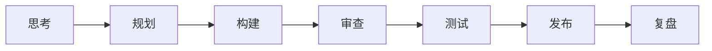

# gstack




> 原文：https://github.com/garrytan/gstack

---

## 摘要

**gstack** 是 Y Combinator CEO Garry Tan 开源的一套 Claude Code 技能框架，将 Claude Code 变成一个虚拟工程团队——包含 CEO、工程经理、设计师、QA、发布工程师等 15 个专家角色和 6 个强力工具。Garry Tan 声称在担任 YC CEO 的同时，60 天内用此系统产出了超过 60 万行生产代码（日均 1～2 万行）。核心理念是**结构化的角色分工与审查关卡，而非通用 Agent 的混乱模式**，遵循「思考 → 规划 → 构建 → 审查 → 测试 → 发布 → 复盘」的冲刺流程，并支持 10-15 个并行冲刺同时运行。全部开源、MIT 协议、永久免费。

---

## 以下为完整翻译

嗨，我是 [Garry Tan](https://x.com/garrytan)。我是 [Y Combinator](https://www.ycombinator.com/) 的总裁兼 CEO，在 YC 我与数千家初创公司合作过，包括 Coinbase、Instacart 和 Rippling——当时创始人们还只是一两个人窝在车库里，如今这些公司已经价值数百亿美元。在 YC 之前，我设计了 Palantir 的 logo，是那里最早的工程经理/产品经理/设计师之一。我联合创办了 Posterous（一个博客平台，后来卖给了 Twitter）。2013 年我构建了 Bookface，YC 的内部社交网络。我作为设计师、产品经理和工程经理构建产品已经很长时间了。

而现在，我正身处一个感觉像是全新时代的浪潮之中。

在过去 60 天里，我编写了**超过 60 万行生产代码**——其中 35% 是测试——我每天产出 **10,000 到 20,000 行可用代码**，而这只是我日常工作的一部分，同时还在履行 YC CEO 的全部职责。这不是打错字。我最近一次 `/retro`（过去 7 天的开发统计）横跨 3 个项目：**新增 140,751 行，362 次提交，约 115,000 行净代码**。模型每周都在飞速变好。我们正处于某种真实变革的黎明——一个人以过去需要二十人团队的规模在交付。

**2026 年 — 1,237 次贡献，仍在增长：**


**2013 年 — 我在 YC 构建 Bookface 时（772 次贡献）：**


同一个人。不同的时代。区别在于工具。

**gstack 就是我的方法。** 它是我的开源软件工厂。它把 Claude Code 变成一个你真正在管理的虚拟工程团队——一个重新思考产品的 CEO、一个锁定架构的工程经理、一个发现 AI 粗制滥造的设计师、一个偏执的审查员专找生产环境 Bug、一个打开真实浏览器点击测试你应用的 QA 负责人，以及一个负责发布 PR 的发布工程师。十五个专家和六个强力工具，全部是斜杠命令，全部是 Markdown，**全部免费，MIT 许可证，现在就可以用。**

我正在学习如何触及 2026 年 3 月智能体系统的能力边界，这是我的实时实验。我分享它是因为我希望全世界都和我一起踏上这段旅程。

Fork 它。改进它。把它变成你自己的。不要嫉妒，要欣赏。

**适用人群：**
- **创始人和 CEO** — 尤其是仍想亲自写代码的技术型创始人。这就是你如何像二十人团队一样构建产品。
- **Claude Code 新手** — gstack 是最好的入门方式。结构化的角色而非空白的提示词。
- **技术负责人和 Staff 工程师** — 为每个 PR 带来严格的审查、QA 和发布自动化。

## 快速开始：你的前 10 分钟

1. 安装 gstack（30 秒——见下文）
2. 运行 `/office-hours` — 描述你在构建什么。它会在你写一行代码之前重新定义问题。
3. 对任何功能想法运行 `/plan-ceo-review`
4. 对任何有变更的分支运行 `/review`
5. 对你的预发布环境 URL 运行 `/qa`
6. 到此为止。你就知道这东西是否适合你了。

在任何已有测试的仓库上，预计 5 分钟内就能得到第一次有用的运行结果。

**如果你只再看一个章节，请看这个。**

## 安装 — 只需 30 秒

**前置条件：** [Claude Code](https://docs.anthropic.com/en/docs/claude-code)、[Git](https://git-scm.com/)、[Bun](https://bun.sh/) v1.0+、[Node.js](https://nodejs.org/)（仅 Windows 需要）

### 第一步：安装到你的机器上

打开 Claude Code 然后粘贴以下内容。Claude 会搞定剩下的。

> 安装 gstack：运行 **`git clone https://github.com/garrytan/gstack.git ~/.claude/skills/gstack && cd ~/.claude/skills/gstack && ./setup`**，然后在 CLAUDE.md 中添加一个「gstack」段落，说明使用 gstack 的 /browse 技能进行所有网页浏览，永远不要使用 mcp\_\_claude-in-chrome\_\_\* 工具，并列出可用技能：/office-hours、/plan-ceo-review、/plan-eng-review、/plan-design-review、/design-consultation、/review、/ship、/browse、/qa、/qa-only、/design-review、/setup-browser-cookies、/retro、/investigate、/document-release、/codex、/careful、/freeze、/guard、/unfreeze、/gstack-upgrade。然后询问用户是否也想将 gstack 添加到当前项目以便队友也能使用。

### 第二步：添加到你的仓库以便队友也能使用（可选）

> 将 gstack 添加到本项目：运行 **`cp -Rf ~/.claude/skills/gstack .claude/skills/gstack && rm -rf .claude/skills/gstack/.git && cd .claude/skills/gstack && ./setup`**，然后在本项目的 CLAUDE.md 中添加一个「gstack」段落，说明使用 gstack 的 /browse 技能进行所有网页浏览，永远不要使用 mcp\_\_claude-in-chrome\_\_\* 工具，列出可用技能：/office-hours、/plan-ceo-review、/plan-eng-review、/plan-design-review、/design-consultation、/review、/ship、/browse、/qa、/qa-only、/design-review、/setup-browser-cookies、/retro、/investigate、/document-release、/codex、/careful、/freeze、/guard、/unfreeze、/gstack-upgrade，并告诉 Claude 如果 gstack 技能无法正常工作，运行 `cd .claude/skills/gstack && ./setup` 来构建二进制文件并注册技能。

真实文件会提交到你的仓库（不是子模块），所以 `git clone` 就能直接用。所有内容都在 `.claude/` 目录下。不会修改你的 PATH，也不会在后台运行任何东西。

### Codex、Gemini CLI 或 Cursor

gstack 可以在任何支持 [SKILL.md 标准](https://github.com/anthropics/claude-code) 的智能体上工作。技能放在 `.agents/skills/` 目录下，会被自动发现。

```bash
git clone https://github.com/garrytan/gstack.git ~/.codex/skills/gstack
cd ~/.codex/skills/gstack && ./setup --host codex
```

或者让 setup 自动检测你安装了哪些智能体：

```bash
git clone https://github.com/garrytan/gstack.git ~/gstack
cd ~/gstack && ./setup --host auto
```

这会根据可用情况安装到 `~/.claude/skills/gstack` 和/或 `~/.codex/skills/gstack`。全部 21 个技能在所有支持的智能体上都能工作。基于 Hook 的安全技能（careful、freeze、guard）在非 Claude 宿主上使用内联安全建议文本。

## 看看它是怎么工作的

```
你：     我想做一个每日日程简报应用。
你：     /office-hours
Claude：[询问痛点——具体例子，而非假设性问题]

你：     多个 Google 日历，事件信息过时，地点错误。
         准备工作太费时间，结果还不够好...

Claude：我要质疑你的框架。你说的是"每日简报应用"。但你实际描述的
         是一个个人 AI 参谋长。
         [提取出你没意识到自己在描述的 5 个功能]
         [挑战 4 个前提假设——你同意、反对或调整]
         [生成 3 种实现方案并给出工作量估算]
         建议：明天先发布最小可行切片，从真实使用中学习。完整愿景
         是一个 3 个月的项目——先从一个真正好用的每日简报开始。
         [写设计文档 → 自动传递给下游技能]

你：     /plan-ceo-review
         [读取设计文档，质疑范围，运行 10 个维度的审查]

你：     /plan-eng-review
         [用 ASCII 图表展示数据流、状态机、错误路径]
         [测试矩阵、故障模式、安全问题]

你：     批准方案。退出规划模式。
         [在 11 个文件中写了 2,400 行代码。约 8 分钟。]

你：     /review
         [自动修复] 2 个问题。[需确认] 竞态条件 → 你批准修复。

你：     /qa https://staging.myapp.com
         [打开真实浏览器，点击各个流程，发现并修复了一个 Bug]

你：     /ship
         测试：42 → 51（+9 个新增）。PR：github.com/you/app/pull/42
```

你说的是「每日简报应用」。智能体说「你其实在构建一个 AI 参谋长」——因为它听的是你的痛点，而非你的功能请求。然后它挑战了你的前提假设，生成了三种方案，推荐了最小可行切片，并写了一份设计文档传递给所有下游技能。八条命令。这不是一个副驾驶。这是一个团队。

## 冲刺流程

gstack 是一个流程，而非工具的集合。技能按照冲刺运行的顺序排列：

**思考 → 规划 → 构建 → 审查 → 测试 → 发布 → 复盘**

每个技能都传递给下一个。`/office-hours` 写设计文档，`/plan-ceo-review` 读取它。`/plan-eng-review` 写测试计划，`/qa` 接手执行。`/review` 发现 Bug，`/ship` 验证它们已修复。没有任何东西被遗漏，因为每一步都知道之前发生了什么。

一次冲刺、一个人、一个功能——用 gstack 大约需要 30 分钟。但真正改变一切的是：你可以同时并行运行 10-15 个这样的冲刺。不同功能、不同分支、不同智能体——全部同时进行。这就是我在做本职工作的同时每天交付 10,000+ 行生产代码的方法。

| 技能                       | 你的专家          | 他们做什么                                                                           |
| ------------------------ | ------------- | ------------------------------------------------------------------------------- |
| `/office-hours`          | **YC 办公时间**   | 从这里开始。六个强制性问题，在你写代码之前重新定义你的产品。质疑你的框架，挑战前提，生成替代实现方案。设计文档传递给所有下游技能。               |
| `/plan-ceo-review`       | **CEO / 创始人** | 重新思考问题。在需求中找到隐藏的 10 星产品。四种模式：扩展、选择性扩展、保持范围、缩减。                                  |
| `/plan-eng-review`       | **工程经理**      | 锁定架构、数据流、图表、边界情况和测试。逼出隐藏的假设。                                                    |
| `/plan-design-review`    | **高级设计师**     | 对每个设计维度评分 0-10，解释 10 分是什么样子，然后编辑方案使其达标。AI 粗制滥造检测。互动式——每个设计选择一个 AskUserQuestion。 |
| `/design-consultation`   | **设计伙伴**      | 从零构建完整设计系统。了解行业现状，提出安全选择和创意冒险，生成你实际产品的真实模拟图。设计是所有阶段的核心。                         |
| `/review`                | **Staff 工程师** | 找出那些通过了 CI 但在生产环境炸掉的 Bug。自动修复明显问题。标记完整性缺口。                                      |
| `/investigate`           | **调试员**       | 系统化的根因调试。铁律：不调查就不修复。追踪数据流，测试假设，3 次修复失败后停止。                                      |
| `/design-review`         | **懂代码的设计师**   | 和 /plan-design-review 同样的审计，然后直接修复发现的问题。原子提交，修复前后截图。                            |
| `/qa`                    | **QA 负责人**    | 测试你的应用，找 Bug，用原子提交修复，重新验证。每次修复自动生成回归测试。                                         |
| `/qa-only`               | **QA 报告员**    | 与 /qa 相同的方法论但只报告不修改。当你想要纯 Bug 报告而不修改代码时使用。                                      |
| `/ship`                  | **发布工程师**     | 同步 main 分支，运行测试，审计覆盖率，推送，创建 PR。如果你没有测试框架会自动搭建。一条命令。                             |
| `/document-release`      | **技术写作者**     | 更新所有项目文档以匹配你刚发布的内容。自动捕获过时的 README。                                              |
| `/retro`                 | **工程经理**      | 团队感知的周复盘。按人分解、交付连续天数、测试健康趋势、成长机会。                                               |
| `/browse`                | **QA 工程师**    | 给智能体一双眼睛。真实的 Chromium 浏览器，真实的点击，真实的截图。每条命令约 100ms。                              |
| `/setup-browser-cookies` | **会话管理员**     | 从你的真实浏览器（Chrome、Arc、Brave、Edge）导入 Cookie 到无头会话。测试需要认证的页面。                       |

### 强力工具

| 技能                | 功能                                                                                                                               |
| ----------------- | -------------------------------------------------------------------------------------------------------------------------------- |
| `/codex`          | **第二意见** — 来自 OpenAI Codex CLI 的独立代码审查。三种模式：审查（通过/拒绝关卡）、对抗性挑战、开放咨询。当 `/review` 和 `/codex` 都审查过同一分支时，你会得到跨模型分析，展示哪些发现重叠、哪些是各自独有的。 |
| `/careful`        | **安全护栏** — 在执行危险命令前警告（rm -rf、DROP TABLE、force-push、git reset --hard）。说「小心一点」即可激活。可以覆盖任何警告。                                       |
| `/freeze`         | **编辑锁** — 限制文件编辑到某个目录。调试时防止 Claude 意外「修复」范围外的代码。                                                                                 |
| `/guard`          | **完整安全** — `/careful` + `/freeze` 合体。为生产环境操作提供最大安全性。                                                                             |
| `/unfreeze`       | **解锁** — 移除 `/freeze` 的边界限制。                                                                                                     |
| `/gstack-upgrade` | **自更新** — 升级 gstack 到最新版。检测全局安装还是项目内安装，同步两者，显示变更内容。                                                                              |

**[每个技能的深度解析、示例和理念 →](docs/skills.md)**

## 新功能及其重要性

**`/office-hours` 在你写代码之前重新定义产品。** 你说「每日简报应用」。它听你描述实际的痛点，质疑你的框架，告诉你其实在构建一个个人 AI 参谋长，挑战你的前提假设，生成三种实现方案并给出工作量估算。它写的设计文档直接传递给 `/plan-ceo-review` 和 `/plan-eng-review`——这样每个下游技能都带着真正的清晰度开始，而非模糊的功能请求。

**设计是核心。** `/design-consultation` 不仅仅是选字体。它研究你所在领域的现有产品，提出安全选择和创意冒险，生成你实际产品的真实模拟图，并写入 `DESIGN.md`——然后 `/design-review` 和 `/plan-eng-review` 会读取你的设计选择。设计决策流经整个系统。

**`/qa` 是一个巨大的突破。** 它让我从 6 个并行工作者扩展到 12 个。Claude Code 说*"我看到问题了"*然后真的修复它、生成回归测试、验证修复——这改变了我的工作方式。智能体现在有眼睛了。

**智能审查路由。** 就像一个运转良好的初创公司：CEO 不需要审查基础设施 Bug 修复，设计审查不需要用于后端变更。gstack 跟踪已运行的审查，判断什么是合适的，然后做出聪明的选择。审查就绪仪表盘在你发布之前告诉你当前状态。

**测试一切。** `/ship` 在你的项目没有测试框架时会从零搭建。每次 `/ship` 运行都会产生覆盖率审计。每次 `/qa` Bug 修复都生成回归测试。100% 测试覆盖率是目标——测试让「氛围编程」变成安全的而不是 YOLO 编程。

**`/document-release` 是你从未拥有过的工程师。** 它读取你项目中的每个文档文件，与 diff 交叉对照，更新所有已过时的内容。README、ARCHITECTURE、CONTRIBUTING、CLAUDE.md、TODOS——全部自动保持最新。现在 `/ship` 会自动调用它——文档保持最新无需额外命令。

**AI 卡住时的浏览器交接。** 遇到验证码、认证墙或 MFA 提示？`$B handoff` 在完全相同的页面打开一个可见的 Chrome，保留所有 Cookie 和标签页。解决问题后告诉 Claude 你搞定了，`$B resume` 从中断处继续。连续 3 次失败后智能体会自动建议交接。

**多 AI 第二意见。** `/codex` 从 OpenAI 的 Codex CLI 获得独立审查——一个完全不同的 AI 审查同一份 diff。三种模式：带通过/拒绝关卡的代码审查、主动尝试破坏你代码的对抗性挑战、以及带会话持续性的开放咨询。当 `/review`（Claude）和 `/codex`（OpenAI）都审查了同一分支后，你会得到跨模型分析，展示哪些发现重叠、哪些是各自独有的。

**按需安全护栏。** 说「小心一点」，`/careful` 会在任何危险命令前警告——rm -rf、DROP TABLE、force-push、git reset --hard。`/freeze` 在调试时将编辑锁定在一个目录，防止 Claude 意外「修复」无关代码。`/guard` 同时激活两者。`/investigate` 会自动冻结到被调查的模块。

**主动技能建议。** gstack 会注意到你处于什么阶段——头脑风暴、审查、调试、测试——并建议合适的技能。不喜欢？说「别再建议了」，它会跨会话记住。

## 10-15 个并行冲刺

gstack 在单个冲刺时就很强大。同时运行十个冲刺时它是变革性的。

[Conductor](https://conductor.build) 并行运行多个 Claude Code 会话——每个在自己的隔离工作空间中。一个会话对新想法运行 `/office-hours`，另一个在 PR 上做 `/review`，第三个在实现功能，第四个对预发布环境运行 `/qa`，还有六个在其他分支上。全部同时进行。我经常运行 10-15 个并行冲刺——这是目前实际的上限。

冲刺结构是并行化能够工作的关键。没有流程，十个智能体就是十个混乱之源。有了流程——思考、规划、构建、审查、测试、发布——每个智能体都确切知道该做什么、何时停止。你像 CEO 管理团队一样管理它们：检查重要的决策，让其余的自行运行。

---

## 来乘风破浪

这是**免费的、MIT 许可证、开源的、现在就可以用。** 没有付费版。没有等待列表。没有附加条件。

我开源了我的开发方式，并且正在积极升级我自己的软件工厂。你可以 Fork 它并把它变成你自己的。这就是全部意义。我希望每个人都踏上这段旅程。

同样的工具，不同的结果——因为 gstack 给你的是结构化的角色和审查关卡，而非通用的智能体混乱。这种治理是快速交付和鲁莽交付之间的区别。

模型在快速变好。那些现在弄明白如何与它们协作的人——真正协作，而非浅尝辄止——将拥有巨大的优势。就是这个窗口期。出发吧。

十五个专家和六个强力工具。全部是斜杠命令。全部是 Markdown。全部免费。**[github.com/garrytan/gstack](https://github.com/garrytan/gstack)** — MIT 许可证

> **我们在招人。** 想要每天产出 10K+ 行代码并帮助打磨 gstack？
> 来 YC 工作吧 — [ycombinator.com/software](https://ycombinator.com/software)
> 极具竞争力的薪酬和股权。旧金山，Dogpatch 区。

## 文档

| 文档 | 涵盖内容 |
|------|---------|
| [技能深度解析](docs/skills.md) | 每个技能的理念、示例和工作流（包含 Greptile 集成） |
| [架构](ARCHITECTURE.md) | 设计决策和系统内部原理 |
| [浏览器参考](BROWSER.md) | `/browse` 完整命令参考 |
| [贡献指南](CONTRIBUTING.md) | 开发设置、测试、贡献者模式和开发模式 |
| [变更日志](CHANGELOG.md) | 每个版本的更新内容 |

## 隐私与遥测

gstack 包含**可选**的使用遥测以帮助改进项目。以下是具体情况：

- **默认关闭。** 除非你明确同意，否则不会向任何地方发送任何数据。
- **首次运行时，** gstack 会询问你是否愿意分享匿名使用数据。你可以拒绝。
- **发送的内容（如果你选择加入）：** 技能名称、持续时间、成功/失败、gstack 版本、操作系统。仅此而已。
- **永远不会发送的内容：** 代码、文件路径、仓库名称、分支名称、提示词或任何用户生成的内容。
- **随时更改：** `gstack-config set telemetry off` 即刻禁用一切。

数据存储在 [Supabase](https://supabase.com)（开源的 Firebase 替代方案）。Schema 在 [`supabase/migrations/001_telemetry.sql`](supabase/migrations/001_telemetry.sql) 中——你可以验证收集的确切内容。仓库中的 Supabase publishable key 是一个公钥（类似 Firebase API key）——行级安全策略将其限制为仅插入权限。

**本地分析始终可用。** 运行 `gstack-analytics` 即可从本地 JSONL 文件查看你的个人使用仪表盘——无需远程数据。

## 故障排除

**技能没有出现？** `cd ~/.claude/skills/gstack && ./setup`

**`/browse` 失败？** `cd ~/.claude/skills/gstack && bun install && bun run build`

**安装过时了？** 运行 `/gstack-upgrade` — 或在 `~/.gstack/config.yaml` 中设置 `auto_upgrade: true`

**Windows 用户：** gstack 在 Windows 11 上通过 Git Bash 或 WSL 工作。除了 Bun 之外还需要 Node.js——Bun 在 Windows 上与 Playwright 的管道传输有一个已知 Bug（[bun#4253](https://github.com/oven-sh/bun/issues/4253)）。browse 服务器会自动回退到 Node.js。确保 `bun` 和 `node` 都在你的 PATH 中。

**Claude 说看不到技能？** 确保你项目的 `CLAUDE.md` 有 gstack 段落。添加以下内容：

```
## gstack
使用 gstack 的 /browse 进行所有网页浏览。永远不要使用 mcp__claude-in-chrome__* 工具。
可用技能：/office-hours、/plan-ceo-review、/plan-eng-review、/plan-design-review、
/design-consultation、/review、/ship、/browse、/qa、/qa-only、/design-review、
/setup-browser-cookies、/retro、/investigate、/document-release、/codex、/careful、
/freeze、/guard、/unfreeze、/gstack-upgrade。
```

## 许可证

MIT。永久免费。去构建点什么吧。
