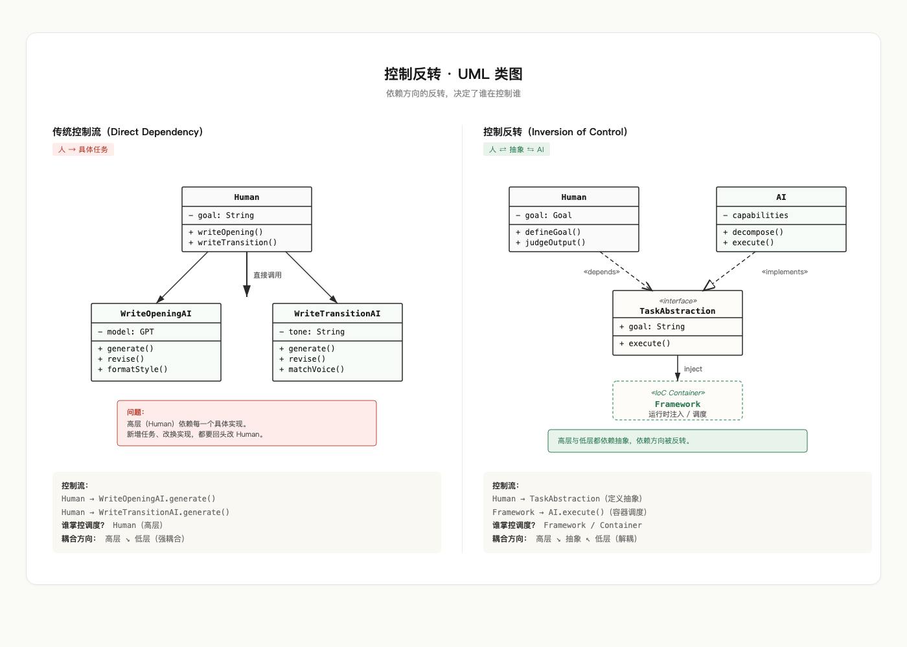
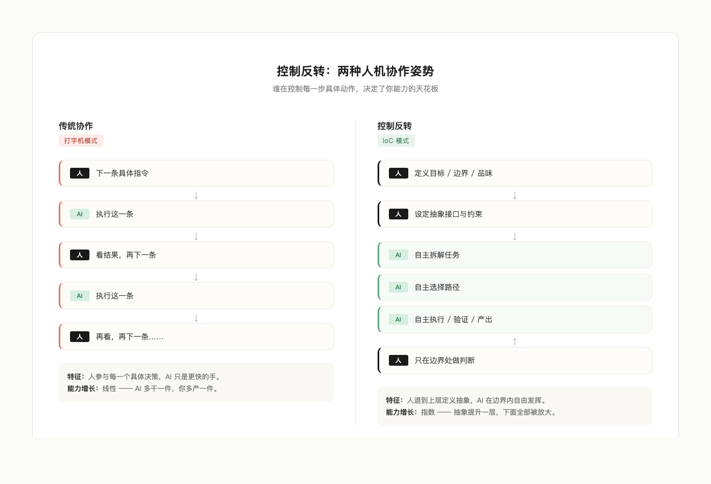

# 控制反转：AI 时代最重要的一种思维方式

"控制反转"这个思维，对我的影响是巨大的。

现在 AI 的能力，让我在生活中超过 99% 的场景都会用控制反转的思路去解决问题。控制什么，反转什么，让 AI 做哪些具体工作，我去控制哪些抽象判断，什么应该被泛化，什么应该被具体定义并交给 AI 执行——把这套思维练好，就意味着你已经稳稳地控制了人和 AI 的能力边界。

我越来越觉得，AI 时代最稀缺的能力，就藏在这四个字里。

## 一、什么是控制反转

控制反转（Inversion of Control，IoC）原本是软件工程里的概念。

在传统编程里，主程序负责发起每一次调用，决定什么时候用哪个组件、传什么参数、走哪条分支。控制权完全握在主程序手里，所有具体动作都由它显式触发。

控制反转把这个过程倒了过来。主程序不再亲自调度每一个细节，而是退一步，去定义接口、约束和规则，把"具体怎么做"的执行权交给框架或容器。框架在合适的时机、按预定的协议，自动调用对应的组件。

这听起来像一个很技术的概念，但它的精神内核很朴素：

- 上层负责定义"什么是合法的、什么是目标、什么是边界"。
- 下层负责"在边界内自由发挥，把事情做完"。
- 上层不需要知道下层是怎么实现的，下层也不需要知道自己被谁调用。

用一张 UML 类图能把这件事讲得最清楚——同样是 Human 和 AI 两个角色，依赖箭头的方向不同，整个系统的性质就完全变了。

左边是传统控制流。`Human` 类直接持有并调用 `WriteOpeningAI`、`WriteTransitionAI` 这些具体实现，箭头从高层指向低层。每多一个任务，就多一根箭头从 Human 拉出去；每换一种实现，Human 自己也要跟着改。高层被低层牵着走。

右边是控制反转。`Human` 不再直接依赖任何具体的 AI 实现，而是依赖一个抽象接口 `TaskAbstraction`——它只声明"目标是什么、要执行什么"，不关心具体怎么做。`AI` 类去实现这个接口，提供具体执行能力。中间由一个 `IoC Container`（框架）在运行时把两者装配起来：把 AI 注入到 Human 需要的地方，并负责调度执行。

依赖箭头被反过来了：高层和低层都指向中间的抽象，谁也不直接依赖谁。这就是"控制反转"这个名字的由来——控制权从高层手里被交给了容器，依赖方向被翻转。

把这套结构迁移到人和 AI 的真实协作上，那个 `TaskAbstraction` 就是你脑子里清晰定义的目标和边界，那个 `Framework` 就是你建立的工作流和约束，AI 在这个框架内自主执行。

左边是大多数人现在的协作姿势——人参与每一个具体决策，AI 只是更快的手；右边是控制反转的姿势——人退到上层定义抽象，把具体执行完整地交出去。两种姿势看起来只差一步，能力曲线却走向完全不同的方向。

## 二、人机协作的两种姿势

观察身边用 AI 的人，会发现两种截然不同的姿势。

第一种姿势，是把 AI 当成一台更快的打字机。

用户每一步都亲自下指令："帮我写一段开头""再改一下""换个语气""加一句过渡"。AI 在他面前像一个反应灵敏的工具，但所有的判断、节奏、方向都还压在用户身上。用得越久，用户越累，因为他承担的认知负担没有减少，只是把"打字"这一个动作外包了出去。

第二种姿势，就是控制反转。

用户不再发起每一个具体动作，而是退到上层去定义抽象：我要解决的问题是什么，目标是什么，边界在哪里，什么样的输出算合格，什么样的算不合格。然后他把"具体怎么做"完整地交给 AI——AI 自己拆解任务、自己选路径、自己写代码、自己跑、自己验证、自己产出结果。用户只在抽象层做判断：这个方向对不对，这个边界要不要收紧，这个产出是否符合我心里那把尺子。

这两种姿势，决定了一个人在 AI 时代的能力跃迁速度。

第一种姿势的人，能力增长是线性的。AI 帮他每天多做了三件事，他就多做了三件事。

第二种姿势的人，能力增长是指数的。因为他练的是抽象能力，而抽象能力一旦提升一层，下面所有具体执行都会被自动放大。他今天能定义一个项目级的抽象，明天就能定义一个业务级的抽象，后天就能定义一个组织级的抽象。每提升一层，AI 替他执行的事情就多一个数量级。

## 三、人和 AI 的能力边界，由抽象层级决定

控制反转思维真正告诉你的，是一件更底层的事——人和 AI 的能力边界，本质上是由抽象层级决定的。

你能在哪一层稳定做判断，AI 就替你执行下面所有层的工作。

如果你只能判断"这一句话写得好不好"，那 AI 只能替你写句子，你得一句一句地审。

如果你能判断"这一段的逻辑顺不顺、节奏稳不稳"，那 AI 可以替你成段地写，你只需要审段落。

如果你能判断"这篇文章的整体结构有没有支撑住主题、有没有传达出我想传达的东西"，那 AI 可以替你写整篇文章，你只审整体。

如果你能判断"这个内容选题在我这条产品线里是不是该出、该以什么形式出、该面向谁"，那 AI 可以替你跑完整条内容生产线，你只在选题层做判断。

每往上抽象一层，你能控制的范围就指数级扩大，而你需要亲自动手的事情却指数级缩小。这就是为什么同样用 AI，有的人产出像滚雪球一样越来越大，有的人却始终困在打字机模式里——区别从来不在工具，而在他能稳定停留的抽象层。

## 四、控制反转的三个支点

要把这套思维真正用起来，有三个支点必须站得住。

第一个支点是：清楚地知道自己在控制什么。

控制反转不等于撒手不管。恰恰相反，它要求你对"我究竟在控制什么"有非常清醒的意识。你控制的是目标的定义，是边界的设定，是品味的判断，是方向的选择。这些东西交不出去，也不应该交出去。你一旦在这些地方含糊，AI 就会替你含糊，最后产出一堆"看起来都对、但全都不是你要的"的东西。

第二个支点是：清楚地知道什么应该被具体定义。

不是所有东西都能被泛化。有些约束如果不写清楚，AI 永远猜不到。比如这篇文章必须用中文标点，必须避免某种句式，必须控制在多少字以内，必须面向某一类读者，必须避开某些雷区。这些是具体的、可被明确定义的，必须由你显式地交给 AI。把它们写清楚，AI 才能在边界内自由发挥。

第三个支点是：清楚地知道什么应该被 AI 自由执行。

具体怎么开头、怎么过渡、怎么遣词造句、怎么组织例子、怎么调用工具、怎么调试代码——这些是 AI 可以做得比你更快、有时甚至比你更好的事情。把它们交出去，不要去微管。一旦你开始在这一层抠细节，控制反转就破了，你又退回到打字机模式。

这三个支点站住了，你才真正在做控制反转，而不只是在用一个嘴替。

## 五、写在最后

AI 的能力还在以肉眼可见的速度提升。每隔几个月，下一层"具体执行"的能力就会被往上拓宽一截，原本需要你亲自做的事情，又会有一大批被吸收进 AI 可以自由发挥的范围里。

在这种节奏下，留给个人的真正问题只有一个：你能不能持续地往抽象层上走。

如果可以，AI 越强，你越强，因为它替你执行的范围在不断扩大。

如果走不上去，AI 越强，你越焦虑，因为你能做的事情正在被一层一层地吃掉。

控制反转思维，就是那把帮你往上走的梯子。它不教你写得更快，也不教你打字更准，它教你站到一个更高的位置，去定义"什么是值得做的、什么是合格的、什么是属于你的判断"，然后把剩下的全部放心地交给 AI。

控制什么，反转什么，把这个问题想清楚的人，就已经站在了 AI 时代的能力曲线上。
