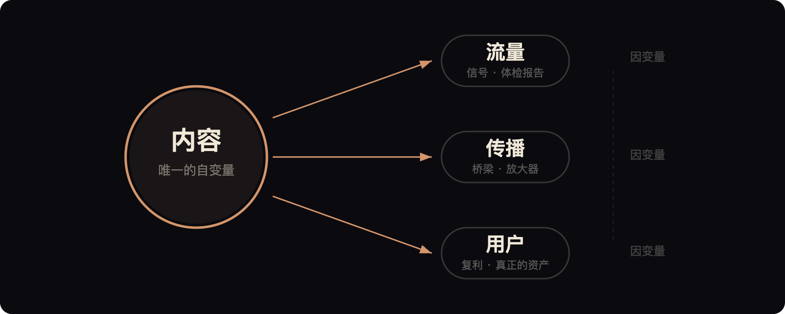
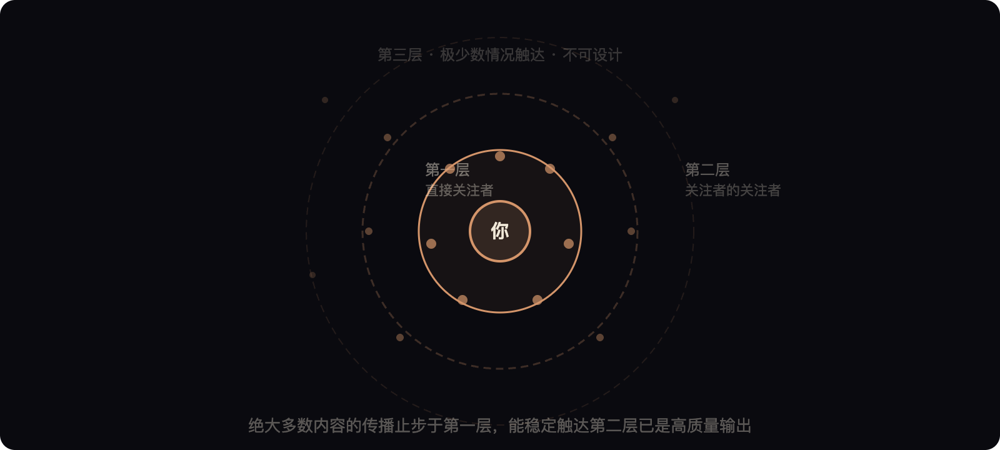
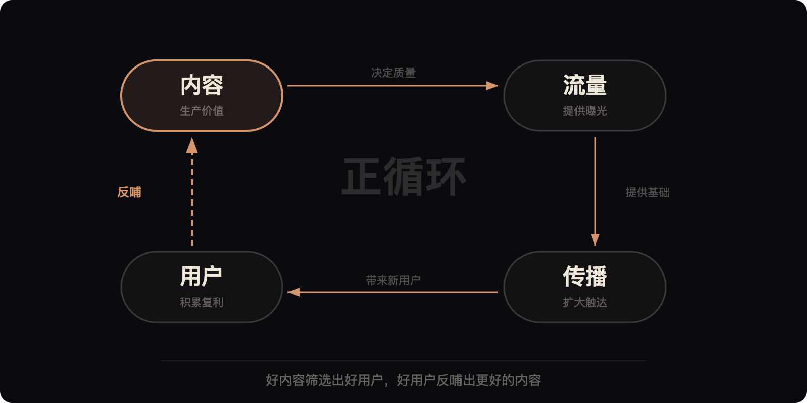

# 内容、流量、传播、用户之间的底层逻辑

## 四个词，一个系统

内容、流量、传播、用户——这四个词几乎出现在每一篇关于自媒体运营的文章里。但大多数人把它们当成四个独立的问题来解决：内容不好就学写作，流量不够就研究算法，传播不广就搞裂变，用户不多就做活动拉新。

这种拆解方式的问题在于，它把一个有机系统拆成了四个孤立的零件。你可以把每个零件打磨得很精致，但如果不理解它们之间的关系，整台机器还是跑不起来。

这篇文章要做的事情很简单：把这四个概念之间的底层关系讲清楚。理解了这层关系，很多具体的运营问题会自动获得答案。

## 内容是唯一的因，其他都是果

先确立一个基本判断：在这四个要素中，内容是唯一的自变量，流量、传播、用户都是因变量。

这个判断听起来简单，但它的推论非常重要——你不可能在内容不变的前提下，单独提升流量、传播或用户中的任何一个。所有试图绕过内容质量去直接获取流量的手段，要么效果短暂，要么代价高昂，要么两者兼具。

为什么内容是因？因为内容是你在这个系统中唯一能真正控制的变量。你无法控制算法给你多少曝光，无法控制读者是否愿意转发，无法控制一个陌生人是否决定关注你。但你能控制的是：你写什么、怎么写、为谁写、写到什么深度。

当你把内容做到位的时候，流量、传播、用户这三件事会以不同的速度、不同的方式自然发生。当你的内容没有做到位的时候，你在其他三个维度上花再多力气，效果也是倒在沙子上盖楼。

## 流量是信号，不是目标

大多数创作者对流量的理解是错的。他们把流量当成目标——"我要获得更多流量"——然后围绕这个目标去设计内容。这个思路从起点就歪了。

流量的本质是一个信号。它告诉你：你的内容在多大程度上命中了某个人群的需求。流量高，说明命中了；流量低，说明没命中。仅此而已。

把流量当成目标会导致一个致命问题：你开始为流量本身优化内容，而不是为内容的价值优化内容。标题党是这个逻辑的极端产物——标题命中了需求，内容没有兑现承诺。结果是你获得了一次性的曝光，但同时也消耗了读者对你的信任。这是一笔亏本生意。

正确的思路是把流量当成体检报告来读。流量数据告诉你哪些话题有人关心，哪些角度引起了共鸣，哪些表达方式更容易被接受。你根据这些信号去调整方向，但你优化的始终是内容本身的价值密度，而不是流量数字。

还有一个被大多数人忽略的事实：**流量的质量远比数量重要。** 一万个对你的领域毫无兴趣的人看了你的推文，不如一百个精准的同行认真读了你的长文。前者给你虚荣指标，后者给你真实的影响力和可能的商业机会。

## 传播有自己的规律

传播是内容与用户之间的桥梁，但这座桥不是你想建就能建的。传播有自己的规律，理解这些规律比研究任何"裂变技巧"都重要。

**第一条规律：人们转发的不是内容，是身份。** 一个人把你的推文转发到自己的时间线上，他实际上是在用你的内容来表达他自己。他转发一篇深度技术分析，是在说"我是一个关注技术深度的人"；他转发一条犀利的商业观点，是在说"我认同这个判断"。所以你的内容要想被传播，它必须具备"值得被代言"的属性——要么提供了一个值得被认同的观点，要么提供了一个值得被展示的品味标签。

**第二条规律：传播是分层的。** 你的内容从你出发，先到达你的直接关注者（第一层），其中一部分人转发后到达他们的关注者（第二层），极少数情况下会触达第三层及以上。绝大多数内容的传播止步于第一层。能稳定触达第二层的内容，已经是高质量输出。能打穿三层以上的，需要话题、时机、内容质量三者同时对齐，这种情况不可设计，只能等待。

**第三条规律：传播的速度和内容的寿命负相关。** 传播越快的内容，往往死得也越快。热点评论、情绪输出、反常识观点——它们容易快速扩散，但也会在几个小时内被下一波信息淹没。而那些真正有深度的内容——长篇教程、系统性框架、原创方法论——传播速度慢，但生命周期长。它们会被收藏、被反复引用、被搜索引擎持续带来流量。如果你的目标是长期建立影响力，你应该有意识地多生产后一种内容。

## 用户是唯一会复利的资产

内容会过期，流量会波动，传播会衰减，但用户会复利。

一个真正认可你的用户，他的价值远超你的想象。他会持续阅读你的每一条推文（稳定的基础流量），会在看到好内容时主动转发（免费的传播渠道），会在你做产品或服务时成为第一批付费用户（商业转化的起点），还会在你被质疑或攻击时站出来支持你（品牌的护城河）。

这就是为什么"涨粉"这个说法其实很粗糙。粉丝数是一个表面指标，真正重要的是：你的用户中有多少人是"真用户"——他们真的在读你的内容、真的认可你的判断、真的愿意为你的价值买单。一万个僵尸粉不如五百个真用户。

用户的积累是一个慢过程，没有捷径。每一篇高质量的内容，都是在筛选真用户。读完你的长文还愿意关注你的人，大概率是你的目标受众。被标题吸引进来、读了两行就划走的人，即使关注了你也不会产生任何价值。

所以不要为了涨粉去写讨好所有人的内容。你的内容越有棱角、越有门槛、越明确地表达"我是为谁写的"，你筛选出来的用户质量就越高。短期看你的增长速度会更慢，但长期看你积累的每一个用户都是真实的、有价值的、会复利的。

## 这四者的系统逻辑

现在把这四个要素的关系串起来。

**内容决定流量的质量。** 你写什么内容，就会吸引什么样的流量。写八卦就来八卦流量，写深度分析就来深度读者。很多人抱怨"流量不精准"，根源在于内容定位模糊。

**流量提供传播的基础。** 没有初始流量，传播无从谈起。但流量只是提供了传播的可能性，不保证传播一定发生。从流量到传播的转化，取决于内容是否击中了读者"愿意分享"的那个点。

**传播带来新的用户。** 传播的本质功能是把你的内容带到你的关注者圈层之外。每一次有效的传播，都是在为你引入潜在的新用户。但传播带来的不是用户本身，而是"体验你内容的机会"——能否转化为真用户，还是取决于内容的质量。

**用户反哺内容的价值。** 用户的评论、反馈、提问，会反向影响你的内容方向。你的真用户就是你最好的选题来源——他们关心什么，你就写什么。这种正向循环一旦建立，你的内容会越来越精准，流量会越来越稳定，传播会越来越高效。

这个循环用一句话概括就是：**好内容筛选出好用户，好用户反哺出更好的内容。** 流量和传播只是这个核心循环的放大器——它们决定了循环运转的速度，但不决定循环的方向。

## 最常见的三个错误

理解了这个系统，就能看清大多数创作者正在犯的错误。

**第一个错误：在内容不到位的时候投入大量精力研究分发策略。** 发布时间、话题标签、互动话术——这些属于分发层面的优化。它们的作用是让本来就有价值的内容获得更大的曝光。但如果内容本身没有价值，分发优化只会让更多人更快地划过你的推文。

**第二个错误：追逐流量而不是经营用户。** 每天盯着阅读量和点赞数，为爆款兴奋，为低迷焦虑。这种心态会驱使你不断追逐短期的流量刺激，而忽略了真正重要的事——每一篇内容是否帮你积累了一些会长期留下来的人。

**第三个错误：把传播当成可控变量来经营。** 花大量时间设计"转发抽奖""互推互转""裂变活动"。这些手段能带来短期的数据提升，但它们吸引来的人对你的内容本身毫无兴趣。活动结束，数据回落，你什么也没留下。

这三个错误的共同根源是：把注意力放在了系统的表层（流量、传播），而忽略了系统的根基（内容、用户）。

## 一句话总结

如果你只记住这篇文章的一个判断，记住这个：**把 80% 的精力放在内容上，剩下 20% 放在经营用户关系上，流量和传播会自己来。**

这个比例不是精确的数学公式，而是一种优先级判断。它的意思是：在你的时间和注意力有限的情况下，永远优先保证内容的质量和深度，其次关注你和用户之间的真实连接。至于流量和传播，它们是好内容和真用户的自然产物，不需要你单独去"经营"。

把因果关系搞对，事情就没那么复杂。
