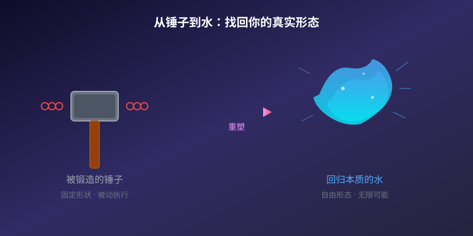
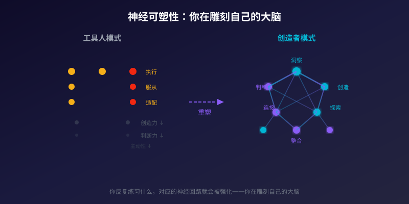
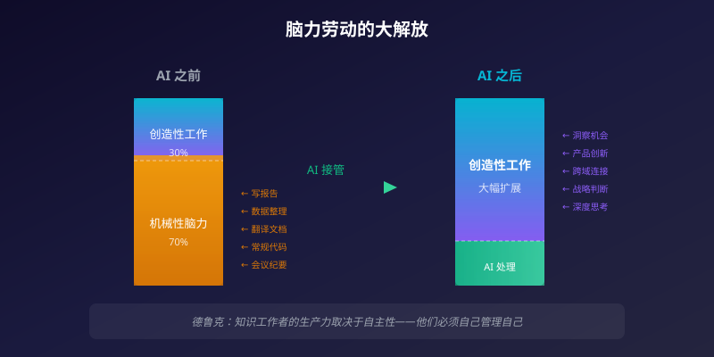
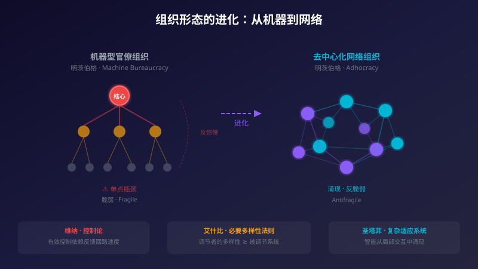

# 别再做一把顺手的锤子：AI 时代，你可以成为你想成为的人

最近在反思一个问题——如果现在让我去面试找工作，大概率是找不到的。

它指向一个真实的困境：过去十几年职场生涯里，我花了大量精力在做一件事——**让自己成为别人用着顺手的工具人**。调整自己的节奏去适配老板的偏好，压缩自己的判断力去服从流程的要求，打磨自己的服从性去匹配组织的惯性。为了那份工资，你必须把自己锻造成一把称手的锤子——敲哪儿指哪儿，从不跑偏。

问题是，锤子是没有自我的。

你的真正潜能无法得到充分释放，你真正的能力无法得到完整的开发。日复一日，你在"适应环境"这件事上越来越熟练，却在"成为自己"这件事上越来越生疏。这是一种缓慢的窒息——不是一下子把你闷死，而是每天让你少呼吸一点，直到有一天你发现，自己已经不记得深呼吸是什么感觉了。

大多数人变得平庸，并非因为天赋不够，而是因为花了太多力气在适应一个并不适合自己的容器。水被倒进方形的杯子就变成方的，倒进圆形的瓶子就变成圆的——可是水本身没有形状，它可以成为任何形态。问题在于，大多数人已经忘了自己是水。

---

## 神经可塑性：你真的可以重塑自己

前不久读到一些关于神经可塑性的研究，结合自己这些年职业发展和个人学习的经历，我发现这个概念远比表面上看起来更具颠覆性。

通俗地讲，**你的大脑终其一生都在重塑自己**。你反复练习什么，对应的神经回路就会被强化；你停止使用什么，对应的回路就会弱化甚至消失。这意味着一件极其重要的事：你此刻的能力边界，并不是你真正的能力边界——它只是过去你选择把时间花在哪里的结果。

换句话说，你今天觉得自己"不擅长"的事情，很可能只是你从未认真投入过的事情。你觉得自己"只能做"的那些事，很可能只是被环境反复强化的习惯性路径。

这是一个让人既振奋又后怕的事实。振奋在于，你确实可以成为你想成为的人——不是鸡汤，是神经科学层面的客观规律。后怕在于，如果你长期把自己放在一个压制潜能的环境里，你的大脑会忠实地执行你的选择——把那些未被使用的能力回路慢慢修剪掉。你以为自己只是暂时在"忍耐"，实际上你在永久地重塑自己。

回头看我自己的经历，那些年努力让自己当一把好锤子的时光，本质上就是在用神经可塑性的力量雕刻一个错误的形状。你越擅长当工具人，就越不擅长做决策者；你越习惯被安排，就越恐惧自己安排自己。

## 生产关系正在发生根本性的改变

意识到"可以重塑自己"只是第一步。更关键的问题是：**重塑的方向应该指向哪里？**

这个问题的答案藏在一个正在发生的结构性变化中——技术革命正在改写生产关系。

工业革命解放了体力劳动。机器替代了人的肌肉，人类从繁重的物理劳作中抽身出来，转向脑力工作。整个社会的经济结构因此重组——工厂取代了手工作坊，城市取代了乡村，白领取代了蓝领作为中产阶级的主体。

AI 革命正在做同样的事，只不过这次被解放的是**脑力劳动中的机械部分**。写报告、做数据分析、翻译文档、编写常规代码、整理会议纪要——这些确实需要用脑，但本质上是重复性的、可结构化的、有明确标准答案的脑力操作。AI 正在迅速接管这些工作，速度和质量都远超人类。

这意味着什么？意味着那些靠"脑力体力活"换取工资的岗位，正在经历跟两百年前纺织工人同样的命运。如果你的核心竞争力是"执行别人想好的方案"，那你和一个即将被蒸汽机取代的织布工没有本质区别——只不过你织的是代码和 PPT。

但硬币的另一面极其重要：**被解放出来的脑力，可以投入到真正有创造性的工作中去。**

这是一次脑力劳动的大解放。你不再需要把 70% 的工作时间花在机械性的执行上，你可以把这些时间用来思考、创造、探索那些只有人类才能做的事情——洞察一个没有人看到的机会，构建一个前所未有的产品，把两个不相干的领域连接起来产生新的价值。

问题是，如果我们抱着过去的工作模式和生活方式不放，指望用加倍的努力去适应一个已经在根本上发生改变的世界——加倍的努力，也未必能达到过去一半的效果。用旧地图导航新世界，走得越快，偏得越远。

管理学大师彼得·德鲁克早在上世纪末就预见过这一天。他提出"知识工作者"的概念时就指出，知识工作者的生产力取决于自主性——他们必须自己管理自己，自己定义工作的质量标准，自己决定把注意力投向哪里。传统的"命令-控制"式管理对体力劳动有效，因为你可以拆解动作、计时监督、标准化流程。但对于创造性的脑力劳动，这套方法不仅无效，而且有害——你越是精确控制一个创造者的工作过程，他的产出质量就越低。

AI 把德鲁克的预言从"前瞻"变成了"现实"。当机械性脑力劳动被 AI 接管，剩下的全是需要自主判断的创造性工作。这意味着整个管理范式必须翻转：领导者的角色不再是发号施令，而是创造条件、移除障碍、让每个人的创造力得到最大程度的释放。哈佛大学领导力学者罗纳德·海费兹把这称为从"技术性问题"到"适应性挑战"的转变——技术性问题有已知的解法，交给专家执行就行；适应性挑战没有现成答案，需要当事人自己改变认知和行为模式才能应对。AI 时代的绝大多数问题，都是适应性挑战。

## 去中心化：未来组织的进化方向

顺着这个逻辑往下推一步，如果个体的脑力劳动被大量解放，每个人都能借助 AI 完成过去需要一个团队才能完成的工作，那么组织的形态必然也要跟着变。

我做一个大胆的预测：**未来凡是高度依赖组织中某一个核心人物的团队，都将无法快速应对新形势的需要。**

这种"中心化"的组织结构——所有决策汇集到一个人，所有资源分配依赖一个人的判断，所有方向由一个人拍板——在信息流通缓慢、变化节奏可预期的时代是有效的。管理学家亨利·明茨伯格将这种形态称为"机器型官僚组织"：清晰的层级、严格的分工、标准化的流程，像一台精密机器一样运转。它的优势是效率和可预测性——前提是外部环境也是可预测的。

但在 AI 时代，变化的速度和复杂度已经超出了任何单一大脑的处理带宽。控制论（Cybernetics）的奠基人诺伯特·维纳在上世纪 40 年代就揭示过一个根本性的原理：**有效控制依赖于反馈回路的速度**。如果环境变化的速度超过了系统采集反馈、处理信息、做出调整的速度，控制就会失效。中心化组织的致命瓶颈正在于此——等信息层层上报到核心决策者那里，再等决策层层传达回执行层，窗口期早就关闭了。

控制理论中还有一条更深刻的定律——艾什比的"必要多样性法则"：一个调节系统要有效控制另一个系统，前者的多样性（可能的状态和响应方式）必须不少于后者。通俗地说，环境越复杂多变，应对它的组织就必须具备同等的复杂性和灵活性。一个只有一个大脑做决策的组织，其"多样性"被限制在一个人的认知带宽内——在简单环境中够用，在复杂环境中必然失控。

这就是为什么去中心化的组织形态将成为未来的主流。复杂系统科学对此提供了坚实的理论支撑。圣塔菲研究所数十年的研究表明，**复杂适应系统（Complex Adaptive Systems）**的核心特征是"涌现"——整体的智能行为不是由某个中央控制器设计出来的，而是从大量自主个体的局部交互中自然产生的。生物学上有一个直观的类比：蚁群没有"总指挥"，每只蚂蚁根据局部信息独立做出决策，整个群体却能展现出惊人的集体智慧和适应能力。没有任何一只蚂蚁理解全局，但全局秩序依然涌现。

明茨伯格在描述组织形态的光谱时，把这种结构称为"创新型临时组织"（Adhocracy）——与机器型官僚组织截然相反，它没有固化的层级，团队根据任务动态组建又动态解散，决策权分布在离问题最近的人手中。在过去，这种组织形态只在少数前沿领域（如航天工程、先锋艺术团体）中出现，因为它对个体能力的要求极高。但 AI 正在降低这个门槛——当每个人都拥有一个强大的 AI 协作者，个体的能力上限被大幅拉升，Adhocracy 得以从小众变为主流。

纳西姆·塔勒布在《反脆弱》中提出的概念也在这里高度适用。中心化组织是"脆弱的"——它在正常条件下运转良好，但一旦遇到超出预期的冲击，整个系统会因为中心节点的过载而崩溃。去中心化组织则具备"反脆弱"特性——压力和波动不仅不会摧毁它，反而会让它在适应中变得更强，因为每个节点都在独立学习和进化。

对于个体而言，这个趋势的含义非常清晰：**你的价值不再取决于你在某个组织层级中的位置，而取决于你作为一个独立节点能创造多大的价值。**

你是否具备独立判断的能力？你是否能在没有上级指令的情况下发现问题并解决问题？你是否能跟不同背景的人快速组成临时团队、完成一个项目、然后各自散开？这些能力在旧体系里被视为"不安分"，在新体系里将成为核心竞争力。

## 去做让自己大放异彩的事

写到这里，所有的线索都指向同一个结论：**停止打磨自己的工具属性，开始释放自己的创造属性。**

这不是一句空洞的口号。它有非常具体的操作含义——

停止优化你的"被雇佣能力"。那些面试技巧、简历包装、如何在组织中向上管理的攻略，在旧世界里也许有用，在新世界里正在快速贬值。取而代之的是：你能不能做出一个东西让人眼前一亮？你能不能写出一段话让人反复阅读？你能不能看到别人看不到的机会并把它变成现实？

停止用"稳定"作为人生决策的第一权重。稳定是一种幻觉——它的意思是"暂时还没被颠覆"。与其追求一份看似安全的工作，不如投资于自己的独特能力。能力长在你身上，谁也拿不走；而那个看似稳固的岗位，随时可能消失。

停止在别人的框架里寻找自己的定位。你不需要适配任何一个现成的岗位描述。在 AI 时代，最有价值的人往往是那些无法被任何现有 JD 描述的人——因为他们做的事情太新了，新到还没有对应的职位名称。

神经科学已经证明，你的大脑有终身重塑的能力。技术革命已经打开了脑力解放的大门。组织形态的进化正在把权力从中心节点还给每一个个体。

所有的条件都已经具备。剩下的问题只有一个——**你是否愿意从那把锤子里走出来，去做让自己真正大放异彩的事？**
