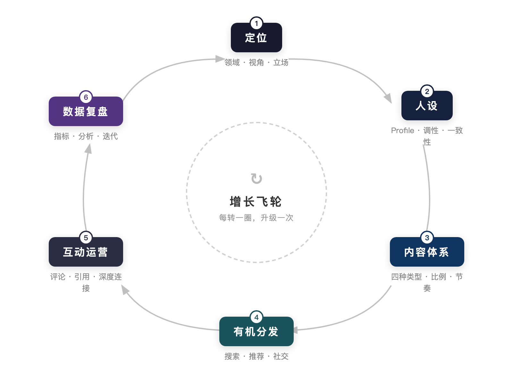
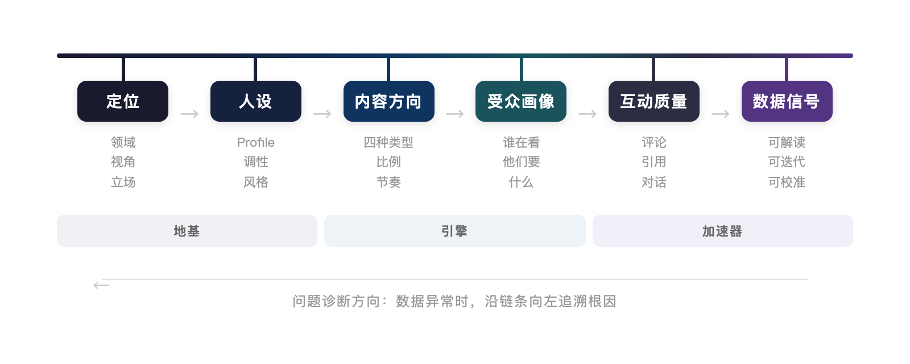

# X 增长系统的框架全景

把 X 上的增长做成一件可持续的事，需要的不是更多技巧，而是一个能把所有动作串起来的框架。本文用最短的篇幅把这个框架讲清楚：它由哪些模块组成，模块之间是什么关系，出了问题应该去哪里找原因。

---

# 一、增长飞轮：六个环节

整个增长系统的核心是一个六环节的闭环飞轮：

**定位**回答"你是谁"。你持续谈论什么领域、用什么独特视角看问题、你的核心立场是什么。定位是整个系统的原点，后续所有环节都从这里派生。

**人设**回答"别人如何感知你"。它是定位在所有触达面上的一致性呈现——你的 Profile、内容调性、互动风格，传达的是否是同一个信号。人设的核心要求不是鲜明，而是一致。

**内容体系**回答"你持续输出什么"。每条推文都应该属于四种类型之一：流量型（扩大曝光）、干货型（证明价值）、信任型（建立可靠感）、转化型（推动行动）。四者按比例组合，分别完成不同的增长任务。

**有机分发**回答"内容如何被更多人看到"。有机增长的三个引擎是搜索、推荐和社交。不同阶段侧重不同引擎：冷启动期靠社交（评论区、引用转发），加速期同时激活推荐（Thread、长文），成熟期三个引擎并行。

**互动运营**回答"如何把浏览者变成信任者"。X 的算法对互动的权重排序是评论 > 引用转发 > 转发 > 点赞。互动不是内容的附属品，它本身就是增长最强的引擎——一次高质量的评论区对话，在建立关系方面的效果远超十条单向输出的推文。

**数据复盘**回答"什么有效，什么失效"。它是飞轮的导航仪。固定节奏地检视数据（每日 5 分钟、每周 30 分钟、每月 1 小时），让"做 → 看数据 → 调整 → 再做"的反馈循环运转起来。

六个环节构成一条因果链。飞轮每完整转动一圈，你的账号就完成一次升级。

---

# 二、因果链：问题出在哪里

六个环节之间有严格的因果依赖关系：

这条链的含义是：当你发现某个环节的数据不好，根因往往不在这个环节本身，而在链条的上游。

几个典型的诊断案例：

**"曝光量不错，但没人关注"**——问题大概率在人设环节。读者看到了你的内容，点进了主页，但 Profile 没有在 10 秒之内说服他"这个人值得关注"。去优化 Bio、置顶推文和 Banner，而不是去写更多推文。

**"互动率持续走低"**——先检查内容体系。是不是四种内容的比例失衡了？全是干货没有信任型内容，读者觉得你有用但没有人味；全是流量型内容，读者看完就走，没有停留讨论的动力。

**"粉丝来了又走，留不住人"**——往回追到定位。你吸引来的人和你能持续提供的内容是否匹配？如果你用一条 AI 热点评论吸引了一批人，但你的主要内容是设计方法论，这批人发现你的日常内容不是他们想要的，自然就取关了。

**"数据无法解读，不知道什么有效"**——说明受众画像模糊。受众画像模糊，说明内容方向混乱。内容方向混乱，说明定位不清晰。需要回到最上游重新校准。

掌握这条因果链之后，你在遇到增长问题时就有了一个系统的排查路径，而不是盲目地尝试新技巧。

---

# 三、三个阶段：地基、引擎、加速器

六个环节在学习和执行上分为三个阶段，每个阶段解决一类问题。

## 第一阶段：地基（定位 + 人设）

解决的是"方向"问题。在发出第一条推文之前，你需要先想清楚：你持续谈论什么话题、你的视角跟别人有什么不同、你的 Profile 能否在 10 秒内向陌生人传达清晰的信号。

地基阶段最容易被跳过，因为它不直接产出内容，看起来"不产生效果"。但跳过这一步的代价会在第三个月显现：粉丝来了留不住，流量有了转化不了。根因不在内容层面，而在起点就没想清楚。

## 第二阶段：引擎（内容体系 + 写作技法 + 有机分发）

解决的是"动力"问题。地基打好之后，你需要一套内容生产和分发的引擎。

内容体系确保你发布的每条推文都有明确的任务分工——不是想到什么发什么，而是四种类型按比例组合，用内容日历来规划节奏。写作技法确保每条推文在信息流里有竞争力——第一行能让人停下来，Thread 有递进结构，观点有可引用性。有机分发确保内容能被更多人看到——冷启动期怎么打开局面，加速期怎么启动飞轮，长期增长期怎么保持可持续。

引擎阶段是整个系统中产出最直接的部分。如果时间有限只能学两个模块，内容体系和有机分发是优先级最高的选择。

## 第三阶段：加速器（互动运营 + 数据复盘 + 时间管理 + 变现 + 进阶）

解决的是"效率"和"延伸"问题。飞轮已经在转了，现在要让它转得更快、转得更久。

互动运营让你把被动的阅读关系转化为主动的信任关系。数据复盘让你用量化指标替代模糊直觉，建立持续迭代的反馈循环。时间管理确保你的精力分配合理——创作、互动、研究、复盘各占多少比例。变现路径把影响力转化为商业价值。进阶策略帮你从"内容生产者"进化为"信息节点"——当你能连接的人和资源决定了你的天花板时，增长的驱动力就从内容转向了网络。

---

# 四、飞轮如何加速

理解了框架的结构之后，最后一个问题是：飞轮怎样才能越转越快？

答案是每个环节的输出质量都会影响下一个环节的效率。定位越清晰，人设越容易保持一致；人设越一致，内容方向越聚焦；内容越聚焦，受众越精准；受众越精准，互动质量越高；互动质量越高，数据信号越清晰；数据信号越清晰，迭代校准越准确；校准越准确，定位越锐利。

这是一个正反馈循环。飞轮的前几圈转得很慢——你的定位还在摸索，人设还不稳定，内容方向还在试探，互动对象还很少，数据样本还不够。但每一圈的积累都在为下一圈减少阻力。坚持转过最初的几圈之后，飞轮会开始自我加速。

反过来，如果某个环节长期薄弱，它会成为整个飞轮的瓶颈。一个定位模糊的账号，不管内容写得多好，增长速度都会被定位这个瓶颈卡住。一个从不做数据复盘的账号，不管发了多少条推文，都没有迭代方向。找到你当前的瓶颈环节，集中精力突破它，就是当下最高效的增长策略。

这就是整个系统的全貌。六个环节、一条因果链、三个阶段、一个正反馈循环。后续的每篇文章都会围绕其中一个环节展开，但无论你在学习哪个模块，都值得把这张全景图放在手边——它会帮你理解每个局部动作在全局中的位置。
