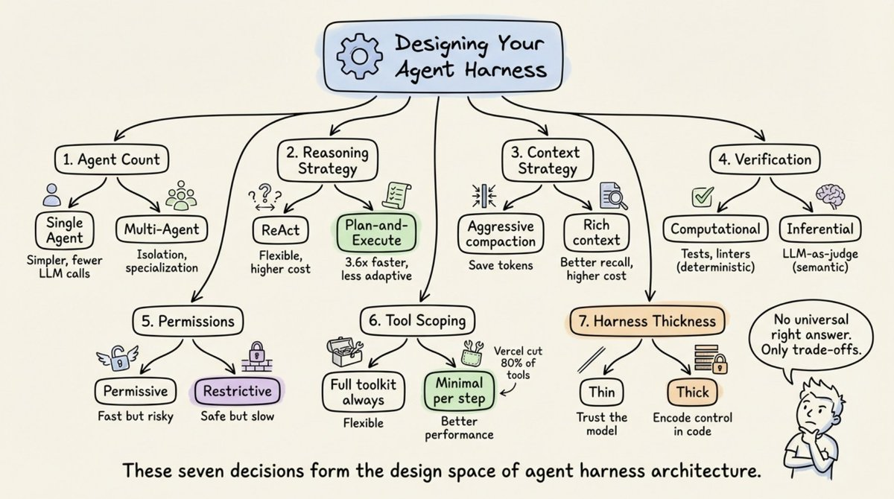
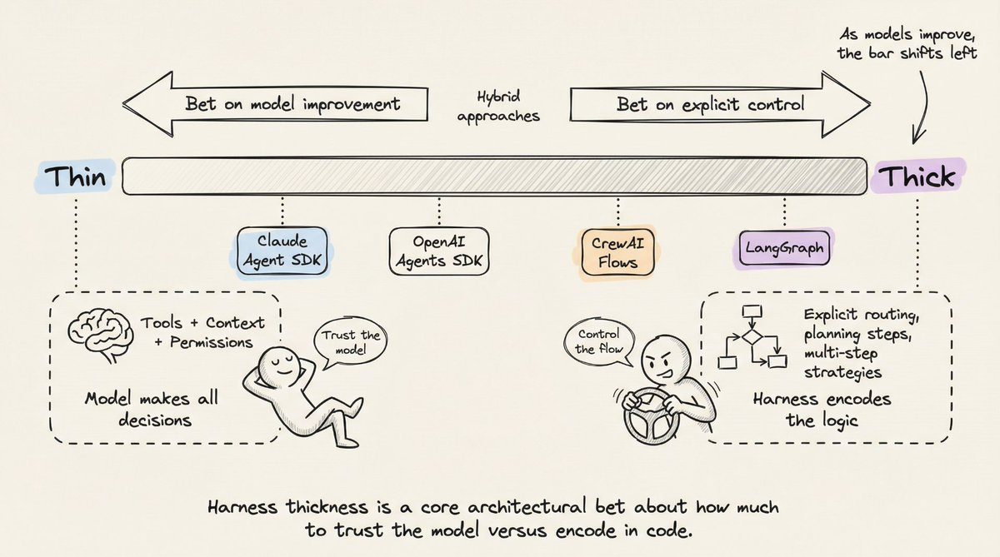
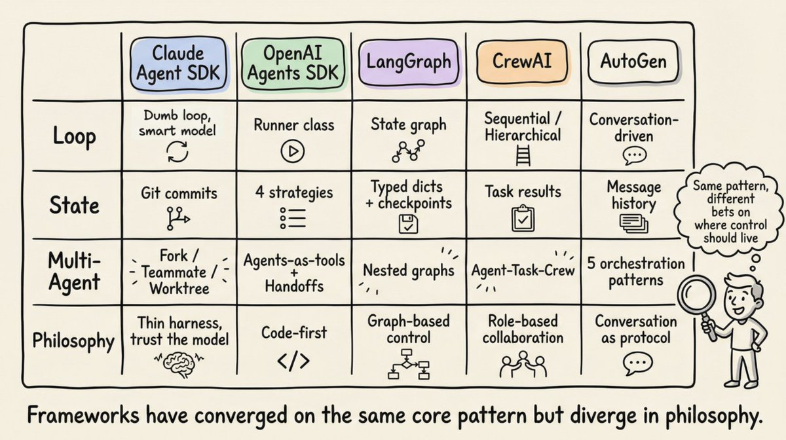
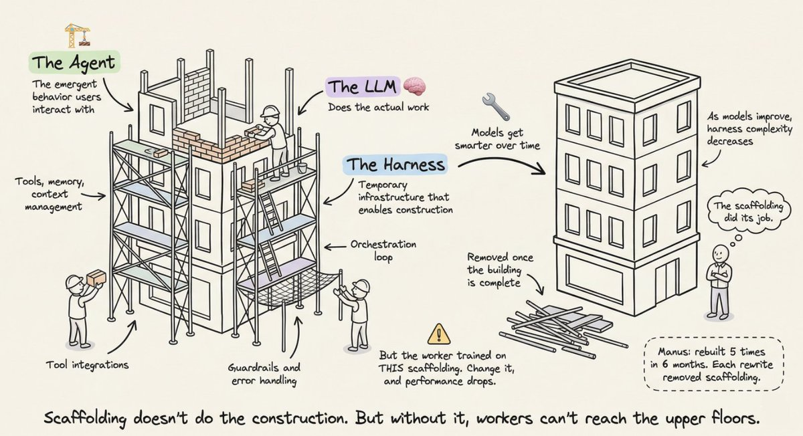
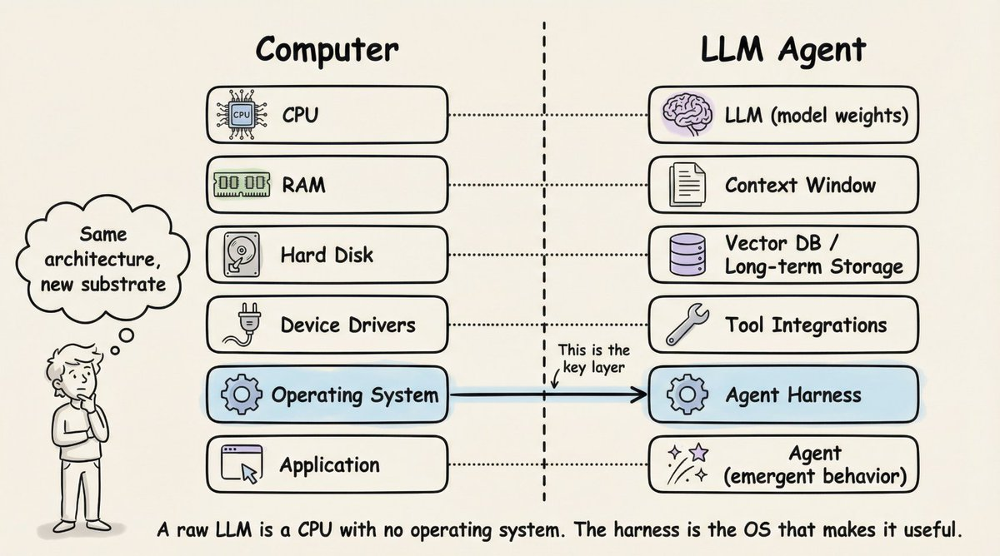
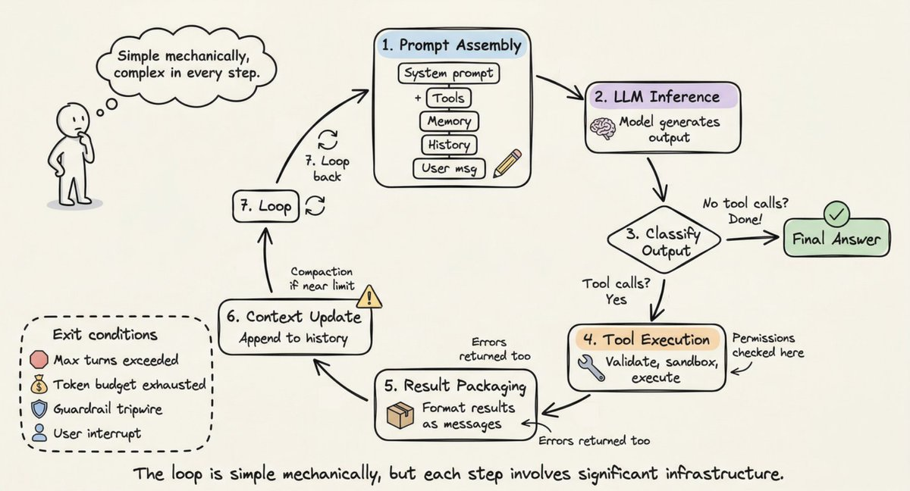
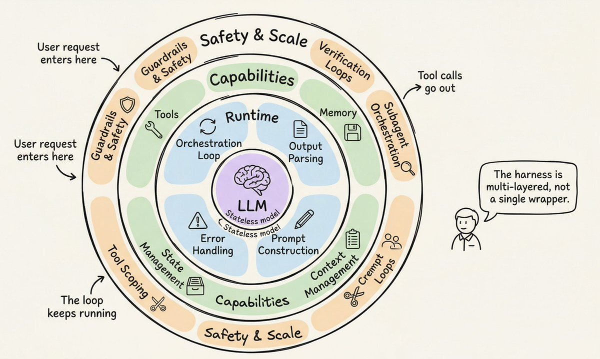

# Agent Harness 剖析

深入解析 Anthropic、OpenAI、Perplexity 和 LangChain 实际上在构建什么。本文覆盖编排循环、工具、记忆、上下文管理，以及把一个无状态 LLM 转变为可用 Agent 所需的一切。

你已经做出了一个聊天机器人。也许你还接入了一个 ReAct 循环和几个工具。它在演示里表现不错。然后你试着构建一个生产级系统，问题就开始出现：模型忘记三步之前做过什么，工具调用静默失败，上下文窗口被垃圾信息填满。

问题不在你的模型，而在模型周围的一切。

LangChain 证明了这一点：他们只改变了包裹 LLM 的基础设施，同一个模型、同一组权重，就从 TerminalBench 2.0 的 30 名开外跃升到第 5 名。另一个研究项目让 LLM 自己优化基础设施，达到了 76.4% 的通过率，超过了人工设计的系统。

这种基础设施现在有了一个名字：agent harness。

# 什么是 Agent Harness？

这个术语在 2026 年初被正式提出，但这个概念早就存在。Harness 指的是包裹 LLM 的完整软件基础设施：编排循环、工具、记忆、上下文管理、状态持久化、错误处理和护栏。Anthropic 的 Claude Code 文档说得很简单：SDK 是“驱动 Claude Code 的 agent harness”。OpenAI 的 Codex 团队也使用同样的表述，明确把 “agent” 和 “harness” 等同起来，用来指让 LLM 变得有用的非模型基础设施。

我很喜欢 LangChain 的 Vivek Trivedy 给出的经典公式：“如果你不是模型，那你就是 harness。”

这里有一个容易让人混淆的区别。“Agent” 是一种涌现出来的行为：用户交互到的那个有目标、会使用工具、能自我纠正的实体。Harness 则是产生这种行为的机器。当有人说“我构建了一个 agent”，他们的意思其实是：他们构建了一个 harness，并把它接到了一个模型上。

Beren Millidge 在 2023 年的文章《Scaffolded LLMs as Natural Language Computers》中把这个类比说得很精确。原始 LLM 就像一颗没有 RAM、没有磁盘、没有 I/O 的 CPU。上下文窗口相当于 RAM，速度快但容量有限。外部数据库相当于磁盘，容量大但速度慢。工具集成相当于设备驱动。Harness 就是操作系统。正如 Millidge 所写：“我们重新发明了冯·诺依曼架构”，因为对任何计算系统来说，这都是一种自然抽象。

# 三层工程

围绕模型，有三层同心圆式的工程：

- Prompt engineering：设计模型接收到的指令。
- Context engineering：管理模型在什么时候看到什么。
- Harness engineering：包含前两者，以及完整的应用基础设施：工具编排、状态持久化、错误恢复、验证循环、安全执行和生命周期管理。

Harness 不是包在 prompt 外面的一层壳。它是让自主 Agent 行为成为可能的完整系统。

# 生产级 Harness 的 12 个组件

综合 Anthropic、OpenAI、LangChain 以及更广泛实践者社区的经验，一个生产级 agent harness 包含 12 个不同组件。我们逐一来看。

## 1. 编排循环

这是心跳。它实现 Thought-Action-Observation，也就是 TAO 循环，也叫 ReAct 循环。循环过程是：组装 prompt，调用 LLM，解析输出，执行工具调用，把结果反馈回去，然后重复，直到任务完成。

从机制上看，它通常只是一个 while 循环。复杂性不在循环本身，而在循环所管理的一切。Anthropic 把他们的运行时描述为一个“笨循环”，所有智能都存在于模型中，harness 只负责管理轮次。

## 2. 工具

工具是 Agent 的手。它们以 schema 的形式定义，包括名称、描述、参数类型，并注入到 LLM 的上下文中，让模型知道有哪些能力可用。工具层负责注册、schema 校验、参数提取、沙盒执行、结果捕获，以及把结果格式化成 LLM 可读的 observation。

Claude Code 提供六类工具：文件操作、搜索、执行、网页访问、代码智能和 subagent 生成。OpenAI 的 Agents SDK 支持函数工具（通过 `@function_tool`）、托管工具（WebSearch、CodeInterpreter、FileSearch）以及 MCP server 工具。

## 3. 记忆

记忆运行在多个时间尺度上。短期记忆是单个会话中的对话历史。长期记忆跨会话持久化：Anthropic 使用项目级 `CLAUDE.md` 文件和自动生成的 `MEMORY.md` 文件；LangGraph 使用按 namespace 组织的 JSON Stores；OpenAI 支持由 SQLite 或 Redis 支撑的 Sessions。

Claude Code 实现了三层层级结构：轻量索引（每条约 150 个字符，始终加载）、按需拉取的详细主题文件，以及只通过搜索访问的原始 transcript。一个关键设计原则是：Agent 把自己的记忆视为“提示”，在行动前仍会根据真实状态进行验证。

## 4. 上下文管理

这是许多 Agent 静默失败的地方。核心问题是 context rot：当关键信息落在上下文窗口中部时，模型性能会下降 30% 以上（Chroma 的研究，以及 Stanford “Lost in the Middle” 发现相互印证）。即使是百万 token 窗口，随着上下文增长，也会出现指令遵循能力下降。

生产级策略包括：

- 压缩：在接近限制时总结对话历史，Claude Code 会保留架构决策和未解决 bug，同时丢弃冗余工具输出。
- Observation masking：JetBrains 的 Junie 会隐藏旧工具输出，但保留工具调用可见。
- 即时检索：维护轻量标识符并动态加载数据，Claude Code 使用 grep、glob、head、tail，而不是加载完整文件。
- Sub-agent 委派：每个 subagent 可以广泛探索，但只返回 1,000 到 2,000 token 的压缩摘要。

Anthropic 的上下文工程指南给出的目标是：找到最小的一组高信号 token，使期望结果出现的概率最大化。

## 5. Prompt 构造

这一步组装模型在每一步实际看到的内容。它是分层的：system prompt、工具定义、记忆文件、对话历史，以及当前用户消息。

OpenAI 的 Codex 使用严格的优先级栈：服务端控制的 system message（最高优先级）、工具定义、developer instructions、user instructions（级联的 `AGENTS.md` 文件，32 KiB 限制），然后是对话历史。

## 6. 输出解析

现代 harness 依赖原生工具调用，模型返回结构化的 `tool_calls` 对象，而不是需要解析的自由文本。Harness 会检查：是否有工具调用？如果有，就执行并继续循环。如果没有工具调用，那就是最终回答。

对于结构化输出，OpenAI 和 LangChain 都支持通过 Pydantic 模型进行 schema 约束。像 `RetryWithErrorOutputParser` 这样的传统方法仍可用于边缘情况，它会把原始 prompt、失败的 completion 和解析错误一起反馈给模型。

## 7. 状态管理

LangGraph 把状态建模为流经图节点的 typed dictionaries，并用 reducers 合并更新。Checkpointing 发生在 super-step 边界，使中断后的恢复和 time-travel 调试成为可能。OpenAI 提供四种互斥策略：应用内存、SDK sessions、服务端 Conversations API，或轻量的 `previous_response_id` 链式传递。Claude Code 采取了另一种方式：用 git commit 作为 checkpoint，用 progress file 作为结构化 scratchpad。

## 8. 错误处理

这件事很重要：一个 10 步流程，如果每一步成功率都是 99%，端到端成功率也只有约 90.4%。错误会迅速累积。

LangGraph 区分四类错误：瞬时错误（带退避重试）、LLM 可恢复错误（作为 ToolMessage 返回，让模型调整）、用户可修复错误（中断并请求人工输入）、意外错误（向上抛出以便调试）。Anthropic 会在工具处理器内捕获失败，并把它们作为错误结果返回，以保持循环继续运行。Stripe 的生产 harness 把重试次数上限设为 2 次。

## 9. 护栏和安全

OpenAI 的 SDK 实现了三层护栏：输入护栏（在第一个 agent 上运行）、输出护栏（在最终输出上运行）和工具护栏（在每次工具调用时运行）。当触发 “tripwire” 机制时，Agent 会立即停止。

Anthropic 在架构上把权限执行和模型推理分离。模型决定尝试什么，工具系统决定什么被允许。Claude Code 独立控制约 40 个离散工具能力，并分三阶段执行：项目加载时建立信任、每次工具调用前检查权限，以及对高风险操作要求用户显式确认。

## 10. 验证循环

这是区分玩具 demo 和生产 Agent 的关键。Anthropic 推荐三种方式：基于规则的反馈（测试、lint、类型检查）、视觉反馈（对 UI 任务使用 Playwright 截图）以及 LLM-as-judge（由另一个 subagent 评估输出）。

Claude Code 的创建者 Boris Cherny 曾指出，给模型一种验证自己工作的方式，可以把质量提升 2 到 3 倍。

## 11. Subagent 编排

Claude Code 支持三种执行模型：Fork（父上下文的字节级相同副本）、Teammate（独立 terminal pane，通过基于文件的 mailbox 通信）和 Worktree（拥有自己的 git worktree，每个 agent 一条隔离分支）。OpenAI 的 SDK 支持 agents-as-tools（专家处理有边界的子任务）和 handoffs（专家接管完整控制）。LangGraph 把 subagent 实现为嵌套状态图。

# 循环如何运转：逐步 walkthrough

现在你已经了解这些组件，我们来追踪它们在单个循环中如何协同工作。

Step 1（Prompt Assembly）：Harness 构造完整输入：system prompt、工具 schema、记忆文件、对话历史和当前用户消息。重要上下文会被放在 prompt 的开头和结尾，也就是 “Lost in the Middle” 发现所提示的位置。

Step 2（LLM Inference）：组装好的 prompt 被发送到模型 API。模型生成输出 token：文本、工具调用请求，或两者都有。

Step 3（Output Classification）：如果模型只生成文本且没有工具调用，循环结束。如果它请求了工具调用，则进入执行阶段。如果请求了 handoff，则更新当前 agent 并重新开始。

Step 4（Tool Execution）：对每个工具调用，harness 校验参数、检查权限、在沙盒环境中执行，并捕获结果。只读操作可以并发运行；会修改状态的操作串行运行。

Step 5（Result Packaging）：工具结果被格式化成 LLM 可读的消息。错误会被捕获并作为错误结果返回，让模型可以自我纠正。

Step 6（Context Update）：结果被追加到对话历史。如果接近上下文窗口限制，harness 会触发压缩。

Step 7（Loop）：回到 Step 1。重复，直到终止。

终止条件是分层的：模型生成没有工具调用的响应、超过最大轮次、token 预算耗尽、护栏 tripwire 触发、用户中断，或返回安全拒绝。一个简单问题可能只需要 1 到 2 轮。一个复杂重构任务可能会跨很多轮串联几十次工具调用。

对于跨越多个上下文窗口的长时间任务，Anthropic 开发了一种两阶段 “Ralph Loop” 模式：Initializer Agent 设置环境（初始化脚本、进度文件、功能列表、初始 git commit），然后每个后续会话中的 Coding Agent 会读取 git log 和进度文件来定位自己，选择最高优先级的未完成功能，开始工作，提交，并写入摘要。文件系统为跨上下文窗口提供连续性。

# 真实框架如何实现这种模式

Anthropic 的 Claude Agent SDK 通过一个 `query()` 函数暴露 harness，该函数创建 agentic loop，并返回一个流式消息的 async iterator。运行时是一个“笨循环”。所有智能都在模型中。Claude Code 使用 Gather-Act-Verify 循环：收集上下文（搜索文件、阅读代码）、采取行动（编辑文件、运行命令）、验证结果（跑测试、检查输出），然后重复。

OpenAI 的 Agents SDK 通过 Runner class 实现 harness，包含三种模式：async、sync 和 streamed。SDK 是 “code-first” 的：工作流逻辑用原生 Python 表达，而不是图 DSL。Codex harness 在此之上扩展为三层架构：Codex Core（agent 代码和运行时）、App Server（双向 JSON-RPC API）以及客户端表面（CLI、VS Code、web app）。所有表面共享同一个 harness，这就是为什么“Codex 模型在 Codex 表面上比在通用聊天窗口里感觉更好”。

LangGraph 把 harness 建模为显式状态图。两个节点（`llm_call` 和 `tool_node`）通过条件边连接：如果存在工具调用，就路由到 `tool_node`；如果没有，就路由到 END。LangGraph 从 LangChain 的 `AgentExecutor` 演化而来，后者在 v0.2 中被废弃，因为它难以扩展且缺乏多 Agent 支持。LangChain 的 Deep Agents 明确使用 “agent harness” 这个术语：内置工具、规划（`write_todos` 工具）、用于上下文管理的文件系统、subagent 生成和持久记忆。

CrewAI 实现了基于角色的多 Agent 架构：Agent（包裹 LLM 的 harness，由 role、goal、backstory 和 tools 定义）、Task（工作单元）和 Crew（Agent 集合）。CrewAI 的 Flows 层增加了一个“确定性骨架，在关键处注入智能”，负责路由和验证，而 Crews 负责自主协作。

AutoGen（正在演化为 Microsoft Agent Framework）开创了 conversation-driven orchestration。它的三层架构（Core、AgentChat、Extensions）支持五种编排模式：顺序、并发（fan-out/fan-in）、群聊、handoff 和 magentic（一个 manager agent 维护动态 task ledger 来协调专家）。

# 脚手架隐喻

脚手架这个隐喻不是装饰性的，而是精确的。建筑脚手架是一种临时基础设施，让工人能够建造他们原本够不到的结构。它不负责施工，但没有它，工人就无法到达更高的楼层。

关键洞见是：建筑完成后，脚手架会被移除。随着模型改进，harness 的复杂度应该下降。Manus 在六个月内重写了五次，每次重写都移除了复杂性。复杂的工具定义变成了通用 shell 执行。“管理 agent” 变成了简单的结构化 handoff。

这指向了共同演化原则：模型现在会在特定 harness 参与的情况下进行后训练。Claude Code 的模型学会了使用它训练时对应的特定 harness。由于这种紧耦合，改变工具实现可能会降低性能。

Harness 设计的“面向未来测试”是：如果模型变强后，性能能继续提升，而不需要增加 harness 复杂度，那么这个设计就是稳健的。

# 定义每个 Harness 的七个决策

每个 harness 架构师都会面对七个选择：

1. 单 Agent 还是多 Agent。Anthropic 和 OpenAI 都说：先最大化单个 Agent。多 Agent 系统会增加开销，包括额外的 LLM 路由调用，以及 handoff 时的上下文损失。只有在工具负载超过大约 10 个重叠工具，或任务领域明显分离时，才进行拆分。
2. ReAct 还是 plan-and-execute。ReAct 在每一步交错推理和行动，灵活但每步成本更高。Plan-and-execute 把规划和执行分离。LLMCompiler 报告称，相比顺序 ReAct，它带来了 3.6 倍提速。
3. 上下文窗口管理策略。五种生产级方法：按时间清理、对话总结、observation masking、结构化笔记和 sub-agent 委派。ACON 研究显示，通过优先保留推理轨迹而不是原始工具输出，可以减少 26% 到 54% 的 token，同时保持 95% 以上准确率。
4. 验证循环设计。计算式验证（测试、lint）提供确定性真值。推断式验证（LLM-as-judge）能捕捉语义问题，但会增加延迟。Martin Fowler 的 Thoughtworks 团队把这描述为 guides（前馈，在行动前引导）与 sensors（反馈，在行动后观察）。
5. 权限和安全架构。宽松模式速度快但风险高，会自动批准大多数操作；严格模式更安全但更慢，每个操作都需要批准。选择取决于部署环境。
6. 工具范围策略。更多工具通常意味着更差表现。Vercel 从 v0 移除了 80% 的工具，结果反而更好。Claude Code 通过 lazy loading 实现了 95% 的上下文减少。原则是：只暴露当前步骤所需的最小工具集。
7. Harness 厚度。多少逻辑放在 harness 里，多少留给模型。Anthropic 押注薄 harness 和模型进步。基于图的框架押注明确控制。随着新模型版本内化相应能力，Anthropic 会定期从 Claude Code 的 harness 中删除规划步骤。

# Harness 就是产品

两个产品即使使用完全相同的模型，也可能仅因为 harness 设计不同而产生巨大性能差异。TerminalBench 的证据很清楚：只改变 harness，就能让 Agent 排名移动 20 多个名次。

Harness 不是一个已经解决的问题，也不是一个商品化层。真正困难的工程就在这里：把上下文当成稀缺资源来管理，设计能在失败累积前捕捉问题的验证循环，构建既能提供连续性又不产生幻觉的记忆系统，并在架构上判断到底要构建多少脚手架、又该把多少留给模型。

随着模型进步，这个领域正在走向更薄的 harness。但 harness 本身不会消失。即使是最强大的模型，也需要某种东西来管理它的上下文窗口、执行它的工具调用、持久化它的状态，并验证它的工作。

下次你的 Agent 失败时，不要先责怪模型。看看 harness。

就到这里！

如果你喜欢这篇文章：

来找我 → @akshay_pachaar ✔️

我每天都会分享关于 AI、机器学习和 vibe coding 最佳实践的教程与见解。
