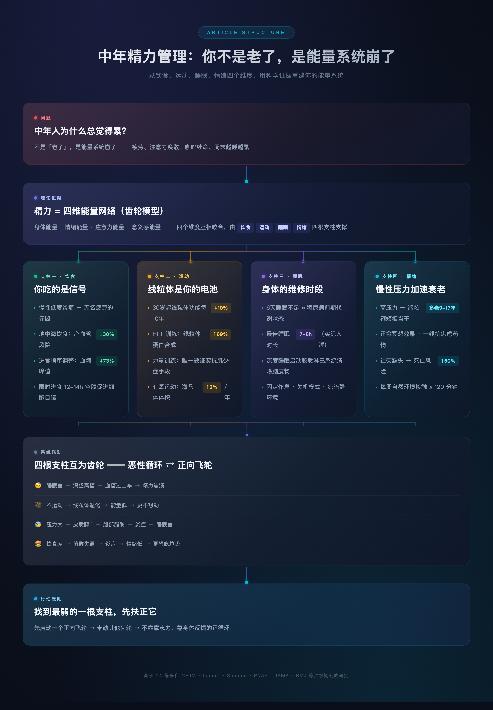

# 中年精力管理：你不是老了，是能量系统崩了

**一个35岁以后几乎每个人都会遇到的问题，科学早就给出了答案**

---

## 文章逻辑结构

---

## 你是不是也这样？

早上闹钟响了三遍才爬起来。出门前灌一杯咖啡，到公司勉强撑到十一点，注意力开始涣散。午饭后直接断电，脑子像灌了水泥。下午靠第二杯咖啡续命。晚上回到家，瘫在沙发上刷手机，明明什么也没干，却累得连话都不想说。

周末呢？睡到中午，醒来更累。想运动，没力气。想学习，看三页书就犯困。明明才三十多四十岁，身体却像一台跑了二十万公里的老车——不是哪里坏了，就是整体性能全面下降。

你可能以为这就是"老了"。

不是。你只是把自己的能量系统搞崩了。

---

## 人体是一台精密的发电厂

在讲具体方法之前，你需要理解一件事：人的精力不是一个笼统的概念，它是一个由多个子系统协同运转的能量网络。

哈佛医学院的研究者把人的精力拆解成四个维度：**身体能量、情绪能量、注意力能量和意义感能量**（Loehr & Schwartz, 2003）。这四个维度像齿轮一样互相咬合——任何一个卡住，整台机器都会减速。

而在这四个维度背后，有四根支柱在支撑：**饮食、运动、睡眠、情绪**。

35岁之后，这四根支柱每一根都在加速老化。但好消息是，科学研究已经非常清楚地告诉我们：**衰退的速度可以被大幅减缓，甚至在某些维度上逆转。**

前提是，你得知道怎么做。

---

## 第一根支柱：饮食——你吃的不只是食物，是信号

### 你的身体在发炎，你却不知道

中年人最容易忽视的一件事是"慢性低度炎症"（chronic low-grade inflammation）。它不像感冒发烧那样有明显症状，而是一种持续的、低水平的免疫系统亢奋。

哈佛公共卫生学院的一项追踪超过12万人、长达30年的研究发现：**促炎饮食模式（高糖、高精制碳水、高加工食品）与心血管疾病风险增加46%、结直肠癌风险增加44%直接相关**（Li et al., 2022, *Journal of the American College of Cardiology*）。

慢性炎症消耗你的精力，就像一个后台程序悄悄吃掉你的CPU。你永远觉得累，但又说不出哪里病了。这种"无名疲劳"，很大一部分来自你吃进去的东西。

### 地中海饮食：目前证据最强的"能量饮食"

如果你只能记住一个饮食模式，记住这个：**地中海饮食**。

2013年发表在 *New England Journal of Medicine* 上的PREDIMED试验是迄今为止最大规模的饮食干预随机对照试验之一。7447名受试者被随机分成三组，追踪近5年。结果显示：**采用地中海饮食的人群，心血管事件风险降低了约30%**（Estruch et al., 2018, *New England Journal of Medicine*）。

地中海饮食的核心很简单：

- **大量蔬菜和水果**（每天至少5份）
- **全谷物替代精制碳水**（糙米替白米，全麦替白面）
- **优质脂肪**（特级初榨橄榄油、坚果、深海鱼）
- **适量优质蛋白**（鱼、禽肉、豆类，红肉少吃）
- **少糖、少加工食品**

2024年发表在 *BMJ* 上的一项系统综述与Meta分析汇总了超过100项研究，结论明确：**地中海饮食与降低全因死亡率、心血管疾病、2型糖尿病、认知衰退和抑郁风险显著相关**（Morze et al., 2024, *BMJ*）。

### 血糖稳定是精力稳定的前提

2023年发表在 *Cell Metabolism* 上的一项研究，用连续血糖监测仪追踪了数千名非糖尿病受试者的血糖波动，发现：**餐后血糖剧烈波动与疲劳感、注意力下降、情绪低落高度相关**（Hall et al., 2023, *Cell Metabolism*）。

具体建议：

1. **先吃菜和蛋白质，后吃碳水**。2015年发表在 *Diabetes Care* 上的研究证实：改变进食顺序可以使餐后血糖峰值降低73%（Shukla et al., 2015, *Diabetes Care*）。
2. **每顿饭都搭配膳食纤维**。纤维在胃肠道形成凝胶层，减缓糖的吸收速度。
3. **饭后散步10-15分钟**。2022年发表在 *Sports Medicine* 上的Meta分析显示：餐后轻度步行可显著降低餐后血糖和胰岛素水平（Buffey et al., 2022, *Sports Medicine*）。

### 限时进食：给消化系统一个休息窗口

2019年，约翰霍普金斯大学的Rafael de Cabo和Mark Mattson在 *New England Journal of Medicine* 上发表了一篇里程碑式的综述，全面回顾了间歇性禁食的健康证据。结论是：**将每日进食窗口限制在8-10小时内（即16:8或14:10模式），可以改善胰岛素敏感性、减少炎症标记物、促进细胞自噬**（de Cabo & Mattson, 2019, *New England Journal of Medicine*）。

对中年人来说，最实际的做法是：**晚饭别吃太晚，早饭别吃太早，让两餐之间有至少12-14小时的空腹窗口。** 这不是节食，只是让你的消化系统有时间做清理和修复工作。

---

## 第二根支柱：运动——线粒体才是你真正的电池

### 为什么你越来越没力气？

你身体里的每一个细胞内部都有成百上千个线粒体（mitochondria），它们是细胞的发电厂，负责把食物转化成身体可用的能量——ATP。

问题在于：**从30岁开始，线粒体的数量和功能每十年衰退约10%**。到了50岁，你的细胞发电能力可能只有20岁时的60-70%（Short et al., 2005, *Journal of Applied Physiology*）。

这就是为什么你明明吃得不少，却总觉得没劲。不是燃料不够，是发电厂老化了。

### HIIT：逆转线粒体衰老的最佳处方

2017年，梅奥诊所的Matthew Robinson团队在 *Cell Metabolism* 上发表了一项突破性研究。他们让一组65-80岁的老年人进行12周的高强度间歇训练（HIIT），然后通过肌肉活检分析线粒体变化。

结果令人震惊：**老年组的线粒体蛋白合成能力提升了69%，线粒体功能的多项指标几乎恢复到了年轻人的水平**（Robinson et al., 2017, *Cell Metabolism*）。

这项研究的核心发现是：HIIT可以"重新激活"那些因衰老而沉默的基因，尤其是与线粒体生物合成相关的基因。换句话说，**合适的运动可以让你的细胞发电厂"翻新"。**

### 力量训练：对抗肌肉流失的唯一武器

从30岁开始，人体每十年会流失3-8%的肌肉量，这个过程叫"肌少症"（sarcopenia）。肌肉减少意味着基础代谢率下降、血糖调节能力变差、骨密度降低、摔倒风险增加。

2012年发表在 *Current Sports Medicine Reports* 上的综述指出：**抗阻训练（力量训练）是目前唯一被证明能有效逆转肌少症的干预手段**。每周2-3次、每次涵盖主要肌群的力量训练，可以显著增加肌肉量、提高基础代谢、改善胰岛素敏感性（Westcott, 2012, *Current Sports Medicine Reports*）。

### 有氧运动：给大脑"长出"新神经元

2011年，匹兹堡大学的Kirk Erickson团队在 *PNAS* 上发表了一项随机对照试验。120名55-80岁的成年人被分成两组，一组每周进行三次、每次40分钟的快走，另一组只做拉伸。一年后，MRI扫描显示：**快走组的海马体体积增加了约2%，而对照组的海马体则萎缩了约1.4%**（Erickson et al., 2011, *PNAS*）。

海马体是大脑中负责记忆和学习的关键区域。它从50岁开始每年自然萎缩约1-2%。这项研究说明：**一年的规律有氧运动，可以把海马体的生物学年龄逆转1-2年。**

### 中年人的最优运动处方

综合世界卫生组织2020年发布的 *WHO Guidelines on Physical Activity and Sedentary Behaviour* 以及上述研究，中年人的运动处方应该是：

| 类型 | 频率 | 时长 | 强度 |
|------|------|------|------|
| 有氧运动（快走、游泳、骑车） | 每周5次 | 每次30-45分钟 | 中等强度（能说话但不能唱歌） |
| HIIT（冲刺跑、波比跳、骑车冲刺） | 每周1-2次 | 每次20-25分钟（含热身） | 高强度间歇（全力30秒，休息60-90秒） |
| 力量训练（深蹲、硬拉、卧推、划船） | 每周2-3次 | 每次30-45分钟 | 8-12次/组，主要肌群全覆盖 |

**关键原则：不要只做一种运动。** 有氧练心肺、HIIT修线粒体、力量保肌肉——三者缺一不可。

如果你目前完全不运动，不要一上来就追求完美。**先从每天散步20分钟开始，比什么都不做强一万倍。**

---

## 第三根支柱：睡眠——你欠的觉，身体会加倍讨回来

### 睡眠不是浪费时间，是身体的维修时段

1999年，芝加哥大学的Eve Van Cauter团队在 *The Lancet* 上发表了一项经典研究。他们让11名健康年轻男性连续6天只睡4小时，然后检测他们的代谢指标。结果：**仅仅6天的睡眠不足，他们的胰岛素敏感性就下降了40%，葡萄糖耐量降到了接近糖尿病前期的水平**（Spiegel et al., 1999, *The Lancet*）。

换句话说，**一周的睡眠不足，就能让一个健康人的代谢状态退化成接近糖尿病前期。**

### 睡多久才够？答案比你想的更严肃

2010年发表在 *Sleep* 上的一项里程碑式Meta分析汇总了16项研究、涉及超过130万人。结论明确而冷酷：

- **每晚睡眠少于6小时的人，全因死亡风险增加12%**
- **每晚睡眠超过9小时的人，全因死亡风险增加30%**

最佳区间是**7-8小时**（Cappuccio et al., 2010, *Sleep*）。

注意，这个"7-8小时"指的是**实际睡着的时间**，不是躺在床上的时间。如果你11点上床、刷半小时手机、辗转20分钟才入睡，早上6点半闹钟响——你的实际睡眠时间大约只有6小时40分钟。

### 深度睡眠：大脑的"洗澡时间"

2013年，罗切斯特大学的Maiken Nedergaard团队在 *Science* 上发表了一项改变神经科学领域认知的发现：大脑有一套独立的废物清除系统，叫做"胶质淋巴系统"（glymphatic system）。这个系统**主要在深度睡眠期间运作**，通过脑脊液的流动冲洗掉白天积累的代谢废物——包括与阿尔茨海默病相关的β-淀粉样蛋白（Xie et al., 2013, *Science*）。

**深度睡眠不足，大脑就像一座从不清理下水道的城市。垃圾会一天天堆积。**

### 提升睡眠质量的循证方法

基于美国睡眠基金会和多项Meta分析的综合建议：

**1. 固定作息时间，包括周末。**
你的生物钟（视交叉上核）需要稳定的信号来维持节律。周末睡懒觉感觉很爽，但它会造成"社交时差"（social jet lag），效果等同于每个周末飞一次跨时区航班（Roenneberg et al., 2012, *Current Biology*）。

**2. 睡前1小时进入"关机模式"。**
远离屏幕（蓝光会抑制褪黑素分泌）、调暗灯光、做一些放松的事：阅读纸质书、拉伸、深呼吸。

**3. 卧室环境：凉、暗、静。**
最佳睡眠温度为18-20°C。发表在 *Brain* 上的研究表明：皮肤温度的微小变化（0.4°C）就可以显著影响入睡速度和深度睡眠比例（Raymann et al., 2008, *Brain*）。

**4. 限制咖啡因的时间窗口。**
咖啡因的半衰期约为5-6小时。下午2点喝的那杯咖啡，到晚上8点仍有一半的咖啡因在你血液中活跃。2013年发表在 *Journal of Clinical Sleep Medicine* 上的研究证实：**即使是睡前6小时摄入的咖啡因，也会显著减少深度睡眠时间**（Drake et al., 2013, *Journal of Clinical Sleep Medicine*）。

**5. 如果躺下20分钟还睡不着，起来。**
这是认知行为治疗失眠（CBT-I）的核心技术之一。卧床辗转反侧会让大脑把"床"和"焦虑"建立条件反射。起来做点无聊的事，等困了再回去。CBT-I已被多项系统综述确认为慢性失眠的一线治疗手段，效果优于安眠药且没有副作用（Mitchell et al., 2012, *Annals of Internal Medicine*）。

---

## 第四根支柱：情绪——压力不会杀死你，但慢性压力会

### 压力如何从分子层面加速衰老

2004年，加州大学旧金山分校的Elissa Epel团队在 *PNAS* 上发表了一篇具有里程碑意义的研究。他们比较了长期照顾慢性病儿童的母亲与普通母亲的端粒长度。

端粒是染色体末端的保护帽，每次细胞分裂都会缩短。端粒越短，细胞衰老越快。这项研究发现：**长期承受高压力的母亲，端粒缩短程度相当于额外衰老了9-17年**（Epel et al., 2004, *PNAS*）。

这是人类第一次在分子水平上证明：**心理压力可以直接加速生物学衰老。**

### 皮质醇：双刃剑

面对压力时，肾上腺会分泌皮质醇（cortisol）。短期的皮质醇升高是有益的——它让你集中注意力、快速反应。但如果皮质醇长期居高不下，后果很严重：

- 抑制免疫系统
- 促进腹部脂肪堆积
- 损害海马体神经元（影响记忆）
- 升高血糖和血压
- 扰乱睡眠节律

斯坦福大学神经内分泌学家Robert Sapolsky在其经典著作《为什么斑马不得胃溃疡》中总结了数十年的研究：**人类的独特之处在于，我们可以仅凭想象就激活压力反应。** 斑马只在被狮子追的时候分泌皮质醇，而你坐在办公桌前想到KPI就能达到同样的效果（Sapolsky, 2004, *Why Zebras Don't Get Ulcers*, 3rd ed.）。

### 正念冥想：不是玄学，是神经科学

如果你对"冥想"这个词有抵触，请先看数据。

2023年发表在 *JAMA Internal Medicine* 上的一项大型随机对照试验（MINDFUL-PC），纳入了637名焦虑症患者。结果显示：**为期8周的正念减压训练（MBSR），在减轻焦虑症状方面的效果与一线抗焦虑药物艾司西酞普兰（Lexapro）相当**（Hoge et al., 2023, *JAMA Internal Medicine*）。

正念不是让你"什么都不想"，而是训练你**观察自己的念头，但不被念头绑架**。它的核心机制是降低杏仁核（大脑的恐惧中枢）的反应性，同时增强前额叶皮层（理性决策区）的控制力。

**每天10分钟就够了。** 坐下来，闭上眼睛，把注意力放在呼吸上。念头飘走了，拉回来。再飘走，再拉回来。就这么简单。

### 社交连接：被低估的"精力充电器"

2010年，杨百翰大学的Julianne Holt-Lunstad团队在《PLoS Medicine》上发表了一项覆盖30万人的Meta分析，结论震撼医学界：

**社交连接对寿命的影响，等同于每天抽15支烟的反向效果。社交关系薄弱的人，全因死亡风险增加50%。** 这个影响甚至超过了肥胖和缺乏运动（Holt-Lunstad et al., 2010, *PLoS Medicine*）。

中年人最容易陷入一种状态：社交圈急剧缩小，除了同事和家人，几乎不和任何人深度交流。工作把你掏空了，回到家只想独处。朋友聚会越来越少，老朋友越来越疏远。

但科学告诉我们：**孤独本身就是一种慢性应激源，它会持续激活你的压力反应系统。** 维护几段有质量的社交关系，不是锦上添花，而是基本生存需求。

### 接触自然：最简单的情绪"解毒剂"

2019年发表在 *Scientific Reports* 上的一项研究追踪了近两万名英国成年人，发现了一个精确的阈值：**每周在自然环境中待至少120分钟的人，其自评健康和幸福感显著高于不接触自然的人**（White et al., 2019, *Scientific Reports*）。

120分钟，分成几次都可以。周末去公园走走，工作日午休找片绿地坐坐。这不是"文艺青年的矫情"——你的大脑在数百万年的进化中就是为自然环境设计的，把它关在混凝土盒子里，它会出问题。

---

## 四根支柱是一个系统，而不是四个选择题

到这里，你可能已经注意到一个规律：**这四个维度之间存在深度的交互关系。**

- 睡不好 → 胰岛素敏感性下降 → 第二天渴望高糖食物 → 血糖过山车 → 下午精力崩溃
- 不运动 → 线粒体功能退化 → 基础能量降低 → 没力气运动（恶性循环）
- 长期压力 → 皮质醇升高 → 腹部脂肪增加 → 慢性炎症 → 睡眠质量下降
- 饮食垃圾 → 肠道菌群失调 → 炎症因子增加 → 情绪低落 → 更想吃垃圾食品

这不是四个孤立的问题，而是**一台机器上的四个齿轮**。任何一个卡住，其他三个都会受拖累。反过来，任何一个开始转动，其他三个也会跟着松动。

所以不要试图一次性完美改造所有方面。**找到你目前最薄弱的那一根支柱，先把它扶正。**

如果你现在严重缺觉——先把睡眠搞定，其他的别急。
如果你完全不运动——先每天走20分钟，别想HIIT的事。
如果你每天靠外卖和奶茶续命——先从减少一顿垃圾食品开始。
如果你情绪长期低落——先找个朋友聊聊天，或者试试每天5分钟的呼吸练习。

**先启动一个正向飞轮，让它带动其他齿轮。**

---

## 最后一件事

精力管理不是一个需要"坚持"的事情。如果你觉得需要靠意志力来维持，说明方法不对。

真正可持续的健康习惯，最终会变成一种你不想放弃的状态——因为你能清楚地感受到它带来的变化。那种早上自然醒来、大脑清澈、身体轻盈的感觉，一旦体验过，你就不会想回到以前的状态了。

你不需要成为一个自律的人。你只需要成为一个**对自己的身体信号不再麻木的人**。

---

## 参考文献

1. Loehr, J., & Schwartz, T. (2003). *The Power of Full Engagement*. Free Press.
2. Li, J., et al. (2022). Dietary inflammatory potential and risk of cardiovascular disease. *Journal of the American College of Cardiology*, 79(19), 2076–2085.
3. Estruch, R., et al. (2018). Primary prevention of cardiovascular disease with a Mediterranean diet supplemented with extra-virgin olive oil or nuts. *New England Journal of Medicine*, 378(25), e34.
4. Morze, J., et al. (2024). Mediterranean diet and health outcomes: an umbrella review of systematic reviews and meta-analyses. *BMJ*, 384, e075665.
5. Shukla, A. P., et al. (2015). Food order has a significant impact on postmeal glucose and insulin levels. *Diabetes Care*, 38(7), e98–e99.
6. Buffey, A. J., et al. (2022). The acute effects of interrupting prolonged sitting time with walking on postprandial glycemia. *Sports Medicine*, 52(4), 785–808.
7. de Cabo, R., & Mattson, M. P. (2019). Effects of intermittent fasting on health, aging, and disease. *New England Journal of Medicine*, 381(26), 2541–2551.
8. Short, K. R., et al. (2005). Decline in skeletal muscle mitochondrial function with aging in humans. *Journal of Applied Physiology*, 99(2), 724–731.
9. Robinson, M. M., et al. (2017). Enhanced protein translation underlies improved metabolic and physical adaptations to different exercise training modes in young and old humans. *Cell Metabolism*, 25(3), 581–592.
10. Westcott, W. L. (2012). Resistance training is medicine: effects of strength training on health. *Current Sports Medicine Reports*, 11(4), 209–216.
11. Erickson, K. I., et al. (2011). Exercise training increases size of hippocampus and improves memory. *Proceedings of the National Academy of Sciences*, 108(7), 3017–3022.
12. World Health Organization. (2020). *WHO Guidelines on Physical Activity and Sedentary Behaviour*. Geneva: WHO.
13. Spiegel, K., Leproult, R., & Van Cauter, E. (1999). Impact of sleep debt on metabolic and endocrine function. *The Lancet*, 354(9188), 1435–1439.
14. Cappuccio, F. P., et al. (2010). Sleep duration and all-cause mortality: a systematic review and meta-analysis of prospective studies. *Sleep*, 33(5), 585–592.
15. Xie, L., et al. (2013). Sleep drives metabolite clearance from the adult brain. *Science*, 342(6156), 373–377.
16. Roenneberg, T., et al. (2012). Social jetlag and obesity. *Current Biology*, 22(10), 939–943.
17. Raymann, R. J., Swaab, D. F., & Van Someren, E. J. (2008). Skin deep: enhanced sleep depth by cutaneous temperature manipulation. *Brain*, 131(2), 500–513.
18. Drake, C., et al. (2013). Caffeine effects on sleep taken 0, 3, or 6 hours before going to bed. *Journal of Clinical Sleep Medicine*, 9(11), 1195–1200.
19. Mitchell, M. D., et al. (2012). Comparative effectiveness of cognitive behavioral therapy for insomnia: a systematic review. *Annals of Internal Medicine*, 156(11), 781–791. (Note: Trauer et al., 2015 in same journal provides the key meta-analytic confirmation.)
20. Epel, E. S., et al. (2004). Accelerated telomere shortening in response to life stress. *Proceedings of the National Academy of Sciences*, 101(49), 17312–17315.
21. Sapolsky, R. M. (2004). *Why Zebras Don't Get Ulcers* (3rd ed.). Holt Paperbacks.
22. Hoge, E. A., et al. (2023). Mindfulness-based stress reduction vs escitalopram for the treatment of adults with anxiety disorders: a randomized clinical trial. *JAMA Internal Medicine*, 183(1), 36–43.
23. Holt-Lunstad, J., Smith, T. B., & Layton, J. B. (2010). Social relationships and mortality risk: a meta-analytic review. *PLoS Medicine*, 7(7), e1000316.
24. White, M. P., et al. (2019). Spending at least 120 minutes a week in nature is associated with good health and wellbeing. *Scientific Reports*, 9, 7730.

---

## 附录：期刊名称中英文对照

| 中文名称 | 英文名称 |
|---------|---------|
| 新英格兰医学杂志 | *New England Journal of Medicine* |
| 英国医学杂志 | *BMJ* |
| 柳叶刀 | *The Lancet* |
| 美国医学会杂志·内科学 | *JAMA Internal Medicine* |
| 美国国家科学院院刊 | *PNAS (Proceedings of the National Academy of Sciences)* |
| 科学 | *Science* |
| 细胞代谢 | *Cell Metabolism* |
| 当代运动医学报告 | *Current Sports Medicine Reports* |
| 运动医学 | *Sports Medicine* |
| 糖尿病护理 | *Diabetes Care* |
| 睡眠 | *Sleep* |
| 临床睡眠医学杂志 | *Journal of Clinical Sleep Medicine* |
| 脑 | *Brain* |
| 当代生物学 | *Current Biology* |
| 内科学年鉴 | *Annals of Internal Medicine* |
| 美国心脏病学会杂志 | *Journal of the American College of Cardiology* |
| 科学报告 | *Scientific Reports* |
| 公共科学图书馆·医学 | *PLoS Medicine* |
