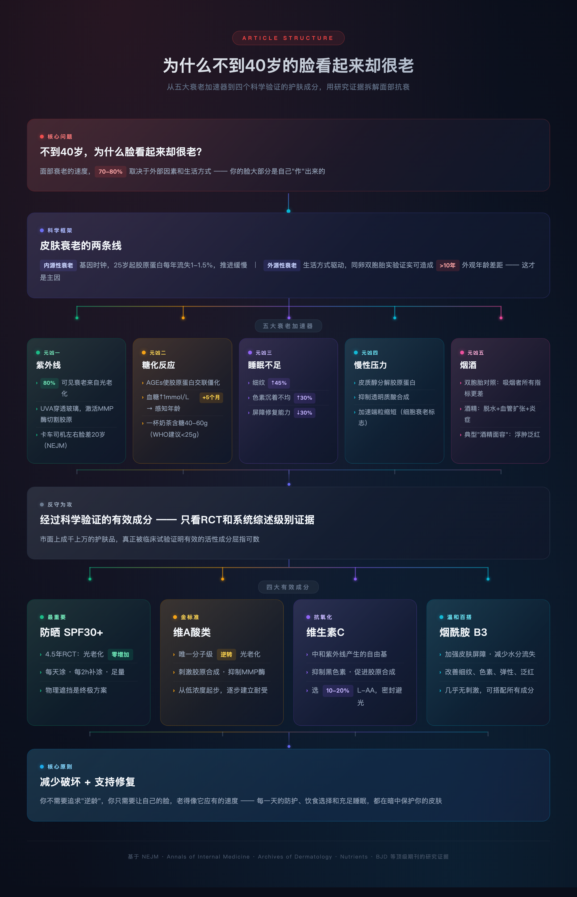

# 为什么不到40岁的脸看起来却很老

这几天我第一次很认真地照了一下镜子，原来我的脸已经老了这么多，我不得不面对一件事就是衰老，一张老脸以前是玩笑，现在这就是现实。我对着AI一通输入，就想搞清楚我为什么成为这个样子。

**你的脸不会说谎，但它可能在替你的生活习惯买单**

---

> **TLDR — 不想看长文？这里是结论：**
>
> 你脸上 80% 的皱纹、色斑、松弛都是紫外线造成的，剩下的主要帮凶是高糖饮食、睡眠不足、慢性压力和烟酒。
>
> **每天只做这几件事，就够了：**
> 1. **防晒** — 每天涂 SPF30+ 广谱防晒霜，每 2 小时补涂，出门戴帽子墨镜
> 2. **晚上用维A酸类产品**（视黄醇/维A酸）— 唯一被证明能在分子层面逆转光老化的成分
> 3. **早上用维生素C精华** — 抗氧化，搭配防晒效果翻倍
> 4. **少糖** — 减少奶茶甜食，先吃菜和肉再吃主食，餐后散步 15 分钟
> 5. **睡够 7-8 小时** — 皮肤修复在深度睡眠时发生，熬夜等于关掉修复车间
> 6. **不吸烟，少喝酒**
>
> 想知道为什么？往下看。

---

## 文章逻辑结构

---

## 照片不骗人

同学聚会，合影一拍，发到群里。你突然发现：明明同龄人，有人看起来像二十八九，有人却像奔五的。

法令纹深得能夹住一根筷子，眼下暗沉像没睡过觉，皮肤松垮得像泄了气——你心里嘀咕：他/她才三十几啊。

然后你不敢再看自己那张脸。

这种"未老先衰"不是玄学，也不是简单的基因好坏。皮肤科学过去二十年的研究已经非常清楚地告诉我们：**面部衰老的速度，70-80%取决于外部因素和生活方式，而不是你天生的基因。**

换句话说——你的脸看起来多老，大部分是你自己"作"出来的。

但好消息是：既然是"作"出来的，就能"养"回去。

---

## 皮肤衰老的两条线：你打不过时间，但能干掉加速器

皮肤衰老分为两种机制，搞清楚这个区分，后面所有建议你才能理解为什么。

### 内源性衰老（Intrinsic Aging）

这是基因决定的自然衰老时钟。25岁之后，皮肤中的胶原蛋白每年流失约1%-1.5%（Varani et al., 2006, *American Journal of Pathology*）。弹性纤维逐渐降解，皮下脂肪层变薄，皮肤自我修复速度放缓。

这条线对每个人都一样，无法逆转，只能减缓。但它的推进速度其实很慢——单靠自然衰老，你到50岁皮肤才会出现明显的松弛和细纹。

### 外源性衰老（Extrinsic Aging）

这才是让你"30岁长了一张45岁的脸"的真正凶手。

2019年发表在 *Journal of the European Academy of Dermatology and Venereology* 上的一项大型双胞胎研究，对比了生活方式不同的同卵双胞胎面部衰老程度。结论非常直接：**即使基因完全相同，生活方式差异可以造成超过10年的外观年龄差距**（Flament et al., 2019）。

外源性衰老的加速器，科学上已经锁定了几个核心元凶。接下来我逐个拆解。

---

## 元凶一：紫外线——皮肤衰老的头号杀手

如果这篇文章你只记住一件事，记住这个：**你脸上80%的可见衰老迹象——皱纹、色斑、松弛、粗糙——都是紫外线造成的。**

这个数字来自2013年发表在 *Clinical, Cosmetic and Investigational Dermatology* 上的一项综述研究（Amaro-Ortiz et al., 2013）。皮肤科学界把紫外线导致的皮肤老化单独命名为"光老化"（Photoaging），因为它的破坏力远远超过所有其他外部因素的总和。

### 紫外线是怎么毁你的脸的？

- **UVA（长波紫外线）**：穿透力极强，能直达真皮层。它激活基质金属蛋白酶（MMPs），这种酶会像剪刀一样切割胶原蛋白纤维和弹性纤维。更关键的是，UVA可以穿透玻璃，阴天同样存在。你在办公室靠窗坐着，脸就在被UVA照射。

- **UVB（中波紫外线）**：主要伤害表皮层，导致晒伤、色素沉着、DNA直接损伤。

2012年 *New England Journal of Medicine* 上发表了一张著名的照片：一位卡车司机，左脸（靠车窗侧）长期接受UVA照射，右脸不受照射。同一个人，左脸看起来比右脸老了整整20年——皱纹密布、皮肤增厚下垂，而右脸相对光滑紧致（Gordon & Brieva, 2012, *NEJM*）。

这张照片是光老化最直观的证据。

### 防晒是所有护肤的地基

2013年澳大利亚的一项随机对照试验追踪了903名55岁以下的成年人，为期4.5年。一组被要求每天涂抹广谱防晒霜（SPF15+），另一组自行决定。结果：**每日使用防晒霜的组，皮肤光老化程度在4.5年后没有可检测的增加，而对照组出现了显著的老化**（Hughes et al., 2013, *Annals of Internal Medicine*）。

注意：这不是防晒霜减缓了衰老，而是几乎完全阻止了可见的光老化进展。

**具体建议：**

1. **每天涂防晒，不分季节、不分阴晴。** 紫外线指数>2就需要防护，而中国大部分地区一年中绝大多数时间都超过这个值。
2. **选择广谱防晒（Broad Spectrum），SPF30以上。** SPF30能阻挡97%的UVB，SPF50阻挡98%，差异不大，但涂抹量要够——面部至少一元硬币大小。
3. **每2小时补涂一次。** 没有任何防晒霜能撑一整天。出汗、擦脸都会让防护层脱落。
4. **物理遮挡是终极防晒。** 宽檐帽、墨镜、防晒伞。这些不需要补涂，不受成分限制，也不用担心肤感。

---

## 元凶二：糖化反应——甜食正在让你的脸变硬变黄

你可能听过"抗糖"这个词，但大部分人理解错了。抗糖不是不吃糖那么简单。

### 什么是糖化？

当血液中的游离糖分子（主要是葡萄糖和果糖）与蛋白质发生非酶促反应，会生成一种叫做"晚期糖基化终末产物"（Advanced Glycation End-products，简称AGEs）的物质。

2010年发表在 *Clinics in Dermatology* 上的综述研究指出：**AGEs在真皮层大量累积后，会使胶原蛋白纤维发生交联——原本柔韧有弹性的胶原蛋白变得僵硬、脆弱，丧失支撑能力**（Gkogkolou & Böhm, 2012, *Dermato-Endocrinology*）。

通俗地说：糖化就像往弹簧里灌了胶水——弹簧还在，但弹不回来了。

更直观的证据：2011年莱顿大学的研究团队测量了602名受试者的血糖水平，并让独立评估者对他们的面部照片进行年龄估计。结果发现：**血糖水平每升高1mmol/L，感知年龄平均增加约5个月**（Noordam et al., 2013, *AGE*）。

高血糖的人，脸确实看起来更老。

### 你该怎么做？

不需要完全戒糖——那既不现实也没必要。关键是**控制血糖波动的幅度**。

1. **减少添加糖的摄入。** 奶茶、果汁、甜点、含糖饮料是AGEs生成的最大催化剂。WHO建议每日添加糖摄入不超过25g（约6茶匙），而一杯全糖奶茶的含糖量通常在40-60g。
2. **控制精制碳水。** 白米饭、白面条、白面包——这些高GI食物进入血液后，血糖飙升的速度和喝糖水差不多。
3. **改变进食顺序。** 先蔬菜和蛋白质，后碳水化合物。前面提到的 *Diabetes Care* 研究证实，这能使餐后血糖峰值降低73%（Shukla et al., 2015）。
4. **饭后动一动。** 餐后散步15分钟就能显著平抑血糖曲线。

---

## 元凶三：睡眠不足——你的皮肤在夜里修复，你却不让它上班

皮肤细胞的修复和更新有明确的昼夜节律。夜间11点到凌晨2点，皮肤的细胞分裂速度是白天的两倍以上，生长激素的分泌在深度睡眠期达到峰值（Kahan et al., 2009, *Clinics in Dermatology*）。

2015年凯斯西储大学的一项研究比较了长期睡眠不足（每晚≤5小时）和睡眠充足（每晚7-9小时）的女性的皮肤状态，使用客观的皮肤评估工具。结果发现：**睡眠不足的组，细纹多45%，色素沉着不均匀多30%，皮肤弹性评分明显更低，皮肤屏障修复能力下降30%**（Oyetakin-White et al., 2015, *Clinical and Experimental Dermatology*）。

更有意思的是2010年 *BMJ* 上那个著名的"美丽睡眠"实验：研究者拍摄同一批人充分睡眠和被剥夺睡眠后的面部照片，让陌生人盲评。结果非常一致：**睡眠不足的面孔被评为"看起来更疲惫、更不健康、更不吸引人"**（Axelsson et al., 2010, *BMJ*）。

睡眠不足写在脸上，而且别人一眼就能看出来。

**具体建议：**

1. **保证每晚7-8小时睡眠，这是底线。** 不是6小时加上周末补觉——睡眠债不能这样偿还。
2. **固定作息时间。** 昼夜节律紊乱本身就是衰老加速器。每天同一时间睡、同一时间醒，比总睡眠时长还重要。
3. **睡前1小时远离屏幕。** 蓝光抑制褪黑素分泌，推迟入睡时间，减少深度睡眠比例。
4. **卧室温度控制在18-20°C。** 核心体温下降是入睡的生理信号，过热的环境会干扰这个过程。

---

## 元凶四：慢性压力——皮质醇在吃掉你的胶原蛋白

长期压力导致肾上腺持续分泌皮质醇（cortisol），而皮质醇对皮肤的破坏是多维度的。

2014年发表在 *Brain, Behavior, and Immunity* 上的研究发现：**慢性心理压力会加速端粒缩短（细胞衰老的核心标志），且这种加速效应在皮肤细胞中尤为明显**（Epel et al., 2004, *PNAS*；后续研究进一步证实了皮肤层面的影响）。

皮质醇具体做了什么？

- **分解胶原蛋白。** 皮质醇激活MMP酶，加速胶原降解——和紫外线的破坏机制类似。
- **抑制透明质酸合成。** 透明质酸是皮肤保水的核心成分，它的减少直接导致皮肤干燥、失去光泽。
- **削弱皮肤屏障功能。** 屏障受损意味着水分流失加快，外界刺激更容易渗透，炎症反应增加。
- **促进腹部脂肪堆积。** 皮质醇偏好在内脏周围存储脂肪，同时让面部脂肪垫萎缩——所以压力大的人往往身体胖了、脸却凹陷了。

**具体建议：**

1. **识别慢性压力源，而不只是"放松一下"。** 压力管理的核心不是冥想和深呼吸（虽然有用），而是识别并处理持续消耗你的那个东西——可能是一段关系、一份工作、一种不敢面对的财务状况。
2. **规律运动是最有效的皮质醇调节器。** 2018年发表在 *Psychoneuroendocrinology* 上的Meta分析显示：规律的中等强度运动可以显著降低基线皮质醇水平（Beserra et al., 2018）。
3. **学会设边界。** 长期过度工作、随时在线、无法拒绝的人，皮质醇水平长期偏高。你的脸会替你记录这一切。

---

## 元凶五：吸烟和饮酒——两把加速衰老的快刀

### 吸烟

2007年发表在 *Archives of Dermatology* 上的双胞胎对照研究，对比了吸烟与不吸烟的同卵双胞胎的面部衰老程度。结果触目惊心：**吸烟的那一个，在上眼睑松弛、下眼袋、法令纹、上下唇皱纹等几乎所有面部衰老指标上都显著更严重**（Guyuron et al., 2009, *Plastic and Reconstructive Surgery*）。

吸烟加速衰老的机制非常清楚：尼古丁收缩血管，减少皮肤血流量；烟雾中的自由基直接攻击胶原蛋白和弹性纤维；一氧化碳降低血液携氧能力。

**如果你在吸烟，戒烟是你能为自己的脸做的最好的一件事。**

### 饮酒

酒精对皮肤的伤害常被低估。2019年发表在 *Journal of Clinical and Aesthetic Dermatology* 上的综述指出：**酒精是强效脱水剂，同时会触发面部血管扩张（导致泛红和毛细血管扩张）、加剧炎症反应、干扰肝脏的雌激素代谢，加速皮肤老化**（Goodman et al., 2019）。

长期饮酒者的面部有一组典型特征：整体浮肿、面部泛红、毛孔粗大、皮肤质地粗糙。这些在皮肤科被称为"酒精面容"（Alcohol Face）。

---

## 那么，有什么是真正有效的？——经过科学验证的护肤成分

市面上的护肤品成千上万，广告说什么的都有。但如果你只看随机对照试验和系统综述级别的证据，真正被证明有效的活性成分屈指可数。

### 1. 维A酸类（Retinoids）——抗衰老的金标准

维A酸（tretinoin/retinoic acid）是目前唯一被大量临床试验证明可以在分子层面逆转光老化的外用成分。

1986年，密歇根大学的Voorhees团队在 *Journal of Investigative Dermatology* 上首次发表了维A酸逆转光老化的证据，此后数十项RCT反复验证。2006年的一项为期2年的随机对照试验证实：**外用0.1%维A酸可以显著减少面部细纹、改善皮肤粗糙度、增加真皮层胶原蛋白含量、改善色素不均**（Kang et al., 2005, *Archives of Dermatology*）。

维A酸的作用机制：

- 加速表皮细胞更新，促进角质层正常化
- 刺激真皮层成纤维细胞合成新的胶原蛋白
- 抑制MMP酶活性（减少胶原分解）
- 调节黑色素分布，改善色斑

**实际建议：** 处方维A酸（tretinoin）效果最强，但刺激性也最大，需要在皮肤科医生指导下使用。非处方替代品包括视黄醇（retinol，效力约为维A酸的1/20）和视黄醛（retinaldehyde），刺激性更低但需要更长时间见效。初次使用从低浓度开始，每周2-3次，逐步建立耐受。

### 2. 维生素C（L-Ascorbic Acid）——抗氧化的第一道防线

2017年发表在 *Nutrients* 上的系统综述总结了维生素C外用的证据：**高浓度（10-20%）的L-抗坏血酸可以中和紫外线产生的自由基、抑制黑色素合成、促进胶原合成**（Pullar et al., 2017, *Nutrients*）。

关键是稳定性——维生素C极易氧化失效。选择密封避光包装、pH值在2.5-3.5的产品。如果精华液变成深棕色，说明已经氧化，扔掉。

**早上用维生素C精华+防晒，是目前证据最充分的日间抗老组合。**

### 3. 烟酰胺（Niacinamide，维生素B3）

2005年发表在 *British Journal of Dermatology* 上的随机对照试验显示：**外用5%烟酰胺可以显著改善细纹、色素沉着、皮肤泛红、皮肤泛黄和弹性**（Bissett et al., 2005）。

烟酰胺的优势在于温和——几乎不刺激皮肤，可以和大多数活性成分搭配使用。它的主要作用是加强皮肤屏障、减少水分流失、抗炎。

### 4. 防晒霜（再强调一次）

不是护肤品，是药品级别的防护。**如果你只能用一个护肤产品，选防晒。** 前面已经详细讲过，不再赘述。

---

## 容易交智商税的"抗衰"陷阱

| 宣传说法 | 真相 |
|---------|------|
| "胶原蛋白口服液/胶原蛋白粉" | 口服胶原蛋白在消化道会被分解为氨基酸，不会直接到达皮肤变成胶原蛋白。少数小规模试验显示可能有微弱效果，但证据强度远不够（Choi et al., 2019） |
| "水光针让你永远水嫩" | 注射透明质酸可以短期改善皮肤水合度，但效果持续2-4周就会被代谢，需要反复注射。长期安全性数据有限 |
| "干细胞护肤/基因护肤" | 目前没有任何外用"干细胞"产品被证明能在人体皮肤上发挥干细胞功能。细胞提取物≠活的干细胞 |
| "贵的就是好的" | 护肤品的价格主要由品牌、包装、营销决定，与有效成分浓度几乎无关。药房品牌的维A酸乳膏和大牌精华的核心成分是一样的 |
| "排毒养颜" | 皮肤不需要"排毒"。肝脏和肾脏负责代谢废物，皮肤没有这个功能。任何声称"排毒"的护肤品或疗法都是伪科学 |

---

## 一张清单：每天花不到30分钟，让你的脸慢下来

把上面所有科学证据浓缩成可执行的日常方案：

### 早上（5分钟）

1. 温和洁面（不要用皂基，选氨基酸洁面）
2. 维生素C精华（10-20% L-Ascorbic Acid）
3. 保湿霜
4. 广谱防晒霜 SPF30+（足量，面部一元硬币大小）

### 晚上（5分钟）

1. 卸防晒/清洁（如果用了防水防晒，先用卸妆油乳化）
2. 温和洁面
3. 维A酸类产品（初期隔天用，建立耐受后每晚用）
4. 保湿霜（含烟酰胺和/或神经酰胺的更好）

### 全天生活习惯

- 每天7-8小时睡眠，固定作息
- 减少添加糖，控制精制碳水
- 每周3-5次中等强度运动（运动改善皮肤血液循环和含氧量）
- 不吸烟，少饮酒（如果喝酒，每周不超过2次，每次不超过1-2杯）
- 每天饮水1.5-2L（脱水不会直接导致皱纹，但会让皮肤失去光泽和弹性）
- 出门戴帽子、戴墨镜，窗边工作拉窗帘或贴防紫外线膜

---

## 最后说一句

皮肤衰老不是突然发生的。它是每一天微小的损伤累积出来的结果——每一次不涂防晒的户外午餐，每一杯含糖饮料，每一个熬到凌晨两点的夜晚，每一根烟。

这些伤害在25岁时看不出来，30岁时你觉得"好像有点变化"，35岁时突然照镜子——怎么老了这么多？

但反过来也一样。每一天的防护、每一次选择少糖的饮食、每一晚充足的睡眠，也在暗中修复和保护你的皮肤。

皮肤管理的核心逻辑只有一句话：**减少破坏，支持修复。**

你不需要追求"逆龄"，你只需要让自己的脸，老得像它应有的速度。

---

*主要参考文献：Varani et al., 2006, American Journal of Pathology; Hughes et al., 2013, Annals of Internal Medicine; Gkogkolou & Böhm, 2012, Dermato-Endocrinology; Oyetakin-White et al., 2015, Clinical and Experimental Dermatology; Kang et al., 2005, Archives of Dermatology; Pullar et al., 2017, Nutrients; Bissett et al., 2005, British Journal of Dermatology*
