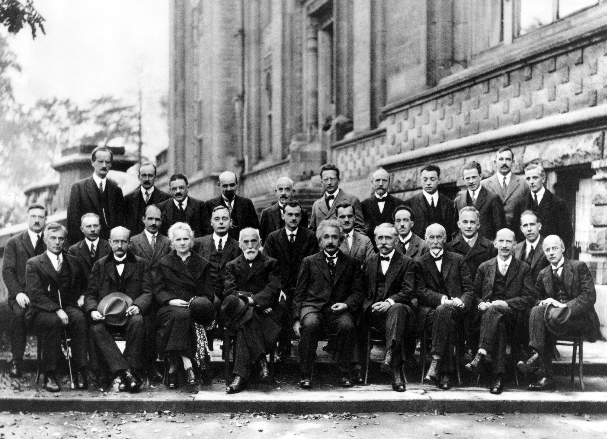

# 人怎么克服傲慢、偏见，不断拓展自己的认知边界？

1927年的索尔维会议，留下了一张物理学史上最著名的合影。29个人站在一起，其中17个是诺贝尔奖得主或未来的诺贝尔奖得主。

那次会议的主题是量子力学。玻尔和他的哥本哈根学派提出了一套颠覆性的解释：微观粒子在被观测之前没有确定的状态，测量本身会改变被测量的对象。

爱因斯坦完全无法接受。

他每天早餐时都会设计一个精巧的思想实验，试图证明量子力学自相矛盾。玻尔每次都能在当天晚餐前找到反驳。这个模式持续了整个会议。

爱因斯坦至死都没有接受量子力学的概率解释。他那句"上帝不掷骰子"，与其说是物理论证，不如说是信仰声明。一个开创了相对论的天才，一个年轻时用光电效应理论为量子力学奠基的人，最终站在了自己帮助创造的革命的对立面。

如果爱因斯坦都会被自己的认知框架困住，普通人凭什么觉得自己能例外？

---

# 傲慢和偏见不是道德缺陷，是出厂设置

我们通常把傲慢和偏见当成品格问题——这个人不够谦虚，那个人心胸狭隘。但认知科学的研究指向一个更深层的结论：它们是人类大脑的默认运行模式。

## 大脑是台预测机器

人脑每秒处理的感官信息大约有1100万比特，但意识能处理的只有大约50比特。差了将近20万倍。为了弥补这个巨大的落差，大脑不得不走捷径：先用已有的经验和信念构建一个"世界模型"，然后用这个模型去预测和过滤信息。

符合模型的信息被优先放行，不符合的被自动降权甚至丢弃。这就是确认偏误（Confirmation Bias）的生理基础——你的大脑不是在客观地观察世界，而是在不断寻找能证实自己已有信念的证据。

这套机制在进化上极其成功。原始人在草丛里看到一个黄色的影子，大脑立刻匹配"老虎"的模式并触发逃跑反应，比花时间仔细辨认高效得多。哪怕十次里有九次是风吹草动，那一次真的是老虎就够了。

但同样的机制放到现代社会，就变成了认知牢笼。你形成了一个判断，然后大脑会自动帮你收集支持这个判断的证据，屏蔽反对的证据，让你越来越确信自己是对的。

## 越无知越自信

1999年，康奈尔大学的两位心理学家邓宁（David Dunning）和克鲁格（Justin Kruger）做了一组实验。他们让参与者完成逻辑推理、语法和幽默感的测试，然后让每个人评估自己在所有参与者中的排名。

结果发现一个一致的规律：得分最低的那25%的人，平均认为自己的表现超过了62%的人。而得分最高的那25%，反而倾向于低估自己的排名。

这就是后来广为人知的邓宁-克鲁格效应：**能力不足的人缺乏识别自己能力不足的能力。**

这个效应的核心在于，它是自我封闭的。一个人对某个领域了解得越少，他就越无法意识到自己的无知，也就越没有动力去学习，于是继续无知下去。傲慢不是因为知道得太多，恰恰相反，傲慢往往是因为知道得太少。

## 偏见是身份的副产品

人是社会动物。我们天生需要归属于某个群体，这种需要深深刻在基因里。一旦归属形成，"我们"和"他们"的边界就自动划定了。

社会心理学家亨利·塔吉菲尔（Henri Tajfel）在1970年代做过一个经典实验：他把一群互不相识的男孩随机分成两组，理由随机到可笑——"你喜欢克利还是康定斯基的画"。结果，仅仅因为被分到了同一组，男孩们就开始偏袒自己的组员，歧视另一组。

不需要利益冲突，不需要历史仇恨，只需要一条任意的分界线，偏见就能自动生长出来。

这说明偏见的根源不在于具体的对象——不是因为某个族群、某种观点、某个职业真的有什么问题——而在于人类维持群体身份的心理机制本身。你一旦认定自己属于某个阵营（技术派/管理派、理性主义/经验主义、安卓/苹果），你就会不自觉地高估本阵营的观点，低估对方的论据。

---

# 四面墙：认知边界是怎么形成的

知道了傲慢和偏见的认知根源，下一个问题是：它们具体通过什么方式限制我们的思考？

## 经验的诅咒

经验是一种强大的认知资源，但也是一种隐蔽的约束。你过去的成功经验越丰富，就越容易用旧地图去导航新地形。

柯达发明了数码相机的核心技术，但整个公司都被胶片时代的经验绑架，无法想象一个没有胶卷的世界。诺基亚在功能手机时代积累的工程优势，反而让它低估了触屏智能手机的颠覆性。

这些案例的共同点是：**当事人不是看不见新信息，而是无法赋予新信息正确的权重。** 因为他们的认知框架——被过去的成功反复强化的框架——会自动把新信息归类为"噪音"或"异常值"。

个人层面也一样。一个靠技术能力一路升上来的工程师，可能很难真正理解管理是一门独立的学科，而不仅仅是"不写代码的人干的事"。一个在传统出版业成功了二十年的编辑，可能打心底觉得自媒体内容就是快餐，不值得认真对待。

## 语言的围墙

本杰明·沃尔夫（Benjamin Whorf）在1930年代提出了一个大胆的假说：语言不仅是思维的工具，还塑造了思维的边界。你的语言中没有某个概念的词，你就很难想到那个概念。

后来的研究部分证实了这个假说。澳大利亚的库克萨语族（Kuuk Thaayorre）没有"左""右"的概念，他们用东南西北等绝对方位来描述一切空间关系。结果是，这个族群的成员拥有近乎超自然的方向感——他们在任何时候都能准确判断自己面朝哪个方向。

语言的限制不只是字面意义上的。每个专业领域都有自己的术语体系，这些术语既是认知工具，也是认知边界。经济学家用"外部性"思考环境问题，物理学家用"熵"思考秩序与混乱，心理学家用"认知负荷"思考学习效率。当你只掌握一套术语体系时，你能看到的问题和能想到的解法都被那套体系框定了。

## 信息茧房

算法推荐时代让这个问题变得更严重。你点了几条关于某个话题的内容，算法就开始给你推送更多同类内容。你以为自己在广泛获取信息，实际上你在一个越来越窄的信息管道里打转。

但信息茧房的真正危险不在于信息单一，而在于它制造了一种"世界就是这样"的幻觉。当你身边所有的信息源都在说同一件事，你很难不把它当成客观事实。你需要刻意的努力才能意识到，你看到的只是一个高度筛选过的切片。

## 沉没成本的锚定

你在一个观点上投入的时间、精力和情感越多，放弃它的心理成本就越高。一个研究了二十年某种理论的学者，发现这个理论可能有根本性的缺陷，他面对的不仅是智识上的挑战，更是身份认同的危机——如果这个理论是错的，那我这二十年算什么？

这就是为什么很多人在面对反对证据时，反应不是重新审视自己的立场，而是更加坚定。心理学把这种现象叫做"逆火效应"（Backfire Effect）：当人们接触到与自己信念矛盾的事实时，他们不仅不会改变信念，反而会更加坚信原来的观点。

---

# 怎么破？

认知边界是真实存在的，而且有强大的心理机制在维护它。承认这一点，本身就是突破的第一步。

## 把"我是对的"换成"我的模型在哪些条件下成立"

每一个判断都建立在一组前提假设之上。当你意识到自己有一个强烈观点时，试着把它拆解成前提和推论：我之所以相信X，是因为我假设了A、B、C。如果A不成立呢？如果B的前提已经变了呢？

这个练习的价值在于，它把你从"对/错"的二元对立中解放出来。问题不再是"我对不对"，而是"我的模型在什么条件下成立，在什么条件下失效"。科学就是这样运作的——牛顿力学不是"错"的，它在低速宏观世界里依然精确无比，只是在高速和微观尺度上需要被相对论和量子力学替代。

## 主动寻找最强的反对论证

人的本能是寻找支持自己的证据。要对抗这种本能，你需要刻意去做一件反直觉的事：**去找你最不想听到的那个声音，而且要找最聪明的那个反对者。**

查理·芒格说过一条原则："如果我不能比我的对手更好地陈述他的论点，我就没有资格反对他。"这条原则要求你不是去找对方论证中最弱的环节来攻击（稻草人谬误），而是去理解对方论证中最强的部分，然后看自己的立场是否依然站得住。

这个方法的副作用是：你经常会发现对方确实有道理，至少在某些维度上比你想得更深。这种发现令人不适，但它是认知成长的燃料。

## 跨领域阅读

如果偏见的来源之一是你只掌握了一套语言和概念体系，那么最直接的对策就是多掌握几套。

一个程序员去读进化生物学，会发现"自然选择"和"遗传算法"之间有深刻的同构关系。一个经济学家去读热力学，会发现"市场均衡"和"热力学平衡"之间存在令人惊讶的结构相似性。每多掌握一个领域的核心概念，你就多了一副观察世界的眼镜。

但跨领域阅读的目的不是成为什么都懂一点的通才。核心价值在于：**当你用至少两套不同的概念框架去理解同一个现象时，你才能开始分辨哪些是现象本身的特征，哪些是某一套框架强加的解读。** 只有一副眼镜的人，分不清哪些是世界的样子，哪些是镜片的颜色。

## 建立"改变想法"的正反馈

大多数人把改变想法视为失败——"打脸了""被推翻了""以前想错了"。这种心理让人死守旧观点，因为改变的代价（尊严损失）太高了。

要突破这个困境，需要把价值判断的标准从"我一直是对的"切换到"我在不断变得更准确"。

具体的做法：当你确实改变了一个重要观点时，回溯一下是什么新信息或新论证让你改变的，然后把这个过程当成一次能力升级，而非一次失败。

贝叶斯统计的核心思想在这里很适用：你对世界的每一个信念都是一个概率估计，当新证据出现时，你根据证据的强度来调整估计值。改变想法不是推翻自己，是根据新数据更新模型。

## 和不同的人待在一起

你的社交圈就是你的信息环境。如果你身边的人都来自同一个行业、同一种教育背景、同一个年龄层、同一种政治倾向，你们之间的对话只会不断强化已有的共识。

刻意让自己接触不同背景的人，不是为了表演"开放包容"，而是因为不同背景的人携带着不同的默认假设。和他们交谈，你会发现自己有很多"理所当然"的想法，在对方看来完全不是理所当然的。这些碰撞是重新审视自己假设的最佳入口。

---

# 终局思考

达尔文在《物种起源》中记录了一个他自己的习惯：**每当他遇到一个与自己理论矛盾的事实，他就立刻把它记下来。** 因为他发现，如果不这么做，大脑会在几十分钟内就把那个事实"遗忘"掉——大脑会主动清除让自己不舒服的信息。

这个细节揭示了认知突破的本质：它不是天赋，是纪律。

没有人能完全克服傲慢和偏见，因为它们根植于大脑的底层架构。但你可以建立一套机制来对抗它们——主动记录反面证据，刻意寻找最强反对论证，定期检查自己的前提假设，把改变想法当成升级而非失败。

认知边界的扩展不是一次性事件，是持续的练习。就像达尔文随身带着笔记本，你也需要自己的"反直觉笔记本"——不是用来记你同意的东西，而是用来记那些让你不舒服的东西。

**让你不舒服的信息，往往就是你认知边界的精确坐标。**
