# 人生操作系统：构建你的人生大系统

> 人生不是一场随机漫步，而是一个可以被设计、优化和迭代的复杂系统。

---

## 引言：为什么需要"人生系统"？

大多数人过着"事件驱动"的人生——被工作deadline推着走，被社交媒体的通知牵着跑，被突发事件打乱节奏。这种模式的问题在于：**你永远在救火，却从未建造防火墙。**

而少数人活在"系统驱动"的模式里——他们建立了一套底层操作系统，让正确的事情自动发生，让错误的事情难以发生。

本文将拆解一个完整的**人生操作系统架构**，帮助你从"被动响应者"转变为"主动设计者"。

---

## 系统全景图

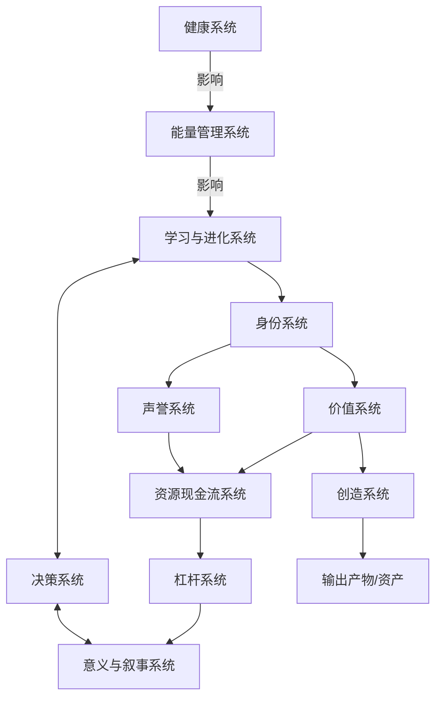

这个系统分为三层：

| 层级       | 系统                               | 核心功能       |
| ---------- | ---------------------------------- | -------------- |
| **基础层** | 健康系统、能量管理系统             | 提供运转燃料   |
| **中枢层** | 学习与进化、决策、意义与叙事       | 处理信息与方向 |
| **输出层** | 身份、声誉、价值、资源、杠杆、创造 | 产生现实成果   |

---

## 第一部分：基础层——一切的燃料

### 1. 健康系统：地基中的地基

**定义**：维持身体机能正常运转的底层硬件系统。

健康系统是整个人生操作系统的**物理基础设施**。就像一台电脑，CPU再强大，内存不够也跑不动程序。

**健康系统的四大支柱**：

| 支柱         | 核心指标            | 优化方向                 |
| ------------ | ------------------- | ------------------------ |
| **睡眠**     | 7-8小时深度睡眠     | 固定作息、睡眠环境优化   |
| **运动**     | 每周150分钟中等强度 | 力量+有氧+柔韧性组合     |
| **营养**     | 均衡摄入、控制炎症  | 减少加工食品、增加蔬果   |
| **压力管理** | 皮质醇水平稳定      | 冥想、呼吸练习、自然接触 |

**关键洞察**：健康不是"有空再说"的选项，而是"没有它一切归零"的前提。

> "失去健康的人想要的只有一件事，拥有健康的人想要的有一万件事。"

**系统设计原则**：

- 把健康行为变成**默认选项**（如：把运动鞋放在门口）
- 设置**熔断机制**（如：连续三天睡眠不足，自动取消非必要安排）
- 建立**监测仪表盘**（如：追踪睡眠、HRV、体重趋势）

---

### 2. 能量管理系统：从电量到算力

**定义**：将健康转化为可用精力，并合理分配到各项活动中的系统。

健康是"电池容量"，能量管理是"电量分配策略"。

**能量的四个维度**（基于Jim Loehr的理论）：

**能量管理的核心策略**：

**① 识别你的黄金时段**
每个人都有精力最充沛的时间窗口。识别它，保护它，把最重要的工作放进去。

**② 建立"能量预算"思维**
把每天的能量想象成一个有限账户：

- 高认知任务：消耗100单位
- 社交应酬：消耗80单位
- 创造性工作：消耗120单位
- 行政杂务：消耗30单位

问自己：今天的能量预算够吗？

**③ 设计恢复仪式**
能量不只靠睡眠恢复。白天需要"微恢复"：

- 番茄钟之间的5分钟站立
- 午餐后的15分钟散步
- 下午的10分钟冥想

**④ 消除能量黑洞**
识别那些消耗能量却不产生价值的活动：

- 无意义的会议
- 情绪内耗的关系
- 无限滚动的社交媒体

**系统输出**：稳定、可预测、可持续的精力供给，支撑上层系统运转。

---

## 第二部分：中枢层——大脑的操作系统

### 3. 学习与进化系统：持续升级的能力

**定义**：获取新知识、技能并将其整合进自身能力矩阵的系统。

这是让你**不断变强**的核心引擎。

**学习系统的三层架构**：

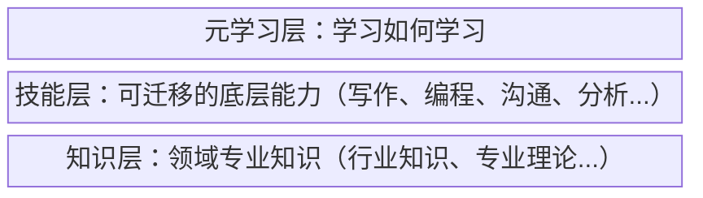

**高效学习的四步循环**：

1. **输入**：选择高质量信息源，而非追求数量
2. **处理**：用费曼技巧、思维导图等方法主动加工
3. **输出**：通过写作、教学、实践来巩固
4. **反馈**：根据结果调整学习方向

**进化思维**：

- 把自己当作"产品"，持续迭代
- 每季度review自己的"版本更新日志"
- 主动淘汰过时的知识和技能

**与决策系统的双向连接**：

- 学习系统提供决策所需的知识储备
- 决策结果的反馈驱动学习方向的调整

---

### 4. 决策系统：人生的方向盘

**定义**：在不确定性中做出选择，并承担后果的系统。

决策质量决定了人生轨迹。平庸的决策累积成平庸的人生，卓越的决策累积成卓越的人生。

**决策系统的核心组件**：

**① 决策框架库**

| 框架             | 适用场景     | 核心问题                                 |
| ---------------- | ------------ | ---------------------------------------- |
| **10/10/10法则** | 情绪化决策   | 10分钟/10个月/10年后我会怎么看这个决定？ |
| **逆向思维**     | 避免重大错误 | 怎样做一定会失败？然后避免它             |
| **机会成本**     | 资源分配     | 选择A意味着放弃什么？                    |
| **可逆性测试**   | 风险评估     | 这个决定容易撤销吗？                     |
| **遗憾最小化**   | 长期重大决策 | 80岁回看，哪个选择让我更少遗憾？         |

**② 决策日志**
记录重要决策的：

- 当时的情境和信息
- 考虑的选项
- 选择的理由
- 预期的结果
- 实际的结果
- 复盘和学习

**③ 决策原则清单**
预先设定的规则，减少临场纠结：

- "如果不是Hell Yes，那就是No"
- "一年只接受3个重大新承诺"
- "睡一觉再做重要决定"

**与意义系统的双向连接**：

- 意义系统提供决策的价值标尺
- 决策结果反过来塑造人生叙事

---

### 5. 意义与叙事系统：人生的GPS

**定义**：回答"为什么"、构建人生故事、提供方向感和动力的系统。

这是整个系统的**精神内核**。没有意义感的人生，就像没有目的地的航行——忙碌但迷茫。

**意义系统的三个层次**：

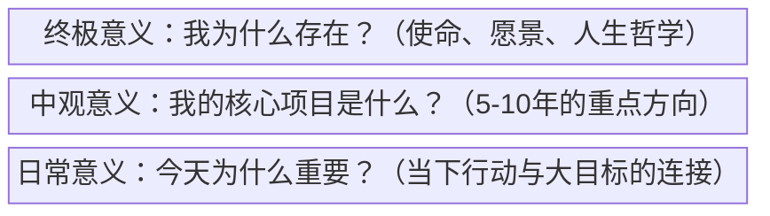

**叙事的力量**：
人类是叙事动物。我们通过故事理解自己和世界。

你对自己人生的叙事，决定了你如何解读过去、体验现在、期待未来。

**两种叙事模式**：

| 受害者叙事           | 主人公叙事           |
| -------------------- | -------------------- |
| "这件事发生在我身上" | "我从这件事中学到了" |
| "我没有选择"         | "我选择了"           |
| "都是因为他们"       | "我负责我的反应"     |
| "我无能为力"         | "我还能做什么"       |

**构建意义系统的实践**：

1. **使命宣言**：用一句话描述你想创造的影响
2. **价值观排序**：明确你最核心的3-5个价值观
3. **人生章节**：把人生划分为章节，为当前章节命名
4. **遗产思考**：你希望被如何记住？

---

## 第三部分：输出层——将内在转化为外在

### 6. 身份系统：你是谁？

**定义**：定义"我是谁"的核心自我认知系统。

身份不是固定的标签，而是一个**动态的操作系统内核**。

**身份的多层结构**：

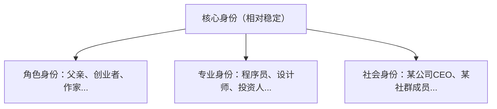

**身份驱动行为**：
James Clear在《原子习惯》中指出：**真正持久的改变是身份层面的改变**。

- "我要戒烟" vs "我不是吸烟者"
- "我要多读书" vs "我是一个读书人"
- "我要健身" vs "我是一个运动者"

**身份系统的设计原则**：

1. **主动选择**：你选择认同什么，而非被动接受标签
2. **保持弹性**：身份可以进化，不要被旧身份束缚
3. **内外一致**：减少"人设"与真实自我的分裂
4. **向前投射**：用未来身份指导当下行为

**连接下游**：

- 身份决定了你建立什么样的声誉
- 身份影响你坚持什么样的价值观

---

### 7. 声誉系统：别人眼中的你

**定义**：你在他人心智中的形象和信任资产。

声誉是**社会层面的身份映射**，是他人对你的预期和信任的累积。

**声誉的双重性**：

| 维度         | 说明             |
| ------------ | ---------------- |
| **能力声誉** | "这个人能做到"   |
| **品格声誉** | "这个人值得信任" |

两者缺一不可。能力强但品格差=危险的人；品格好但能力弱=可爱但没用的人。

**声誉积累的三个层级**：

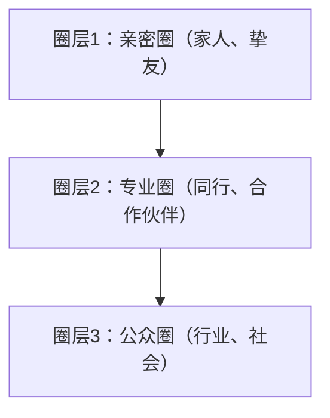

**声誉管理的原则**：

1. **一致性**：言行一致，长期一致
2. **可验证**：用作品和成果说话
3. **守住底线**：声誉毁坏只需一次严重失信
4. **主动传播**：好酒也怕巷子深

**声誉 → 资源**：
良好的声誉会自动吸引机会、人才、资本。这是声誉系统连接资源系统的核心路径。

---

### 8. 价值系统：你相信什么？

**定义**：指导行为和决策的核心信念和原则。

价值观是你的**内在宪法**——当外界压力来临时，它决定你坚守什么、放弃什么。

**价值系统的层次**：

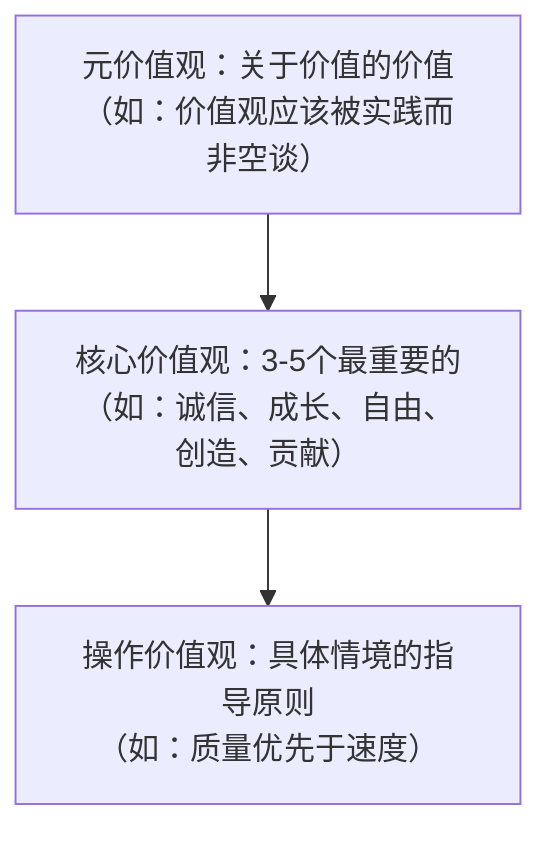

**价值观的作用**：

- **过滤器**：快速筛选不符合价值观的选项
- **优先级**：当价值观冲突时，按排序决策
- **能量源**：符合价值观的行动自带动力
- **一致性锚**：保持长期行为的连贯性

**价值系统的校准**：
定期问自己：

- 我声称的价值观和我实际的行为一致吗？
- 如果有冲突，是价值观需要更新，还是行为需要修正？

**价值 → 资源**：
价值创造是获取资源的根本途径。不是追逐金钱，而是创造价值，金钱是副产品。

---

### 9. 资源现金流系统：你的经济引擎

**定义**：产生、管理、增长财务资源的系统。

资源系统是让其他系统得以**持续运转**的燃料供给站。

**资源系统的四大模块**：

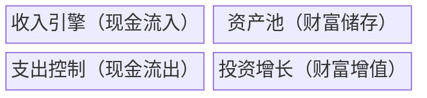

**收入类型演进**：

| 阶段 | 收入类型 | 特征               |
| ---- | -------- | ------------------ |
| 1.0  | 时间换钱 | 出卖时间，线性增长 |
| 2.0  | 技能溢价 | 稀缺技能，高时薪   |
| 3.0  | 系统收入 | 建立系统，杠杆放大 |
| 4.0  | 资产收入 | 资产产生现金流     |

**关键指标**：

- **储蓄率**：收入中用于积累的比例
- **被动收入比**：被动收入/总支出
- **财务跑道**：现有资产能支撑多久
- **资产增长率**：财富的年化增速

**资源系统的设计原则**：

1. 先支付自己（储蓄优先于消费）
2. 建立多元收入流
3. 让资产为你工作
4. 持续提高收入上限，而非只压缩支出

---

### 10. 杠杆系统：放大你的影响力

**定义**：用有限的个人投入，撬动不成比例的产出的系统。

杠杆是让你**突破个人极限**的关键。没有杠杆，你永远是一个人在战斗。

**四大杠杆类型**：

| 杠杆           | 说明             | 示例             |
| -------------- | ---------------- | ---------------- |
| **劳动力杠杆** | 雇佣他人为你工作 | 团队、外包       |
| **资本杠杆**   | 用钱生钱         | 投资、借贷       |
| **媒体杠杆**   | 内容无限复制     | 书籍、视频、播客 |
| **代码杠杆**   | 软件边际成本为零 | 产品、SaaS、App  |

**杠杆的演进路径**：

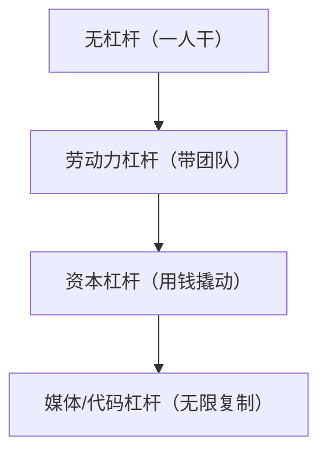

**新时代的杠杆优势**：
媒体和代码杠杆是互联网时代的"民主化杠杆"——不需要资本或许可，任何人都可以获得。

Naval Ravikant说：

> "给我一个有互联网连接的人，他可以接触到劳动力杠杆、资本杠杆、代码杠杆和媒体杠杆。这在人类历史上从未有过。"

**杠杆使用原则**：

1. 在高价值方向上使用杠杆
2. 杠杆放大优势，也放大错误
3. 先做对事，再放大规模
4. 持续积累可复利的杠杆资产

---

### 11. 创造系统：将想法变成现实

**定义**：将内在的想法、技能、价值转化为外在产出的系统。

创造是整个人生系统的**终极输出端口**。

**创造系统的流程**：

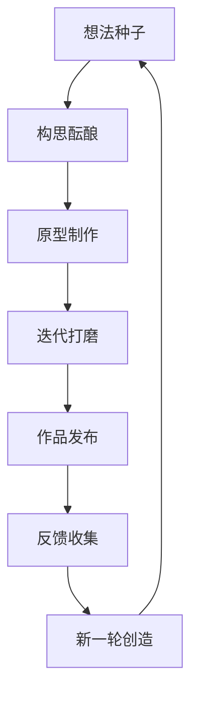

**创造的三个层次**：

| 层次         | 说明                   | 示例       |
| ------------ | ---------------------- | ---------- |
| **问题解决** | 创造解决特定问题的方案 | 工具、服务 |
| **价值表达** | 创造表达自我的作品     | 艺术、写作 |
| **系统构建** | 创造持续运转的系统     | 企业、平台 |

**创造者心态**：

- 完成比完美重要
- 发布是学习的开始
- 每个作品都是通往下一个作品的桥
- 创造是理解的最高形式

**创造系统的维护**：

1. 保护创造时间（固定的"创造时段"）
2. 建立创意捕捉系统（随时记录想法）
3. 设置发布节奏（倒逼产出）
4. 构建反馈循环（让作品进化）

---

### 12. 输出产物/资产：系统的最终成果

**定义**：创造系统产生的可积累、可交换、可产生持续价值的产出。

这是整个人生操作系统的**可见成果**。

**资产的类型**：

| 类型         | 说明                 | 示例               |
| ------------ | -------------------- | ------------------ |
| **金融资产** | 可直接变现的财富     | 存款、股票、房产   |
| **知识资产** | 可重复利用的知识产物 | 书籍、课程、专利   |
| **关系资产** | 高质量的人际网络     | 社群、合作伙伴     |
| **声誉资产** | 品牌和信任积累       | 个人品牌、口碑     |
| **技能资产** | 稀缺的能力组合       | 专业技能、独特经验 |

**优质资产的特征**：

- **可积累**：随时间增值而非贬值
- **可复利**：产生进一步的收益
- **可保护**：有护城河，难以被复制
- **可传承**：可以留给后代或他人

**资产思维**：
把每一次重要的投入都想成"资产建设"：

- 写一篇文章 → 知识资产
- 深度交流 → 关系资产
- 完成项目 → 能力资产 + 声誉资产

---

## 第四部分：系统之间的连接

### 核心流动路径

**路径一：能量流**

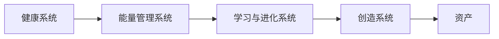

这是从身体资源到外在产出的**能量转化链条**。

**路径二：意义流**

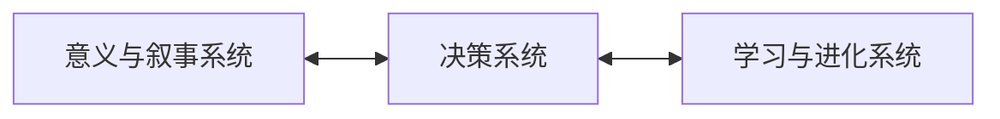

这是**方向校准回路**，确保你的努力方向正确。

**路径三：价值流**

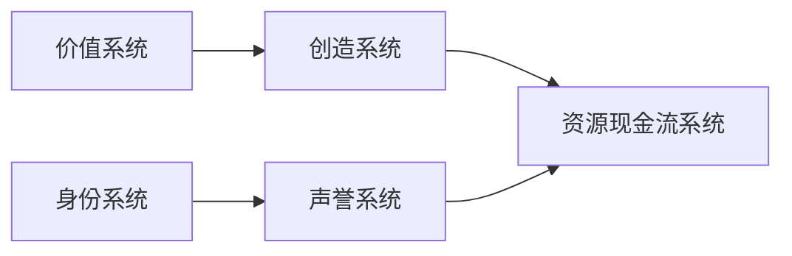

这是从内在价值到外在财富的**价值变现链条**。

**路径四：放大流**

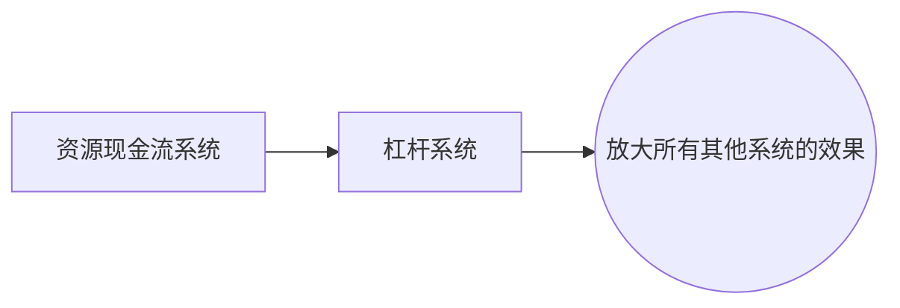

这是**规模化路径**，让有限投入产生超额回报。

### 飞轮效应

当系统运转良好时，会形成正向飞轮：

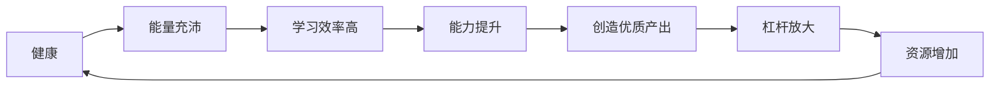

每个系统的输出都成为下一个系统的输入，形成自我强化的循环。

---

## 结语：成为自己人生的架构师

这套人生操作系统不是一个需要完美遵循的蓝图，而是一个**思考框架**。

它的价值在于：

- 帮你看到全局，而非只盯着眼前
- 帮你理解各部分如何相互影响
- 帮你找到当前的瓶颈和杠杆点
- 帮你做出更系统性的决策

最终，每个人都需要设计**适合自己的版本**。这套系统会随着你的成长而进化，随着你的阅历而丰富。

记住：

> 你不是在这些系统中生活，你就是这些系统本身。

从今天开始，有意识地设计、运营、迭代你的人生操作系统。

不是因为它能保证成功，而是因为——

**一个被设计的人生，总好过一个被随机塑造的人生。**

---

*写于2026年2月 | 持续迭代中*