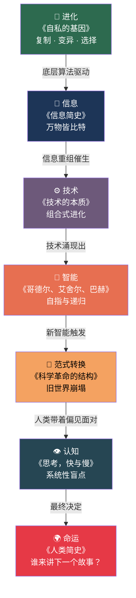

# 大转换时代，最有启发的 7 本书

> 我们正处在一个大转换时代——AI 重塑工作方式，旧范式加速崩塌，新规则尚未成型。
>
> 这 7 本书不教你用任何工具，但它们会改变你看世界的方式。读完之后，你对智能、技术和人类命运的理解，会完全不同。

---

## 1. 认知：你的大脑是怎么骗你的

### 《思考，快与慢》 丹尼尔·卡尼曼
*Thinking, Fast and Slow* — Daniel Kahneman

**一句话**：你以为你在理性思考，其实大部分时候你在自动驾驶。

卡尼曼把人脑拆成两个系统：系统 1 快而直觉，系统 2 慢而理性。问题在于，系统 1 经常"抢答"，而你浑然不觉。

**这本书的启发：**

- AI 没有认知偏误，但你有。当 AI 给你一个答案，你的系统 1 会不假思索地接受——这就是「自动化偏见」。
- 理解自己的思维缺陷，才能知道什么时候该信 AI，什么时候该信自己。
- 讽刺的是，AI 模型本身也从人类数据中继承了偏见。了解偏见的来源，你就能更好地审视 AI 的输出。

---

## 2. 范式：科学是怎么"翻天"的

### 《科学革命的结构》 托马斯·库恩
*The Structure of Scientific Revolutions* — Thomas S. Kuhn

**一句话**：科学不是知识的线性积累，而是一次次"推倒重来"。

库恩提出了一个震撼性的观点：科学进步不是渐进的，而是"范式转换"——旧范式积累足够多的反常现象后，整个框架被新范式取代。地心说到日心说，牛顿力学到相对论，都是这个模式。

**这本书的启发：**

- AI 本身就是一次范式转换。就像库恩说的，新范式来临时，旧范式内的人往往看不懂、不接受——这正是很多人面对 AI 的状态。
- 理解范式转换的规律，你就能判断：AI 到底是工具升级，还是一次文明级的范式更替？
- 更重要的是，库恩告诉你：**所有范式都是暂时的**。今天深度学习的统治地位，未来也可能被颠覆。

---

## 3. 进化：为什么复制和变异解释一切

### 《自私的基因》 理查德·道金斯
*The Selfish Gene* — Richard Dawkins

**一句话**：你不是基因的主人，你是基因的载体。

道金斯颠覆了"物种为单位"的进化观：进化的主角不是个体，不是种群，而是基因。基因唯一的"目的"就是复制自己——个体不过是基因的生存机器。

他还提出了"模因"（meme）概念：文化信息的传播，跟基因传播遵循同样的逻辑——复制、变异、选择。

**这本书的启发：**

- AI 模型的训练过程——变异、选择、迭代——本质上就是进化过程的数字版。理解进化，就理解了 AI 为什么有效。
- "模因"概念直接解释了信息时代的传播规律：为什么有些想法"病毒式传播"？因为它们是高适应度的模因。
- AI 正在成为新的"复制机器"——它在复制和重组人类的知识、风格和创意。这是进化的延伸，还是全新的物种？

---

## 4. 智能：意识到底是什么

### 《哥德尔、艾舍尔、巴赫》 侯世达
*Gödel, Escher, Bach: An Eternal Golden Braid* — Douglas Hofstadter

**一句话**：智能和意识，可能来自简单规则的无穷嵌套。

这本书被称为"思想界的交响乐"。侯世达用数学家哥德尔的不完备定理、画家艾舍尔的悖论画作、音乐家巴赫的赋格曲，编织出一个核心问题：**"我"是怎么从无生命的物质中涌现出来的？**

答案指向"自指"和"递归"——当一个系统足够复杂，能够引用自身时，意识就可能涌现。

**这本书的启发：**

- 这本书直击 AI 的终极问题：机器能不能有意识？如果意识是"自指"的产物，那 AI 能不能自指？
- 哥德尔定理暗示：任何足够复杂的形式系统，都有它无法证明的真理。AI 也一样——它总有它"看不到"的东西。
- 读完这本书，你会对"AI 会取代人类"这个说法有更深的、而非更浅的理解。

---

## 5. 信息：万物的隐藏语言

### 《信息简史》 詹姆斯·格雷克
*The Information: A History, a Theory, a Flood* — James Gleick

**一句话**：信息不是现代发明，信息是宇宙的基本成分。

格雷克从非洲鼓语讲到莫尔斯电码，从香农的信息论讲到量子计算，勾画出一条线索：**宇宙的本质，可能不是物质，不是能量，而是信息。**

香农定义了"信息"= 不确定性的消除。这个看似简单的定义，奠定了整个数字时代的基础。

**这本书的启发：**

- AI 的本质就是信息处理。大语言模型做的事情，本质上就是"预测下一个 token"——这直接来自香农的信息论。
- 理解"信息熵"的概念，你就明白了为什么 AI 生成的内容有时候"正确但无聊"——因为它倾向于输出低熵（高概率）的内容。
- 信息过载是这个时代的核心挑战。格雷克在十多年前就预见了这一点。

---

## 6. 技术：技术到底是什么东西

### 《技术的本质》 布莱恩·阿瑟
*The Nature of Technology: What It Is and How It Evolves* — W. Brian Arthur

**一句话**：技术不是科学的"应用"，技术是一个自我进化的有机系统。

阿瑟提出了一个惊人的框架：技术是由已有技术组合而成的，技术创造技术，技术就像生物一样在进化。每一项新技术，本质上都是对已有技术的重新组合。

**这本书的启发：**

- AI 本身就是阿瑟理论的最佳例证：Transformer 架构 = 注意力机制 + 神经网络 + 大规模并行计算……全是已有技术的重组。
- 阿瑟的"组合进化"观点解释了为什么 AI 发展如此之快——不是某个天才突然顿悟，而是技术积木到了可以搭建新东西的时刻。
- 他还提出：技术会自己"创造需求"。AI 不只是满足现有需求，它正在创造我们之前不知道自己需要的东西。

---

## 7. 命运：智人的过去、现在和未来

### 《人类简史》 尤瓦尔·赫拉利
*Sapiens: A Brief History of Humankind* — Yuval Noah Harari

**一句话**：人类统治地球，靠的不是力量，不是智商，而是"讲故事"的能力。

赫拉利提出：人类之所以能大规模协作，是因为我们能相信"虚构的故事"——国家、宗教、金钱、公司，全都是人类发明的"故事"。正是这种"虚构现实"的能力，让人类从非洲草原走向太空。

**这本书的启发：**

- AI 正在获得"讲故事"的能力。当机器也能创造令人信服的叙事时，人类最核心的竞争优势还在吗？
- 赫拉利的框架帮你理解：AI 的影响不只是技术层面的，它是人类文明故事的新篇章——就像农业革命、科学革命一样。
- 最关键的问题：**如果 AI 能比人类讲更好的故事，我们的社会组织方式会怎么变？**

---

## 7 本书，一张地图

| # | 主题 | 核心洞见 |
|---|------|----------|
| 1 | 认知 | 你的思维有系统性的盲点 |
| 2 | 范式 | 知识体系会整体崩塌和重建 |
| 3 | 进化 | 复制、变异、选择是万物的底层算法 |
| 4 | 智能 | 意识可能从自指和递归中涌现 |
| 5 | 信息 | 宇宙的本质可能是信息 |
| 6 | 技术 | 技术是自我进化的组合系统 |
| 7 | 命运 | 人类的超能力是"讲故事" |

这 7 个洞见连起来，就是理解大转换时代的完整地图：

> AI 利用了进化的算法（3），在信息的海洋中（5），通过技术的组合进化（6），正在创造一种新的"智能"（4），它正在引发一次范式转换（2），而我们带着认知偏见（1）去面对这一切，最终影响的是人类文明的走向（7）。

**别急着学工具。先读懂这 7 本书。**

因为工具会过时，但思维方式不会。
