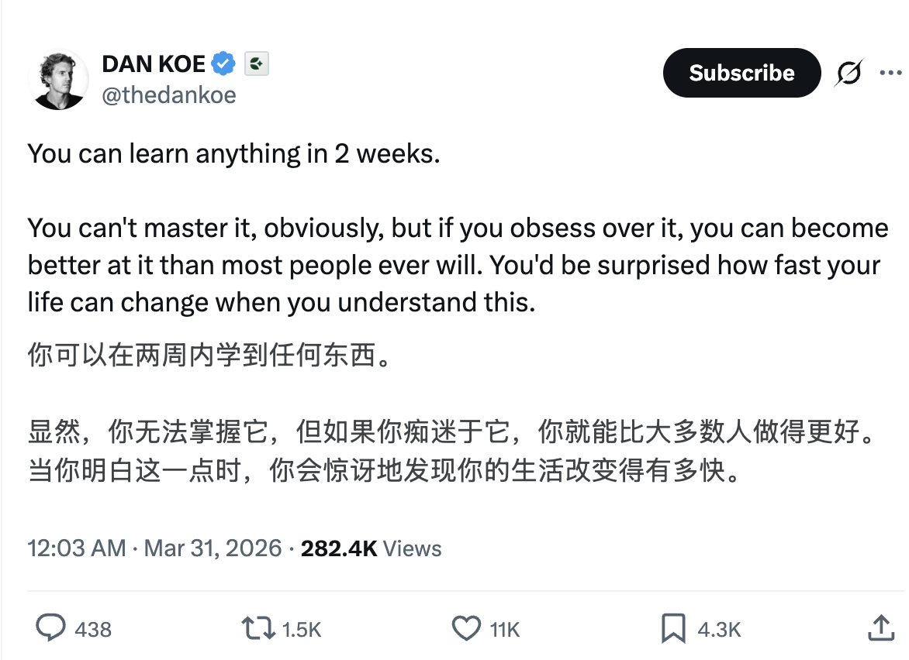

# 两周入门，一万次迭代：痴迷的科学

你可以在两周内学到任何东西。

如果你足够痴迷，你就能比大多数人做得更好。

** 成就的关键不是天赋，不是时间，而是你能否找到一件让自己痴迷的事，然后迭代一万次。**

---

## 20小时假说：入门门槛远比你以为的低

Josh Kaufman 在《The First 20 Hours》中提出了一个反直觉的论断：大多数技能从"零基础"到"还不错"，只需要大约20小时的刻意练习。

两周，每天投入一到两小时，差不多就是这个数字。

这个结论之所以反直觉，是因为我们被"一万小时定律"误导太深。Malcolm Gladwell 在《异类》中引用了心理学家 K. Anders Ericsson 的研究，得出"成为世界级专家需要一万小时"的结论。但 Ericsson 本人后来多次公开澄清：一万小时是达到**顶尖水平**的数字，而不是入门的门槛。绝大多数人连入门都没完成，就被"一万小时"这个数字吓退了。

真正的问题从来不是"学不会"，而是"没开始"。

---

## 我的实验：把X当成一个迭代系统

拿我搞X这件事来说。

我是真的痴迷于搞流量——不断创作内容，不断复盘，不断查看数据，总结经验后，立刻用来指导下一次的内容创作。就这样不停迭代，不停进化，迭代速度很快。

在相当长的一段时间里，我把发推当做一种游戏，粉丝数就是我的游戏积分。

每一条推文发出去，我都会盯着数据看：曝光量多少？互动率怎么样？为什么这条火了而那条没火？是标题的问题，还是发布时间的问题，还是内容结构的问题？

这不是什么高深的方法论。本质上，我在做的事情就是科学实验中最基本的范式：**提出假设 → 设计实验 → 观察结果 → 修正假设 → 再次实验。** 每一条推文就是一次实验，每一组数据就是实验结果。

空军战略家 John Boyd 把这个过程形式化为 OODA 循环（Observe-Orient-Decide-Act）。他的核心洞察是：**在对抗性环境中，决定胜负的不是单次决策的质量，而是循环的速度。** 谁的迭代转得更快，谁就赢。

内容创作的本质就是一个对抗性环境——你在和信息流里的所有内容竞争注意力。而我做的事情，就是把OODA循环转得尽可能快。

---

## 痴迷的神经科学：多巴胺不是奖励，是预测误差

很多人误解"痴迷"这个词。他们以为痴迷是一种天赋——有些人天生就对某件事充满热情，而自己没有，所以做不到。

神经科学告诉我们，事实恰好相反。

剑桥大学神经科学家 Wolfram Schultz 的经典研究揭示了多巴胺系统的真正工作机制：大脑释放多巴胺的触发条件不是"获得奖励"，而是**"奖励预测误差"**——即结果比预期更好的那个瞬间。当你连续几天发推零互动，突然有一条推文开始被转发，那个"超出预期"的惊喜感，会触发大量多巴胺释放。

这意味着什么？**痴迷不是起点，是结果。** 你不需要等到"找到热爱"才能开始。你只需要开始做一件事，坚持到第一个正反馈出现——那个"超出预期"的瞬间会自动点燃你的多巴胺回路。

斯坦福大学行为设计实验室的 BJ Fogg 教授把这个过程叫做"成功动量"（Success Momentum）：小的成功催生动力，动力驱动更多行动，更多行动带来更多成功。这就是飞轮效应——难的是推动第一圈，一旦转起来，系统会自我强化。

所以关键问题不是"我对什么有热情"，而是"我愿意在哪件事上坚持到第一个正反馈出现"。

---

## 刻意练习的核心：没有反馈的重复毫无意义

Ericsson 用了几十年研究"刻意练习"（Deliberate Practice），他最核心的发现不是"练一万小时就能成功"，而是一个更残酷的事实：**没有反馈的练习，无论重复多少次，都不会带来进步。**

这解释了为什么很多人"努力了很久"却毫无长进。他们在重复，但不在迭代。重复是做同样的事一千次；迭代是做一千次不同的事，每一次都比上一次好一点。

区别在哪？**反馈。**

你发了一条推文，不看数据，不分析为什么好、为什么差，然后发下一条——这是重复。你发了一条推文，花十分钟分析数据，发现"带具体数字的标题互动率高30%"，然后下一条立刻用上——这是迭代。

Ericsson 的研究明确指出，刻意练习的四个必要条件是：
1. **明确的目标**——不是"我要写好"，而是"我要把互动率从2%提到5%"
2. **即时的反馈**——不是三个月后的年终总结，而是每条推文发出后几小时的数据
3. **在舒适区边缘**——不是重复已经会的东西，而是每次都尝试一个新变量
4. **高度专注**——不是心不在焉地发推，而是全神贯注地分析和调整

X作为一个平台，天然满足了条件2——即时反馈。而条件1、3、4，取决于你自己的心态。

---

## 心流状态：为什么痴迷让你不再需要自律

心理学家 Mihaly Csikszentmihalyi 花了三十年研究一种特殊的心理状态：**心流**（Flow）。

他的发现是，当一个人完全沉浸在一项活动中、忘记时间流逝、感受到深度满足时，这个人正处于心流状态。而进入心流有三个前提条件：

1. **目标清晰**——你知道自己在做什么，下一步是什么
2. **反馈即时**——你能立刻知道做得好不好
3. **难度与能力匹配**——不太容易（无聊）也不太难（焦虑）

游戏之所以让人上瘾，正是因为它在设计层面完美满足了这三个条件。而我做的事情，本质上就是把X的内容创作改造成了一款游戏——每条推文是一次出牌，数据面板是计分板，粉丝数是等级。

心理学家 Edward Deci 和 Richard Ryan 的"自我决定理论"（Self-Determination Theory）从另一个角度解释了同样的现象：当一个人感到**自主感**（我自己选择做这件事）、**胜任感**（我越来越擅长）和**关联感**（有人在看、有人互动）时，内在动机会自然涌现。

这意味着什么？**当你进入心流状态后，"坚持"这个词就不存在了。** 没有人需要自律才能打游戏。你不需要设闹钟提醒自己"该迭代了"，你会自动打开X，因为你想看今天的数据变化。

痴迷的本质，就是心流成为了你的默认状态。

---

## Grit：最终胜出的人，不是最有才华的那个

Angela Duckworth 在宾夕法尼亚大学做了一项大规模研究，试图回答一个看似简单的问题：**到底是什么决定了一个人能否在某个领域取得成就？**

她追踪了西点军校学员、全国拼字比赛选手、顶尖销售员、新手教师等群体。结论始终一致，而且出乎意料——预测成就最强的指标既不是智商，也不是天赋，也不是家庭背景，而是她定义的"Grit"：**激情与毅力的结合。**

翻译成大白话就是：最终胜出的人，不是最聪明的那个，而是在没有正反馈的时候仍然继续迭代的那个。

Carol Dweck 在斯坦福大学的"成长型思维"（Growth Mindset）研究从另一个维度印证了同样的结论：认为能力可以通过努力提升的人（成长型思维），比认为能力是固定的人（固定型思维），在面对挫折时更倾向于加倍投入而非放弃。

把这两个研究放在一起看，一幅清晰的图景浮现出来：

- 你不需要天赋，你需要 Grit
- Grit 不是咬牙硬撑，而是痴迷驱动的持续迭代
- 痴迷不是天生的，而是从第一个正反馈开始被点燃的
- 正反馈来自于刻意练习中的即时反馈
- 所以，整个系统的启动按钮就是：**开始做，并且看数据**

---

## 纳瓦尔的洞察：找到属于你的一万次迭代

Naval Ravikant 说过一句极其精辟的话：

> Play long-term games with long-term people.（和长期主义者玩长期游戏。）

他还有另一个更底层的洞察：

> Play iterated games. All the returns in life, whether in wealth, relationships, or knowledge, come from compound interest.（玩重复博弈。人生中所有的回报——无论是财富、关系还是知识——都来自复利。）

纳瓦尔说的"重复博弈"（iterated games），和刻意练习的"迭代"，本质上是同一件事：**你不是在做一次性的赌注，你是在玩一个无限游戏，每一轮都在积累信息和优势。**

在博弈论中，一次性博弈（one-shot game）和重复博弈（iterated game）的最优策略完全不同。一次性博弈鼓励投机和短视；重复博弈则奖励信誉、学习和长期优化。当你把内容创作视为一次性投稿——"这条推文火不火"——你会焦虑、投机、追热点。但当你把它视为重复博弈——"这是我第847次迭代"——每一次失败都不再是终点，而是数据点。

这就是"一万次迭代"的真正含义。不是盲目重复一万次，而是带着反馈、带着调整、带着进化地迭代一万次。每一轮循环都在积累认知复利。

纳瓦尔还说过：

> Specific knowledge is found by pursuing your genuine curiosity and passion rather than whatever is hot right now.（专属知识是通过追随你真正的好奇心和热情来获得的，而不是追逐当下的热点。）

这和我们前面讨论的所有科学研究指向同一个结论：**你必须找到一件能让自己痴迷的事。** 不是因为"追随热爱"是一句好听的鸡汤，而是因为多巴胺系统、心流理论、刻意练习和重复博弈理论都在告诉你同一件事——只有痴迷才能驱动足够多次数的高质量迭代，而只有足够多次数的高质量迭代才能产生复利效应。

没有痴迷，你撑不过前一百次没有正反馈的阶段。
没有迭代，你的一万小时只是一万小时的低效重复。
没有复利，你的努力只是线性增长，永远追不上指数增长的人。

---

## 所以，你的一万次迭代在哪里？

让我们把整个逻辑链条串起来：

1. **入门门槛比你以为的低**（Kaufman：20小时就能入门）
2. **痴迷不需要等待天赋，它会被第一个正反馈点燃**（Schultz：多巴胺奖励预测误差）
3. **进步的关键不是重复，而是带反馈的迭代**（Ericsson：刻意练习）
4. **当迭代形成心流，坚持变成自动行为**（Csikszentmihalyi：心流理论）
5. **最终胜出的不是最有天赋的人，而是迭代次数最多的人**（Duckworth：Grit）
6. **每一次迭代都在积累认知复利，产生指数级回报**（Naval：重复博弈与复利效应）

整个系统的启动按钮，就是一个简单的动作：**今天就开始输出，然后看数据。**

不要等到准备好。不要等到找到"真正的热爱"。不要等到制定出完美的计划。

找到一件你愿意迭代一万次的事——它可能是写作，可能是编程，可能是做视频，可能是任何让你好奇的东西——然后开始第一次迭代。

两周后，你会惊讶于自己已经走了多远。

一万次迭代后，你会成为一个连自己都不认识的人。

这不是鸡汤。这是多巴胺、心流、刻意练习和复利效应共同运作的科学结果。
