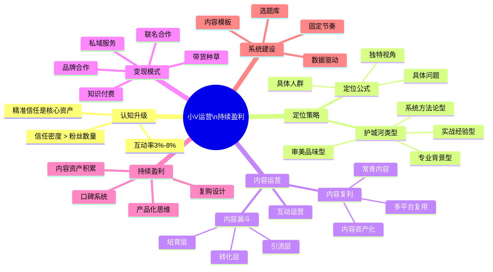

# 小V生存手册：如何运营与持续盈利

## 思维导图



---

## 一、重新认识「小V」的真实价值

很多人有一个误解：粉丝不过万，就没有变现资格。

这个逻辑来自流量时代的旧思维——把博主等同于「媒体广告位」，粉丝越多，广告费越高。但这个时代正在悄悄结束。

**小V**（通常指1000~10万粉的创作者）正在成为内容商业的真正主角。

一个反直觉的数据：粉丝在100万以上的大V，互动率通常不足1%；而1~10万粉的垂直小V，互动率往往在3%~8%之间。这意味着，一个1万粉的小V，实际上有300~800个真实关注你、愿意和你互动的人。而百万大V能触达的有效粉丝，可能也就这个量级。

这背后有一个核心概念：**信任密度**。

规模越大，个人温度越稀薄。当一个博主有100万粉丝，他和每个粉丝之间的关系，更接近明星与粉丝——是单向仰视，而非双向信任。而小V的粉丝，很多是真实地把你当成「领域里信任的朋友」，这种关系的商业转化效率，远高于流量数字所呈现的。

**小V的三个不可替代性：**

- **人格可识别性**：粉丝认的是「你这个人」，而不是某个赛道里任意一个博主
- **垂直信任背书**：在特定领域里，你被视为同路人或专家
- **关系可维护性**：你有能力和每一个粉丝建立真实互动

这三点加在一起，就是小V最核心的商业资产——**精准信任**。

---

## 二、定位：垂直到极致，才能被需要

小V运营失败的第一大原因，不是内容不够好，而是**没有人知道你是谁、能解决什么问题**。

### 定位公式

```
我帮 [具体人群] 解决 [具体问题]，用 [你独特的视角或方法]
```

注意三个关键词：**具体、具体、独特**。

- 「帮人学英语」× → 「帮30岁+的职场人，用碎片时间通过英语面试」✓
- 「分享健康饮食」× → 「帮没时间做饭的上班族，15分钟吃出营养均衡」✓
- 「聊创业」× → 「帮0~1阶段的独立创作者，跑通第一条变现路径」✓

人群越具体，问题越痛，你的内容才越容易被「需要你的人」精准搜索到。

### 内容护城河的四种来源

1. **专业背景型**：有从业经历，内容天然有公信力（律师、医生、工程师转型博主）
2. **实战经验型**：亲身踩坑，输出真实案例（创业者、独立设计师、全职妈妈）
3. **审美品味型**：靠独特眼光和筛选能力建立信任（好物推荐、生活方式）
4. **系统方法论型**：把碎片知识结构化输出（学习博主、效率工具博主）

你不需要四者兼备，找到自己最自然的一种，深挖。

### 定位的常见误区

- **「先做大再聚焦」**：等你攒了10万泛粉，付费心智一个都没建立
- **「追热点扩赛道」**：每月换方向，粉丝不知道你是谁
- **「模仿大V」**：大V的成功路径依赖规模效应，小V照搬只会失去最核心的个人温度

---

## 三、内容运营：内容漏斗与信任积累

内容不只是「表达」，更是「系统」。

### 内容漏斗模型

```
引流层（宽）→ 培育层（窄）→ 转化层（精准）
```

**引流层**：目的是让新用户发现你。

话题性强、传播性好，形式往往是「干货列表」「反直觉观点」「经验总结」。例：「10条让我少走5年弯路的XX经验」。这类内容的任务不是深度，而是**让对的人点进来**。

**培育层**：目的是建立信任。

展示你的价值观、方法论和真实经历。案例拆解、个人故事、系列化教程都属于这一层。例：「我如何在6个月内做到XXX（完整复盘）」。这类内容在消费时，用户心里在做一件事：**评估「我信不信这个人」**。

**转化层**：目的是引导进入私域或付费。

不是突然推销，而是一个自然的邀请。例：「留言/私信我，送你一份XXX资料包」「这套方法我整理成了课程，感兴趣的朋友看主页」。

很多小V只做引流层，发很多干货，但没有培育层和转化层的内容，流量进来又出去，什么都没留下。

### 内容复利：一次制作，多次传播

聪明的内容运营不是「发更多」，而是「让每条内容走更远」：

- 一个核心观点 → 长文 + 短视频脚本 + 社群分享 + 私信素材
- 高互动内容 → 整理成知识库 → 变成课程模块
- 常青内容（解决永恒问题的内容）→ 持续带来新粉丝，无需重复创作

**推荐节奏**：1~2篇高质量内容/周，优于5篇低密度内容。质量不够的高频更新，只会稀释你在粉丝心中的价值感。

### 互动：把关注者变成关系

- 回复评论重质不重量：有深度的一句话回复，远好过刷「谢谢支持」
- 主动私信高互动粉丝：建立一对一关系，这些人是未来最核心的用户
- 定期提问箱或用户调研：让粉丝感受到被看见，同时收集真实需求

---

## 四、变现模式：五条路径详解

### 前提：信任先于变现

```
错误顺序：有粉丝 → 立刻卖课/带货 → 粉丝流失
正确顺序：积累信任 → 验证需求 → 设计产品 → 自然转化
```

把你的内容账号想象成一个「信任账户」：每次输出有价值的内容，是在存款；过度推销、交付质量差，是在取款。账户余额见底，变现就失效了。

---

### 路径一：知识付费

**适合**：专业型、方法论型小V

**产品形态**：电子书/PDF、录播课、直播训练营、1对1咨询

**定价结构**（健康的产品梯队）：

| 层级 | 价格区间 | 目的 |
|------|---------|------|
| 入门产品 | 9~99元 | 降低决策门槛，积累付费用户 |
| 核心产品 | 299~999元 | 主力变现 |
| 高端服务 | 3000元+ | 服务少数高意向用户 |

**典型路径**：免费干货 → 免费社群 → 低价训练营 → 高价1对1

不要一开始就做高价产品。先用低价产品验证需求、积累案例、建立口碑，再往上走。

---

### 路径二：私域服务变现

**适合**：有强服务能力的小V（咨询、辅导、定制服务）

**核心模型**：

```
公域引流 → 私域沉淀（微信群/个人号）→ 服务变现
```

**私域社群的运营要点**：
- 入群设置门槛（付费或完成任务），筛选高质量用户
- 定期高价值内容输出，保持活跃度
- 社群内产品预售/内测，给予专属折扣

**案例思路**：一个劳动法博主，公域输出普法科普，私域提供合同审核、法律咨询服务。1000个精准粉丝里，哪怕5%需要付费咨询，月收入就相当可观。

---

### 路径三：品牌合作

**适合**：有稳定垂直受众的小V

**纠正一个误解**：1万粉的垂直博主，单条广告报价可以和10万粉的泛内容博主持平，因为品牌方买的是「精准触达率」，不只是曝光量。

**接广告的四个原则**：
1. 产品必须自己用过或认可（信任资产只有一次）
2. 单月广告内容不超过总内容的1/3
3. 广告内容也要有信息量（软植入 > 硬广）
4. 主动建立媒体包（受众画像、互动数据、合作案例）

**如何主动找品牌**：列出10个与你定位匹配的品牌，直接发合作邮件或私信，不要等待平台派单。

---

### 路径四：带货（种草/直播/短视频）

**适合**：有强推荐信任的小V，且内容风格与产品匹配

**小V带货的转化率优势**：因为信任密度高，精选推荐的转化率可以是大V的3~5倍。

**选品原则**：
- 自己真实使用过
- 与账号定位匹配（不要因为佣金高就推荐不相关产品）
- 佣金健康区间：15%~40%

**注意**：专业知识型博主（律师、医生、心理咨询师）慎做带货，可能损伤专业感和信任感。

---

### 路径五：联名与IP合作

**适合**：有一定影响力、想扩大用户池的小V

**小V联名的机会**：不是找大品牌，而是找**同量级创作者**或**本地商家**。

- 共同出品内容或课程
- 联合直播，互相导流
- 本地服务类小V（健身、美妆、餐饮）与当地品牌联名

---

### 变现组合建议

- **初期（0~3个月）**：专注一种变现，跑通完整路径
- **中期（3~12个月）**：叠加第二种，通常是「知识付费 + 品牌合作」或「私域服务 + 带货」
- **成熟期（1年+）**：产品矩阵化，不同价格段都有产品承接不同用户

---

## 五、持续盈利：从单次交易到长期关系

变现一次不难，难的是**持续变现**。

### 复购：持续盈利的核心

获取一个新客户的成本，通常是留住老客户的5~10倍。小V的可持续性，本质上是**复购率**的可持续性。

**设计复购的三种方法**：

1. **产品升级路径**：低价产品 → 中价产品 → 高价产品，每一步有自然延伸，用户跟着你的内容成长，跟着你的产品升级
2. **会员体系**：年费会员享受持续内容或社群服务，提高用户粘性和预期收入的可预测性
3. **课后跟进**：结课不等于结束。社群、定期答疑、学员案例分享，把服务周期拉长，复购就自然发生

### 口碑系统：让用户帮你带用户

口碑的本质是：用户愿意把你推荐给身边人。这是最高等级的信任，也是成本最低的获客方式。

**如何设计口碑传播**：

- **超预期交付**：给用户比他们期待的多20%（额外的资料包、一对一回复、意外惊喜）
- **主动收集案例**：用学员/用户的真实成果做内容，这些案例既是口碑，也是最好的营销素材
- **分享激励**：设计「推荐朋友购买，双方各得福利」的机制，但要控制尺度，避免变成微商感

### 产品化：突破时间天花板

小V最容易陷入的时间陷阱是：**用卖时间换钱**。1对1咨询、定制服务，收入直接被你的时间上限锁死。

**产品化路径**：

```
重复回答的问题 → 整理成FAQ → 做成课程模块
1对1咨询流程 → 标准化咨询框架 → 可复用产品
自己的工作方法 → 提炼成模板/工具包 → 独立售卖
```

产品杠杆的本质是：**一次制作，多次销售**。这是小V突破收入天花板的核心路径。

### 内容资产积累：时间站在你这边

每一篇高质量的内容，都是一个持续工作的「数字员工」。

- 优质文章/视频在搜索中持续带来新粉丝
- 历史内容可以系统化整理成课程或知识库
- 个人品牌的复利效应：随着时间积累，用户对你的认知越来越清晰，转化越来越自然

不要只看当月数据，要想象三年后你拥有的内容资产库是什么样子。

---

## 六、可持续运营的系统建设

小V运营最常见的失败模式，不是内容不好，而是**靠灵感驱动，没有系统**——灵感来了爆发更新，灵感走了断更两个月。

**建立内容生产系统**：

- **选题库**：持续积累选题，不依赖临时灵感。每次看到好问题、好评论、有趣现象，立刻记下来
- **内容模板**：降低每次创作的认知负担，同类型内容有固定结构
- **固定发布节奏**：让粉丝形成预期和习惯

**精力管理**：小V通常一人操作。学会说「不」——对不匹配你定位的合作说不，对消耗精力的内容形式说不，对让你偏离核心的机会说不。聚焦，是小V的最大竞争力。

**数据驱动，而非感觉驱动**：

每月复盘三个问题：
1. 哪些内容带来了最多私信/新粉丝/付费？
2. 这些内容有什么共同特征？
3. 下个月如何做更多这类内容？

---

## 七、结语：小V的时代刚刚开始

大V时代的红利已经过去，但**精准信任的时代刚刚开始**。

用户越来越不相信大规模投放，越来越相信「像自己一样的人的推荐」。这正是小V的天然优势。

小V不需要变成大V才能赚钱。你需要的，是把「有限的信任」转化为「有效的价值交付」。

**三个立刻可以行动的第一步**：

1. 写下你的定位公式：「我帮 [具体人群] 解决 [具体问题]」
2. 列出你最常被问到的10个问题——这就是你的第一批产品雏形
3. 找到5个最活跃的粉丝，私信他们，了解他们现在最大的困扰是什么

持续盈利的本质，不是流量游戏，而是**关系生意**。
