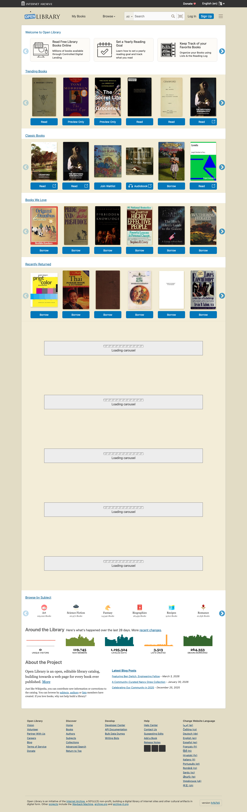
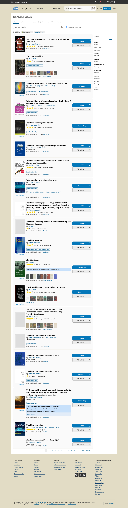
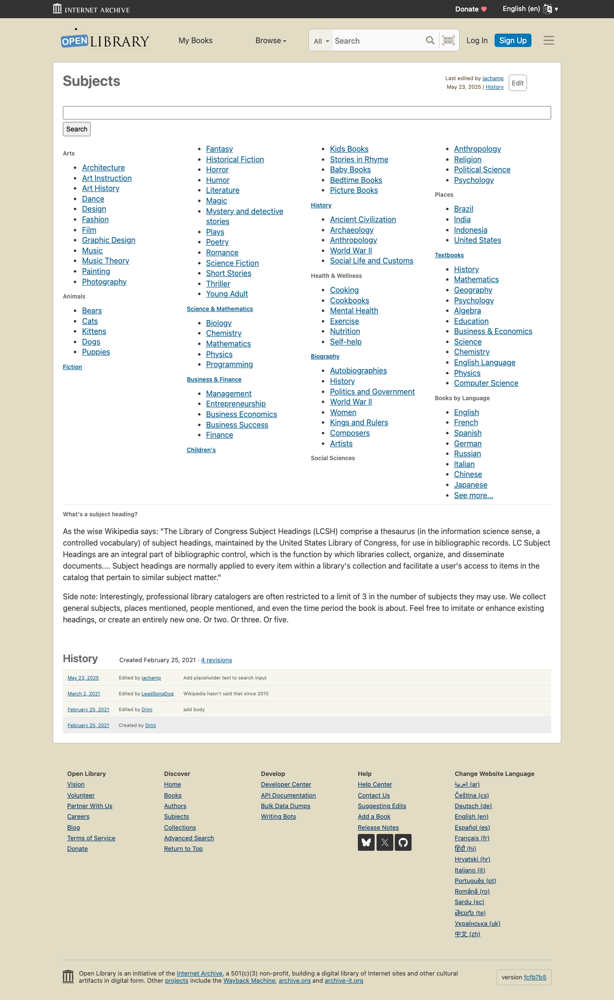
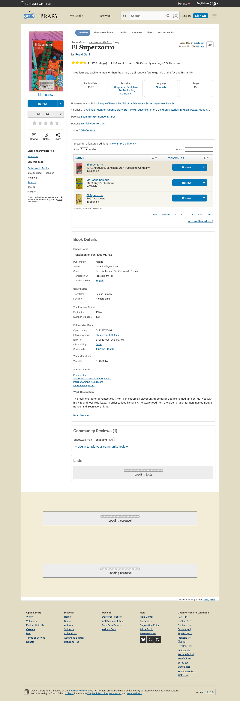
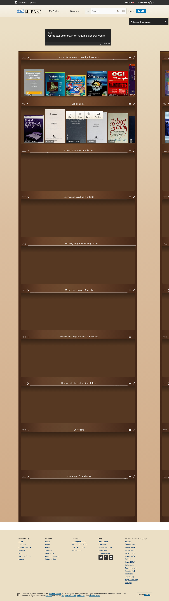

# Open Library：一个为每本书建一个网页的开放图书馆

> "One web page for every book ever published." —— 为每一本出版过的书建一个网页。

在信息爆炸的时代，获取知识的门槛理应越来越低。然而现实是，很多优质书籍被锁在付费墙后面，偏远地区的读者更难接触到丰富的图书资源。**Open Library**（[openlibrary.org](https://openlibrary.org)）正是为了解决这个问题而诞生的——一个完全免费、开放、由社区驱动的数字图书馆。

## 什么是 Open Library？

Open Library 是 **Internet Archive**（互联网档案馆）旗下的一个开源项目，创建于 **2008 年 4 月 9 日**。它的目标非常宏大：为人类历史上每一本出版的书创建一个网页目录，并尽可能让人们免费在线阅读。

目前，Open Library 已经收录了超过 **2000 万条图书记录**，涵盖了从古典文学到现代科技的几乎所有领域。

作为一个 501(c)(3) 非营利组织的项目，它的运营资金部分来自 **加州州立图书馆** 和 **Kahle/Austin 基金会** 的支持。

## 核心功能

### 1. 免费借阅电子书

Open Library 最吸引人的功能就是**免费借阅电子书**。通过"受控数字借阅"（Controlled Digital Lending）机制，用户可以像在实体图书馆一样借阅数字版图书。支持的阅读格式包括：

- **BookReader**：网页端直接阅读，无需安装任何软件
- **Adobe Digital Editions**：适用于支持 DRM 的设备
- **DAISY 格式**：为视障用户提供无障碍阅读
- **Kindle / Nook** 兼容（有部分限制）

### 2. 强大的搜索功能

Open Library 提供了全文搜索功能，可以在数百万本书的内容中查找匹配结果。你可以按书名、作者、主题、ISBN 等多种方式搜索。

### 3. 丰富的分类浏览

网站提供了详尽的主题分类系统，涵盖了：

- 历史（240 万+本）
- 科幻小说
- 宗教（16.5 万+本）
- 艺术与设计
- 科学与数学
- 商业与经济
- 教育与教材
- ……以及更多

### 4. 图书详情页

每本书都有一个专属页面，展示封面、版本信息、出版详情、分类标签等。用户还可以查看社区评论和评分。

### 5. 虚拟书架浏览

"Library Explorer" 功能模拟了真实图书馆的书架体验，你可以像在实体图书馆逛书架一样，浏览虚拟书架上的书籍。

### 6. 阅读记录与目标

注册用户可以：
- 维护个人**阅读清单**（想读、在读、已读）
- 设置**年度阅读目标**
- 创建和分享**书单列表**
- 为图书添加**评论和笔记**

## 社区驱动：像 Wikipedia 一样的图书馆

Open Library 的一大特色是它的**维基式编辑机制**。就像 Wikipedia 允许任何人编辑词条一样，Open Library 允许社区成员：

- **添加新书记录**到目录中
- **修正现有的图书信息**（书名、作者、出版日期等）
- **补充作者资料和照片**
- **上传书籍封面图片**
- **提交 CSV 格式的出版物数据**

这种开放协作的模式让图书馆的数据不断丰富和完善。仅在最近 28 天内，社区就完成了：

| 指标 | 数量 |
|------|------|
| 新增会员 | 119,745 |
| 目录编辑 | 1,195,324 |
| 电子书借阅 | 264,335 |
| 新建书单 | 3,513 |

## 开发者友好

Open Library 不仅面向普通读者，也为开发者提供了丰富的接口：

- **开放 API**：可以通过 API 查询图书信息、获取封面图片等
- **批量数据下载**：整个图书目录数据集可以下载使用
- **开源代码**：项目本身的软件、数据和文档都是开源的
- **条形码扫描**：支持通过扫描条形码添加图书

对于想要构建读书应用、图书推荐系统或学术工具的开发者来说，Open Library 的 API 是一个极好的免费数据源。

## Open Library vs 其他平台

| 特性 | Open Library | Goodreads | 豆瓣读书 | Google Books |
|------|-------------|-----------|---------|-------------|
| 免费借阅 | 是 | 否 | 否 | 部分预览 |
| 开源 | 是 | 否 | 否 | 否 |
| 社区编辑 | 是 | 有限 | 有限 | 否 |
| API 开放 | 是 | 已关闭 | 有限 | 是 |
| 全文搜索 | 是 | 否 | 否 | 是 |
| 非营利 | 是 | 否（Amazon） | 否 | 否（Google） |

## 如何开始使用？

1. **访问** [openlibrary.org](https://openlibrary.org)
2. **注册**一个免费账号（也可以使用 Internet Archive 账号登录）
3. **搜索**你感兴趣的书籍
4. **借阅**——点击"Borrow"按钮即可开始在线阅读
5. **参与**——发现错误？点击"Edit"帮助完善图书信息

## 适合谁？

- **学生和研究者**：免费获取大量学术资料和教材
- **阅读爱好者**：发现新书、管理阅读清单、设定阅读目标
- **开发者**：利用开放 API 和数据构建应用
- **图书馆员**：参考和补充图书编目数据
- **教育工作者**：Open Library 还专门设有 K-12 学生图书馆区域

## 写在最后

在一个知识日益商品化的世界里，Open Library 代表了互联网最初的理想——**让知识自由流通，让每个人都能平等地获取信息**。它不是最华丽的平台，但它可能是最重要的数字图书馆之一。

如果你还没有试过 Open Library，不妨现在就打开 [openlibrary.org](https://openlibrary.org)，搜一本你一直想读的书。也许你会惊喜地发现，它就在那里，免费等着你。

---

*Open Library 是 Internet Archive 旗下的非营利项目。如果你认同它的使命，可以通过 [archive.org/donate](https://archive.org/donate) 进行捐助支持。*
