# 7 分钟，上线一个属于自己的网站

> 你不需要会写代码，不需要懂服务器，只需要一杯咖啡的时间，就能拥有一个属于自己的、有独立域名的个人网站。

---

## 为什么你需要一个个人网站？

在社交媒体的时代，很多人觉得有公众号、有小红书就够了。但问题是——**这些平台上的内容，从来都不真正属于你。**

平台改算法，你的流量就没了。平台封号，你的积累就归零了。你在别人的地盘上盖房子，地契永远不在你手上。

一个个人网站是你在互联网上的"自留地"：

- 它是你的在线名片——求职、接活、社交，一个链接搞定
- 它是你的作品集——比简历 PDF 高级十倍
- 它是你的数字资产——域名在你手里，内容在你手里，谁也拿不走

**但大多数人不做个人网站的原因只有一个：觉得太难了。**

今天我要告诉你，这件事从"难"变成了"7 分钟能搞定"。靠的是两个工具：**Claude Code** + **Cloudflare**。

---

## 整体流程：三步走

在开始之前，我先把完整流程画给你看，心里有个数：

```
第一步：用 Claude Code 生成一个漂亮的个人简历网站（HTML/CSS/JS）
第二步：用 Cloudflare Pages 把网站发布到互联网上（免费）
第三步：在 Cloudflare 上买一个域名，配置好指向你的网站
```

三步走完，你就拥有了一个有独立域名的个人网站。

下面一步步来。

---

## 第一步：用 Claude Code 生成你的个人网站

### 什么是 Claude Code？

如果你还不知道 Claude Code，简单说：**它是一个能直接在你电脑上帮你干活的 AI 助手。** 你用自然语言告诉它你要什么，它就能帮你写代码、生成文件、操作你的电脑。

传统的做法：你得学 HTML、学 CSS、学 JavaScript，花几周时间才能做出一个像样的网页。

用 Claude Code：你只需要告诉它你想要什么样的网站，它直接帮你生成好，文件放在你的电脑上，打开就能看。

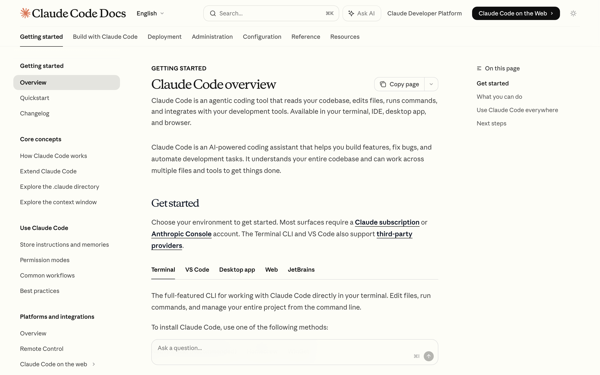
*Claude Code 官方文档——一个能读取代码、编辑文件、执行命令的 AI 编程助手*

### 安装 Claude Code

> 如果你已经装好了 Claude Code，跳过这一步。

Claude Code 是一个命令行工具，安装只需要两步：

**1. 安装 Node.js**

打开终端（Mac 按 `Cmd + 空格` 搜索"终端"，Windows 搜索"PowerShell"），输入：

```bash
# 检查是否已安装
node --version
```

如果显示版本号，说明已经装好了。如果提示找不到命令，去 nodejs.org 下载安装 LTS 版本即可。

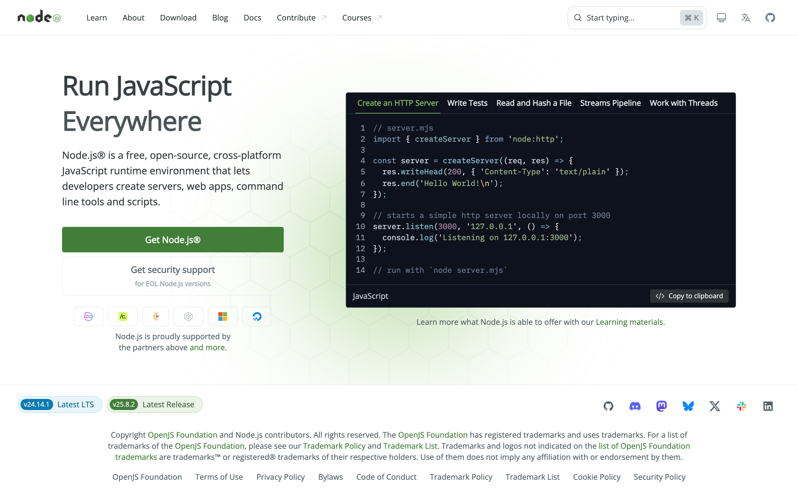
*Node.js 官网——点击左侧绿色的「Get Node.js」按钮下载 LTS 版本*

**2. 安装 Claude Code**

```bash
npm install -g @anthropic-ai/claude-code
```

安装完成后，输入 `claude` 回车，按照提示登录你的 Anthropic 账号就好了。

> 没有 Anthropic 账号？去 console.anthropic.com 注册一个，充值一点余额就行（最低 $5）。或者如果你有 Claude Pro/Max 订阅，可以直接使用。

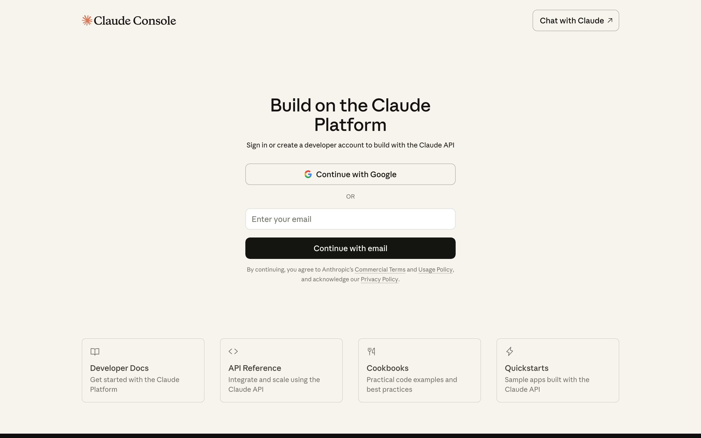
*Anthropic Console——可以用 Google 账号或邮箱注册，注册后充值即可使用 Claude Code*

### 一句话生成网站

现在是最爽的环节了。

先在你的电脑上创建一个空文件夹，用来存放网站文件：

```bash
mkdir my-website
cd my-website
claude
```

进入 Claude Code 后，直接告诉它你要什么。比如：

```
创建一个个人简历网站。我叫张三，是一个产品经理，
有5年互联网经验，擅长用户增长和数据分析。
做过的项目包括XX电商平台用户增长体系、XX社交App冷启动。
我的邮箱是 zhangsan@email.com。
设计风格要简约现代，配色用深色系。
用 HTML + CSS + JS 实现，所有代码放在一个 index.html 文件里。
```

然后等个一两分钟，Claude Code 就会帮你生成好一个完整的网站。

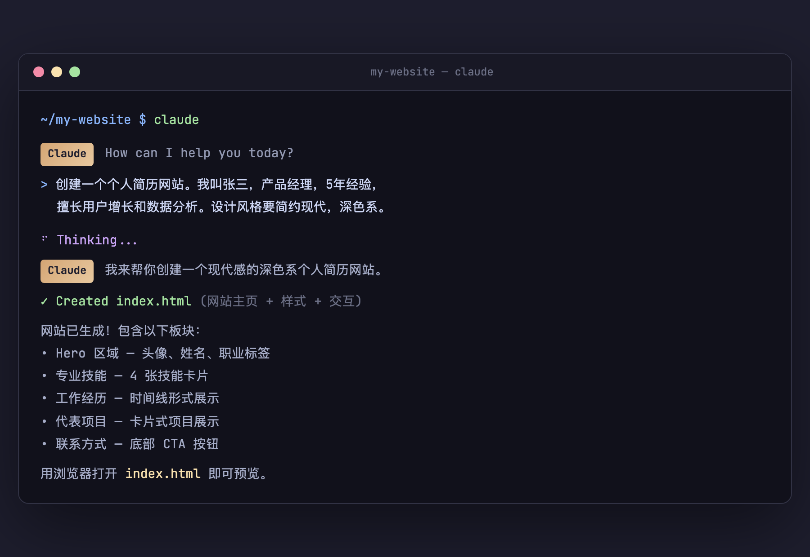
*实际操作画面：在终端里输入一句话需求，Claude Code 就帮你把网站生成好了*

**你会看到它在终端里噼里啪啦地工作：分析你的需求、规划网站结构、编写 HTML 骨架、设计 CSS 样式、添加 JS 动效——全部自动完成。**

生成完毕后，用浏览器打开那个 `index.html` 文件，就能看到你的个人网站了：

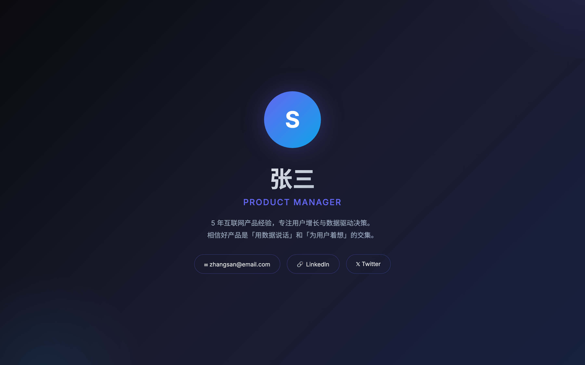
*Claude Code 生成的个人简历网站——深色系、现代感、完全响应式*

下面是整个网站的完整样貌：

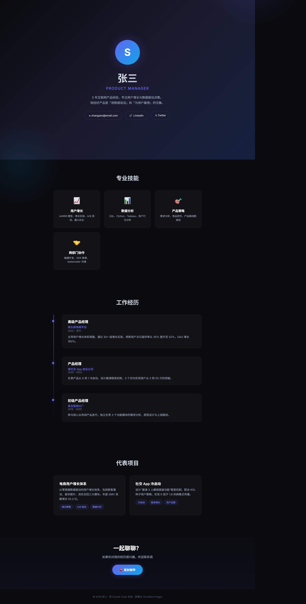
*完整网站包含：Hero 区域、专业技能、工作经历时间线、代表项目卡片、联系方式*

### Claude Code 会问你什么？

在生成网站的过程中，Claude Code 可能会主动问你一些问题来完善细节：

- **基本信息**：你的名字、职业、联系方式
- **工作经历**：你做过什么、在哪里工作过
- **技能标签**：你擅长什么
- **设计偏好**：喜欢什么风格、什么颜色
- **特殊需求**：要不要暗黑模式切换？要不要动画效果？

你只需要用大白话回答就行。**越具体，生成的网站越贴合你的预期。**

### 不满意？继续调

第一版出来后，可能有些地方你不太满意。没关系，直接跟 Claude Code 说：

```
把头像区域改成圆形，加一个渐变边框
"关于我"这段文字太长了，精简到三句话
加一个"我的项目"板块，用卡片形式展示
颜色太暗了，换成蓝白配色
```

**它会直接修改文件，刷新浏览器就能看到最新效果。** 不需要你动一行代码。

来回调个两三轮，你就能得到一个非常满意的个人网站了。

### 最终你会得到什么？

一个文件夹，里面包含你的网站文件。最简单的结构是：

```
my-website/
├── index.html      ← 网站主页
├── style.css       ← 样式文件（如果分离了的话）
├── script.js       ← 交互效果（如果有的话）
└── assets/         ← 图片等资源（如果有的话）
```

到这一步，你的网站已经"做好了"。但它还只是在你的电脑上——别人看不到。

接下来，我们要把它放到互联网上。

---

## 第二步：用 Cloudflare Pages 发布网站

### 什么是 Cloudflare？

**Cloudflare 是全球最大的网络基础设施公司之一。** 你可以简单理解为：它是互联网的"物业公司"，帮你管域名、管网站托管、管安全防护。

对我们来说，Cloudflare 有三个关键服务：

| 服务 | 作用 | 费用 |
|------|------|------|
| **Cloudflare Pages** | 托管你的静态网站 | 免费 |
| **域名注册** | 买一个 `.com` / `.me` 等域名 | 约 $10/年 |
| **DNS 解析** | 把域名指向你的网站 | 免费 |

没错，除了域名本身要花点钱，其他全是免费的。

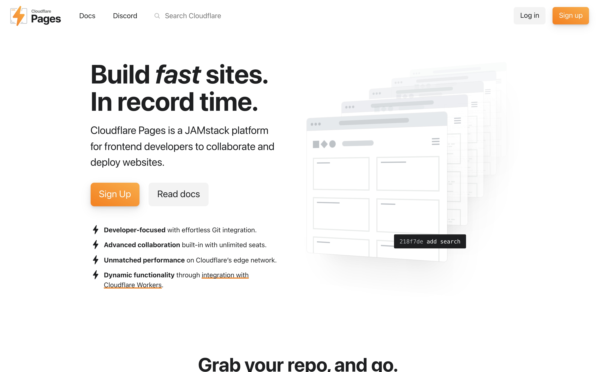
*Cloudflare Pages——免费托管静态网站，支持 Git 自动部署，全球 CDN 加速*

### 注册 Cloudflare 账号

1. 打开 dash.cloudflare.com
2. 点击 Sign Up，用邮箱注册
3. 注册完毕，进入 Dashboard

就这么简单。

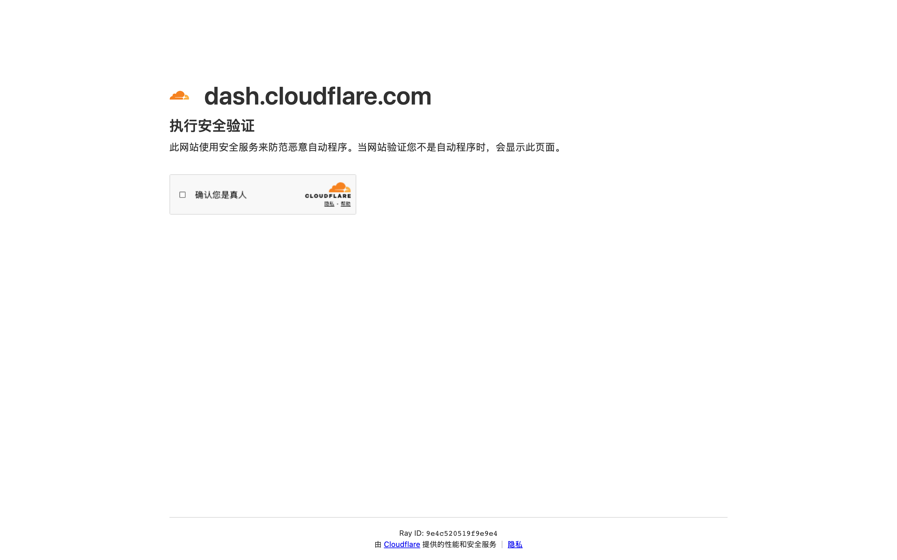
*Cloudflare 注册页面——你可能会遇到这个安全验证，勾选「确认您是真人」即可通过*

### 方法一：通过 GitHub 部署（推荐）

这是最推荐的方式，因为以后你修改网站内容只需要更新 GitHub 仓库，网站就会自动更新。

**第 1 步：把网站代码推送到 GitHub**

如果你还没有 GitHub 账号，去 github.com 注册一个（免费）。

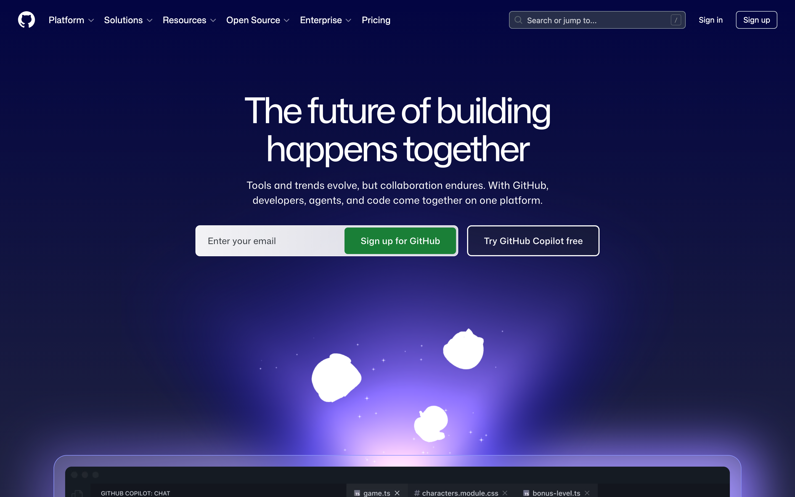
*GitHub 首页——输入邮箱，点击绿色的「Sign up for GitHub」按钮注册*

注册登录后，在你的网站文件夹里执行以下命令，把代码推送到 GitHub：

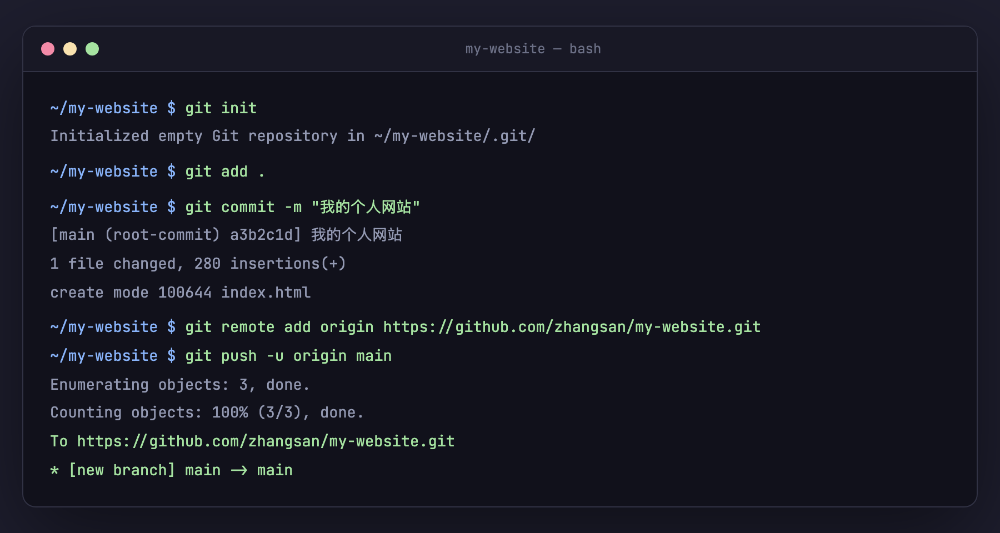
*Git 操作全流程：初始化 → 添加文件 → 提交 → 推送到 GitHub*

如果你对命令不熟悉，这里解释一下每一行的意思：

```bash
git init                    # 初始化一个 Git 仓库（在当前文件夹建一个"版本记录本"）
git add .                   # 把所有文件加入暂存区（"我要记录这些文件"）
git commit -m "我的个人网站"  # 提交一次记录（"保存当前版本，备注是'我的个人网站'"）
```

然后去 GitHub 上创建一个新仓库（点右上角的 "+"→"New repository"），仓库名随便取，比如 `my-website`，选 Public（公开），然后：

```bash
git remote add origin https://github.com/你的用户名/my-website.git  # 关联远程仓库
git branch -M main                                                  # 确认主分支叫 main
git push -u origin main                                             # 推送代码到 GitHub
```

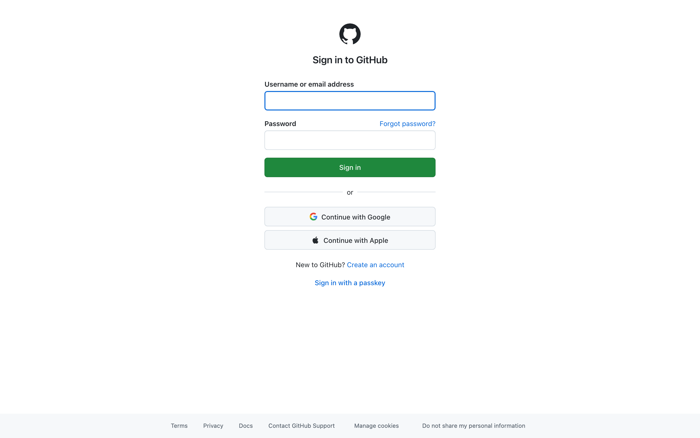
*如果未登录会先跳转到登录页——支持 Google、Apple 账号或邮箱密码登录*

> 如果你不熟悉 Git，也不用担心。这几行命令的意思就是：把你电脑上的网站文件，上传到 GitHub 这个"代码网盘"上。复制粘贴执行就行。

**第 2 步：在 Cloudflare Pages 中关联 GitHub**

1. 登录 Cloudflare Dashboard
2. 左侧菜单点击 **"Workers & Pages"**
3. 点击 **"Create"** → 选择 **"Pages"** → 选择 **"Connect to Git"**
4. 授权 Cloudflare 访问你的 GitHub 账号
5. 选择你刚才创建的 `my-website` 仓库
6. 构建设置：
   - **Framework preset**：选 `None`
   - **Build command**：留空（我们是纯 HTML，不需要构建）
   - **Build output directory**：填 `/`（根目录）或留空
7. 点击 **"Save and Deploy"**

等个一两分钟，Cloudflare 就会自动把你的网站发布到互联网上。

**部署完成后，Cloudflare 会给你一个默认的网址**，类似：

```
https://my-website-abc.pages.dev
```

用浏览器打开它——**恭喜，你的网站已经上线了！全世界都能访问。**

### 方法二：直接上传文件

如果你不想折腾 GitHub，也可以直接上传：

1. 在 Cloudflare Dashboard → **"Workers & Pages"** → **"Create"** → **"Pages"** → **"Upload assets"**
2. 给项目起个名字
3. 把你的网站文件夹直接拖进去
4. 点击 **"Deploy site"**

几十秒后，你的网站就上线了。同样会给你一个 `.pages.dev` 的默认地址。

> 这种方式的缺点是：以后每次更新网站内容，都需要手动重新上传。而用 GitHub 的方式，只要你 push 了代码，网站会自动更新。

---

## 第三步：买一个域名，让网站更专业

### 什么是域名？

域名就是你网站的"门牌号"。

就像你去一家店，你可以说"去朝阳区望京 SOHO T3 楼 12 层 1202 室"，也可以说"去 XX 公司"。域名就是那个更好记的名字。

```
没有域名：https://my-website-abc.pages.dev      ← 能用，但不好记、不专业
有了域名：https://zhangsan.com                   ← 简洁、好记、属于你
```

### 在 Cloudflare 上购买域名

Cloudflare 是全网最良心的域名注册商之一——**它按成本价卖域名，不赚差价。** 同样一个 `.com` 域名，别的地方卖 ¥80-120/年，Cloudflare 只要大约 $10.44/年（约 ¥75）。

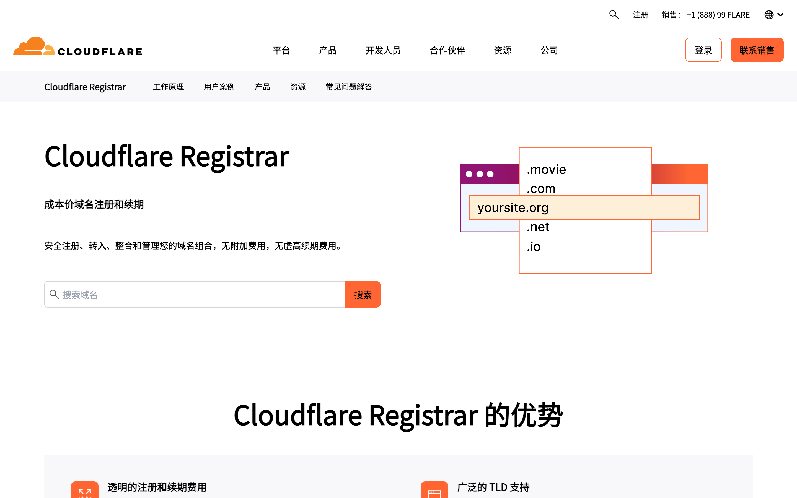
*Cloudflare Registrar——搜索你想要的域名，支持 .com、.net、.io、.org 等各种后缀*

**购买步骤：**

1. 在 Cloudflare Dashboard 左侧菜单，点击 **"Domain Registration"** → **"Register Domains"**
2. 搜索你想要的域名（比如 `zhangsan.com`）
3. 如果可用，加入购物车
4. 选择注册年限（默认 1 年）
5. 填写注册信息（姓名、地址等，Cloudflare 会自动开启隐私保护，不用担心个人信息泄露）
6. 付款（支持信用卡）

> **域名选择建议：**
> - 个人网站推荐用自己的名字拼音，比如 `zhangsan.com`
> - 如果 `.com` 被注册了，可以试试 `.me`、`.dev`、`.io` 等后缀
> - 域名尽量短，好记就行

### 域名解析：让域名指向你的网站

买了域名之后，还需要做最后一步：**告诉互联网，当别人访问你的域名时，应该去找你的 Cloudflare Pages 网站。**

这个过程叫"域名解析"，或者叫"DNS 配置"。

**你可以把它理解为：**

```
域名 = 你的门牌号（zhangsan.com）
DNS = 快递公司的地址簿
网站 = 你家的实际位置（Cloudflare Pages 服务器）

域名解析 = 在地址簿上写一条记录：
"如果有人找 zhangsan.com，请把他带到 Cloudflare Pages 上的那个网站"
```

**配置步骤：**

1. 在 Cloudflare Dashboard 中，进入你的 Pages 项目
2. 点击 **"Custom domains"**（自定义域名）标签
3. 点击 **"Set up a custom domain"**
4. 输入你购买的域名（比如 `zhangsan.com`）
5. Cloudflare 会自动帮你配置 DNS 记录（因为域名就是在 Cloudflare 买的，它自己就是 DNS 服务商，所以这一步是全自动的）
6. 等待几分钟，状态变为 **"Active"**

**如果你的域名不是在 Cloudflare 买的**（比如在阿里云、腾讯云买的），那你需要做两件事：

1. 把域名的 DNS 服务器改为 Cloudflare 提供的地址（在域名注册商那里修改）
2. 然后在 Cloudflare 中重复上面的步骤

> Cloudflare 会给你两个 DNS 服务器地址，类似 `xxx.ns.cloudflare.com`。把这两个地址填到你的域名注册商后台的 "DNS 服务器" 设置里就行。

### 域名配置完成！

配置完成后，打开浏览器，输入你的域名：

```
https://zhangsan.com
```

**你的个人网站，正式上线了。**

有 HTTPS 加密（Cloudflare 自动配），有独立域名，有全球 CDN 加速（Cloudflare 自动配），有 DDoS 防护（Cloudflare 自动配）。

**这些东西在以前，你得花几千块买服务器、装 Nginx、配 SSL 证书才能搞定。现在全部免费、全部自动。**

---

## 基础知识补充：理解你刚才做了什么

如果你是纯小白，看完上面的操作可能还是有点懵。没关系，我把几个核心概念解释一下，让你知其然也知其所以然。

### HTML / CSS / JS 是什么？

你可以把一个网页想象成一个人：

| 技术 | 比喻 | 作用 |
|------|------|------|
| **HTML** | 骨架 | 定义网页的结构和内容（标题、段落、图片等） |
| **CSS** | 衣服和妆容 | 定义网页的样式（颜色、字体、布局等） |
| **JavaScript** | 行为和动作 | 定义网页的交互（点击、动画、切换等） |

Claude Code 帮你把这三样东西都写好了，你不需要学它们。

### 什么是"静态网站"？

网站分两种：

- **静态网站**：内容是固定的 HTML 文件，打开就看，不需要后端服务器。就像一本印好的书。
- **动态网站**：需要后端程序实时生成内容，比如淘宝的商品页面、微博的时间线。就像一个直播节目。

个人简历网站是典型的静态网站——内容不会实时变化，不需要数据库。**静态网站的好处是：简单、快速、免费托管、几乎不可能宕机。**

### DNS 解析的原理

当你在浏览器里输入 `zhangsan.com` 并按回车，背后发生了什么？

```
1. 浏览器问 DNS 服务器："zhangsan.com 在哪里？"
2. DNS 服务器查地址簿："zhangsan.com 指向 Cloudflare Pages 的服务器"
3. 浏览器去 Cloudflare Pages 的服务器上拿到你的 index.html
4. 浏览器把网页渲染出来，展示给用户
```

这个过程在几十毫秒内完成，用户完全感知不到。

你在 Cloudflare 配置域名解析，其实就是在第 2 步的"地址簿"里写了一条记录。

---

## 常见问题

**Q：我完全不会写代码，真的能做到吗？**

是的。整个过程中你不需要写一行代码。Claude Code 帮你生成代码，你只需要用中文告诉它你要什么。Cloudflare 的操作全部是在网页上点点按钮。

**Q：费用是多少？**

- Claude Code：需要 Anthropic 账号余额（约 $5 起步）或 Claude Pro/Max 订阅（$20/月起）
- Cloudflare Pages 托管：免费
- 域名：约 $10/年（约 ¥75）
- **如果不买域名，用 `.pages.dev` 的免费地址也完全可以，那就是零成本。**

**Q：以后想改网站内容怎么办？**

打开 Claude Code，告诉它你要改什么。比如"把工作经历更新一下，加上最近的 XX 项目"。改完之后，如果你用的是 GitHub 部署方式，push 一下代码就自动更新了。

**Q：网站会不会挂掉？**

几乎不会。Cloudflare Pages 的静态网站有全球 CDN 分发，可用性极高。而且免费额度非常慷慨——每月 500 次构建、无限带宽。一个个人网站用几辈子都用不完。

**Q：我想做更复杂的网站（博客、作品集、电商），可以吗？**

可以，但那就不是 7 分钟能搞定的了。不过 Claude Code + Cloudflare 这套组合依然适用——你可以让 Claude Code 帮你用 React、Next.js 等框架生成更复杂的项目，然后同样部署到 Cloudflare Pages 上。思路是一样的，只是工作量更大。

---

## 最后

拥有一个个人网站，在以前是一件需要专业技能的事情。你得学前端、学服务器、学域名配置，或者花钱请人做。

现在这些门槛都被抹平了。**Claude Code 搞定代码生成，Cloudflare 搞定托管和域名。** 剩下的唯一门槛，是你愿不愿意花 7 分钟试一下。

一个属于你自己的网站，不受平台约束、不被算法绑架、不会突然被封号消失——这可能是你在互联网上最值得拥有的一件东西。

去做吧。

---

*这篇文章中的所有操作，我在写作过程中全部亲自走了一遍。如果你在操作过程中遇到任何问题，欢迎留言。*
