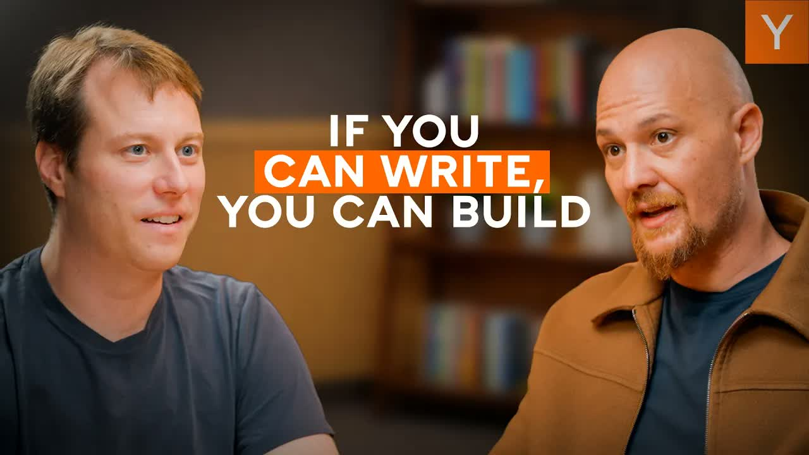

# Replit CEO 谈未来公司只剩两种岗位：建造者与销售

> 来源：[Replit's CEO On The Only Two Jobs Left In The Company Of The Future](https://www.youtube.com/watch?v=kMYeTRqzAfc) ｜ 频道：Y Combinator ｜ 时长：39:11 ｜ 上传：2026-04-25 ｜ 类型：YouTube 视频

## 核心观点

- Replit 的目标是让任何会读会写的人都能把想法变成可部署、可扩展的真实软件，2024 年 9 月成为首个完全抽象掉代码的"vibe coding"产品
- 真正的核心用户不是传统开发者，而是产品经理、设计师、创业者这类"AI 原生开发者"，2023 年起 Replit 显式放弃了对传统开发者的争夺
- 企业市场的销售动作已经发生质变——不是讲产品功能，而是做"启蒙教育"，组织黑客松，把懂业务的非技术人员变成内部冠军
- 未来公司只剩两类核心岗位：建造者（builder）与销售（更像传教士与教育者），其他角色会演变成"通用型创业者"，主动找问题、部署 Agent 解决问题
- Agent 4 的关键升级是并行 Agent、异步设计画布、团队协作、统一上下文（Web/移动/演示全打通），代表"工作流状态而非交互界面"的设计转向
- 创始人技能正在从 prompt 工程转向"高层目标设定"，未来甚至能让 Agent"每天帮我做一家 SaaS 公司并尝试变现"

## 详细总结

### 1. 从开发环境到 vibe coding：Replit 的十年路径

Amjad Masad 把 Replit 十年的演进概括成"逐步消除非创造性的复杂度"。最早解决的是开发环境配置问题——他回忆毕业时光是搭一个 Web 应用就像噩梦。然后是部署环境，再到代码本身。

转折点是 2024 年 9 月。Replit 成为第一个真正意义上的 vibe coding 产品，把代码完全藏到背后，用户用自然语言就能完成开发。最近的 Agent 4 进一步引入设计交互——可以在画布上拖拽、写注释、做评论。Amjad 强调未来一定是多模态的，"也许是视频，也许是音频"，但不变的是"让人自然地表达想法，让想法几乎魔法般地变成真实软件"。

他拿 VB6 类比：当年 VB6 比现在搭 React + Webpack 简单得多。"编程在过去几十年是越来越糟的"——他想做的就是把它带回来。

### 2. 谁在用 Replit：从开发者到"AI 原生开发者"

Amjad 提到一个关键的内部判断：很多传统开发者其实"享受痛苦"，他们喜欢配置每一处细节，像匠人享受打磨自己的工具。Replit 的真实增量用户是另一群人：

- **产品经理**：多年前写过代码但不想再碰开发环境
- **设计师**：有想法但被工程师卡住
- **创业者**：有热情有判断但被"必须先学技术"挡在门外

2023 年 Replit 做了一个明确的战略选择——不再追逐传统开发者。Amjad 说 Replit 团队走在办公室里看上去依然是个开发者工具公司，但产品定位上已经是"为创造者服务"，是为"因为 AI 才进入开发的新一代开发者"服务。

他举了几个让他印象深刻的案例：

- **物理治疗师**：在筋膜放松领域积累了大量方法论，花了几十万美元外包给海外开发者都不满意，最后自己在 Replit 上做出了带 3D 身体扫描和活动度追踪的应用
- **韩国母亲**：为患罕见病的孩子做了一套健康管理软件
- **泳池行业 SaaS**：来自世代经营泳池生意的创业者，做出了行业内人才理解的工具
- **运动俱乐部软件**：现存方案居然还是 MS-DOS 时代的产品

他的判断是："硅谷的人觉得没什么可建的，其实经济中存在大量盲区，当任何人都能做软件，整个经济会被改造一次。"

### 3. 企业销售的范式转变：从卖工具到做启蒙

Amjad 把企业销售的逻辑分成两层。

**自下而上的 PLG 路径**——和过去 Stripe、PagerDuty 给开发者的打法相似，但对象换成了非开发者。"当一个人意识到自己可以用代码解决问题时，会发生神经层面的转变——他开始用不同的方式看世界。"周末玩 Replit 的人，周一就会带到公司。

**销售团队的角色重塑**：Replit 的销售更像传教士和教育者。流程是：用户带着 Replit 进公司 → 销售协助他成为内部冠军 → 帮他组织黑客松，培养更多冠军 → 给领导层做 AI 教育。

进企业谈大单时也用同样的逻辑："不要先付钱，先让我们带最兴奋的那群人来做一次黑客松。"

理想的内部冠军画像不是某个职位，而是一组特质：**有创业者气质、足够能折腾、不被规则卡死、主动学习其他 AI 工具来配合**。Amjad 把它对应到 YC 经常说的 PG SA（Paul Graham 笔下的 resourcefulness）。

### 4. Agent 4 的设计哲学：从交互界面到工作流状态

Replit 每六个月发布一代 Agent，节奏对齐 AI 能力的"半年一次台阶"。Agent 3 解决了长任务自治——后端被重写，支持几小时的后台容器运行。Agent 4 的几个关键能力：

**并行 Agent**：解决了"提交大任务后干等"的问题。后端要解决 merge 冲突等一系列工程问题。

**异步设计画布**：Agent 在后台建造时，用户可以同时在画布上设计下一个页面或功能，准备好后再开新线程。"用户进入了心流状态——Agent 慢没关系，因为可以并行做事。"

**团队协作**：解决了并行 Agent 之后，团队协作几乎是免费的——每个加入会话的人都获得一个 fork 的 VM，多人光标实时显示。Orchestrator 还能自动拆分任务。

**统一上下文**：以前做 Web 应用、移动 App、Deck、视频要切不同工具。Replit 现在让所有产物共享同一个项目上下文——一句"我需要个移动 App"就能基于现有 Web 应用生成对应版本，部署时同时推到 Web 和 TestFlight。Amjad 说这意味着"现在你可以在 Replit 上经营整个公司"。

### 5. 通向"后 prompting 时代"

被问到用户应该练习什么技能，Amjad 的回答出人意料：

> "我其实觉得我们正在走向后 prompting 的世界。"

证据是 OpenClaw 等衍生工具的用法——人们越来越倾向于给高层目标，比如"优化我的营销漏斗"。Prompt 不会消失，但会变成一种细粒度的交互。下一代（Agent 5 或更早）可能允许这样的指令：

> "每天帮我做一家 SaaS 公司，自己尝试推广，看看哪个能赚到钱。"

为这个未来要练的技能：

- **理解能力边界**：保持玩心，持续接触最前沿的工具
- **持续在线，知道什么在路上**："曾经'天天看新闻'是缺点，现在变成必备能力"
- **不放弃**：今天做不出来的东西，过一个月再试一次
- **保持创造力与生成力**：一个产品能赚几百万但生命周期会过去，需要持续生成新想法

### 6. YC 留下的方法论烙印

Amjad 把 YC 三个月的经验称为"思维烙印"。最关键的是认识到三个月能做成多少事：

> "Sam Altman 站在我们面前说：接下来三个月，告诉你的朋友你失踪了。三个月后再回到他们的生活里。"

Replit 进 YC 时还叫 Ripple，只是个能跑代码的命令行工具。三个月后已经有了 Web 开发、托管、代码智能感知、IDE 功能。

这个节奏被搬进了 Replit 的产品节奏——每一代 Agent 发布前的最后四周，全员到办公室、24 小时供应咖啡食物，冲刺一个极高目标。

第二个习惯是"7% 周环比增长"——Amjad 说不知道 Paul Graham 怎么算出 7 这个数字，但作为新产品线启动期的标尺极好。

第三是网络。Replit 被 YC 拒了三四次，最后是因为 Paul 和 Sam 在 Hacker News 上看到他们才发的邀请。进 YC 之后他主动要 Marc Andreessen 的引荐，A16Z 后来领投了他们的种子轮。"如果当时融不到钱，可能我们就放弃了。YC 给了我们公司一条命。"

### 7. 还在等待的 AI 能力

Amjad 提到他个人最期待的两个突破：

**Computer use（计算机操作）模型**：现在还很慢。语言更容易压缩进高维空间，视觉流的压缩比要难得多。但他注意到一个有趣现象——**编程能力意外成了 computer use 的替代方案**。Excel agent 变好是因为代码生成变好，电商 agent 能跑是因为可以调 API。但企业里还有大量"老旧软件"无法用代码绕开，必须靠 computer use。Replit 自己的测试 Agent 已经在用大量 prompt 工程来弥补 computer use 模型在"品味判断"上的缺陷。

**持续学习（continual learning）**：现在的变通方案是写文件。"Agent 学到一个技能，就写一个 Skill MD 文件。"但真正的"在岗学习"还没解锁。如果某天能做到"把 Agent 部署到一个组织里，让它持续为这个组织变得更好"，企业 AI 的价值会再上一个台阶。

### 8. 未来公司：建造者 + 销售 + 通用型创业者

最后一个核心问题：当 Agent 能做完所有事，公司里还剩下什么？

Amjad 给的答案分两层。

**剩下的两类岗位**：

1. **建造者**：负责持续创造、持续抬高抽象层级。"以前一屋子人是 computer（计算的人），后来计算被装进盒子。我们的工作就是不断把更低层的东西打包，自己往更高层走。"
2. **销售**：销售反而是最难被替代的——"很多公司想跟人说话、跟人学习。人类信任人类。"形态会变，但角色不会消失。

**新的主流角色：通用型创业者**：

Amjad 描绘的未来公司结构是——大部分员工醒来想的都是"我怎么让公司更成功？怎么让公司多赚钱？"然后在公司里游走，找问题、创建或部署 Agent 去解决。

Replit 内部已经在跑这个模式：他们有一个"vibe coding 驻场团队"，任务模糊到只有一句话——**"在公司里转，让公司变得更好"**。这个团队跑去问支持团队："你们用 Zendesk，最大的痛点是什么？"得到答案后做出了一套客户优先级可视化系统，CSAT 立刻上升。然后他们去 HR，发现没有统一入职平台，又顺手做了一个。

> "未来公司里会有越来越多通用型创业者，目标是让业务成功，手段是部署 Agent。"

## 值得反复琢磨的几句话

> "When anyone can make software, a lot of parts of the economy is just going to improve. That's a beautiful thing — a lot of wealth creation, productivity gain."

> "The moment you understand that you can solve a problem with code, it changes your mind. There's like a neurological shift where you start looking at the world differently."

> "We're headed to a post-prompting world."

> "Almost everyone is a founder. They wake up in the morning and they think how can I make the company more successful?"

> "Programming got worse over time. I wanted to make programming great again."

---

*本文由 Content Summarizer 自动生成总结，原视频：YouTube/@Y Combinator*
