# Conductor: 用强化学习训练一个 7B "指挥家"来协调多个大模型

> 论文标题：Learning to Orchestrate Agents in Natural Language with the Conductor
>
> 作者：Stefan Nielsen, Edoardo Cetin, Peter Schwendeman, Qi Sun, Jinglue Xu, Yujin Tang
>
> 机构：Sakana AI（日本）
>
> 会议：ICLR 2026
>
> 论文链接：https://arxiv.org/abs/2512.04388

## 作者与机构

这篇论文来自 **Sakana AI**，一家 2023 年在东京成立的 AI 研究公司。Sakana AI 由前 Google Brain 研究员 David Ha 和前 Google DeepMind 研究员 Llion Jones 联合创办——后者是 Transformer 奠基论文"Attention Is All You Need"的共同作者之一。公司名称"Sakana"取自日语"鱼"（さかな），其核心研究方向正是从鱼群等自然群体智能中汲取灵感，探索多 Agent 协调协作的可能性。这篇 Conductor 论文是这一理念的直接体现。

| 作者 | 机构 |
|------|------|
| Stefan Nielsen | Sakana AI, 日本 |
| Edoardo Cetin | Sakana AI, 日本 |
| Peter Schwendeman | University of Michigan, 美国（Sakana AI 实习期间完成） |
| Qi Sun | Sakana AI, 日本 / 东京科学大学 |
| Jinglue Xu | Sakana AI, 日本 |
| Yujin Tang | Sakana AI, 日本 |

## 摘要（原文翻译）

来自不同提供商的强大大语言模型（LLM）经过了昂贵的训练和微调，各自在不同领域形成了专长。在本文中，我们引入了一种新型的 Conductor 模型，通过强化学习训练，自动发现 LLM 之间的高效协调策略。我们的 Conductor 不仅学会了为 Agent 之间的有效协作设计定向通信拓扑，还学会了为各个 LLM 设计针对性的提示指令，以最大化发挥它们各自的能力。我们展示了，通过在强大的 Worker LLM 池上学习最优协调策略，一个 7B 参数的 Conductor 能够带来显著的性能提升，超越任何单一 Worker 模型，在 LiveCodeBench 和 GPQA 等高难度推理基准测试中达到了最先进的结果。通过在随机化的 Agent 池上训练，我们的 Conductor 能够有效适应任意的开源和闭源 Agent 组合，满足用户的各种需求。此外，允许 Conductor 将自身选为 Worker 还催生了递归拓扑结构，通过在线迭代适应实现了一种新型的动态测试时扩展，进一步提升了性能。更广泛地说，我们的工作是早期证明语言模型协调能力可以通过强化学习解锁的研究之一——强大的协调策略通过纯粹的端到端奖励最大化在 LLM 中自然涌现。

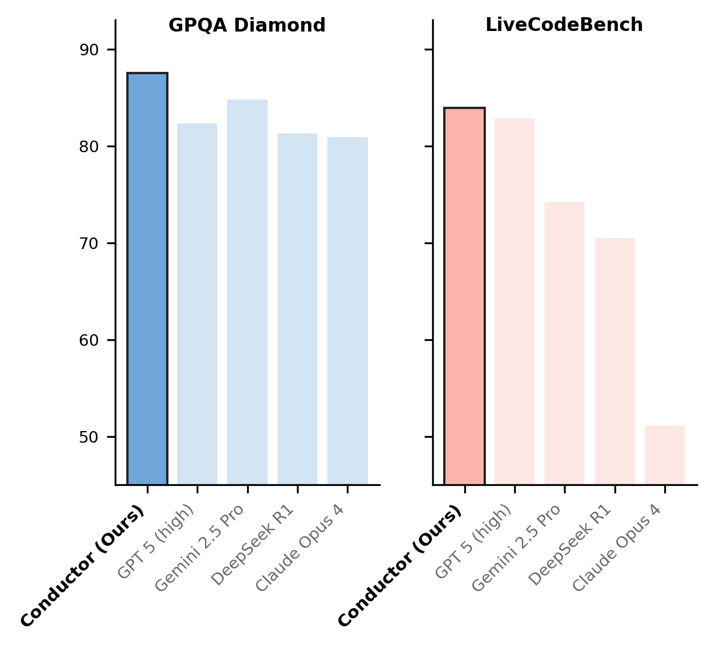

*图 1：Conductor 在 GPQA Diamond 和 LiveCodeBench 两个高难度基准测试上超越了所有单一模型，包括 GPT-5、Gemini 2.5 Pro 和 DeepSeek R1。*

## 问题背景：为什么需要一个"指挥家"

当前 AI 领域存在一个有趣的现象：各家公司花费巨额资金训练出的顶级模型，在不同任务上各有所长。GPT-5 在代码生成上表现出色，Gemini 2.5 Pro 在推理任务上更胜一筹，Claude Sonnet 4 在某些场景下有独特优势。单独使用任何一个模型，都无法覆盖所有场景。

一个自然的想法是：能否让这些模型协同工作，各取所长？

已有的多 Agent 框架（如 Mixture-of-Agents、MASRouter 等）都在尝试回答这个问题，但它们大多依赖人工设计的协调规则，或者只做简单的路由选择——把问题分配给某一个模型来回答。这篇论文提出了一种截然不同的方案：训练一个专门的小模型来充当"指挥家"（Conductor），让它通过强化学习自主学会如何编排多个大模型的协作流程。

## 核心方法：Conductor 如何工作

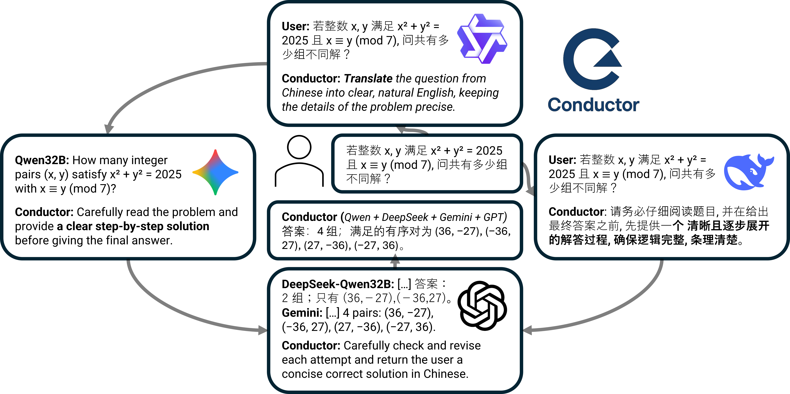

*图 2：Conductor 的工作流程示意。Conductor 接收用户问题后，生成包含子任务描述、Worker 分配和信息访问列表的结构化工作流，协调多个 LLM 按步骤执行。*

Conductor 的核心思想可以用一个类比来理解：它就像一个乐团指挥，面对一群实力各异的演奏家，需要决定谁来演奏哪个乐段、演奏时能参考谁的表演。

具体来说，Conductor 接收到用户问题后，输出一个结构化的工作流，包含三个同步的 Python 列表：

- **model_id**：整数数组，指定每一步由哪个 Worker 模型执行
- **subtasks**：字符串数组，为每个 Worker 编写针对性的自然语言指令
- **access_list**：嵌套数组，定义每个 Worker 能够看到哪些前序步骤的输出

举一个直观的例子。面对一道编程题，Conductor 可能会生成：

```python
model_id = [2, 0]
subtasks = [
    "设计一个高效的算法来计算完整子数组的数量",
    "用 Python 实现这个算法"
]
access_list = [[], ["all"]]
```

这意味着：先让 Agent 2（比如 Gemini）负责算法设计，再让 Agent 0（比如 GPT-5）在看到算法设计结果的基础上完成代码实现。Conductor 不只是选择"用哪个模型"，它同时设计了任务分解方式、针对性的提示指令，以及信息在模型之间的流动路径。

## 训练方法：GRPO 强化学习

Conductor 基于 Qwen3-32B 模型进行微调，使用 GRPO（Grouped Relative Policy Optimization）算法训练。训练数据由四个领域的 960 道题目组成：数学、编程、推理和通用知识。

奖励函数的设计非常简洁：

| 条件 | 奖励值 |
|------|--------|
| 输出格式不合法（无法解析为 Python 列表） | 0 |
| 格式正确但最终答案错误 | 0.5 |
| 格式正确且最终答案正确 | 1.0 |

值得注意的是，Conductor 本身并不直接回答问题——它的奖励完全取决于它编排的工作流最终产出的答案是否正确。这是一种端到端的训练方式：Conductor 必须学会理解每个 Worker 模型的能力特点，才能设计出有效的协作方案。

训练在 2 块 NVIDIA H100 80GB GPU 上进行，共 200 轮迭代，每轮 256 个样本，每个问题生成 64 个候选工作流。Worker 池包含 7 个模型：Gemini 2.5 Pro、Claude Sonnet 4、GPT-5、DeepSeek-R1-Distill-Qwen-32B、Gemma3-27B-it、Qwen3-32B 和 Qwen3-32B（thinking）。

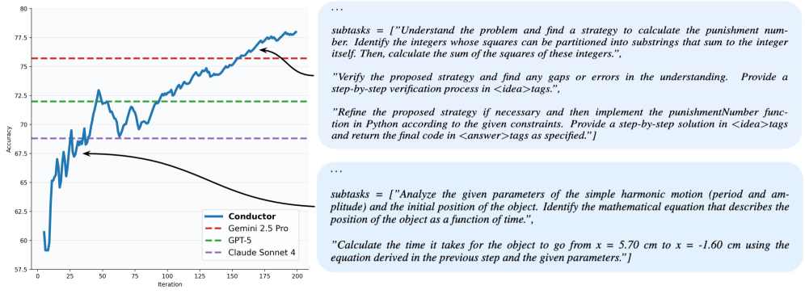

*图 3：训练过程中 Conductor 行为的演化。上方展示训练早期（左）和收敛后（右）的输出对比，下方是性能曲线。训练早期，Conductor 只会生成简单的子任务划分；到训练后期，它自发学会了任务规划、针对性指令编写、推理过程共享，以及验证和修正等策略。*

## 实验结果

Conductor 在七个基准测试上进行了评估，覆盖数学、编程、推理和通用知识四大领域。

**域内基准**（训练时涉及的领域）：MATH500、MMLU、RLPR、LiveCodeBench V6

**域外基准**（训练时未见过的领域）：AIME25、GPQA-Diamond、BigCodeBench

| 模型 | MATH500 | MMLU | RLPR | LCB | AIME25 | BCB | GPQA-D | 平均 |
|------|---------|------|------|-----|--------|-----|--------|------|
| Gemma3-27B | 39.8 | 81.3 | 16.67 | 13.14 | 20.7 | 14.86 | 38.4 | 32.12 |
| Qwen3-32B | 73.5 | 83.5 | 31.00 | 21.21 | 20.0 | 30.41 | 64.1 | 53.81 |
| Qwen3-32B (thinking) | 80.7 | 84.1 | 37.25 | 25.86 | 72.9 | 28.38 | 66.8 | 56.57 |
| R1-Distill-Qwen-32B | 82.5 | 84.4 | 33.50 | 26.86 | 63.0 | 33.07 | 58.1 | 54.49 |
| Claude Sonnet 4 | 96.0 | 91.4 | 36.70 | 46.54 | 74.3 | 37.16 | 77.7 | 65.69 |
| Gemini 2.5 Pro | 96.0 | 92.4 | 40.55 | 67.24 | 78.3 | 37.51 | 84.8 | 70.97 |
| GPT-5 | 99.0 | 93.5 | 42.20 | 82.90 | 90.8 | 32.75 | 82.3 | 74.78 |
| **Conductor** | **99.4** | **94.1** | **44.75** | **83.93** | **93.3** | **37.86** | **87.5** | **77.27** |

Conductor 在所有七个基准上都超过了任何单一 Worker 模型。尤其在域外的 GPQA-Diamond 上达到了 87.5%，比最强的单一模型 Gemini 2.5 Pro（84.8%）高出 2.7 个百分点；在 LiveCodeBench 上达到 83.93%，超越了 GPT-5 的 82.90%。

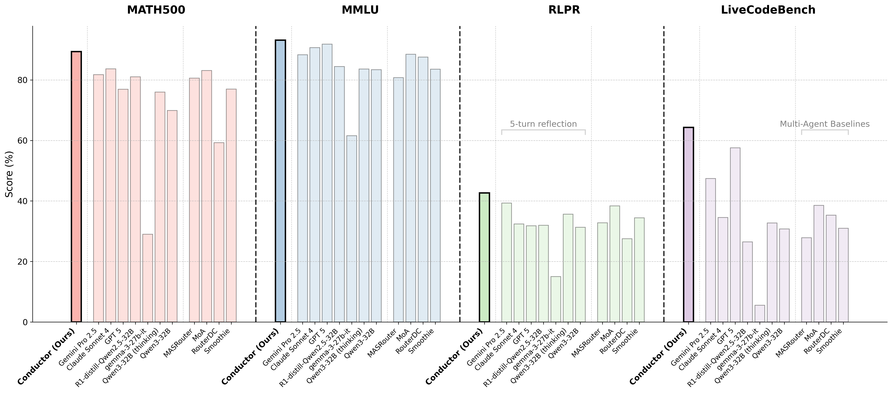

*图 4：Conductor 与多种基线方法在四个域内基准上的大规模对比。Conductor（最左侧红色柱）在所有基准上均领先于其他多 Agent 方法（MASRouter、MoA、RouterDC、Smoothie）以及 5 轮自反思基线。*

## 效率优势：用更少的调用达到更好的效果

性能只是故事的一半。在实际部署中，调用多个大模型的成本是一个关键考量。Conductor 在这方面展现了显著优势。

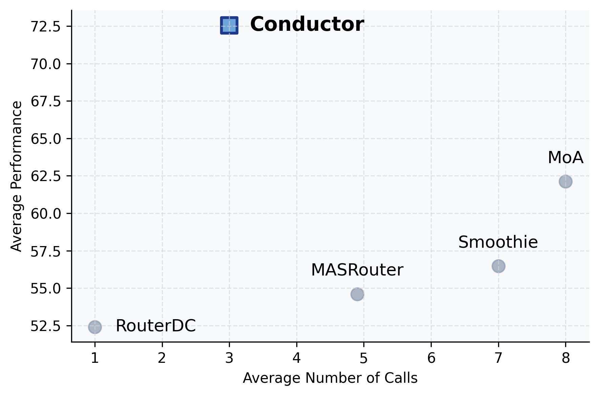

*图 5：性能-效率对比图。横轴为平均 Agent 调用次数，纵轴为平均性能。Conductor 仅用约 3 次调用就达到了最高性能，而 MoA 需要 8 次调用、Smoothie 需要 7 次调用，且性能都更低。*

Conductor 平均只用约 3 步工作流就完成任务，而 MoA 需要 8 步、Smoothie 需要 7 步、MASRouter 需要 5 步。在成本效率方面，对比同样的 5 倍推理时扩展方案，Conductor 的优势更为明显：

| 方法 | 性能 | Token 消耗 | 平均成本 | 成本调整后性能 |
|------|------|-----------|---------|--------------|
| Claude 5× 共识 | 91.00 | 1412.8 | $0.0211 | 42.94 |
| Gemini 5× 反思 | 88.33 | 2919.8 | $0.0168 | 52.70 |
| GPT-5 5× 共识 | 91.30 | 1376.3 | $0.0138 | 66.34 |
| **Conductor** | **93.14** | **735.2** | **$0.009** | **103.49** |

Conductor 的 Token 消耗仅为 GPT-5 五次共识方案的一半，成本不到其 65%，但性能更高。成本调整后的性能指标（性能/成本）几乎是最佳单模型方案的 1.6 倍。

## 自适应 Worker 选择：适配任意模型组合

在实际应用中，用户可能因为成本、隐私或可用性等原因，无法同时使用所有模型。论文提出了自适应 Worker 选择机制：在训练时随机移除部分 Worker，迫使 Conductor 学会在不同的模型子集上都能有效工作。

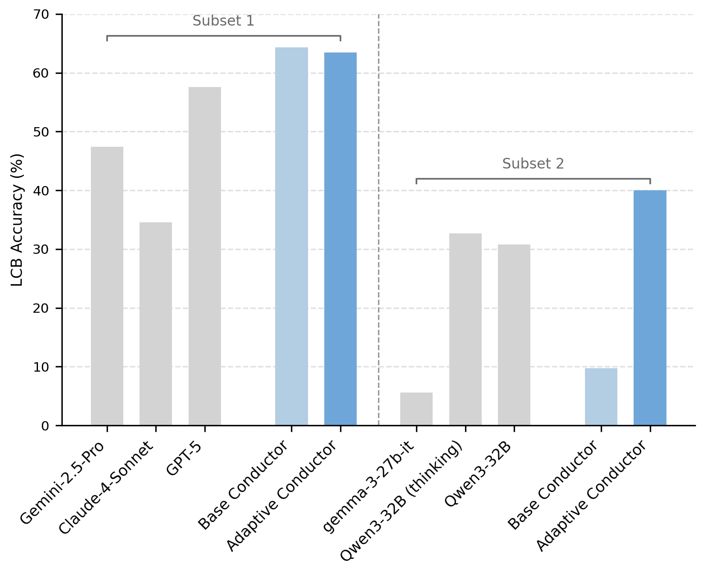

*图 6：自适应 Conductor 的泛化能力。左侧为仅使用闭源模型子集（Subset 1：Gemini、Claude、GPT-5）的表现，右侧为仅使用开源模型子集（Subset 2：Gemma、Qwen3-32B thinking、Qwen3-32B）的表现。自适应 Conductor（深蓝色）在两种配置下都显著超越了各子集内的最佳单一模型。*

结果显示，自适应 Conductor 在面对从未在训练中见过的特定模型子集时，仍然能够有效地编排协作。在仅使用开源模型子集时，自适应 Conductor 将 LiveCodeBench 准确率从基础 Conductor 的约 10% 提升到约 40%——因为它学会了在缺少顶级闭源模型时，通过更巧妙的协作策略来弥补。

## 递归拓扑：Conductor 调用自己

论文最具想象力的设计是递归拓扑：允许 Conductor 将自身选为一个 Worker。当第一轮工作流的结果不理想时，Conductor 可以递归地调用自己，根据已有的中间结果重新设计工作流。

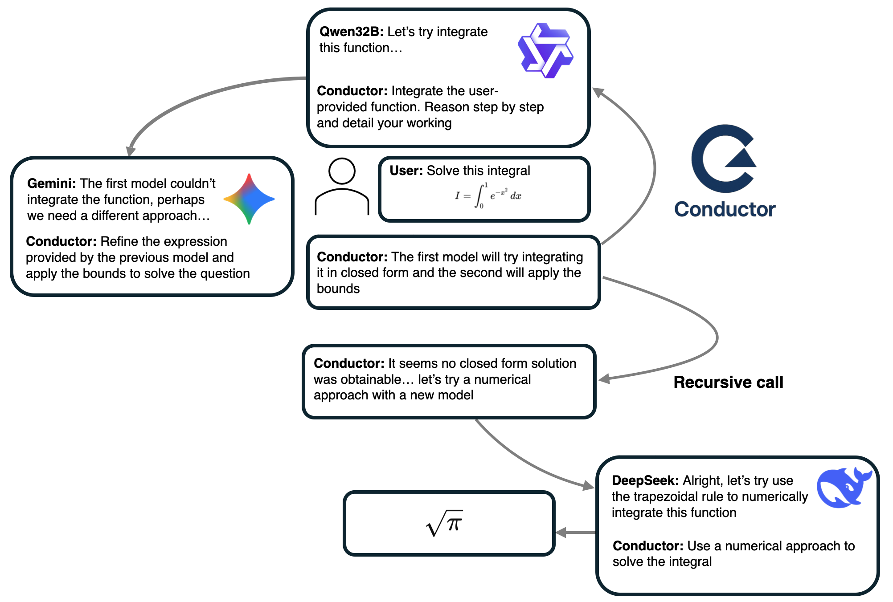

*图 7：递归拓扑示意。Conductor 先让 Qwen 尝试求解积分，发现闭式解不可行后，递归调用自身，重新设计方案改用 DeepSeek 进行数值积分，最终得到正确答案。*

递归机制通过在 350 个样本上的轻量微调（20 轮迭代）实现。实验表明，递归在域外基准上带来了稳定提升：

| 模型 | AIME25 | BigCodeBench | GPQA-D | 平均 |
|------|--------|-------------|--------|------|
| Conductor | 66.67 | 37.8 | 81.31 | 61.93 |
| Conductor-Recursive | 66.67 | 40.0 | 82.32 | 63.00 |

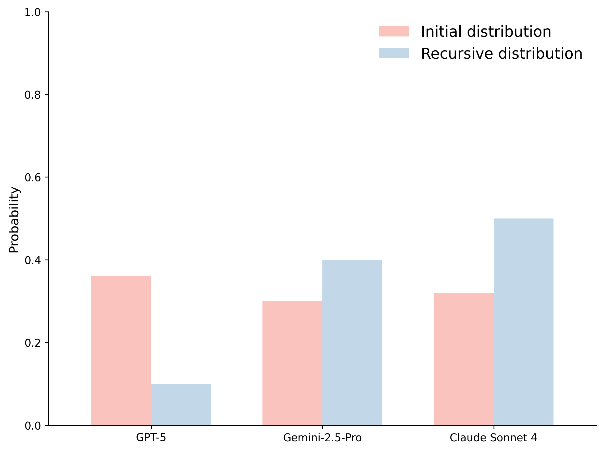

*图 8：递归调用前后的 Worker 选择分布变化。初始工作流中 GPT-5 的选择概率最高（约 36%），但在递归调用时，Conductor 转向了 Claude Sonnet 4（约 50%）和 Gemini 2.5 Pro（约 40%），大幅降低了 GPT-5 的使用。这表明 Conductor 学会了在初始方案失败后，主动切换到不同的模型组合来寻找新的解题路径。*

## 涌现行为分析

训练过程中，Conductor 自发涌现出多种协调策略，这些策略并非人工设计，而是通过端到端的奖励最大化自然产生。

**任务分解**：面对复杂问题，Conductor 学会了先让一个模型设计算法或制定方案，再让另一个模型负责实现。

**针对性提示工程**：Conductor 为不同的 Worker 编写风格各异的指令。给擅长推理的模型会写"逐步推导并详细说明你的工作过程"，给擅长代码的模型会写"用 Python 实现以下算法"。

**验证与修正循环**：在关键任务中，Conductor 会安排一个额外的步骤来验证前序输出的正确性，有时还会让不同模型对同一问题给出独立答案，再综合判断。

**难度自适应**：Conductor 根据问题难度动态调整工作流的复杂程度。

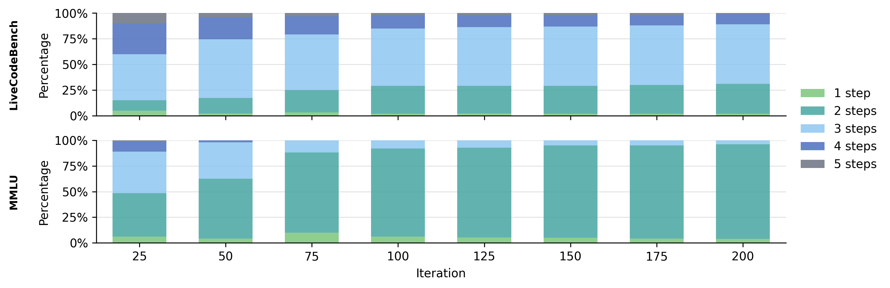

*图 9：Conductor 在不同基准上的工作流步数分布随训练进行的变化。对于较简单的 MMLU 任务，训练收敛后约 90% 使用 2 步工作流；对于更复杂的 LiveCodeBench 编程任务，则更多使用 3-4 步工作流。这种差异化策略完全由模型自主学得。*

## 模型规模分析

论文还对比了 3B 和 7B 两种规模的 Conductor。一个有趣的发现是：两种规模的 Conductor 在 Worker 选择策略上收敛到了几乎相同的模式，但 7B 模型在提示工程质量上明显更优。

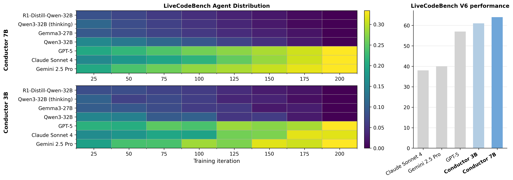

*图 10：3B 和 7B Conductor 在 LiveCodeBench 上的 Agent 选择分布热力图（左）与性能对比（右）。两种规模的 Conductor 都收敛到优先选择 GPT-5 和 Gemini 2.5 Pro 的策略，但 7B 版本凭借更高质量的提示工程取得了更好的最终性能。*

这意味着 Conductor 的能力提升主要来自更好的"提示编写"能力，而非更好的"模型选择"能力。理解哪个模型适合哪个任务相对容易学会，但如何为每个模型写出最有效的指令，需要更强的语言理解和生成能力。

## 域外少样本提示的反直觉发现

训练时使用的少样本示例也有讲究。论文发现，使用域外（OOD）示例——比如在训练编程任务时给数学题的示例——反而比使用域内示例效果更好。

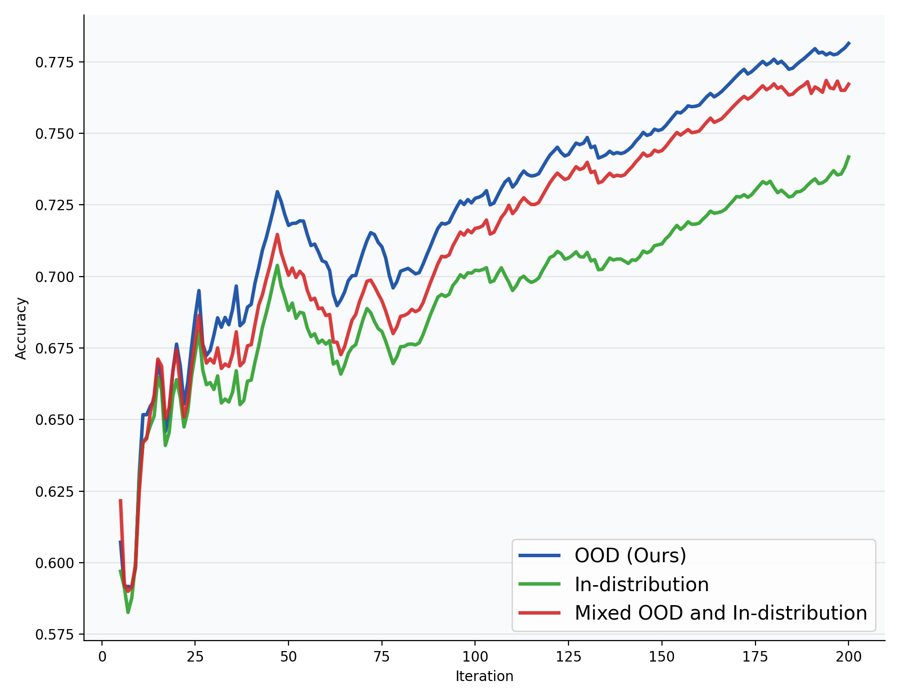

*图 11：三种少样本提示策略的训练曲线对比。蓝色（OOD）始终优于绿色（域内）和红色（混合）。*

研究者的解释是：域内示例可能导致 Conductor 直接模仿示例中的策略，而域外示例只提供格式参考，迫使 Conductor 自主探索适合当前任务的策略。

## 总结

这篇论文的核心贡献在于证明了一个看似矛盾的命题：一个 7B 参数的小模型，可以通过学习"如何指挥"来超越所有它所指挥的大模型。它不需要理解具体的数学证明或编写实际的代码，只需要学会三件事：把任务拆给谁、怎么描述任务、让谁看到谁的结果。

从工程视角看，Conductor 提供了一种实用的多模型协作范式。在 API 调用成本持续降低的趋势下，用一个轻量的编排层来组合多个模型的能力，比单纯追求更大的单一模型可能是更经济的路径。

从研究视角看，这篇论文验证了一个重要假设：复杂的多 Agent 协调策略可以通过简单的端到端强化学习自然涌现，无需人工设计。Conductor 在训练过程中自发学会了任务分解、提示工程、验证修正和难度自适应等策略，这些行为的涌现过程本身就具有启发意义。
